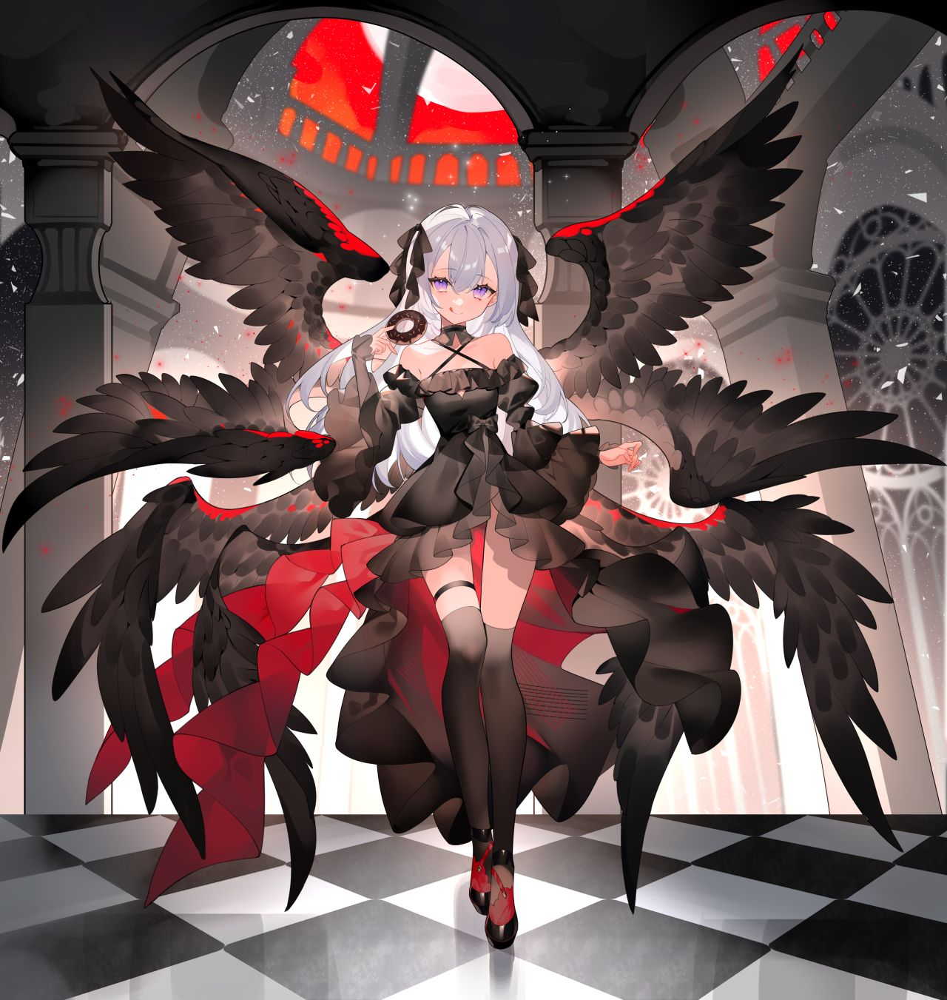
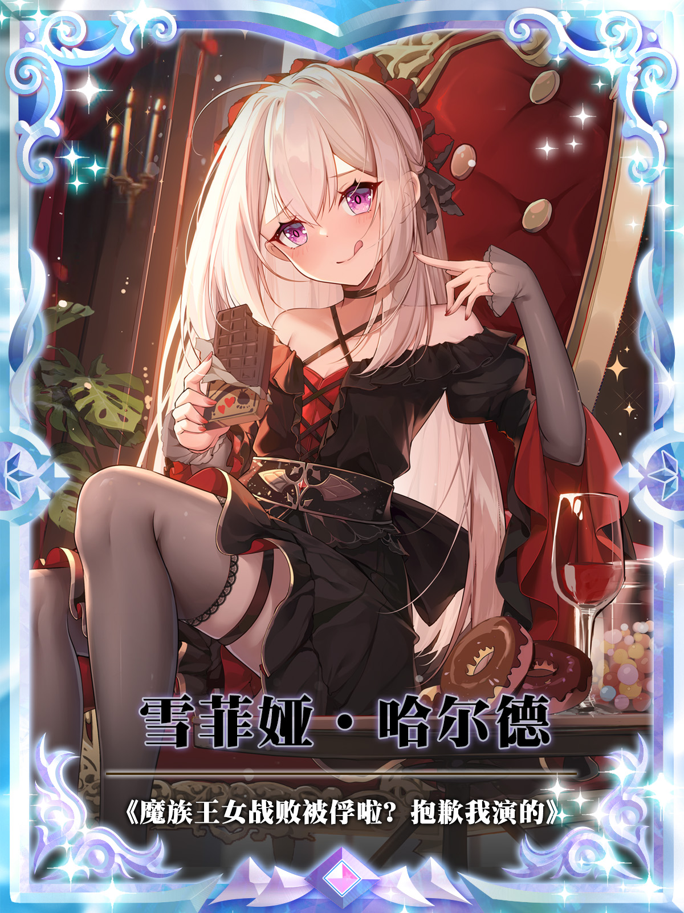

---
title: '魔族王女战败被俘啦？抱歉我演的'
author: '北星'
lang: 'zh-Hans'
description: |-
  作为堂堂魔族第一王女，只想每天喝喝小茶，看看风景，平稳度日，这不过分吧？
  可是魔族同胞们天天喊我去打仗，非要去拿下人家王都，这谁受得了？
  我不干了！！
  这么想打仗，那你们怎么不自己打啊！
  作为一个渴望和平的转生者，我只想摆烂睡大觉！
  还好友善的勇者少女让我到她家借住~
  可是等我到达之后...
  结果怎么会是这样的呢？
  “雪菲...明明是你自己要假装战俘的...我抓到你了，事到如今你还想跑吗？”
  “咱...咱觉得雪菲娅大人应该适时给咱些奖励才对...！咱要求不高的，早晨中午晚上...分别三次亲亲就可以了呀？”
  “王姐，魔族领才是你的家，请跟我回家。哈...战争？那和我们有什么关系，我只是想喊你回我们的房间而已。”
  面对重重生活压力...雪菲娅仰望苍穹，不免发出无力的哀叹。
  不说了。
  她们好像又朝我跑过来了！！
cover-image: 'imgs/cover.jpeg'
...

# 新的归宿？

## 1.败啦？“已经结束了...魔族王女，雪菲娅·哈尔德。这场战争，注定是你败了。”

“唔咕...该死的勇者...只能到此为止了吗...？”

身穿漆黑哥特式裙装的娇小绝美六翼银发少女半跪在地，张嘴就吐出一口鲜血。

场面凄美而凄惨，不甘而无奈。

——银发少女赶紧压好手掌底下早就备好的番茄酱料纸袋，紧皱眉头，决意将凄美进行到底。

抬头分毫，就是锐利足以斩断世间万物的寒光剑锋。

战场血腥味浓重的轻风，将手持利剑之人的璀璨金发向后吹拂，却不能动摇其身姿分毫。

金发之下倒映决意的湛蓝双瞳，优雅高贵，承载起无懈可击的精致容颜。

很难想象就是这样看似柔弱的存在，身着盔甲，双手握紧剑柄，将人族国家奉作至宝的圣剑，稳稳指向了魔族引以为傲，堪称历代最强的王女。

这一刻...也宣告了人族与魔族之间长达数十年的战争，拥有了即将画上短暂终止符的希望。

明明剑锋再偏斜分毫，就能斩落魔族王女的头颅。

可那金色圣剑...却迟迟没有再推进半分。

战场两侧本来已经杀红眼的双方部队屏气凝神，全都目眦欲裂将视线投向战场中央。

压抑太久的战场，竟一时之间陷入片刻的默契宁静。

可这终究是暴风雨前的诡异安静罢了...

只是片刻，战场双方就爆发出撕心裂肺山呼海啸般的仇恨宣泄！

“勇者大人！请挥剑！请不要慈悲！请为人族的未来斩落荆棘！！”

“雪菲娅殿下请振作起来啊啊！卑鄙的勇者，不要挥剑！我们愿意替殿下赴死！勇者！卑鄙的人族，恶劣的人类！你们都该死！该死啊！！”

呼声震天响，几乎要把山峦震碎，把湖泊掀翻。

人族国家一方部队不敢上前，他们深知自己只会给勇者大人拖后腿，谁也不想当那耽误斩杀魔女的千古罪人。

魔族一方同样不敢轻举妄动，他们救援王女殿下心切，可谁知道他们的莽撞会不会成为压落催促圣剑斩落的最后那根稻草？

他们吵得天翻地覆。

而对比之下的战场中心位置的两人...

气氛却是颇有些莫名的僵硬。

跪坐在地的魔族王女雪菲娅，眨眨幽紫色充满灵气但呆萌的大眼睛，耸耸左肩，使得搭在肩头的圣剑嗡嗡一响，疯狂暗示。

可当她抬头看到勇者希雅莱特比自己还要呆萌无措的眼神...

她只能出声小声提醒一下她了！

“喂...希雅？你在愣着干嘛呢？赶紧朝我脑袋敲一下啊！咱们的计划不是都提前商量好了吗！”

“可是...雪菲，真要砸一下...你会很痛的。”

“啧，你看看你，关键时刻掉链子，痛什么痛啊，真要是痛，我能让你敲？我又不傻，【冲击屏障魔法】我一直开着呢，整整三层大护盾！听我的，就按照原计划执行。敲我，我装晕，你把我当做俘虏，带到你的国家去，我要去那享清福！”

“话是这么说...但是雪菲，你也要考虑考虑我的感受哇...让我敲你脑袋，这不是你临时决定的吗...绝对会给我留下一生的心理阴影，我很心疼的知道吗...完全下不了手！要不...我们改变计划，改成你打我？”

“你想得美啊！是你要享清福还是我要享清福？！瞧把你给嘚瑟的！”

“呜...那怎么办啊，他们都好吵...”

“啊啊啊我真是服了你个笨蛋勇者榆木脑袋！暂时的痛苦，是为了更大的幸福你懂不懂啊你！算了...你不动手是吧，不动手，那我自己来！”

“雪菲...？！”

雪菲娅那银白色星河般的长发一晃。

竟是迎着圣剑的剑背，主动撞了上去！

【冲击屏障魔法】与圣剑的灭魔性质光辉冲击碰在一起，发出爆炸般不妙的声响。

撞上去之前，这位向来无敌的魔王之女，竟还露出“万般不甘”的神情。

并大声说了一句话。

“卑劣的人族勇者啊...竟然将圣剑施展引力魔法...！可恶，今天是我败了...但是将来...！唔咕...！！”

嘭~~~

好听吗。

好听就是好剑，好听也是好头。

雪菲娅软绵绵地，侧倒在地逐渐没了动静。

倒地的瞬间，她身后六只漆黑代表魔族实力的羽翼，也化作不详的黑色星光，渐渐消失不见。

只是雪菲娅倒下时，不忘记压好番茄酱料纸袋，还特意吹气驱赶拍走地上的小虫子...这就是所有人都没有看到的事情了。

突如其来的变化。

让战场双方都顿时愣住。

而转瞬之间...

——悲喜两重天！

人类一方相拥而泣，振臂高呼，士气大涨！

魔族一方悲痛万分，手中各自凝聚魔力光束，抱着必死的决心，准备最后一次杀向人族奥陆斯王国部队，就算拼了命，也势必要夺回王女殿下！

这一切可影响不到战场中间的两人。

希雅莱特被雪菲娅的卓绝演技吓了一跳。

她赶紧收起圣剑，蹲下身来查看雪菲娅的状况。

发现银发少女还在朝她疯狂眨眼示意，勇者大人才长长舒了一口气...

你缓个锤子的气啊！！

你没看两边又要打起来了吗！

这个憨憨勇者...雪菲娅倒在地上都不能省心。

她赶紧脸贴着地面再度提醒道。

“笨蛋希雅，快说台词...台词！说我教给你的台词啊！”

“啊...抱歉！”

希雅莱特在关键时刻其实还是蛮靠得住的。

人族至强者之一的天选勇者，希雅莱特挺直身姿，握紧圣剑。

——将其高高举起，直指苍穹。

金光熠熠的人族镇国至宝，圣剑【西莱特菈】散发骇人的杀戮气息与守护的均衡光辉。

尚且没有真正展现威势，就已经震慑着这个战场上每一个想要继续夺走生命的暴戾想法。

在绝对的力量面前，一切仇恨都要感到畏惧，所有针锋相对都显得不值一提。

通过某种魔力加持，勇者希雅莱特的声音，响彻整个战场。

“魔族王女，雪菲娅·哈尔德已经由我击败，魔族部队速速退散，汝等继续战斗已毫无意义。”

“作为魔族军队退回魔族领内的交换，我以圣剑威名起誓，绝不会将魔族王女杀害。今后她将作为我人族的俘虏，被关押在我国国都，反省她至今犯下的罪行。”

“相对的...敬告各位人族同胞，这不是仁慈，这是警示魔族，永远都不要再进犯人族领地的最佳方式！他们今后会明白，凡有违背者，必然和魔族王女是同一个下场！”

无懈可击的发言。

人类无法反驳——即便他们更希望将魔族王女在此斩杀以绝后患。

他们深知勇者大人的话有足够的分量，她的判断是否更符合人族利益，并不是一届士兵可以判断的。

魔族更是如此...勇者的言外之意，就是如果他们不退，就等同于回绝。

那么这样一来，勇者就会当场将殿下斩杀。

即便不甘心...又能有什么办法呢。

于是。

似乎是魔族部队分队指挥官，拥有着四只黑色羽翼的魔族战士，含着眼泪，悲痛万分朝身后大部队摆手。

摆手的方向，正是返回魔族领地的归途。

“回去...！都撤退！以殿下的安全为重！重复一遍，以殿下的安全为重！撤退！！！”

撤退二字，响彻云霄。

恰如魔族当时第一次迈上人族领地时的那句“进攻”，这般洪亮。

浩瀚无垠的魔族军队，在对人类的一片咒骂声中，如黑色潮水一般逐渐退去。

像是再没有乌云遮住太阳。

沐浴在阳光之下的人类部队，手中的剑与盾尽数落地。

甚至有人已经开始跪地不起，掩面而泣。

“赢...赢了...？”

“魔族...真的退了？我活下来了...？”

“勇者大人...！这一切多亏了勇者大人的判断！勇者大人万岁！”

“谢谢勇者大人...谢谢勇者大人！啊...我可以活着回去了...我可以活着回家了！”

“难以置信...”

被魔法与魔晶炮反复轰击的大地，早已残破不堪。

勇者独站其上，力挽狂澜。

想必这是任何英雄史诗都会赞誉的一幕吧...

更别说，勇者才只是今年刚满二十岁的绝美少女而已。

在人族部队的一片欢呼中，希雅莱特将倒下地上装死的雪菲娅扶起。

高傲的魔族王女，此时已经“苏醒”，被希雅莱特押解着，前往战场边缘独属于勇者的马车。

她现在即将要作为俘虏，被押送回人族聚集国家，奥陆斯王国的国都。

即便是胜利者，可成千上万的人类士兵，在勇者与魔族王女通过的道路上，还是本能避让的远远的。

就连仇恨的眼神都不敢过多投去。

任谁都记得魔族王女在战场上那般挥手间就足以引动天灾的恐怖魔法...

瘦死的骆驼比马大，谁也不愿意在胜利的现在过去寻死。

——即便勇者大人已经给魔族王女的手腕戴上了国家秘宝之一的“封魔手链”。

雪菲娅远远望见那金碧辉煌马车的轮廓，抖抖身后的手链。

虽然继续保持一脸严肃的姿态，但只有希雅莱特能听到的声音，却是无比的俏皮可爱。

“啊呀？做戏做全套啊，还带着封魔手链呢？可以呀希雅，有进步~”

“假的。”

“诶？”

“这手链肯定是假的啊...你以为呢，难道你觉得，我会给你戴上真的有封魔作用的道具？”

“嗷...我说怎么感觉没有影响...我...那个...希雅，你是不是在生气呀...？”

“你说呢。”

哎...

希雅莱特已经不知道该怎么说了。

雪菲...虽然我知道你的用心，也明白你的用意，同样也很理解你之前在魔族压力巨大的处境。

可是...让我亲自陪你演这出俘虏你的戏码，对我来说，可是很残酷的。

明面上她是在押解住雪菲娅的手腕，实际上，希雅莱特将手指轻点在她的手心。

脸色微微泛起些不自然的红晕...

雪菲...不管怎么说，等回到国都，你要好好补偿一下我。

这叫做精神伤害方面的补偿你知道吧！

可怜的雪菲娅，还没有意识到身后少女的所思所想，正在肆意畅想今后的自由人生呢！

专属于勇者的马车，已经近在眼前。

雾气散去。

通往国都的路，也已经渐渐显现在了深夜过后的朝阳之中，与太阳升起是同一个方向。

希雅莱特在战场众人都看不到的马车背面。

亲自替“俘虏”魔族王女雪菲娅，打开鎏金华贵的马车侧门。

相当庄重的，做出一个“请”的手势。

“走吧，雪菲，我们...该回家了。”

这话轻的像雪。

却又重至如山。

闻言雪菲娅娇小的身体竟像是被轻风吹动，不由得微颤缓缓低头。

银色刘海的碎发遮住眼帘，看不清她现在的神情...

而当她猛然抬头。

——却是恰好迎上太阳升起洒下的金辉，笑容灿烂足以压住天空阳光金灼，万里雪山闪烁。

同时不变的活泼声音里...竟多了些刚才所没有的温度。

“回家呀...这词听起来，还挺带劲的？”

“不喜欢吗。”

“不是，只是突然觉得，真是来之不易啊...哎算了！有话路上说，走吧希雅，回家回家！”

“嗯！”

## 2.她似乎在撩我！越过雪山，横跨土原，一路的车辙，将聒噪的战场甩在目不可及的远方。

随着接近王国都城，边荒战场的荒原沙地，狼烟烽火，就越是会被郁郁葱葱的美景替代。

战火没有燃烧而至的地方...着实是这些年难得寻觅的岁月安好。

装饰金碧辉煌的马车，行至军队最前方，不需要任何护卫伴行。

勇者世家饲养的马匹本身都极具灵性，完全无需人为来掌控缰绳，它们就能识途，安稳返回王都。

毫不夸张的说，这良马，可是能自己上战场杀敌的！而且还会嘶嘶叫呢！

可即便车厢里封闭而神秘...

也完全阻挡不了稳坐其中，身为俘虏的银发少女——像是小孩子出来踏青旅行一般开心！

在车厢里稳坐的雪菲娅，腾空晃悠着包裹荷叶边白色短袜与暗紫色小皮靴的小脚。

此时她正使用自己独一无二的特有魔法【视觉穿透】，将视野延伸到封闭的马车以外，欣赏沿途一路的风景~

希雅莱特眉头微跳...不得不佩服雪菲的定力。

汇报战况的信哨已经千里奔赴双方国都，估计现在魔族领和奥陆斯王国的最高领袖都已经得知战果乱成一团了吧...

雪菲倒好，居然还有心情看风景。

在吐槽着这些的希雅莱特本人，却是一路在关切端详着雪菲娅那稍稍显得伤感的绝美容颜。

看得出神。

雪菲娅在用魔法看风景呢，自然没有注意到这热烈的视线。

“唔哇...人族的国家果然很漂亮啊！湖泊，高山，树木，山峦，我滴天，还有大狗！魔族领很少有这种景色！”

说着，雪菲娅陷入短暂沉思，并自顾自用手掌摩挲着下巴思考起来。

“这么说起来，这种景色，感觉只有在上辈子见过...？太远的事了，远的还真是叫人怀念嘞！”

“雪菲，是想起以前的事了吗。”坐在她对面的希雅莱特目光一沉，轻灵的嗓音喃喃出声，“是想起...我们降生到这个世界之前的事情了？”

“算是吧。”

雪菲娅稍稍停顿，缓慢着朝希雅转过头来。

“我说，希雅你也还记得吧，在我们以前的世界，这种风景一般出现在‘公园’哦？湖泊里还有划船的，没记错的话，咱们还一块坐过船呢？”

“是啊...想想才觉得，时间过得真快，那居然都已经是二十年多前的事情了。”

“噗~要说时间过得快，难道不是因为咱们自从来到这个世界以后就没闲下来过吗？我出生在魔族王族，你出生在人族勇者世家，你说说咱俩，怎么就这么倒霉呢！来到异世界了都不能过安稳日子，真是见了鬼了！”

“别抱怨啦~要不是因为那件事，我估计咱们这辈子都不可能有机会认出彼此。所以，这也说不准是件好事，就因为勇者的身份，我才能这样正大光明接你走，不也挺好的吗。”

“嗷，那倒也是~”

希雅莱特和雪菲娅在封闭性极好的马车之上，对向而坐。

雪菲娅一袭黑裙，耀目的银发及腰，眨动紫色瞳眸，灵气四溢。

明明有着一米五左右还算勉强合格的身高，嗯...很勉强。

而稍显幼态青涩的脸庞，还是让这位魔族王女缺乏些威严感，一举一动反而是可爱感更多一些。

尤其是那晃动的小脚丫，让希雅莱特不争气的视线总是很难移开...

——当然这完全是在希雅莱特的视角看来才会有这样的结论。

若是旁人评价，肯定只会说，雪菲娅是残暴不仁的恶魔魔女吧。

希雅莱特已经收起了魔力汇聚而成的勇者之铠。

纯白色的长连衣裙，将她一米七的绝佳身高衬托的淋漓尽致，金色长发下一双碧瞳，优雅而不失华贵。

当然，她最具存在感的...

恐怕还得是胸口那，由含蓄款宽松连衣裙布料遮挡住的，那完全足够符合勇者之名的起伏！

这也是雪菲娅现在眉头疯狂跳动...以无语神态紧紧盯着的位置。

“雪菲...？你在看什么。”

“咳哼...没什么，我就是在想，你这家伙到底是吃什么长大的，为何这么浮夸。甭以为穿这种不显身材的衣服就能骗过我的眼睛...我的独有天赋魔法，能看穿一切虚妄。”

“啊？”

“没有，我胡说的，你不必在意。”

雪菲娅收回用于观赏“风景”的【视觉穿透】。

这的确是雪菲娅的独有魔法。

这个魔法，在这个世界上只有她能够使用。

她那身为魔王的倒霉老爹说过，这个世界从古至今，从来没有出现过视觉类魔法。

而当魔王大人听说自己的宝贝闺女不仅能使用视觉穿透，而且还能延伸视野看到很远很远以外的地方，不由得惊喜狂笑，魔王疯狂的笑声，响遍整个魔王城！

他早就说过了！

他的女儿，绝对是有着魔神庇佑的伟大天才啊！

那么如此伟大的特有技能，雪菲娅是如何领悟的呢？

很简单。

小时候在城堡外边的湖泊钓鱼，坐了半天，一条鱼都钓不到。

当时小小的雪菲娅恼羞成怒，一气之下竟就觉醒了世间独有的视觉魔法。

有它在，湖里的鱼无处遁形！

这下子鱼竿都不用了，她直接气到跳进湖里，去和比她脑袋还大的大鱼徒手搏斗！

连咬带抓，连蹬带打，王女大人这一举动让湖泊周围的魔王城守卫瞠目结舌。

这也是魔族王女“暴虐的雪菲娅”称号的最初来源。

护卫：我们是目击者，王女大人杀伐果断，湖里的鱼全被堆到了湖岸，几乎无一幸免。

鱼：我是当事鱼，我只能说，太暴虐了，真的。

咳...不过说到底，这视觉魔法平时是不会发动的啦！

刚才那是个意外。

谁知道我在看沿途风景的时候希雅突然来跟我搭话。

嗯嗯，要说怪，也肯定得怪她才对！

看着双手抱在胸前频频点头的雪菲，呆萌的希雅莱特歪头困惑道。

“雪菲...？你是不是在想什么奇怪的事情？”

“没有，绝对没有，如果你觉得有，那肯定是你奇怪。”

“是吗...”

“是的，你很怪。”

屑雪菲，总是能够孤傲站立于道德的制高点而不败。

相比之下...雪菲娅低头瞅瞅自己的胸口，就显得有些可怜了。

只有小小的起伏而已，不成气候。

哎，没所谓，她向来不在意这种毫无意义的对比。

谁让雪菲娅在转生到这个世界之前，也就是上一世的时候并非女生，所以从本能上就不是特别在意胸前赘肉的发展呢。

所以即便这辈子转生成了女孩子，当了快二十年的女孩子了，也完全不会在意这种...咳哼，真的不在意啊！

——雪菲娅捏住自己那一掌盈盈可握的胸口，发出了一声小动物般的悲鸣。

车厢里，萦绕着希雅身上令人安心的淡淡花香。

雪菲娅一个人的时候，很少会回忆以前的事情。

毕竟上辈子的事，想来并不是那么愉快。

可就是因为此时希雅也在，雪菲娅脑海里很多回忆，也就不受控制地涌出。

雪菲娅双手手背端着下巴，逐渐陷入沉思...

——雪菲娅是拥有着前世回忆的。

她的上辈子，是生活在一个叫做地球的地方。

“我说，希雅，你还记得咱们上辈子的事情吗。”

“嗯，记得一些吧。”

“我倒是忘了很多了...都这么久了，风景也看够了，好无聊，你要是还记得什么有趣的，就讲讲呗~”

“让我讲是没关系...可是我记着的也不多呀...嗯...我现在还记得清清楚楚的，也就是仅限于关于雪菲的全部事情吧。至于其它无关紧要的事，可能就记不太清咯？”

“哦哦你这记性看来也不行啊，居然只记得关于我的全...嗯？！”

雪菲娅没有证据。

但是她严重怀疑...

这个呆女人，她似乎在撩我！

## 3.过往雪菲娅上辈子生活的地方，叫做地球。

那里没有魔法，没有魔素，也没有那么多奇奇怪怪的种族。

甚至连大狗子都是只长着一个脑袋的温顺品种，能在家里养的那种神奇狗子。

主要活跃的种族，就只有人类而已。

而且她还清楚记得，自己上辈子的性别与这辈子相反。

上辈子，自己是个男孩子来着。

这一点才最重要！

啊啊啊...！

她每次想起这个就想吐槽一句——转生就转生，为什么性别会改变啊喂！

难道这个不该是承袭下来才会更方便的吗！

讲道理啊，刚转生过来那段时间，尤其是十岁之前的那些年真是有够不习惯的，生活方式的改变代表着各种意义上的费尽周章。

当然有一点好处，是不得不认可的。

那就照镜子的时候——能欣赏自我超乎寻常的可爱。

雪菲娅对此并无怨言！

爷真可爱，爷就是有这份自信，嘻嘻。

嘛，不过今年雪菲娅已经年满二十岁了，她已经完全适应了作为女孩子的生活。（大概）

想到这里，雪菲娅的目光幽幽飘忽向对面呆萌歪头坐着的希雅莱特。

这家伙和自己一样，也是转生者，上辈子来自于地球。

只不过她就没有经历那么多变化，她上辈子是女孩子，这辈子也还是女孩子，只是变得更加漂亮，多了亿点气质而已。

随着希雅不慌不忙微笑谈起上一世的趣事，雪菲娅用手拄着侧脸，随着平稳马车几乎感受不到的颠簸，也跟着回忆起曾经那些可能并不值得回首的过往。

雪菲和希雅，两人在上一世早就熟识。

——上一世，是青梅竹马的关系。

希雅比自己要大一岁，是从小到大的邻居，可以说是一直照顾关心自己的邻家大姐姐。

雪菲娅上辈子应该算是个留守儿童吧。

爸妈常年在外工作，家里说不上缺钱，但几乎全年都只有她一个人在家。

于是自然而然的，作为邻居的希雅，就离她的生活变得很近。

两人的关系也一直很要好，完全就像是自家人一样。

谁来谁家吃饭都不会觉得违和，希雅家里外出要去哪里玩，基本也是喊着雪菲一起去。

直到高中为止，除了希雅先毕业的那一年，上学也一直是在同一所学校。

不乏吵架，不乏打闹，但不管什么矛盾，赌气之后，能总一笑置之。

少女有点笨，不懂得生气记仇。

少年有点小聪明，但也不屑于跟自家姐姐多计较。

说到底，两人的关系，就只是一对如同家人般纯洁的笨蛋姐弟而已。

少年在高三那年，就开始备考和少女相同的大学了。

哼哼，毕竟希雅很笨嘛，自己这位姐姐憨憨的，要是没有自己跟着恐怕会有不少麻烦的吧！

实际上少年很清楚，离不开的不是她。

而是一直被关照，扫平孤独的自己。

少年的性格就是如此，他把每天的欢声笑语，岁月静好，看的要比前途志向要重要的多。

可是...

天有不测风云呀，世事难料。

希雅的上一世...

她在大一那年，罹患绝症。

而且一查出来，就是晚期了。

雪菲记得，明明她拿到大学录取通知书的时候还围着自己蹦蹦跳跳的...

可几个月没见，就已经只能窝在冰冷的病床上，脸色苍白，整个人都瘦了一大圈，不成样子。

雪菲心疼，但面对命运，很多话都无从说起。

命运就是不讲道理的。

那年，那天。

绝症的少女向哭泣的少年说了好多宽慰的话。

她说，世间总会开这种残酷的玩笑，我没有避开，很笨，所以不配上大学了。

她希望少年就算一个人，也要继续乐观地走下去，姐姐一直都在呢。

少年当然也含泪答应了她，但始终没有放弃协助少女家里治疗。

怀揣着一丝希望，整天往返于医院奔走，甚至放弃了高考复习。

少女骂他傻，他说他足够聪明也能考好，不用复习。

在最绝望的那段时间，少年依旧守护着属于两人的日常，极力挽回着明知要失去的一切。

他本以为，至少，也还有一年吧。

可是万万想不到啊...

希雅说对了。

世界真的总是在开着各种各样残酷的玩笑。

一个雨夜，少年怀里揣着医院里紧缺，从国外邮寄而来的药物，连伞都顾不上打，急匆匆跑向医院，他只希望这药物能够更快些交到希雅手里。

然而那天，药物并没有送到。

在距离医院两个街道的拐角，随着一声货车车轮雨天打滑吱哟的刺耳尖锐...

少年永远倒在了那个碎裂灯光，小雨淅淅的傍晚。

直到最后，他还努力伸手去触及那被压扁的药盒...

终究是体力不支，不甘心地闭上了双眼。

再醒过来时。

就是这辈子生活的这个世界咯~

雪菲娅睁眼见到的，是一座偌大但不够明亮的城堡。

面前的，是一个慈祥美丽，状态略显虚弱的漂亮银发女人。

她匍匐到自己耳边，用很欣慰很温暖的语气在说着这句话。

‘外边正好下雪了...所以你就叫...雪菲娅...？怎么样...？雪菲娅，母后给你取的这个名字...喜欢吗？’

明明是不同的语言，可雪菲娅居然很神奇的能够听懂。

而更令她震撼的，是女人背后那六只漆黑的羽翼，将当时还是婴儿的自己完全包裹，安全感十足。

以及抬头能望见城堡外，远远的苍穹里，云间掠过的巨龙...

从那一刻，雪菲娅就明白了。

自己已经来到完全不同的世界了。

哎，虽然当时那么震撼，但是既来之咱安之呗，想别的也没有用啊。

在那之后，雪菲娅就莫名奇妙成了魔族的排面。

莫名其妙就担负了许多责任。

又莫名其妙被推上了战场。

这大概就是雪菲娅至今为止经历的情况吧。

上辈子的事情已经太过久远。

雪菲娅的回忆，除了上一世一些刻骨铭心的细节，更多的是苦恼于今生今世的烦心。

细数着这些经历，雪菲娅又是一声长叹。

她用手指缠绕自己身前的一撮银发，突然询问起对面乖巧坐着的希雅莱特。

“话说希雅，你具体是什么时候过来的呀。”

“我大概...只比雪菲晚一点点而已？”

希雅莱特将手指抵在嘴唇旁，思索回忆了一下。

随后对着雪菲娅绽放一个稍稍无奈的苦笑。

“我记得，当时我听说雪菲出了车祸特别难受，然后就没有多少天吧...病情恶化的很快，医生说已经没有抢救的价值了，于是我在雪菲走后不久，我也跟着走了。”

“是吗...辛苦你了。”

“雪菲才是，辛苦。”

“嘛...彼此彼此吧！等等...这么说，你来的比我晚一点，那我的年龄甚至比你还稍微大一点？！”

“应该是这样的吧...哈，那从这个意义上说...雪菲这辈子还算是我的姐姐呢。”

“姐...！我？哎...算了。”

你的波澜壮阔离我不过一尺之隔。

你说我算是你的姐姐...我这嫩脸往哪搁啊！

但雪菲娅不打算计较这些细枝末节。

希雅虽然呆萌，但是永远都是这样乐观的。

比如她刚才的遣词用句，她更愿意用“走”这个词汇，而不是“死”。

就像她当年在病床上，依旧能笑得出来那般，比起自己，总是带给周围人以力量。

怪不得你这辈子是勇者呢...没准就是这个原因？

万幸，我们俩又在这个世界相遇了，这是莫大的幸事呢！

马车车厢里短暂的沉默不语。

可能就是两人温柔给予彼此回味的时间吧。

本来双方在这个世界是敌对阵营，注定很难坐下洽谈的。

可是如今这样坐在一起，还是多亏了雪菲娅的妙计！

雪菲娅在不够宽敞的车厢里试图搭起个帅气的二郎腿，当因为两条小短腿太短，搭的有点费力，索性就换成了脚腕搭脚腕。

她坏笑着摊开左手笑道。

“话说我到这个世界，可是连性别都变了诶，当时希雅居然能认得出我，我只能说，震撼。”

“我也不知道该怎么形容当时那种感觉，可是我觉得，雪菲就是雪菲，灵魂的气质是不会变的。而且你自己整出那么大动静的‘杰作’，我还能察觉不到？”

“嘿嘿...果然是因为那个？”

## 4.火祸降罚说起“那回”啊，俩人心有灵犀，可立马就都懂咯！

甭看马车已经离王都越来越近，可老乡见老乡，那聊得是越来越起劲。

想起两人在这个世界重逢的“那回”契机，希雅莱特还是忍不住轻抬手背到唇边，半掩嘴角相当优雅地笑道。

“噗...果然，就算现在想想，也还是觉得雪菲做的实在太夸张啦。”

“有吗？”

“肯定有啊，把足以绵延覆盖整个人类联盟领地的火焰魔法打到天空，那种规模的魔法...当时就连国王都吓到了！民众都以为是要世界末日了呢！”

雪菲娅搭着脚脚满不在意，耸耸肩膀摇头笑道。

“我那能有什么办法，谁让我这人就是聪明嘞。我老是在想，我转生过来了，那万一你也在这个世界呢？这种几率虽说很小，可也不是没有，如果是真的，你找不到我，那希雅你岂不是太可怜啦！哈哈哈哈！开玩笑的...”

“是的...我可是一直都在想念雪菲，自从来到这个世界...就一直在想着你。”

“喂喂喂...我说你啊...倒是稍微反驳我一下啊...你这么顺着我说话，整的怪不好意思的...说到底！你这人怎么从来不按常理出牌啊你！这不就没意思了吗！”

“啊？可我...我只是说事实而已呀...雪菲你怎么生气了？”

“我没...！哎，行吧行吧...真憨。嘛，反正当时那个火焰魔法就是纯粹碰碰运气，我也没想到还真就找到你了，这算是...瞎耗子碰上瞎猫了？”

“那好像是叫瞎猫碰上死耗子...？”

“呃，抱歉，上辈子的歇后语了，记得有点混乱，也对哈...至少不能两个都瞎，不然也碰不上。”

歇后语不重要。

重要的是雪菲娅很庆幸自己当时的决策。

她之前就是不确定希雅是否也转生到了这个世界呀。

于是，就心血来潮做了一个小小的尝试。

大概...算是“小小的”尝试？

——朝着人类联盟的方向，释放火焰魔法，将魔法纯度压缩淬炼到极致。

然后全力全开...朝着天空释放！

她这火焰魔法可不是瞎放的啊。

雪菲娅是凭借极高的魔力纯度将火焰扭曲，不断通过魔力的细微掌控，改变其形状。

就连她自己也没有想到，本来异想天开的想法...居然真的实现了。

最终庞大规模的火焰，成功在天空勾勒出了文字的样式！

咳哼，只是这文字，是这个世界所没有的啦。

雪菲娅勾勒出的文字，是用的记忆中，上一世的汉字。

如果说希雅真的在这个世界...那想必她肯定能够读懂，这两人之间的暗语。

——【我，魔族王女，在不？】

在这后边紧跟着的文字，就是两人上一世的姓名。

【在不？】这两个字后边，雪菲娅甚至还特意把【？】都给做好了。

你就说她认真不认真嘛！

这事大概发生在俩月以前吧。

这也是勇者希雅莱特突然提出要去战场最前线与魔族王女对峙的原因。

名为对峙，实为洽谈。

然后魔族王女与人族勇者的感动重逢，就实现于那战火纷飞的最前线。

世仇颇深的异族士兵们喊归喊，杀归杀。

也完全影响不了战场中间的营地里...双方领袖是感动的哇哇大哭啊！

老乡见到老乡，两眼总是泪汪汪。

举杯喝起小茶，在战场正中央唠起了家常。

雪菲娅一想到当时那个火球术居然真帮她找到了老乡，不由得露出小虎牙嗤嗤笑了几声。

白雪般丝滑的银发一晃又一晃，她的笑声除了有点屑，总体还是若银铃般好听。

“哈哈哈！其实我也没想到哇，我之前从来没有用全力释放过火焰魔法，那回可把我累的够呛，但是效果还算不错，我的评价是，非常值得！”

“雪菲你有点自觉好不好...你那火焰魔法真的还能被称为火球术吗...人族历史上千年，按照记载，就连初代勇者集合全体长老之力对初代魔王释放的神圣魔法，都没有你这火焰魔法一半的范围啊...而且那还只是记载而已，你这是实实在在的！你都不知道，你这魔法用出来，大家都以为，是神明降临了。”

“这么夸张？！”

“哎...你以为呢。”

希雅莱特当时坐镇国都，可是亲眼见证者。

火焰灼烧天空，夜晚亮如白昼。

火幕明明距离地面有上千米，站在地面却依旧能感受到脚下的灼热。

那盛大的天空火墙...在整个人类联盟的领地都可以抬头望见。

那已经不是“天灾”能够形容的壮阔场景了。

普通民众纷纷开始跪拜，祈求神明不要降下天罚，主动诉说起自己的罪孽。

比如，他偷了你家两袋米，你掐死他家一只鸡。

“末日”的斗殴，蔚为壮观，王都一度异常混乱！

那火焰天幕存在了足足有十几分钟，才逐渐化作点点星光消失不见。

只留下空气中些许灼热的温度，证明它曾经存在过。

这场其实称不上灾难的灾难...被王国居民称为「火祸降罚」。

实际上并没有降罚啦~这顶多相当于是雪菲娅朝着人族领地放了一个超大的烟花！

只是并没人知道这火焰是出自魔族王女之手就是了。

唯独希雅知道~

别人看见那天空的火焰长墙是感到畏惧。

而唯独她...眼中倒映火幕，仿佛闪烁起了二十年都不曾有过的期待兴奋光辉。

那一刻，勇者的全世界都被照亮了。

但果然这场“烟火”还是太过夸张啦！！

希雅莱特扶额摇头，暗叹对面坐着的雪菲完全没有自觉。

“哎...其实我觉得我也应该见怪不怪了...雪菲你上一世也是这个性格啊，明明学习成绩全校第一，却总是想着要和我考一所大学，你明明能选更好的才对。”

“你管我嘞。”

“嗯，不管你不管你。哈...其实我最惊讶的，果然还是雪菲变成了女孩子这件事。”

“这...！可恶，这事咱能先不提了吗，又不是我愿意这样...完全没有男子汉气概了！”

“不是呀，雪菲这样明明很可爱啊？”

“！”

希雅有时候真的很坏心眼啊喂！

你看看她突然眯起眼睛坏笑的样子！

要不是这里施展不开，我简直想蹦起来给她来一个坚实有力的飞踢！

希雅莱特见雪菲有那么一丢丢的羞愤神情，心中升腾起某种莫名的满足感~

她摆摆手表示先放过雪菲，暂且可以不谈这个话题。

——并伸手过去，轻轻拍了两下雪菲娅银白色的头发。

这突然的摸头拍打，让这位威严满满的魔族王女嗓子里蹦出些唔唔嘤嘤的奇妙单音。

“嗯...其实变成女孩子又能怎么样呢，我刚才也说了，雪菲就是雪菲，我一直都在想念着你。”

“唔嗷...呜哇！！先别拍脑袋了！都二十的人了，还这么不稳重！”

“是是是~我是该学学雪菲的稳重呢，话说...雪菲。”

“咋了？”

“我能问你个问题吗。”

希雅莱特眯起眼睛，似乎是感知了一下马车如今行进的位置。

随后她睁眼，神情中覆盖些许刚才不曾有过的严肃认真。

“我们说完这个...就真的要进入王都范围了。雪菲，我要问的这件事对咱们以后在王都的生活影响是很大的，我希望你能如实回答。”

“怎么突然这么认真...行，你说，我知无不言。”

说着说着，雪菲娅突然想起了什么。

她赶紧竖起一根食指来额外强调道！

“但是先说好！问什么都行，就是别问我有没有钱，离开魔族领之后，我就身无分文了！千万别想着让我拿生活费！我没有钱！真的没有钱！也绝对不会去打工的！”

“...！不会找你要钱的啦...！！真是的，区区雪菲，我养得起！”

“哦哦，你早说嘛，吓我这一大跳。嘻，有你这句话我就放心了。那问吧，只要不提钱，别的都好说！”

“......”

呜呜...我家的雪菲，像不像一只小小守财奴啊！

## 5.真实实力？钱的事，你别管。

到了王国，我肯定不会饿到你的！

希雅眼中的宠溺神色一闪而过。

她要问的事情，可比这要重要太多了。

对于雪菲娅的无厘头发言顿感一番无奈后...

希雅的表情依旧保持着七分凝重。

剩余的三分情绪，是没法掩饰的忧虑。

“我说雪菲，能问一下吗...你现在的真实实力，究竟是怎样的。”

“我的实力？”

雪菲娅被这突然的提问整的一愣。

随后她弯曲手臂，撸起黑色哥特式连衣裙袖口的丝绸，展示着她那毫无肌肉的小胳膊！

“我还可以的！实不相瞒，我相当能打！”

“......”

“我说希雅...你是不是在藐视我。”

“不是...我只是觉得，雪菲的皮肤真好，很白，跟雪一样。”

“好哇！你的关注点居然在这里吗！让我看看你的！”

“没有...咳哼，雪菲，要严肃，不许岔开话题！”

“是我先岔开话题的吗？！”

“啊...抱歉。”

雪菲娅只能说，呆萌的家伙两辈子都是呆萌。

拥有这样的勇者...人族的王国不知道还能存续多久。

加油吧，奥陆斯王国。

雪菲娅用胳膊肘杵着车厢旁的木质扶手，摊开右手试图说些例子让希雅来理解。

“我觉得你问的这个问题有点抽象，我也不知道怎么回答才算合适，不过答案应该还挺直观的吧。人族那边，这些年应该没少说我坏话？我听说咯，他们不是喊我为【天灾王女】吗。”

“啊...这个称呼很不好听对吧...等回去王都，我就想办法，让他们停止这种称呼。”

“别啊！”

“欸？”

“这称呼多帅气啊！改了干嘛？你都不知道，在魔族领，我只要躲起来乐呵呵喊一句‘天灾王女来咯’！魔王城外边的小孩子们都得被吓跑！可有威严了！所以这事你可别管啊！管了小心我直接跟你急！”

“......”

连珠炮式的发言，给希雅整的一愣一愣的。

雪菲你还真是乐观哈...？

还是该说魔族的风土人情...有点淳朴？

希雅莱特性格是有点憨，但是她考虑问题的时候绝对足够聪明。

就比如刚才雪菲举【天灾王女】这个称呼的例子。

就是在告诉自己，她就是如同传闻里那般实力卓越。

但是...这种模棱两可的说法，并不能让希雅信服。

当然，单看之前那布满天空的火焰魔法以及近些年传闻中雪菲的战场表现，就知道她不仅不弱，而且很强，非常强。

很大可能，要比被称作人族历代最强勇者的自己更强。

但即便如此——这都并不是希雅亲眼所见的。

包括那燃烧天际的火幕，希雅无法判定那是否是仅凭雪菲一人的魔力，就构筑出的神迹。

正因为它过于夸张而华丽，才让希雅莱特更加担忧，这其中是否有什么隐情呢？

在这个世界的历史中，并不是没有出现过某一种族为了震慑它国，而合力虚构或是夸大自己种族的所谓顶尖战力，来起到迷惑混淆它国不敢进犯的作用。

就比如精灵族，上百年来总是在标榜他们自己的世界树结界天下无敌，靠近者必死。

——结果前些年居然被一头没有彻底掌握飞行迷路的幼年龙种无意间给撞了个大窟窿。

那幼年飞龙在精灵世界树守卫的围攻下受了重伤。

但是最后居然活着逃掉飞走了！

精灵族折了颜面，全族合力编织的谎言，被一个意外拆穿，这可能就是导致如今他们处境异常艰难的原因之一吧。

所以，如果可以的话，希雅希望能亲耳从雪菲这边听到，确认她的真实实力。

而不是以“道听途说”这种不靠谱的方式来模棱两可着去接受。

不经意间，希雅微微颤抖的手掌，已经覆盖在雪菲娅的左手上方。

所思所言，皆为真心。

所忧所伤，皆为一人。

“雪菲，接下来...我们要一起在人族的国都生活。到时候你身为魔族，四面八方可能都会有你的敌人...”

“我在能关照到你的地方，一定会时时刻刻陪在你身边。我会尽量掩藏你的存在，你想演戏，我就陪着你演戏，只要你能过上你想要的生活。”

“但是你要明白...我总有暂时离开的时候。”

希雅莱特的湛蓝色眼眸中，顿时闪烁出一抹无可置疑的执着与守护。

“所以我希望你能好好地告诉我这一点，你真的可以保护好自己，对吗。我要是以前不知道你在这个世界就罢了...但现在，我已经知道了，我无法接受任何一点再次失去你的可能性，雪菲你...能理解姐姐的感受吗？”

“......”

雪菲娅呆呆地，望着那坚毅而动摇，因为“害怕失去”而惧怕的眼神。

真的是...

刚才不是还说自己这辈子我年龄比较大，所以我才是姐姐来着吗...现在就又以姐姐自居了？

既然是勇者大人，既然是姐姐...那就不要露出这种怯懦的样子啊...

真是不像话。

这回，雪菲娅不再吊儿郎当了。

她放好本来搭在一起的双脚，把双手并排放在双腿之上，很规范地朝着希雅的方向转过身来正坐。

一举一动，王族风范。

这一下，她终于有了些符合“魔族王女”身份的威严感。

“希雅，你知道魔族的实力，与翅膀羽翼的数量是挂钩的吧。”

“欸...？嗯，这个我是知道的。”

“那你在刚才的战场应该看到了，我的翅膀数量。”

“对...和传闻里说的一样，我看到的是...六只羽翼。”

漆黑的羽翼，不祥的暗光，其中布满魔族发动魔法需要的魔素，决定着魔力的质量。

很大程度上，就是因为天生的羽翼，才会让魔族站在这个世界魔法造诣的顶点。

“我记得魔族出征的时候，是这么说的。‘三翼黑羽，军势溃散。四翼凌空，城镇难存。’”

“对的，人族这边也是差不多，凡是遇到四翼以上的魔族，就必须立刻汇报国王，从王都派遣强者迎战，谁也不能擅作主张。”

“是啊，说起四翼的魔族...在魔族领也得是魔族大公勋爵一类了吧，确实有足够的实力。”

这么说吧。

在魔族之中，单侧只有一只羽翼，以及双侧的两只羽翼是最常见的。

人族的战士对上他们虽然有些吃力，但凭借魔晶炮以及各种附魔武器，加上魔法咏唱者的协助，并非没有一战之力。

可若是到了三翼四翼...

就像希雅所说，需要一整个军队，乃至于一整个城池为后盾来与之对抗。

五翼魔族。

这仅仅局限于魔王王座周围环绕着的魔王军各军团长，其数量，两只手就能数得过来。

他们若是亲自出战，除了勇者本人，以及勇者所在家族——【镇国之剑】莱特家族的强者，恐怕人族只能喊出元老会里那些魔法造诣极深的老家伙们来应对了。

再往上...

那就是站在这个世界顶点之一的存在——六翼魔族。

他们已经不是以“天赋卓越”二字可以形容概括的了。

他们是天灾的代名词，是规格以外的存在，是这世间各种族的绝对强者之一。

由于这个世界上其它顶尖种族势力的干预，为了保持种族之间力量的均势，也为了防止战火过于激烈导致别的种族受到威胁...魔族在这场与人族的战争中，不被允许全部的六翼魔族参与其中。

最多，只可以派遣一位六翼。

为了不腹背受敌，魔族自然是同意了这个还不算过分的要求。

毕竟，六翼魔族崇尚强大，本身也不屑于欺凌弱者。

也得益于此，人族奥陆斯王国，才没有短时间内将国家所有秘宝与资源快速耗尽。

目前世间存在的六翼，据希雅莱特所知，就只有魔王，魔族王后，以及魔族王族近卫军里的两位最高级将领公爵。

不...

如果自己在战场见到的是真实情况。

——那么应该还有坐在自己面前的雪菲。

雪菲就是由魔王决定出来，以“历练”之名，派遣其加入并统领这场战斗的唯一六翼魔族。

雪菲娅是魔王的大女儿，魔王总共就俩女儿，派出第一王女来统帅战场，他非常放心。

这也是雪菲被希雅“俘虏”时，人族一方为何能兴奋到那种程度的原因所在了。

敌将已被生擒啊！！这可是能载入史册的大事件了！

他们亲身参与了那种战斗，当然是无比的荣耀！

然而希雅完全不在乎这些无关紧要的事情。

说到这里，她迫切地要确认这一点。

“所以雪菲...你的六翼是实实在在的对吗，你不要怪我一直追问，因为历史记载里从来没有像你这么年轻的六翼魔族啊...这过于匪夷所思了。”

雪菲娅幽紫色仿若魔力萦绕的双瞳，左看看右看看，最终固定于希雅的双瞳。

然后又悄悄自然将视线挪开，不太好意思去继续直视。

真的是...

都多久没有这样被关心过了。

姐姐你呀，还是和上辈子一样，什么事情都要刨根问底，真是担心过度了。

但是...感觉还不错。

雪菲娅眯起眼睛微笑，俏皮着打了个响指。

“真想看真相？”

“嗯，我一开始就说了。”

“行行行~我都打算以后跟着希雅你混了，还有什么不能说的？你猜的没错，关于这个，我确实掩藏了一些东西。”

“？！”

难道真的被我猜中了...？

“雪菲你要是没有自保的能力...那我们就不去国都了！不安全的！我们可以去...去哪里...啊...哪里...”

“哎我不是那个意思！啊啊，具体我也不知道该怎么说啦...！干脆这样吧，我给你看一看，看完你就知道咯！”

雪菲娅可是个行动派。

说展示，那就是立马，现在！

话音刚落，都还没提醒希雅做好准备呢。

一道漆黑的光，就顿时闪耀于希雅莱特面前！

因为马车隔绝结界的阻挡，才勉强把这耀目的黑光隔绝在车厢之内。

希雅眯起眼睛...过了好几秒才有些艰难地将眼睛重新睁开。

同时...

一片轻盈的漆黑羽毛，从她的眼前缓缓飘落。

而当希雅莱特的视线稳定下来，彻底看清坐在对面，已经显现出作为魔族象征的黑翼，还在摇头晃脑的雪菲之时...

希雅莱特瞪大双眼。

她不自觉稍稍张开小嘴，震惊到了极点。

她感觉自己的眼睛或者这个世界...肯定是有一个出了问题！

不然的话，面前怎么会出现这样的情况呢！

“八...八翼...？”

## 6.说到做到（六千字大章）“八只羽翼...雪菲！八...不行我再数数...一二三四五...啊，果然就是八翼！”

你甚至在震惊之中还能多数一遍。

看的出来，你并不是很智慧。

雪菲娅若无其事压压手掌，示意面前这位勇者大人要学会冷静。

“啊我懂我懂，别那么惊讶啊，你可是勇者，不能一惊一乍。”

“怎么可能淡定...！雪菲，你知道八翼代表什么吗？！”

“啊？这我还真不知道，代表什么？”

“我也不知道啊！”

“你也不知道那你说个螺旋锤子怪呢！”

这波吐槽把雪菲娅自己给累的不轻！

可是可是！希雅莱特面对此情此景，实在是无话可说了呀！

漆黑的八条羽翼，延伸抵在宽敞马车车厢的顶部。

翅膀和雪菲娅背部的相接处，有着如同虚影般扭曲的空间，翅膀就像是直接从连衣裙后延伸出来的一般。

魔力化形的翅膀，并不会受到衣料的阻隔影响，相当方便~

环绕羽翼周身不可视的魔力漩涡，仿若是深海星空深邃，寻不见底。

就因为希雅是勇者...她才能更加真真切切感受到八翼带来的强大压迫感，让她一时间甚至忘记了该怎样呼吸才最有效率。

如果是普通人，在如此近距离之下面对这种状况...应该会本能的昏死过去吧。

希雅莱特即便感受到了些许窒息，但很快就恢复了过来，并没有进一步的不适反应。

除了她本身的强大以外。

另一个原因，希雅也非常清楚。

“雪菲...你是在刻意掩盖气息了吧。”

“唔姆，那不然嘞，你这马车的隔绝屏障看着不怎么靠谱哇...万一引起骚动，外边的人还不得以为是我又开始闹事啦！那岂不是还要再演一次？多麻烦，我又不是真演员，演戏也没人给我发工资。”

“那倒是...不过你居然说这隔绝屏障不靠谱...哎，算了，我感觉，我好像有点习惯了。”

“哈？”

雪菲你怕是不知道。

咱们这马车的气息隔绝屏障，是用人族三大至宝之一的【纤神链】构筑，哪怕是巨龙朝着马车全力释放吐息，也无法动摇车厢分毫。

隔绝的了巨龙吐息——可不代表能完全隔绝八翼气息。

希雅莱特紧张着咽了下口水，闭起眼睛，将感知探查系魔法全开，延伸到马车后方的人族军队。

还好...看来雪菲将气息压制到了很低的程度，军队并没有什么异常的反应。

希雅莱特停止感知，睁开湛蓝色的双瞳，并捂住颇为有料的胸口，长舒了一口气。

“呼...还好，军队还在正常行进，没有什么骚动。多亏雪菲你留了个心眼啊...不然就麻烦了。”

“那是！我这人超谨慎的！”

“谨慎的人才不会突然展开翅膀啦！雪菲你个笨蛋！”

“唔痛！”

雪菲娅头顶莫名其妙挨了一手刀，委屈兮兮，但并不痛。

挨了这一手刀，雪菲娅蜷缩起八只黑翼，将自己包裹在其中，缩在了整排座位上。

银发的小家伙只从翅膀相接的夹缝中露出一个脑袋，机灵眨眨眼瞅着对面的希雅。

“喂，这可不地道，能怪我展开翅膀吗，明明是希雅你说让我证明实力的，我这不是证明了吗。”

“唔...那我道歉，可是话说回来，八只羽翼什么的...我读过这个世界的通史，完全没有出现这种记载啊，就连初代的魔王也是六翼。不...等等，雪菲，你们魔族信奉传说中的创世魔神提耶耳，在描述里是不是就是说的八翼？”

“创世...魔神？那是什么东西。”

“是你们魔族信仰里的神明大人啊！啊啊雪菲你真是的...你这些年在魔族都没有学习常识嘛！”

“噗...我是开玩笑的啦，我当然知道那什么...那什么提椰子！”

“不是提椰子，是提耶耳...”

“都一样啦！哈哈哈！”

“啊...简直是匪夷所思。”

雪菲娅吹起口哨眼神飘忽向旁边，不再言语。

她肯定是略知一二的嘛，但是小时候在城堡上课那么枯燥...怎么可能完全听的进去呢！

希雅莱特上下打量面前这漂亮的八只羽翼，并尝试伸手去触碰上边魔力涌动的纹路。

“但是魔神终究只是神话传说而已...理解不能。”

“呀...？！”

“雪...雪菲？”

实不相瞒，雪菲娅这声如同小猫般可爱的悲鸣，让希雅的心头酥麻一片。

她连忙伸回触碰到翅膀的左手。

只见雪菲娅死死抓着自己的黑翼，比刚才缩的更紧，满脸通红谴责着从翅膀里伸出一只小手，露出小虎牙控诉道！

“怎么直接上手啊...！你你你...你不是学过常识了吗！魔族的翅膀是很敏感的你知道吗！”

“不是...雪菲，我从来没有听说过这种常识...你是不是记错了？”

“胡说，我自己的翅膀我能不知道？”

嘴硬的性格就是喜欢犟嘴，雪菲娅论述这个问题，为了证明自己的正确，那是越说越上头。

“这翅膀每回展开之后，只要碰到墙碰到门，都会酥酥麻麻的。”

“那不可能呀...”

“怎么不可能！所以我平时才很小心的！可要是没小心碰的次数很多...那就很难受了。”

“怎么个难受法呢？难受是指...？”

“哎呦你怎么这都听不懂啊！我说的那种难受就...就是...我自己缩到魔王城的房间里，得自己用手来稍微解决一...嗯？！你这是在诱导我说什么呢？！”

“......”

我不是有意在诱导的...

可是...刚才无意之中，希雅好像听到了一件爆炸性的情报？

露出一个若有所思的笑容，希雅那眼神好像在说——雪菲有时候好像涩涩的呢。

这一个眼神把雪菲娅彻底整不会了，她猛地缩进翅膀里，低声吐槽希雅卑鄙至极。

怎么了嘛...转生成女孩子这方面肯定是有好奇心的呀...再加上这不争气的翅膀，难道自己自食其力来解决还有错吗！

我们没错！我们自由！

希雅也不打算让雪菲下不来台阶，她虽然听到这些已经心满意足，但还是要纠正雪菲的这个常识性错误。

“不过...我还是想说，有没有可能只有雪菲你自己有这种情况？”

“哈，那怎么可能。”

“因为你想啊，如果真的是这样，魔族的生活也太辛苦了，而且如果真有这种事情，一定会被记载到书本上的，既然没有，那就代表你这是特例。”

“真的假的...”雪菲娅眼睛里的高光在慢慢褪去，“只有我这样吗？那我是不是生病了...完了，我要完蛋了！”

“我想这应该不至于那么严重...”

希雅长长一声叹气，原本心中某种坏心眼促使她还想伸手摸摸那些漂亮的羽翼。

怎奈何理智占据上风，她还是忍住了。

“先不说这个，雪菲，除了我以外，还有人知道你是八翼吗？”

“除了你...哦，还有我父王和我母后，除此之外，再就没有别人知道了。”

“魔王和王后吗...他们看见八翼之后有说什么吗，他们是否知道什么我们不了解的，或者...他们有什么反应？”

“他们吐了。”

“？”

雪菲娅的眼神突然有点茫然。

似乎想起了些不堪回首的黑历史。

希雅莱特愣了一下，刚开始不太能理解雪菲的意思。

可是只是片刻，她也就反应过来了。

懂了。

刚才那是雪菲在刻意压制魔力，所以自己才没有受到太多影响。

而既然她懂得压制魔力...

就说明她之前经历过没有压制魔力导致的后果！

想必当时魔王和王后，直面到了相当恐怖的魔力大漩涡。

以至于毫无防备的情况下，直接晕眩吐了出来。

希雅莱特默默感谢遭罪但素未谋面的魔王夫妇...让雪菲懂得了收敛，让自己幸免于难。

你们辛苦了。

雪菲娅对此只感到悲伤。

呜呜，自家爹妈啊，看见自家女儿开心展示翅膀之后，直接吐了！

这件事，给她幼小的心灵留下了极其深刻的心理阴影！

懂不懂父母对女儿呕吐的含金量啊！

“不过...魔王和王后既然知道你是八翼，你假装被俘，他们能相信吗？”

“那就不是我能管的了，走一步看一步呗。”

“也是...”

双方经过一阵短暂的沉默，希雅还是想问问这个她刚才就很在意的问题。

“可是之前在战场上，我看到雪菲明明是六翼，难道是我之前...看错了？”

“哦哦，你说这个啊，那倒是没看错。”

雪菲娅从羽翼中伸出一根食指，在自己面前绕了两圈。

白葱般的指尖，闪烁出如同水波涟漪般的微亮荧光。

随之而来的变化——就是包裹她的翅膀，模模糊糊中竟慢慢消失了两翼。

而随着指尖荧光的消失。

六翼又重新变回原原本本的八翼。

雪菲娅忧心忡忡叹了声气。

但在可爱的面容加持下，这样的叹息不仅不沧桑，甚至还有几分可爱。

“哎~其实，如果有需要展开翅膀的时候，我平时会用视觉系魔法隐藏两翼啦。我在魔族这么些年就没见过八翼的..我也不是天生八翼，是在学会魔法之后才这样的，那就说来话长了。但是枪打出头鸟知道吧！我让父王母后也帮我保密了，我要是不这样，还不得给魔族加班加到死！你看，我之前就够忙的了！”

“你肯定找不到别的八翼啊...嗯...不过，我能理解雪菲的感受...我作为勇者，也是天天忙得要命。”

“对吧！”

希雅完全可以理解雪菲不想过多展示实力的想法。

毕竟...

魔族这些年，过于依靠他们这位王女大人了。

自从雪菲十岁之后，就总是出现在战场最前线。

只要是她在的地方，魔族士气高涨，势如破竹。

讲到这里。

雪菲娅蜷缩的八只羽翼慢慢展开了。

显露出坐在其中的银发少女，抱着自己的膝盖。

幽紫色的双瞳中，骤然萦绕起多年的纠结与茫然。

“希雅...你说，人族和魔族的战争，究竟哪边是正确的。”

“战争没有正义的一方。”希雅莱特似乎是提前就猜到了，她会问出这个问题。“这场征战在我们出生很久以前就开始了，人族觊觎魔族积攒的财富，魔族窥探人族广袤的领土，是谁先动手的...已经很难再去考究，就算能够知道，也没有任何意义。”

“是吗...”

嗯，答案是肯定的。

听说最初的最初，是精明的人族商人，将优秀的工艺品引进了魔族领。

这本该是好事才对，种族之间展开商业贸易，对于双方生活都是种便利。

但以力量为尊，钱财富裕的魔族，压根没有那么多的防备。

他们低估了人族恶意贪婪的一面。

直到他们反应过来，才发现魔族领原本能购买一袋粮食的货币，竟然已经贬值到一勺米都无法购得。

魔族暴怒了。

而那些人族商人们，沾沾自喜，早就赚的盆满钵满，各自回到自己的人族国家，跟家人朋友炫耀他们在魔族领大闹一场的丰功伟绩，赚了多少多少的钱，还嘲笑那些愚蠢的魔族都是些蠢蛋。

甚至还笑着炫耀估算，他们这波“伟业”，会饿死多少的魔族。

从那时起，战争就已经无可避免了。

当魔族大军踏上人族领地的第一寸土地开始。

那些个别商人的罪孽，就已经转移到了全体人族的头上。

无论其无辜与否。

你说，这不公平？或者公平？

不...这无关于公正。

战争只要开始，引发战斗的理由，就绝对不再是所谓单纯的报仇而已了。

而是一个种族看见了更加广袤的星辰大海...无边无际的征战野望。

人族的贪婪，确实有目共睹。

但魔族的欲望，也早已无穷无尽。

一直蜷缩于洪流中心的雪菲娅，暗紫瞳眸中的光彩略显黯淡无神。

“所以...我才要像这样，作为‘战败者’，离开魔族，去找个地方...过普普通通的生活...我已经不想再看到战场了。”

“即便雪菲可以用蛮力改变魔族的一切...让他们不敢再产生征战的想法？”

“我改变不了他们的想法，也不想去改变。”

雪菲娅继续压低脑袋抵在膝盖，她虽然声音很小，但还是努力向自己在这世上唯一信任的人来诉诉多年无处倾诉的苦水。

“因为...凭什么呢...凭什么我要当这个用蛮力改变别人想法的‘叛国者’？希雅...如果我真的那样做，你不觉得...这很不公平吗，我就算改变了他们，他们也只会骂我多管闲事。这一切除了这个魔族王女的身份...到底和我有什么关系。”

“那就顺应同族的想法，继续进攻人族，直到战争结束？”

“战争是不会结束的...只要欲望存在，永远没有终点。”

雪菲娅现在已经越来越明白了。

魔族的贵族们，一开始说，只想占领人族一方偏隅，震慑他们的贪婪即可。

可后来，他们集体要求魔族王族下令，长驱直入，借助魔王之威继续进军。

现在，他们又盯上了人族国家的王都。

正义的一方早就被标榜了些罪恶，而固守领土的一方也说不上多么正直。

那么，人族王都陷落之后呢...？

这世间还有许许多多的星辰大海，他们走不到尽头。

而一切，都会伴随杀戮。

恰巧，雪菲娅并没有那般野心。

她只想着，有朝一日能和珍视之人一起坐于林间山泉，听鸟鸣水吟而已。

——这就是雪菲娅逃离计划的由来。

既然无论如何都会成为“叛国者”或者“杀戮者”。

那我选择在某场战争中“战败被俘虏”。

这样一来，一切就都不是我的错了吧？

“希雅。”雪菲娅的神情中颇有些无助，“你能理解吗...这种进退两难的感觉。”

“嗯...我理解，我都明白...雪菲现在已经可以放松些了...”

希雅伸出手，默默牵住雪菲娅搭在她腿上的手指。

勇者希雅莱特的声音，淡若春水。

就仿佛此时此刻，她是只属于一人的勇者那般，宠溺至极。

不...其实，她一直期待着，成为独属于她的勇者。

“雪菲这些年心里委屈对吧...所有人对你的期待，他们都渴望你带领他们去杀戮...去征服，理所当然地认为，你也有那些宏图大志，成天萦绕耳边的，尽是些所谓的豪言壮语，微言大义。”

“希雅...”

我明白的。

因为雪菲...我们其实很像。

有时候身不由己。

明明只想闲来无事看看碧海蓝天，却眨眼间，就因为所谓的“大义”前往战场，紧握刀剑。

你当然可以选择说一句不想去。

可是这话说出来...就注定受尽冷眼，承受所有不该承受的指责与压力。

“对啊...”雪菲娅突然觉得鼻头一酸，她这些话，多少年了也不知道该跟谁去说，“就连父王也跟我说...我得再努力点，说什么魔族的未来都在我肩膀上，可是...可是我根本就不想要这种未来！”

“嗯...不想要，那就扔在一边吧。”

握紧手指的手掌，情不自禁继续往前，想抱抱强大而脆弱的她。

在希雅前倾身体的途中...

环绕雪菲娅的八只黑翼，依次变为暗光点点散落。

希雅莱特没有任何阻碍地...紧紧拥抱住了雪菲娅颤抖着的娇小身躯。

金发代替暗光环绕在雪菲的身旁，话语温柔而充满着温度。

“雪菲不想去的战场...没有存在的价值。”

雪菲娅下巴抵在希雅的肩头。

眼里闪烁出一圈浮光。

她真的忍不住想说这些了！

“希雅...！我这些年有在努力了...！每次到了战场...我都尽量不杀他们，可是他们！都不要命朝我杀过来...！我没办法啊...”

“嗯嗯...雪菲很努力了...真的很厉害。”

“呜...！”

雪菲真的很温柔呢...

恐怕这就是战场上【天灾王女】雪菲娅名号的由来吧。

那些惧怕雪菲的人族战士们，万万不会想到...雪菲娅其实有很多很多将他们一击毙命的魔法。

——却选择了最能“虚张声势”的引动天灾。

雷声呼啸，可没有击落荒野。

风声大作，却不曾吹散灵魂。

每次的天灾，只是雪菲想要用这种场面来让敌人害怕，让他们主动投降来减少伤亡。

这样的孩子，却获得了人族最恶贯满盈的评价...

这个世间，属实是不够公正的。

希雅莱特紧紧抱着她的肩膀，任由受伤的王女在自己怀里轻轻啜泣。

也不知道过了多久呀。

雪菲娅终于是慢慢的，在这温暖的怀抱中停止了颤抖。

她在希雅的胸口间慢慢昂起头，暗紫色的双瞳因为泪光闪烁而闪耀起神采奕奕。

而她说出的话语...这回却是让希雅浑身一颤！

“呜...好久没这样哭了。谢谢你呀...姐姐。”

“嗯...好久没听雪菲喊我姐姐了...真是怀念。”

“但是我还是想问问，你究竟是吃什么长大的呀...！这么软和！”

“啊...？！雪菲！你在擅自感受些什么啊！”

“嘻嘻...！抱歉抱歉~”

希雅一下子脸色通红，嗔怪着轻拍了一下雪菲娅的后背。

然而~雪菲并没有撤出怀抱。

希雅也没有将雪菲驱赶。

小小马车车厢里的气氛，是世间最令人舒适的温度。

而就在此时...

两人都同时感受到，马车以外一些微妙的变化。

希雅莱特轻轻打了个响指，笼罩马车的隔绝屏障，暂时被取消了。

与此同时。

马车外，山呼海啸的欢呼声，此起彼伏再也没有受到任何阻碍。

“勇者大人万岁！”

“迎接勇者凯旋了！！”

“和平！！生活！！”

雪菲娅和希雅莱特相视一笑，共同得出结论。

——看来，我们已经到王都了。

雪菲娅用侧脸在这份柔软继续蹭了两下，并调侃道。

“听见了吗希雅，民众都在欢迎你凯旋呢~俘虏了我，这次你的功劳可大了去了！准备领赏吧！”

“嗯？只是欢迎我吗？也许大家也在欢迎你呢。”

“哈？说啥呢，他们估计都快恨死我了，还能欢迎我？”

“那...如果被大家欢迎的我，我来欢迎雪菲的到来，那又怎么算呢。大家欢迎我，我欢迎雪菲，这样换算，是不是算大家也在欢迎雪菲？”

“欸...？这是什么逻辑...？我不可能比希雅笨啊...奇怪...”

啾~

趁着雪菲没有反应过来。

希雅稍稍俯身，在雪菲的额头上，印下轻盈的一吻。

再热烈的欢呼也仿佛静止，时间的流动皆为二人。

雪菲娅呆呆地摸摸自己的额头，不可置信的表情浮现的稍稍迟钝了些。

只是呀，希雅的笑容这时候已经绽放了。

“雪菲，跟姐姐回家，以后...还请多多关照呀。”

“嗷...好...？”

任世间奚落，我独站你心间。

山呼海啸的欢迎，纵使不是给你，可我愿意取代那欢声，予你世间万千美好。

骤然，希雅的眼眸中多了几分锐利。

到达王都...有些挑战，才刚刚开始。

放心吧雪菲。

姐姐愿意守护你想要的生活。

说到，做到。

## 7.懂了！“不赶紧过去没关系咩？”

“我已经用传讯水晶告知国王那边了，我大概会稍微晚点到。有必须‘妥善关押魔族王女’这个理由在，我去的晚一些，也不会有人觉得奇怪。”

“嘿~我是没想到我有这么大的排面啊，我被抓到王都，你们这国王，居然还紧急召集全国的勋爵集合开大会？”

“只是雪菲你没有自觉而已吧...真要说起来，这事情的严重性不亚于一场王权更迭。”

“哇...我竟如此伟大！”

“是是是，我家雪菲最伟大了。”

“我怎么就成你家...！唔，好吧，人在屋檐下，不得不低头，现在我借住你家，暂且就算这样吧！”

王国都城，稍稍远离城镇中心的郊外。

瓷白外墙双层宅邸依湖泊而建。

整座宅邸倒映在波光粼粼的湖水中，镜花水月随风摇晃出不俗气派。

这里就是王国唯一的勇者，希雅莱特的家。

是奥陆斯国王对其功绩认可而赏赐下来的，代表荣耀与安宁的宅邸。

一路搭载希雅与雪菲回来的马车现在就停在湖泊旁边。

跑了一路的几只高大马匹，正低头啃食清水湖泊旁的草地，跑了老远到家，吃点水草让它们都惬意地很。

而此时希雅莱特与雪菲娅二人，正站在木雕精美的宅邸门前。

希雅催动手中魔力翻转，金色的光环由她指尖扩散至高处，逐渐形成一圈闪耀的结界，笼罩住整个宅邸的范围。

规模庞大，用于抵挡外来攻击的【高阶守护结界】只是闪了几下亮光，就化作隐形。

看不见，但它的确是生效了。

希雅知道雪菲可能不需要守护，但她还是想把事情做的更加保险稳妥些才好。

而且这结界还可以完全隔绝外来感知，还是很有必要的。

雪菲娅踮起脚尖，尽可能拔高身段来环视面前湖泊与远处群山。

这久违的美景让她双瞳中绽放的光彩愈显盛大，甚至开心到原地蹦跶了两下！

直至察觉到希雅还在旁边一脸宠溺地看着自己，雪菲娅赶紧收起这小孩子一般的举动，颇有威严轻咳两声重新打开话茬。

“嘛，不得不说你家周围环境真不错，除了山就是水。唯一问题是，往外蹦跶几小时都瞅不见个人影，说到底...这真是你住的宅邸？不是什么深山老林？！你这是想隐居吗，希雅你年纪轻轻的，这种想法很可怕啊！”

“我没有你想的那么悲哀啦！”

“唔呀！”

希雅果断用手刀轻巧一下雪菲的脑袋，制止这小家伙的丰富想象力继续发散。

她同样是看看周围青山绿水，随后满意着点头解释道。

“奥陆斯王国国土面积很大，最不缺的就是土地，所以国王赏赐功臣动不动就给很大一块封地，我平时不住在这里的，回王都的时候我一般会去城镇里边看看父母，这里一直闲置着。以后要和雪菲一块生活，这地方不是正好吗？隐蔽又安静，不会有人打扰咱们的。”

“嗷...这还真是圆了我当隐士的梦想。”

“......”

原来这是雪菲你的梦想吗！

忍住想继续用温柔手刀出击的想法，希雅幽幽地长叹一声作罢。

她带着雪菲娅走到湖边的马车那，单手拿起放置于车厢的金色圣剑【西莱特菈】，将其别在纯白色连衣长裙的腰间剑柄系带。

以清澈湖泊亮闪闪的微光为背景，希雅的金发似金色星河般绚烂，成熟美感与英姿飒爽达成了完美统一。

这一幕比远方风景要漂亮太多，让雪菲娅不由得竖起个大拇指赞许道。

“高，实在是高！”

“雪菲你就先别说奇怪的话了...在家好好等我回来，虽说晚到一会没关系，但是这场集会规模太大，全国的贵族都来了，我不到场的话，难免有人说三道四。”

“那是，毕竟是你把咱给抓了嘛！他们开会，你不到，那还开个锤子！王国提前歇菜得了呗！”

“我是真想抓了你这张巧舌如簧的小嘴啊...！”

希雅狠狠地rua了一番雪菲的呆萌小脸，整个人都感觉被治愈了个彻底。

单手撑住马车底座轻轻一跃，希雅就以一个相当潇洒的姿态跃上车厢底板。

眼神中透露出丝丝担忧。

希雅明明是要去参加一场重大会议，却满脑子还是关于雪菲娅的事情。

“雪菲，刚才我已经带你看过卧室在哪了，你要是累了可以先睡一会，要是有什么情况随时用通讯水晶跟我联系。”

“放心放心！”雪菲娅拍了拍自己那钢铁般的小胸脯发出铿锵有力的声响，“我这人，只需要一张床，大软床！就能完成你想象不到的精致睡眠。”

前一句还在元气满满说着开心的话。

可下一秒，雪菲娅眼神的突然落寞，全都映照在希雅眼中。

“还有就是...你要是方便的话，回家路上能帮我带一样东西吗，我有点想它了...”

“雪菲...”

希雅很心疼。

她认为...雪菲肯定是背井离乡不好受，想起什么在魔族领的时候拥有家乡风情的物件了吧...

她这趟“离家出走”除了要瞒着魔王和王后，听说她在家里还有个妹妹，也就是魔族的第二王女。

跟谁也不能说...也不知道何时能再回去，怎么会没有落寞呢。

于是希雅轻咬牙关握紧圣剑，保证道。

“雪菲你说就行，只要是王国境内能找到...不，只要这个世界上存在，我都帮你带回来。”

“真的？！”

“千真万确。”

“你这么好啊！那我可就说了！就是...你们王国有那种甜甜圈吗！草莓味的，啊，最好是有真草莓的那种！啊啊你不知道...我之前连续好久都待在魔王军营，都好久没吃到甜甜圈了，我是真的想它！想的都要哭了！”

“......”

握紧圣剑的手...它为何渐渐没了力气。

雪菲，口水都快滴下来了哦？

看来完全不需要担心啊...雪菲比自己想象中要更屑...咳，更坚强。

在马车车厢中坐正，希雅莱特点头答应。

“行...我回来的时候会帮你看看有没有卖甜甜圈的，不过那要先等这场集会顺利结束，我猜这场会谈绝对会涉及到关于雪菲你的事情。”

“别耍酷，这是你猜的吗。”

“呜...是雪菲你刚才告诉我的。”

“哼哼，这就叫做智慧。”

笨蛋希雅是不会预判的，但是雪菲娅会！

到时候在集会上，国王肯定会提到关于自己的处置问题。

大致上要怎么说，雪菲在回来的路上已经向希雅交代了一下。

希雅轻轻敲了下她自己的脑门，似乎在暗暗责怪自己智慧不足。

随后她握紧小拳头保证道。

“我其实也没有雪菲你说的那么笨...到时候我随机应变就好，还有就是...雪菲。”

“嗯？”

希雅的眼神突然有些闪躲，说着这些话的时候的柔软，哪里还有勇者大人的英姿。

“雪菲...我...我去去就回哦？”

“......”

她支支吾吾地左顾右盼。

似乎是期待着雪菲能给出一个绝佳的回应。

雪菲娅眨眨眼睛，那必不可能让她失望啊！

魔族第一王女双手叉腰，这话说的那叫一个理直气壮！

“不然呢！你要是不去去就回，我的甜甜圈不就没了吗！”

“雪菲！！”

“哈哈哈抱歉~~我明白我明白，我开玩笑呢~”

这回，雪菲娅叉腰的两只小手，慢慢背在身后握住。

她往前探出身子，歪歪脑袋，眯起眼睛灿烂一笑。

露出小虎牙的微笑，似融化冰原的祈福。

银色长发在阳光之下熠熠生辉，耀出世间最本真的可爱。

甜腻的声线，几乎要融化心扉。

“姐姐，一路顺风~”

“！”

勇者大人湛蓝双眸里骤亮起浮光。

她扭过头去，连忙招呼着马匹即刻启程。

纵使马儿还没吃饱丰润的水草，可主人的命令又怎能不听呢。

随着几匹骏马仰头嘶鸣，马车如风一般掠向王都内城方向的远方。

——独留下雪菲娅自己愣在原地。

她蹲下身来到湖边捏下一朵小花，陷入短暂的思考。

哈...这句话说出来有点不礼貌。

但是总感觉和希雅重逢后，希雅的状态偶尔会有点奇怪呀。

就比如刚才，哦...刚才也不是不能理解，她要去开大会嘛，有点紧张想要缓解，能够理解。

又比如她回程路上...好像时不时老是往我身上瞅...不不不，这应该是错觉吧？是我自我意识过剩？

哼哼，反正啊，雪菲娅是坚信着的。

我和希雅之间纯粹的姐妹之情源远流长，不包含一丝杂质！

她甚至没有管我要生活费！

虽然有点不想承认——就算希雅笨笨的，也是自己敬重的姐姐。

想必之后，我们也会更加友好的嘞！

雪菲娅双手往后抱着后脑勺往前踏步，打算回屋去睡会觉，等希雅回家，反正一个人也没啥乐子，而且现阶段不能太嚣张，老老实实等着呗。

可是...

怎奈何，她路过了湖。

湖？鱼？

有湖，有鱼。

有鱼的湖和一湖的鱼...

嗯...

懂了！！

...............................

（PS：本书目前会保持一天两更，中午和晚上更新，小北星绝不迟到！）

## 8.商讨极尽奢华的奥陆斯王国，王都科米尔王族城堡，建式气势恢宏，玉砌雕栏，尊贵无比。

象征王权刀与盾图案的旌旗，赫然高悬于城堡正面的巨大城门前，被一道弯弯曲折的护城河分隔。

城门两侧，护城河前后，都有密集林立的士兵把守，每个士兵都身披盔甲手握长矛，严阵以待。

即便这里并不是战场前线，也没有任何一个人敢于懈怠分毫。

要说理由的话，就只是因为，这里是科米尔，是王国都城。

王国最高的领导者尽数都在身后的城堡，士兵们以能够站在这里守护人族的未来为傲，故而，器宇轩昂。

当然，这些都是废话。

——主要还是因为工钱发的足够啊！

钱够，所以卖命也值得了，外边前线战火连天，他们能得一日安闲在这驻守王城，也不应该再有什么怨言。

远方突响，马车车轮急速压出飒飒风声朝城边奔来。

士兵们都是握紧手中长矛，警惕望向从远方疾驰而来的骏马马车。

而当看清楚那马车的具体外饰过后，士兵们竟全都是换了一副姿态。

将长矛杵在地面，单膝跪地，并将脑袋稍稍压低，不去直视马车上的勋章。

马车越是接近护城河前的栈桥，他们的头就越是要摆在更低的位置。

悬挂与王国王权“剑与盾”图案相似，实际展现为“双剑相抵”图案的马车，代表的是勇者所在家族——莱特家族的象征。

并不是说出生在莱特家族的都是勇者，勇者只有一人。

但天选的勇者，必定是在莱特家族诞生。

历代均是如此。

这就是莱特家族在王国地位如此显赫的原因之一。

除了被上天选中的勇者大人以外...莱特家族其它成员也都不是等闲之辈，几乎全部都有着匹敌军队的战力，被世人所赞颂，【镇国之剑】名不虚传。

骏马嘶鸣扬蹄，拖拽着马车踏过护城河上降下的木筏，完全没有停顿的架势，径直往前冲进了城堡外围的大门。

士兵们知道，拦下莱特家族的马车进行检查，是没有任何意义的。

如果说连莱特家族的马车都被敌人所截获，那这个国家就等同于完蛋了。

进驻王都不被盘查，可携剑进入城堡，这都是王权赋予莱特家族的特权，是守护者与被守护者之间默契的协议，那是王族与贵族之间的事，自然无需多问。

华贵的马车之上...

希雅莱特稍稍撩开遮挡马车车窗的布帘，她观察着路过王都一路的景致。

——她刚才在留意王都摊贩有没有在卖甜甜圈的。

而既然此时已经越过栈桥，进入王都最核心的科米尔王族城堡。

一路过来，马车外边的气氛如果要形容的话，那就只有理所当然的两字。

热闹！

是啊...热闹是理所当然的。

在大众的视角里，是莱特家族中作为勇者的自己击溃了魔族核心部队，夺得了暂时的和平，那自然是要热闹庆祝一番，扫荡这些年战争带来的阴霾。

人不能总是活在阴影里，总要找些机会，通过一些形式，给自己的生活带来些光彩。

即便民众不知道这场“胜利”能给世间带来多久的和平，但总归是一种信心的提振。

可想到这里，希雅莱特却是不由得一声叹气。

“哎...”

战火带来的创伤已经太久了。

不管是对于完全不知胜利虚假的民众，还是对于这个遭受战争重创苟延残喘的国家。

可比起这些，最让希雅心疼的...

还是不知道背负着多少压力的雪菲娅。

呜...雪菲，姐姐现阶段能为你做的事情不多，但是一定...一定给你找到草莓味的甜甜圈回去！

已经来不及做出太多的思考，希雅放下了继续往外张望的布帘。

因为，目的地已经到达了。

马车直奔城堡内部的正门，议事厅大殿正前方的空地广场。

早就在此等待着的正是奥陆斯王国国王，奥陆斯三世，凯尔特·奥陆斯。

这位已经年过六十的老人，正带领一众达官贵胄，分列广场两侧，迎接着勇者的凯旋。

马车停稳。

希雅缓缓睁开闭起的眼睛。

其中微光闪烁，闪烁出某种决意。

她潇洒拿起宽敞马车里悬挂的绯红披肩与佩剑，挂于此刻身穿的轻甲之上。

勇者之风，赫然洒脱。

马车车门由内向外而开。

当希雅严肃着脸色迈下马车的那一刻，殿前广场顿时爆发出一阵阵欢呼雷动！

几乎奥陆斯全国能数上号的贵族，都聚集于此了。

“恭迎勇者凯旋！”

“人族万岁！”

“国王陛下万岁！”

希雅走自己的路，哪里会在乎他们说些什么。

她知道这些话肯定是这些达官贵胄提前商量好的，走个流程做样子给国王看而已。

勇者除了拥有莱特家族所固有的权利之外，还额外有一项特权。

那就是见到国王，也无需跪拜。

莱特家族成员如此，更别说是被圣剑【西莱特菈】选中的勇者。

所以，希雅先是走到广场最前方，距离国王几米开外的地方，对他稍稍点头以表敬意，等待国王也回应了一个招手，希雅也就自觉走到她该站的地方去了。

她该在的地方，自然是她自己的家族，莱特家族的列队。

莱特家族自列一队。

统一的血红色披肩与耀眼的金发，是家族的标志。

他们站在国王右侧的空场，尤为显眼，气宇不凡。

希雅即便是勇者，作为家族的一员，也应该站到列队之中，这是规矩。

只是她走向家族列队的过程中...

家族成员们似乎并没有对她表现出刚才其他人表现的那般热烈欢迎。

直至希雅莱特走到莱特家族的家主，也就是她的父亲面前时，其余家族成员才转头过来，以并不真实的笑容表达着祝贺。

“恭喜希雅贤侄，此番战果斐然，果真是我家族的骄傲。”

“叔父过誉了，此次征战，的确是险象环生。”

这边还没说两句。

另一边就有人紧跟着言语纷纷。

“欸，希雅表妹大可不必谦虚啊，我们是真心认为你是我们家族的榜样啊！”

“是的，如果不是希雅姐，我们家族在这个时代怕是要蒙尘不少。”

“迪尔，不要多话。”

“啧。”

他们话不少，而希雅只是轻皱眉头简单回应。

“也多谢各位堂兄堂姐了。”

道完谢，也没有收到再多的回应。

希雅并不纠结这些，反正早就习惯了。

她迈着规整礼仪的步伐站在了莱特家主与家主夫人，也就是她的父母身旁。

莱特家族的家主，艾克莱特，双手交叠，持一把大剑矗立在那里，气场异常强大。

他严肃紧皱眉头，眼睛明亮凌厉，沧桑但坚韧面容之上络腮胡整整齐齐，全都给人一种骇人的威压。

他站在这，就像一颗雷打不动的松柏，魏然中透露出沉稳与不俗的实力气质。

家主夫人，罗妮莱特，即便年过四十也依旧刻印着当初倾国倾城的容颜痕迹，一头秀丽的金发飘然。

她倒不是不管那么多，见希雅来了，连忙招呼着热情迎接女儿的凯旋。

家主艾克莱特一动不动目视着前方。

他用余光看了眼正在寒暄的母女俩，用听不出情绪，但严肃至极的语气询问。

单凭说话的内容判断，他的话语中是带着些许苛责的。

“希雅，为什么来的这么晚。”

“抱歉，父亲大人，路上有点事情，耽误了些时间。”

“记住，莱特家族即便是受到王国优待，也万不可有丝毫懈怠，让国王陛下在此地等你到来，成何体统，下不为例。”

“好。”

家主夫人轻轻皱起眉头，看来是想替女儿说几句话的。

可惜话还没有说出口。

就已经有负责宣告国王旨意的官员，捏碎某种可以短时间内扩张声音的魔力水晶，让国王的安排可以传遍全场。

“各位远道而来辛苦，接下来请移步城堡之内议事大厅，关于这场战争，以及接下来的安排，乃至于整个人族的命运，国王有话，需要跟大家商讨。”

................................

（小北星来求个月票~大家如果有多余的月票可以分给小北星一点吗，这对新书来说真的非常重要！感谢大家支持！）

## 9.如何处置？王都城堡议事厅中心大殿。

鲜红镌刻王族勋章的地毯铺满偌大宫殿的走廊。

水晶与黄金以精巧玄妙工艺制成的承重柱，坚实承载起大殿的四边，气势恢宏，彰显出人族工匠千百年来引以为傲的匠心底蕴。

满庭勋爵，锦绣华服，根据各自负责职能不同分列大殿两侧，拱卫高坐于最前方台阶王椅之上的奥陆斯三世国王陛下，以及坐在他身旁另一御座之上的王妃。

他们的站位可以说都有传统规矩的讲究。

而并排站于距离王座右侧不过几米之隔的莱特家族成员，恐怕就没有那么多规矩可讲了。

既然是威名为【镇国之剑】的家族，理应要站于王座近旁。

宫殿之中，身着黑白花边女仆装的中年女子们，正细心紧张着将用于扩散音量的魔力水晶布置在宫殿的各个角落。

今天奥陆斯王国几乎所有的大人物都聚集于此。

这种情况下，由不得她们的工作出现丝毫纰漏。

这些成长于王宫城堡的女仆，心里忐忑将魔力水晶布置到位，就匆匆微提裙摆从宫殿侧门离开，不敢再继续打扰大殿的喧嚣。

王国正殿已经多年没有这般热闹，人声鼎沸。

向来针锋相对的勋爵政敌，都是王国各个领地的领主，他们是想过有朝一日会在国王御前集聚，但万万想不到这一天竟来的如此之快。

奥陆斯三世，凯尔特·奥陆斯已经年迈，年龄接近于七十岁。

他自二十即位，时至今日已经快有五十年的光阴了。

五十年，除了登基大典，这还是第一次将全国大贵族尽数汇聚于王都。

人多，就代表混乱，喧嚣议论声在殿内回响不断。

凯尔特国王头顶王冠，白发苍苍，锐利沧桑视线扫视一圈满殿贵族。

最终，这视线落在距离他最近的莱特家族家主，艾克莱特的身上。

艾克莱特颔首，心领神会。

无需国王发话，这位威风凛凛的莱特家族族长，轻抬手中大剑。

——然后将剑柄朝下对着地面轻轻一磕...！

咚！！

一阵如同巨龙咆哮般的骇人风浪，顿时席卷了整个王宫大殿。

刚才还混乱一片的讨论声，顿时就因为惊吓而变得鸦雀无声。

所有人看向艾克莱特的方向。

他手中那仿佛没有动过的大剑剑柄依旧矗立在地，明明刚才发出了那么恐怖的动静，剑尖与水晶地板接触的位置却没有出现一丝裂纹。

艾克莱特能当上莱特家族族长可不是没有原因的。

人族仅有的五位十阶强者，他就是其中一位。

十阶等同于拥有与五翼魔族过招的实力，传闻中甚至说他们可以与六翼魔族抗衡，但是这传闻是真是假就不好说了，毕竟并没有实战给予参考。

六翼魔族的出现实在是过于稀少，无迹可寻。

莱特家族的震慑力远不止于此。

艾克莱特的女儿，希雅莱特，年纪轻轻就已经达成十阶，成为人族历史最年轻的十阶战士，并获得了勇者加护，圣剑认可，实力足以与魔王匹敌，可谓资质恐怖。

其它家族成员也大都是七阶八阶这样可以单挑四翼魔族不落下风的极强者。

这样的莱特家族，是被上天神明所眷顾的，在奥陆斯王国的地位不言而喻，而其忠心同样是日月可鉴。

见大殿安静，凯尔特国王知晓讲话时机已经成熟。

年迈并不能影响常年征战沙场国王的风姿。

他起身时，向后甩动红色披肩华贵斗篷，带起飒飒风声，像是一面迎风飘动的旌旗。

国王的声音通过扩音水晶的加持，响起于在场每一个人的心底。

“诸位，这次远征是我们人族的胜利，魔族已经溃退而去。庆贺吧！荣耀与王国同在！”

片刻的沉闷过后...

这简短有力的开场白，炸出全场山呼海啸般的振臂激昂！

“国王陛下万岁！”

“人族万岁！”

“胜利永存，和平万岁！！”

兴许有的大贵族只是在附和国王的情绪而振臂高呼。

但也不乏有些常年因领地受到战乱所苦的苦难领主，是真的在掩面痛哭，感慨感恩着王国为他们带来此等来之不易的胜利。

凯尔特没有坐下。

他接过王妃递过来的权杖，在地上轻敲两下，虽不及艾克莱特敲剑柄时那般波澜，也依旧达到了让场面归于安静的效果。

已经在任几十年国王的威信，无可置疑。

“胜利来之不易啊...我们期待这一天已经太久。”

“但是我想告诉诸位，这场胜利只能为我们带来短暂的和平，今天召集你们聚集于此，也不只是所谓的庆功宴会。”

“更现实的意义...是我想拜托大家，要继续固守领地，随时向王都报告魔族的一举一动，战火，随时可能重燃。”

这话其实是有些泼冷水的意味，但没有人会质疑国王在这激动时刻的不解风情。

奥陆斯王国早就被魔族打怕了，这场胜利谁都知道，并非一劳永逸，风险仍然存在。

就在这时。

一阵稍显尖锐刻薄的声音带着些怪里怪气的语调，骤然响起。

“陛下您请放心吧，有您的英明领导，无人胆敢懈怠，您坐镇王国，还有莱特家族守护王都！我甚至能够断言，十年之内，魔族必不敢再起战事！”

“哎...菲雷克斯卿，如果事情真如你所讲，那我王国就能休养生息了啊...”

站出来颔首弯腰说话的，是一位身着紫色华贵长袍，估计是四十岁上下的瘦削男人。

男人留着细长的胡须，大长脸，紫色短发，眼睛一笑呈现让人不太舒适的月牙形。

他站在所有大贵族的最前方。

菲雷克斯，是如今奥陆斯王国的宰相。

他眼含泪珠向国王拱手，又对着莱特家族的方向轻轻点头。

随后，回身对着满殿勋爵抬高双臂。

“诸位！陛下已经阐明利害，往后还请所有领地严加防范，若是有魔族行动，务必汇报给王宫，不得延误！”

这次比起国王的宣讲，回应声明显少了许多。

毕竟相较于国王威严，这位凭借家族显贵，总想着出风头的王国新晋宰相就并不是那么有号召力了。

察觉到自己没有收到多少回应，菲雷克斯苦笑两声站回自己的位置。

他往后退回勋爵列队，国王面前的视野再度开阔。

国王坐回御座，将权杖轻握在手心，旋即不久又将权杖递给王后，他自己则是用手指轻捏眉心，一副头疼困扰的样子。

这种时候，台阶下“懂事”的大贵族自然是要上前颔首询问的。

“陛下，敢问您是有何烦心事吗？”

“是啊...我召集你们千里迢迢过来，还有一件更重要的事情，这事情牵扯甚广，麻烦得很。”

稍稍停顿过后。

国王苍老的双眸之中，骤然浮现一抹戾气似剑刃，一如当年亲临战场，踏破万里戈壁时那般意气风发。

“你们只知道王国这场战争惨胜，而不知，我们此番出征，还有更伟大的战果。”

“在这场战斗里，勇者率领的先锋部队生擒俘获了恶贯满盈的魔族第一王女，雪菲娅·哈尔德。”

“事关重大，关系到在场每一个人...不，是王国每一位臣民的安危，今天召集你们，就是为了商讨，该如何处置这可怕的魔女才最为妥当？”

## 10.寒意国王说到最后，即便有扩音水晶加持，也很难听清楚了。

因为啊，在他说到关键点，也就是‘王国已经俘获第一王女’之时...

全场早就爆发出阵阵惊叹之声，如潮水一般滚滚而动！

这次不管刚刚真在意还是假在意的，全都彻底被国王道出的话语给震惊到了。

可能也就只有几个提前得到前方战报的大贵族没有太多震撼吧，但大多数人还是消息不够灵通的。

毫不夸张的说，这个情报绝对可以算是一场惊涛骇浪。

“传言居然是真的吗...！我们王国，真的抓住了魔族王女？！那可是那个【天灾王女】啊！六翼魔族？！”

“我的天哪...勇者居然已经强大到这种地步...匪夷所思，匪夷所思！这岂不是说明...我们有反攻魔族领的机会吗？！”

“绝对可以绝对可以！勇者还年轻，假以时日一定能彪炳史册啊！”

“......”

国王默默一声叹气，捏着额角叹气的动作始终没有停止。

他对于底下众人讨论的内容只感到头疼。

凯尔特国王自知将如此多的勋爵召集于此，必然是没什么秩序与价值可言。

但这是必要的。

在场的都是王国有头有脸的人物，这种关乎于王国存亡大计的重要事宜，国王并不想独断。

决策正确已经不会给他增长多少威望。

而决策错误必然会在一定程度上动摇王权。

这就是战争啊...战争就是洪流，其中大事，就得摊上台面共议，马虎不得。

凯尔特国王再度将视线转向御阶右侧的莱特家族。

准确来说。

是转向站在莱特家主身旁，身披暗红色斗篷的王国勇者，希雅莱特。

“勇者，此番凯旋，时间紧迫，我还没来得及亲自向你祝贺。”

“陛下言重了。”

希雅风度翩翩，轻甩披风面向王座。

金发与轻风同扬，腰间金色圣剑剑鞘的辉光崭露锋芒。

国王认可着点头，随后轻声皱眉询问道。

“关于魔族第一王女的事情...听闻你已经安排妥当了？”

“是的，正如我在通讯水晶汇报的，已经封印稳妥。”

希雅先是用余光观察莱特家族成员的情况，随后正视王座汇报道。

“我已将雪菲娅·哈尔德押解至我所在领地，以巨量封魔石及陛下赐予的王国秘宝协同镇压，万无一失。”

此乃谎言。

雪菲现在估计在家里睡大觉呢。

“既然勇者亲自到场，就说明哪怕你不在，魔族王女也没法挣脱封印？”

“自然，王国秘宝构筑的结界封印法，牢不可破。”

此亦乃谎言。

如果雪菲没法挣脱某种封印——那也一定是名为“暖和被窝”的封印。

“很好...非常好！勇者希雅莱特，你这次的功绩必将载入王国史册！”

“多谢陛下。”

“来人！我要再加封勇者几块封地！”

“......”

希雅闻言，比起继续说话，就只能是在低头的瞬间悄悄遗憾叹息。

她本来还寻思着，国王要是能给点金钱封赏，就全都拿出来去给雪菲买当地的美食来着...

可惜，国王的封赏，百分之九十九的时候都不会提到钱财。

原因很简单。

毕竟之前打仗的情况比较惨啊...国库都打的没几个钱了。

听说就连国王的私人资产都要拿出来充军费，足以见得王国财力早已经捉襟见肘，以前富饶无比的奥陆斯王国，如今就连赏赐功臣金钱这件事，也早就变得不现实了。

还好现在战争已经暂时停歇，如果王国能够成功休养生息，商业重新繁荣，那就能让雪菲在这边的生活更滋润咯？

不过一点都不给也是不太可...

呃...稍微等等...？

国王刚才那么果断的说出要加赏封地，该不会是真打算一点钱都不给吧！

希雅猛的抬头，发现国王正在着急签署封地赐予协议，一秒钟都不带耽误的！

这一下就证实了...国王完全是在刻意避开金钱方面的赏赐！

咱们国家真就穷到这种地步了啊！

哎算了...之后拿封地换钱，给雪菲买吃的，也一样。

希雅汇报结束后回到自己的位置，直视前方。

不久，她就从身旁听到了一声以沉稳语调道出的言语。

莱特家族族长，艾克莱特即便是在嘈杂的环境，也能运用某种魔力将声音清晰传达。

“希雅，魔族王女确实已经安排妥当了，是吗，你确定你向陛下汇报的情况没有差池？”

“是的父亲，正如我刚才所言，情况就是如此。”

“是吗...”

希雅困惑转头望去。

刚才希雅莱特闻言还紧张了一下，她还以为自己和雪菲的演技是不是哪里出了差错？

然而并不是。

父亲已经重新紧皱眉头，目视王座。

就像刚才什么都没有问，还是那般严肃认真。

一开始希雅还不知道父亲问这些是什么意思。

直到母亲贴近她耳边笑着说出这句话，她才恍然大悟！

“小希雅~你父亲他啊，就是拉不下脸来明说。他这是担心你跟魔族王女接触会有危险呀，毕竟那么厉害的人物...对吧？六翼魔族啊...就算是你父亲自己上阵，都没有正面对抗取胜的把握。你这次去迎战，他能不担心吗。刚才他确信你已经处置妥当，现在危险解除了，他当然也就放心了呀，所以我才说啊...你父亲这人别扭的性格才那么让人讨...”

“喂，罗妮，多余的话可以不讲，说了没有任何意义。”

“好好好~不说就不说，也不知道是谁在孩子出征的时候去教堂拜战神像，嗯？是谁来着？”

“啧，胡闹，说的像是你没去一样。”

“对呀，我当然要去啊，谁让小希雅年纪轻轻就承担了那么多责任呢？哎，没有办法的事情，孩子太优秀，也是一种奢侈的烦恼呀。”

“所以说没必要讲这么多，你啊...哎！”

希雅莱特愣愣地听着自家父母的对话...

她眨眨眼睛，这好久才刚反应过来。

随后希雅想明白前因后果之后终于是没忍住，半掩嘴角轻轻笑出了声。

在这御阶前笑出来显然不合乎礼仪。

可这回，莱特家主竟是睁一只眼闭一只眼，就当没看到了，只是轻咳一声表示提醒而已。

希雅与母亲罗妮相视一笑，默契不语。

嗯...亲情的表达方式，就是这样多种多样的呀。

刀剑寒光破敌溃，清风万里盼女归。

希雅虽然承担了许多。

但能有这样的父母家人，她明白自己是幸福的。

欣慰轻笑了几声过后。

希雅那漂亮的湛蓝色眼眸中，却慢慢浮盈出与之相反的感伤。

相较之下...

雪菲就过于孤单了。

也不知道现在她在做些什么，是在睡觉...还是一个人在卧室看着天花板发呆呢...

真不知道撇开战争因素，雪菲在魔王城的时候，在魔族王族的情况，是否与家人和睦。

等回家一定要跟她聊聊，哪怕没有用，能陪她聊聊天缓解一下压抑心情也好啊。

——安稳并没有延续多久。

正在此时。

一阵稍显尖锐的语调响起，猛然打断了全场所有人的思绪。

宰相菲雷克斯拿起一块扩音水晶，高高举起一只手臂，放开嗓门，尽可能让自己的声音传遍全场。

“大家安静一下！既然，是国王陛下是在询问大家的意见，那就由我来率先发表个人拙见！”

清清嗓子咳嗽几声，菲雷克斯面相狡诈的神情中透露出一种狠劲，握紧拳头高声道。

“我认为比起扣押或者封印，我们更应该选择当机立断！我提议！立刻处死魔族王女，永绝后患！”

话音落下，鸦雀无声。

菲雷克斯一定没有注意到...

此时，来自莱特家族的方向。

正有一股视线，如寒风裹挟冰雪的利刃，仿若要将他撕碎那般，骇人凌厉。

## 11.找到啦！宰相菲雷克斯言罢，顿时只觉得周身环绕着一股杀气，这使得他没由来地打了个寒颤。

可当他急忙环视周围，却并没有找到这不适之感的来源。

及时纠正失态，宰相的建议已经说完，他拍拍紫色衣衫站的笔直，等待贵族们的反应。

大家的反应很真实。

——最真实的反应，就是完全没有反应！

并不是宰相的提议令人不屑一顾。

而是...大家对此并不敢随意评判。

贵族们又不傻...这么重大的问题，国王陛下明面上说，这是在召集群臣商讨。

实际上谁不知道，这场紧急会议就只是为了由王国最上层掌权者讨论出决策，他们只需要负责听个结果就可以了。

决策和知情向来是两码事，知情者，不必决策。

菲雷克斯虽说没得到什么回应，但好像相当满足享受这种大家都在听他发言的感觉。

他站的越发挺直，一脸傲气，一副更加坚持看法，绝不更改的态度！

凯尔特国王握紧御座扶手，眉头皱的很紧，脸上不悦神色已经渐渐无法掩盖。

“菲雷克斯卿，你说，要行杀伐之策？”

“是的陛下，请容我将缘由道来。”

菲雷克斯听见国王说话立马回身朝向王座，嘴角露出一丝诡异的笑意。

“现在这可是预料之外的情况，这趟出征之前，谁能想到我国可以生擒魔族王女？千载难逢的机会，难道要留下隐患，等她万一恢复实力放虎归山？不...一想到这魔女对我国犯下的滔天罪行...我就心口发痛！我国多少的战士与子民，惨死在魔族羽翼之下啊！”

说罢，菲雷克斯“情真意切”将手掌压在心口，表情仿若真的悲痛万分。

他甩动鎏金礼服的披风曳起飒飒风声，握紧双拳道出坚决。

“所以！我不认为我们有任何理由要让她继续活着，杀了她，才能震慑魔族领。杀了她，才能保我奥陆斯王国繁荣永昌！一个我们曾经畏惧到极点的对手现在落在我们的手里，如若瞻前顾后不敢杀，那只能代表他是个蠢货！陛下，请您一定要明断啊！”

“......”

慷慨激昂的演讲，只换来零零散散的掌声。

那少的可怜的鼓掌，也只是宰相早就安排在台下的心腹们罢了。

大多数人对于菲雷克斯的讲说，完全没有任何归属认同感，自然不会鼓掌。

且不论他说的内容如何...

就单说这位现任的新晋王国宰相的身份...

这家伙虽然贵为宰相，可他压根就不是奥陆斯王国本地居民啊！

在这个世界上，人族聚集的国家其实并非只有奥陆斯王国。

而是总共有两个。

另一个人族聚集国家，是版图紧邻着奥陆斯王国，全民信奉神明与教皇的神权教会国家——科雷亚教国。

相传几百年前，这两个国家曾经是一个统一的人族大帝国，但因为政见与信仰的不同，内战不断，最终彻底分裂成了如今的这两个不同的国家。

而这位新晋王国宰相菲雷克斯...他是由科雷亚教国的教皇指定点名，以“战时互通友好”之名，委派他来王国任职的。

一想到这里，凯尔特国王就不禁再度捏住眉角头疼起来。

他不止一次跟教国交涉，想把这个强塞过来的宰相弄走，但总是会被教皇以各种近乎“要挟”的理由回绝。

王权并不屈从于教权，可是自从与魔族的战争开始以来...王国的资源打的七零八落，想要维持战争，就必须依靠教国在后方提供的魔晶石，魔晶炮，以及更多必备的资源。

为什么不让教国自己去打？

谁让王国才是紧邻着魔族领的那个啊...

近乎楼台先得月，同样的道理反过来，离得近也是先挨打，在魔族的眼里两个国家都是人族，没什么区别，当然是哪个离得近就先打垮哪个。

教国明明也惧怕魔族，也明白唇亡齿寒的道理，却还一直让王国优先派遣军队在最前线，一打就是几十年。

他们在后方吟诵圣词，而我们在前方浴血杀戮，家破人亡。

同样是人族...待遇却是如此不公。

世间之事，向来就不是公平的。

而这其中最大的妥协...恐怕就是接受了他这位异国人来当本国的宰相。

明知道教皇是在趁火打劫提条件，把菲雷克斯这个“眼线”安排在自己身边，可在战争还没彻底结束的现在，凯尔特国王也没有办法跟教国彻底撕破脸。

谁不知道这位宰相背后是教皇的权杖，来这里只是耍威风的隔岸观火之人而已？

所以，当这位科雷亚教国的贵族，在王国的宫殿高呼“为了奥陆斯王国”，又有几个人能为此受到情绪感染呢？

没有的，大家都不傻，都是心知肚明，但是知道有些话不能说罢了。

国王听完菲雷克斯的说法稍稍沉思一会，眉头紧紧皱起，扫视台下诸勋爵，有气无力地开口问道。

“诸位，若是有不同意见，可以畅所欲言。”

国王提醒的很明白——他并不满意宰相的判断，甚至觉得很荒唐。

很可惜，这场集会从一开始就注定不是论战，没人愿意当这个出头鸟，招惹宰相，被教国针对。

但，每当王国困顿，总有镇国之声，响起于王座之右。

“陛下，臣认为宰相所言，颇有不妥，乃至荒谬。”

“哦哦...！艾克莱特卿，你有何不同见解？”

听见这个可靠的声音，国王的语气舒缓，眉头也顿时舒展开来。

随着宰相菲雷克斯面露不悦而站出来的，正是在王座右侧的莱特家主，艾克莱特。

虽是他在说话，可是随着他一同走出队列的还有勇者，希雅莱特。

这父女两人在王国的分量，自不必多提。

此言一出，终于是将一潭死水的宫殿引得有了那么几分稍显期待的讨论。

艾克莱特无视来自宰相的警告视线，也同时无视身后嘈杂的众人。

明面上他是在和宰相隔空对峙。

实际上，艾克莱特压根就没有正眼看他一眼。

“杀伐之道，一了百了，的确是效率最高，但是试问宰相，你这样武断的判断，就不怕招致魔族领的报复？你要知道你提议要杀的可不是什么魔王军干部，而是魔王之长女，雪菲娅·哈尔德。”

“那有何惧？！你们莱特家族，堂堂镇国之剑，居然说出害怕魔族报复这种怯懦之语？”

菲雷克斯就像是真的为国家着急一般做作，一甩胳膊朝着艾克莱特反驳道。

“唯独她魔族王女杀不得？这是无知！比起什么指挥官近卫长，杀她魔族王女才更能震慑魔族！我人族军队气势久衰，正需要这样来振奋人心啊！望国王陛下明鉴。”

“看来宰相大人所在的教国...是丝毫不在意宫廷礼仪啊...真是随性。”

“你...！”

菲雷克斯指责的话语仅仅说了一半，竟就不敢再出声辩驳。

究其原因...无非就是艾克莱特斜着视线瞪过来的警示目光。

被王国至强者这样盯着...即便是手握权柄，也要懂得惜命。

更可怕的是艾克莱特身后那不声不响的勇者...

她居然真的做出了手握剑柄的动作！

金色碎发之下寒如冷剑锋芒的眼神...菲雷克斯感觉到自己若是再出声说话，很可能真的会被刀光切碎！

可恶...可恶啊...到底是谁不懂宫廷礼仪！

你们这些卑鄙的外乡人！

若非不得已，艾克莱特并不是一个喜欢用武力镇压一切的人。

他压压手掌示意希雅不必拔剑，看向已经有点气急败坏的宰相。

“我们这位宰相似乎是有点误会，也许是在科雷亚教国养尊处优惯了？没关系，你要是不明白我可以告诉你，刚才我之所言，并非怯懦，而是作为王国将领，对国民负责。”

“哈...说...说的冠冕堂皇，其实还不是畏惧魔族？莱特家主，请你不要忘了，这场战争我们才是胜利者，你现在说这些简直是在挫败士气！”

“我们这场战斗确实是胜了，看你如此激昂，这场胜利，莫非是您这位宰相大人打下来的？”

“你...！我坐镇国都，怎么可能亲自去前线打仗？”

菲雷克斯着急解释的样子，逗得下边好一片贵族出声讥笑，让他更加面红耳赤。

“那你就不该有这等自信。”

艾克莱特长叹一声。

虽也有不愿，但还是大大方方承认了这一点。

“我们和魔族的战争...败多胜少，这次战果斐然，都是多亏前线将士英勇。再就是家女希雅莱特俘获了敌方将领，才换来这一时和平，如若不然，你以为我们现在能聚在这里高谈阔论？”

“...今时不同往日。”菲雷克斯还在极力替自己的说法辩解，“我刚才已经说过了，我们以前从未有过战胜六翼魔族的纪录，现在勇者做到了这一点，岂不是代表局势已经有所逆转？那我们趁现在杀了魔族王女，才是削弱魔族战力的最佳时机！”

“那你可知，魔族还有其它四位六翼？”

“哈哈...！难道莱特家主不知道？有暗龙族和高阶种族的制衡，魔族根本不敢派出其它六翼参战！”

“如果你觉得我们就算杀了魔王的女儿...魔族也不敢撕毁条约的话，那我劝你，还是辞去宰相职务为好。”

不等菲雷克斯再做回应，艾克莱特就已经转身回来，面对群臣。

他的回身潇洒而利落，自然而坚韧，完全不像菲雷克斯那般做作。

浑厚而富有磁性的声音，骤然响起，一连贯说了许多他的见解。

“正如我刚才所言，魔族王女杀不得。只忌惮她的实力但忽视了她在魔族领的威信，才是愚昧的行为。”

“如果我们诛杀雪菲娅·哈尔德，就凭她在魔族领的威望，比起震慑，我们更可能遭遇的是魔族愤怒拼死的报复，不只是其它六翼，也是全体魔族的怒火。”

“到时不管王国有多少底蕴，教国有多少支援，怕是都挡不住魔族的鱼死网破，别忘了，就算魔族王女不在了，可魔王仍在，他们不乏战斗力。”

“那我们若是将雪菲娅·哈尔德囚禁限制起来呢？”

“魔族会因为顾虑我们可能会将她杀掉而投鼠忌器，不敢轻举妄动。”

“诸位，试问，你们要的究竟是和平，还是一时爽快的杀伐报复？”

这次台下的沉默已经完全不同。

沉默过后，竟是一片连贯的掌声不停。

不仅仅是因为国王已经从御座上起身带头鼓掌了。

还有他们打从心底里佩服这位一直守护着王国的英雄！

莱特家族这边的成员也是如此。

宰相眼看事态不利...他眼珠一转嘴角一挑，竟是立马改变了立场。

“对...对啊！听完莱特家主的意见我才知道自己的想法多么片面浅薄！”

“菲雷克斯卿。”凯尔特国王已经有些不耐烦了，“没什么事你就退下吧，既然决定了不杀，那就不必再议了。”

“...明白，明白。”

对国王的不满与不屑，在菲雷克斯的眼底隐藏的很好。

国王自始至终就很明白，菲利克斯的意见并不是他的个人想法，而是他背后的科雷亚教国表态。

教国看不得王国安逸和平，他们依旧想让王国与魔族领拼个你死我活，从中牟利。

小人之心...小人之心啊...

既然如此，凯尔特国王也有自己的表态。

“菲雷克斯卿，你稍等。”

“陛下是改变想法了吗？！”

“不是，我已经说了这事情不必再议。”国王右手一挥示意女仆去宫殿后边的仓库拿东西，同时继续向菲雷克斯说道，“你早晨替科雷亚教皇送来的，献给我和王后的各国特产食材珍品，都再带回去吧。”

“可是陛下...这是教皇大人的一番心意啊，是从全世界各国收集来的珍馐佳肴，怎么能再收回...！”

“教皇怕是担心我王国连饭都吃不起，才在这战乱时期给我和王后送来食物，嗬嗬，这份‘好意’我心领了！罢了，今后我王国修生养息，自不必教皇多做担心，这些东西，很快就会毫无价值，你都带回去便是！”

“......”

台下的希雅莱特呆呆的，突然听见了“食材珍馐”几个字。

各国收集来的特产...佳肴？

雪菲...姐姐给你找到好吃的啦！！

反应过来时，勇者大人已经从队列出列。

“陛下请稍等，关于这些特产食材的去向，我认为，不必归还。”

## 12.湖与鱼从王宫回领地别墅的路上，希雅莱特很开心。

嘿嘿嘿...瞅瞅这堆满半个车厢的木箱子~简直有种大丰收的喜悦呀！

没错，这占了偌大马车厢一大半空间的箱子，每个里边都满满当当装着来自世界各国各种族的珍贵食材，听说就连精灵族之森独产的，堪称绝世美味的甘蓝香菇都有，那可是很多大商人出资昂贵都买不到的珍品。

这下，雪菲绝对可以享享口福啦！

一想到自家雪菲坐在餐桌前能美美地享受美食的可爱样子，希雅就忍不住哼着快乐的小曲，绚烂的金色长发随着曼妙身姿左摇右摆而同时摇曳，节奏感十足。

天色已暗。

两只拉车的马匹听到车厢里主人的歌声，竟也跟着嘶鸣两声朝着落日的方向加速奔腾，它们怕是也在着急回别墅去享受湖边的水草嘞。

希雅轻拍着身旁的木箱，随之回忆起刚才在城堡议事厅向国王讨得这些食材的过程。

她当时站出来之后向国王阐明看法。

这些食材，教国给了就是给了，退回去也并不能真正宣扬王国的威严。

可是给了，这食材就是我国的了，那怎么处理，就应当是我们自己说了算的吧？

既然如此——不如把这些食材分发给有功的功臣如何？

因为这些食材原本是教国送给国王和王后的。

那如果国王收到之后，转手就把它们送给臣下，某种意义上是不是在表明王国压根瞧不上这种程度的礼物？

这样一来，原本用来嘲讽王国资源匮乏的食材，就反过来变成了教国对他们自己的嘲讽。

当然希雅没有说的这么直接，可表达出来的就是这么个意思。

国王听后大悦！

他当即就下令将女仆们从仓库里搬出来的食材分给诸位王公大臣，当然，作为这个意见的提出者以及王国的最大功臣，希雅莱特自然是分到了最多。

还记得宰相菲雷克斯当时啊，气的脸都绿了！

眼睁睁看着自己受教皇所托，带到这边用来炫耀教国威风的食材被分掉，他能不生气吗！

生气也没用，最后会议散场时他也只能是骂骂咧咧灰溜溜地离开，走出殿外还摔了个狗啃泥。

只是可怜了国王和王后。

在王后的提醒下，乐呵呵的国王看着空空荡荡的仓库，脸色顿时一黑。

他才意识到...他一箱也没给自己留，食材已经全被大臣们给搬走了！

那没办法，谁让他在大殿上下令时为了出口恶气，讲的那么痛快，没考虑那么多呢。

想反悔也没用了，因为希雅已经带着大半的食材，踏上即将到家的归途咯！

哼哼，雪菲，我就说了，我才没有你想的那么笨，我也是会随机应变的！

迎着月色与星光，希雅撩开布帘，远远望见了宅邸轮廓在远方出现的雏形。

——快到家了。

雪菲自己在家里待了一下午肯定觉得寂寞了吧。

姐姐这就来给你做好吃的。

可是当马车越过通往宅邸的小路，停到别墅门前的湖边。

希雅从马车上一跃而下，目视周围之时...

王国的勇者大人傻眼了。

等着吃水草的马儿也傻眼了。

眼前的场景是令人震撼的。

原本别墅门前那么宽阔一个湖...怎么没水了呢。

那些早晨还长势良好的水草...现在怎么都蔫了呢。

希雅想问，我的湖呢？

马儿想问，我的草呢？

震惊之中，希雅莱特听到了一阵哒哒哒由远及近的脚步，以及那轻灵可爱的天籁。

“哟哈！！希雅你回家啦！”

“雪菲...”

“嗯？”

“你在家到底都做了些什么啊？！”

.........................................

可怜雪菲娅的脑袋，又挨了一下软绵绵的手刀冲击。

此刻她正一脸委屈跪坐在那干涸的湖边，由衷的忏悔。

希雅脸颊气的鼓鼓的，正在听雪菲的解释。

那一路狂奔回来的马儿正在试图挣脱缰绳，他们要是能够自由，为了给水草报仇，铁定要给雪菲娅一个全力的野蛮冲撞！！

“解释一下吧雪菲，我实在是很难想象你为什么稍微‘玩耍’了一下，能把那么大个湖给玩消失了？”

“可我真是在钓鱼而已...”

“你确定是钓鱼，不是钓湖？”

“所以说不是啦...”雪菲两只小手在身前互相捏动，有点心虚，“我一开始确实是在老老实实钓鱼啊...可是钓着钓着，意外发生了。”

“意外...？”希雅的脸色突然有些紧张，“难不成是有人来袭击？你这是正当防卫吗，那我们不能待在这里了！”

“不是...我说的意外，指的是...鱼老是不咬钩。”

“哈...？”

“就是说鱼不咬钩哇...你说说，我来钓鱼，鱼饵用的那么多！它们不咬钩我还怎么钓啊！这些鱼简直是...啊痛...！”

“我这还没打呢。”

希雅象征性地扬起手刀，雪菲娅就已经可怜巴巴护住了自己的脑壳。

原来钓鱼的时候，鱼不咬钩是鱼的错吗？！

雪菲娅疯狂观察，察觉到希雅放下了手刀，危险解除了，才重新理直气壮起来。

刚才已经解释完关于“鱼”的事情了，现在则该解释解释关于“湖”的事情。

“那鱼不咬钩不就坏了吗，所以我就...我就用了釜底抽薪的方式！从根本上解决了问题，让钓鱼变成了一件高效的事情。”

“就比如...？”

“就比如把湖水都抽掉，只留下鱼，把鱼都抓出来。”

“！”

希雅的世界观逻辑遭受了巨大冲击！

诶...？钓鱼居然是这么回事吗？可是我认识里的钓鱼不是...欸？

愣了半天。

希雅才呆呆地问出这个最本质的问题。

“那钓的鱼呢...？不是...湖呢？”

“哦哦！我刚要说这个，为了等你回来给你展示战果，我特意用储存魔法把它们存起来啦！你看！”

“？”

雪菲娅突然弹跳起身，手掌之间萦绕暗紫色的光，手掌正对着湖边广阔的空地。

随后希雅见到的场面...让她瞠目结舌。

大晴天下雨了...

不，是大晴天下鱼了！

从紫色大魔法阵中降落的，正是由大鱼组成的阵列，啪嗒啪嗒跟雨点一样平铺在湖岸。

每只大鱼落在地上都还在努力蹦跶，每只大鱼都渴望着蹦到那个银发的少女面前，给她来个神鱼甩尾，打她个大嘴巴子！

好一副地狱绘图...！

而雪菲娅却是回头摸着后脑勺哈哈一笑，俨然还是一副幸福快乐的模样。

“希雅你看，我就说，我这人钓鱼，很稳妥的！”

“呜...雪菲你快别说了。”

“是吧！”

“可是这么多鱼该怎么办啊...放在这不管的话，明天宅邸外边不全都是鱼腥味了吗？”

“啊？不会不会！我这就是跟你展示一下战果，马上就让它们回家了，吃不了的鱼就得放生，这是钓鱼人的基本素养，这我是懂的！”

“放生？往哪放？”

比宅邸占地都多的鱼群，还有干涸的湖泊。

那些马儿赶紧护住它们的水槽，以免食物没了又丢了水源。

雪菲娅手掌释放【储存魔法】的方向改变了。

这次，她指向了干涸的湖床。

轰隆隆...

“嗯？”

希雅听到怪声，不由得发出一声可爱的呢喃。

轰隆...

嘭！！！

“嗯？！！！”

可爱的呢喃，终于是变成了惊慌的呼喊！

什么叫银河落九天啊！

魔法阵在一瞬间，延伸到了与湖床同等平行的范围。

随之而来的，就是滚滚湖水顷刻间注满了本来干涸的湖泊！

溅起的水珠洒了希雅一脸，金发黏在绝世的侧颜。

她也已经无心去擦拭。

毕竟，慢慢死掉的眼神已经没有余力去处理这种微不足道的小事。

片刻之间，广阔的湖水就像是从来没有变化一般涌动，深不见底。

这还没完呢，那些湖岸的鱼儿由雪菲娅施展的魔力牵引，就跟长了翅膀一样嘭嘭嘭依次跳水入湖，湖岸变得再度广阔空旷，蔚为壮观。

雪菲娅还踏步到湖边，小手一挥，那排蔫了的水草就重新生机盎然。

行，嘶鸣的马儿，顿时也跟着安静了。

希雅莱特已经彻底无话可说了...

她目视着前方滚动的湖水，心情也跟那高悬的明月一般平静。

直至雪菲娅抱着一条比她脑袋还大的大鱼跑到自己身前时，希雅才堪堪缓过神来。

“雪菲，这鱼是...？”

“我留了一条！咱们晚饭做饭吃！唔呀！还挺闹腾！”

大鱼拼尽全力用尾巴给了雪菲娅一个大嘴巴子，这是它生而为鱼下锅前最后的倔强。

哪知道雪菲娅更倔强！

她直接把脑袋往鱼头上一磕！！

钢铁般的脑门直接把鱼给撞昏了。

它再也蹦跶不能了。

希雅莱特低头看看鱼，又看看微笑的雪菲。

最后希雅拍拍自己的脑袋，仰头就是一句轻叹。

“哎...这真是...完全超越我的常识了。”

“生气了吗...”

“生气倒是没有...就是觉得，很离谱。”

随着希雅发言的结束，雪菲娅整只萝莉都变得垂头丧气了。

同时她将举起的大鱼放在地上，可爱小脸上的笑容迅速褪去。

“抱歉...其实...其实我是想着头一天来你家，所以晚饭食材自己准备，自食其力，就不用你去买这买那了...等你晚上回来，就能直接有鱼吃了。”

“雪菲...难道你是因为我才这样...”

“倒也不至于那么...呜，就是这样的，为了咱们都能吃上大鱼。”

“我...”

希雅湛蓝色的双瞳里光彩疯狂动摇。

情绪驱使着她猛地往前一步，弯腰跪坐下来抱住了面前的雪菲！

“对不起啊雪菲...我还以为你只是贪玩调皮...我不知道居然是为了我...你千万别这么想啊，你到我这边就由我来照顾，你不用自己找食材的！我一会...一会就给你做清蒸鱼，好吗。”

“咳哼，太近了太近...！嘛，既然希雅理解了...那我就原谅你啦！哦对了。”

“嗯？雪菲还有别的事情吗。”

“不清蒸，红烧行吗。”

“好！”

## 13.心态！嘶啦...嘶啦...

随着火焰魔晶石点火以及那注入锅底滚烫的热油，顽强大鱼的末路终究是热血沸腾。

雪菲娅坐在古雅风格的餐桌前方，因为身高不足双脚碰不到地面只能悬空。

也就是因为如此，看到那呲呲冒油的红烧大鱼被希雅端上锅的时候，她迅速前后晃悠着两只小脚丫，满眼放光的样子才显得更加俏皮！

希雅这座别墅里的装饰都是王国顶尖水准。

毕竟是国王的赏赐，那肯定不寒酸。

用光魔石照明的圆弧形顶灯，在这个世界可不多见。

希雅已经换好居家粉色睡裙，将盛好红烧鱼的大盘子放好在雪菲面前。

看着雪菲用勺子舀起一块鱼肉，迫不及待放进小嘴里，然后捂着嘴角幸福绽放的样子，作为做饭之人的希雅同样也是无比开心的哦？

“好吃...好吃欸希雅！没想到，你厨艺见涨！！”

“嗯？我这是第一次给雪菲做饭吧？”

“哼哼哼，别忘了还有上辈子，我吃过你做的红烧鱼！”

“噗...居然算上辈子呀，那倒是~觉得好吃那就努力的吃，咱们食材还多得很呢。”

“那是，外边还有一湖的鱼。唔好吃...别一直盯着我看啊，希雅你也尝尝？”

“好，马上。”

比起美食...希雅更想以这份宠溺，多看一会自家雪菲。

明明上辈子在一起吃饭时就只有温馨。

可现在除了温馨...为什么总觉得有种莫名的怦然心动呢。

看着雪菲，希雅觉得心里很舒服。

希雅莱特就只能暂时将这种悸动的原因归咎于久别重逢的怀念，以及雪菲如小动物般的可爱吃相。

愣了许久，希雅才拿起勺子也伸去盘子那打算吃口鱼肉。

可是...

“雪菲...我记得这鱼刚才，不是蛮大的吗...？”

“是...是啊，一锅炖不下。”

“那为什么才过了两分钟...它就只剩贴着盘子边那一块了呢。”

“哈哈哈...！没准是天气太热，它缩水了！你快吃吧...这是我给你留的...不然我又忍不住把它给...”

“缩水可还行...”

希雅意识到自己低估了雪菲的饭量。

甭看她体型娇小，胃里恐怕是个大黑洞！

嘛，不过她能吃的这么快就代表对自己的厨艺满意。

希雅胃口不大，吃了几口鱼肉就饱了，但是心里是无比的满足。

毕竟女孩子人生中最开心的几件事之一，就是被珍视之人夸奖厨艺好呀。

恰好，雪菲娅嘴甜！

吃饱喝足的雪菲娅瘫坐在椅子上，咕嘿嘿笑了几声对希雅竖起个大拇指。

“真好啊真好啊，原本我还以为希雅会把鱼给烧糊...我还在储藏魔法里预备了一条呢。”

——《嘴甜》。

希雅收拾空盘子身形一晃，脸上浮现起颇为“和善”的笑意姑且问了一声。

“雪菲为什么觉得我厨艺会下降那么多呢。”

“我这不是以为你这二十年已经荒废了做饭嘛，堂堂王国勇者大人还需要自己做饭？不过...这荒郊野岭的，好像完全没看到女仆嗷？”

“我不习惯。”希雅莱特实话实说，“一开始国王是说要给我家安排女仆，我父母也说过，但是我都拒绝了。我总觉得自己的事情自己做就好，而且生活空间很私人，别人在家里转来转去，我会很不自在。现在雪菲也在这，就更应该由我亲自照顾了，来，雪菲，喝水。”

“嗷~谢谢...呜好烫！”

“没事吧？！喝之前吹一下。”

“没事没事~还好，我这人，耐高温。”

“那也得注意。”

雪菲很强，有高温抗性是真的，但这并不能妨碍喝水太热时，被烫到的那么一瞬间。

对于生活中的小细节，雪菲娅向来不屑于用魔力压制，毕竟只有被烫到嘴，你才知道自己喝的是热水嘛~

雪菲娅伸出小舌头，舔了一下刚才嘴唇被烫到的位置，场面莫名有些涩气...

也许压根就没有什么涩气，只是看着这一幕的金发少女想的太多...？

希雅撇开视线，听着雪菲伸出小舌头调皮舔水的声音，情不自禁伸手摸摸她银发的脑壳，同时嘱咐道。

“一会睡觉我先帮你找一身我以前的睡衣，尺寸应该合适。今天实在事情太多了，等明天...我想办法帮你去城镇里买一套新的，今天雪菲就先将就一下吧。”

“这叫将就？”雪菲娅总能在不该嘴甜的时候达成嘴甜，“穿希雅的睡衣，这不是该叫奖励才对嘛~”

“雪菲...！说什么呢！”

“啊...？不是吗，我是寻思着，勇者的睡衣肯定用的全国最好的布料，穿着绝对舒服啊！”

“你你你...你一次把话说全啊，吓我这一跳...”

“嗯？”

雪菲娅呆萌歪头，表示不解，并继续喝水。

“还有雪菲你要的草莓甜甜圈我帮你买回来了，现在放在马车...你给我等会？！今天都吃了这么多，明天再吃！不能暴饮暴食！”

“独裁啊！这是独裁啊！你早告诉我有甜甜圈...我就不吃鱼了！不对...鱼还是得吃的。”

“你啊...”

雪菲娅作为魔族第一王女，还是懂事的。

毕竟她记下了甜甜圈的位置，没必要闹。

捏着茶杯边缘的小手往前引动。

将杯子推到餐桌边缘。

雪菲娅翘起个艰难的二郎腿，目视坐在对面的希雅，终于是问了件正事。

“今天的会议，还顺利吗。”

“还好。”希雅回忆下午的宫廷会议，大概描述了一下，“除了某个跟教国有关系的宰相在闹事，别人都明白要将雪菲你好好保护起来，不能威胁你的安全。”

“哎...这正常，我猜也是这样。”

沉默片刻后，雪菲将一只胳膊撑在桌上，眼神中突然浸染些关切。

“别人我不管，但是希雅你听好，未来如果有这种可能，你千万要避免和六翼魔族正面对抗。”

“欸？怎么突然...”

“哎，我这不是防患未然吗，我知道今天你们开会，肯定有蠢蛋说什么六翼魔族也可以打，但是你要知道...六翼，绝对比你们想的要更加危险。”

“我明白，你放心。”

希雅没有多问，就做出了保证。

她这话并不是敷衍，而是让雪菲放心，很认真的在表述。

雪菲说的，我听就是了。

雪菲娅满意点头，随后漫不经心地摊摊手掌笑道。

“其实也不用太较真~实在不行就搬出我的名字！你放心~只要提到我，不管它五翼六翼，都不在话下！”

“我家雪菲面子可真大。”

“什么！我脸才没那么大！”

“我是说面子...喂？！”

雪菲娅吃饱了，也交代完事情了，赶紧奔赴向那雪白的大软床！

她早就看上希雅房间的那个大床了！

简直如云朵般美妙！

在看见这大白床的那一刻，雪菲娅就跟看到了亲人一样，连忙脱掉鞋子，以飞扑的架势扑了过去，毫无犹豫！

窝在床上舒服地眯起眼睛，银发铺盖身体像是一只大白猫般慵懒。

穿着荷叶边白袜的小脚抵在白雪般无暇的床单，双腿蹬直一个简单的伸展运动就让雪菲娅舒缓了这一整天的疲惫。

过于放松，以至于从嗓子里挤出一声不受控制的“呼哈~”可爱单音。

希雅捏起一块火魔力晶石放置在特质的水壶中烧开热水，余光不受控制地瞥向“占领”了自己房间的魔族王女。

唔...雪菲躺在我的床上呢...

可爱的小脚丫...懒散的腰肢...浑身都看起来很放松欸...

现在抱起来，会不会很软...？

嗯...？

咳哼？！

希雅猛地回过头来，发现手里的水壶中的热水早就嗡嗡直响冒起热气，她这才连忙摇摇头让自己别胡思乱想。

放下水壶拍拍自己不知为何泛红的双颊。

金发少女现在很怀疑自己的心态是不是有点大问题！

## 14.多说无益希雅莱特端着两杯热茶跟到卧室，又看到了“暖心”一幕。

雪菲娅已经完全“融化”在床上，抱着天鹅绒的枕头蜷缩成一团趴着，俨然就是个银色的可爱大团子。

只是这动作过于随意而放肆...以至于微微卷起的黑色裙摆之间，某种神秘美好而隐蔽的白色布料一角忽隐忽现。

尽量让自己心静如水，希雅将茶杯放在窗台——即便放下时里边的茶水在疯狂颤动，算不上平稳。

走到雪菲娅躺着的床边坐下。

希雅悄悄地帮她把裙摆给往下拉扯遮好到小腿肚。

“真是的...雪菲，你这样很没有防备知道吗，女孩子要有女孩子的自觉，在魔族领宫廷里没学习这些礼仪嘛？”

“哈？我平时肯定有注意啊，不然会被母后给狠狠锤脑袋，在魔王城一举一动都要特别小心嘞！”

雪菲娅后知后觉回头，这才注意到希雅将脑袋别向一旁，帮自己整理衣裙的动作所表达的含义。

对此她稍稍合拢双腿，但没心没肺地坐起身来摸摸后脑勺嘿嘿一笑。

“可是在这里没有关系啦，反正这里就只有我和希雅两人而已呀，我要防备谁呀~”

“话不能这样说，万一我也对雪菲图谋不轨呢。”

“不可能，绝对不可能~嘻，你就喜欢开这种玩笑，真幽默。”

“......”

突然安静下来的空气。

只有墙壁的挂钟还在滴滴答答响个不停。

在雪菲娅那大大的眼睛带着大大的困惑突然回眸时，希雅将一切沉默的根源都掩饰到无懈可击。

转移话题，她是可以的。

“咳哼...话说，雪菲，你说你刚才抓鱼用的是【储存魔法】？”

“对吖，就是朴实无华的储存。”

“哪里朴实无华了...我可从没听说过有能把一整个湖泊存进去的储存魔法...”

在希雅印象里储存魔法的极限，顶多就是能将一辆马车收纳，那就已经是足够骇人听闻的大魔法师程度了。

平常的储存魔法也就是能放些小物件而已。

所以刚才见到雪菲的抓鱼演示，希雅要不是听她说这是储存，恐怕会下意识将这当做某种特殊的超高阶空间魔法。

雪菲娅可听不得这个！

她这人实在，是什么魔法就是什么魔法，怎么能混淆呢！

以鸭子坐的姿势坐在床上，两只包裹着白袜的脚丫往前挪动，将身子挪到离希雅的脸更近的位置。

不知为何，希雅突然往后退了同样的距离。

但雪菲娅必须竖起一根食指进行解释！

“这你就不懂了吧！这是经过我改良之后的储存魔法，方便快捷，而且魔力消耗量还小！”

“消耗量小是吗...？这次我出于保险起见先问一下，就说刚才那个储存湖泊的魔法...释放一下，大概要消耗多少魔力。”

“真不多啊...我想想。”

雪菲掰扯着手指还真在心算呢，她在思考该怎么表述才比较形象易懂，也能彰显出自己改良魔法的便捷！

很快，她就灵机一动想到了最合适的说法。

“这么说吧，据我推断啊，这大概只相当于三千个二翼魔族同时释放一次火球术，怎么说，是不是特别节能？！唔...！”

“这哪里节...！啊啊雪菲...我以后一定要多给你普及一些常识，这根本就是战争级别的魔力消耗了啊！”

“乱说，我还不知道战争？要是同等规模的空间转移，而不是储存魔法，少说也需要六千个火球术呢！我这只需要三千个！你就说是不是进步嘛。”

“这...”

嘿你别说，真要是这样算起来，还确实挺节能的。

整整节约了一半的魔力消耗呢，雪菲你可真是个天才。

——但是你架不住它魔力消耗基数太大了啊！

三千个二翼魔族完全能组成一个魔族军团了，同等规模的魔力量，你居然用来钓鱼？！

希雅扶额叹气拍拍雪菲娅的肩膀，她这是在感慨，人族能撑到现在，真是多谢你了...

雪菲娅还以为她这个动作，是在表明对自己的认可呢！

由此，雪菲幽紫色的眼睛里顿时炸出一片光彩，活到这么大还没有人认可过她的魔法钻研能力，所以雪菲非常感动！

以至于她突然站起身来，摇摆着双手开始热情地解说了起来。

“还有还有...！我不只是改良了储存魔法，我还会经常做些别的魔法实验...比如火球爆裂，火球多重爆裂，高阶火球超级爆裂什么的...！杀伤力都是一等一的漂亮！唔...就是我在魔王城的家老是被炸飞，我那魔王老爹那段时间就把我给赶出去了，简直过分诶！试验个魔法不是好学吗，既然是试验总会有意外的吧？！”

每回我那身为魔王的老父亲，看见我在整大火球爆炸魔法试验，总是瞠目结舌，高高挥舞胳膊握紧拳头大骂我笨蛋东西...简直恨不得让我赶紧滚！

我这为数不多的自信心各种受挫的好吧！

雪菲娅真是个兴趣爱好在家里受到压抑的可怜孩子呜呜呜...

“......”

希雅听完，表情慢慢变得微妙且明悟。

懂了。

我可能需要先收拾收拾家里贵重的东西。

因为不定什么时候...

——家就没了。

雪菲娅见状赶紧摆摆手解释道。

“别慌！我不会在你家里实验魔法的啦，我保证。”

“你确定...？”

“嗯，毕竟，我很中意你的大软床，炸了不就没了吗，这一点你得相信我。”

“感觉难哦...毕竟雪菲相当没有自觉。”

“哈？！这是偏见，我必须要抗议！我...！唔哇？！”

“雪菲！”

心一着急，脚下动作就容易乱。

雪菲娅白袜小脚站在床上，一个没注意，就当场表演了一波左脚绊右脚！

顿感失去平衡，整个人都朝着床下跌落下去！

随着视野急速下落，她第一时间就开启了防御魔法，用来减缓脸怼地面时的冲击。

可希雅的第一反应肯定是赶忙拉住她呀！

状况出现太突然，希雅伸手错过了雪菲娅的胳膊——但抓住了她的小腿！

嘭咚！

“哎呦喂！”

“！”

你知道吗...抓住小腿，是没有用的。

我的脑门就像个萝卜，狠狠地砸在地上啦！

防御魔法组成的光点渐渐消散，雪菲娅脸贴地面，仍在感慨自己足智多谋。

“呼...还好我反应快，不然这下高低也得摔个粉身碎骨...开玩笑的，摔了也没事。呃，希雅？”

你咋突然不说话了呐？

还有你咋不放开我的腿...？

保持这个高难动作，雪菲娅努力扭动脖颈仰头。

雪菲娅发现正抓着自己小腿的希雅，死死盯着自己裙下的方位...同时脸上仿佛有一片代表震惊的黑线。

脸朝下垂直跌落——裙摆自然会像花骨朵一样向下绽放。

雪菲娅这才反应过来，小脸微红，连忙腾出一只手捂住已经完全暴露在希雅面前的裙底！

“我说希雅...！你这样可不太礼貌！”

“礼貌...？”

“是啊！虽然我上辈子不是女孩子...但是...但是凡事要论这辈子对吧！你这样让我很没有尊严啊！”

希雅缓缓松开雪菲娅的小腿，让她扑腾着身体坐在地上。

居高临下的希雅，伸出手指，指向雪菲娅如黑色花瓣一般铺在地面的裙摆。

并喃喃问道。

“雪菲你既然知道自己这辈子是女孩子了...那你这裙摆底下穿的是什么？”

“那个...这个...哈...你不是都看到了吗，怎么还要问我...”

“我更想听你亲口回答一下，来，请答。”

雪菲娅先是心虚低头。

兴许她是在组织语言。

可只是片刻，她再抬头时神态是无比的坚毅！

只不过声音还是没有底气。

但嚣张！

“不就是...不就是穿的四角裤吗...我从小总觉得女孩子的内衣穿不习惯...没有安全感，四角裤不是挺好的吗...还是我自己一针一针缝出来的...做工精良你知道吧。”

这是谎言。

这只萝莉，制作四角裤的过程明明是用魔法一气呵成的。

希雅莱特这回，终于是拉住了雪菲娅的手腕。

刚才雪菲坐在床上，希雅还以为自己窥见的风景...是若隐若现的美好。

结果！居然是如此煞风景的四角裤！

雪菲...你不懂啊，你完全不懂！

“这样不行...不行的，雪菲，这方面，马虎不得。”

“怎么就马虎不得...？！呃，那你的意思是...”

“雪菲对自己现在的外表没有自觉，四角裤真的不适合你...哎！”

“...可是我没带别的内衣啊！”

“没关系，穿我的，我有不少新的内衣还没穿过，稍微早些年的。”

“别拉我...不要哇...！咱们别去衣柜那边！这简直就是魔鬼行为！我要求保留穿四角裤的权利！我要求...！”

“多说无益。”

“噫！！”

## 15.能屈能伸！可怜的雪菲娅，最后也没能逃脱这万恶的三角软绵布料。

嘿...！但你别说，不穿上不知道，穿着还真挺合身的欸！

雪菲穿着希雅的粉色睡裙。

又穿着希雅的白色内衣。

甚至在希雅面前蹦跶了一圈！

“希雅你看你看，合身的嘞！嘻...你说这是你五年前的衣服，没想到你现在发育的好，几年之前也是个搓衣板啊！哈哈哈哈！”

“雪菲你不要说出来啊啊！呜呜...早知道就不让你穿我衣服了！”

“哼哼~谁让你非要让我穿这种内衣呢，这是报复！”

雪菲娅觉得自己已然在言语高地占尽上风。

实际上不知道她刚才那句“也是个搓衣板”是自取其辱。

有的人她现在已经营养旺盛了，有的人她依旧是砧板。

谁是砧板，咱们不说。

希雅微红着脸用手羞耻挡住眼睛，她尽量不去想象自己以前的衣服现在被雪菲贴身来穿还在疯狂炫耀的现实。

但其实她的视线，从指尖的缝隙里是在悄悄溜出来的哦...？

唔...装饰可爱雪原兔图案的睡裙，对于以前的希雅来说稍显幼稚，但是穿在雪菲身上刚刚好呀。

雪菲娅刚洗完澡，在大浴缸里潜游了足足半小时，现在换好睡衣出来，银发还湿漉漉的，发梢耷拉在粉色兔子睡裙的肩带之上，颇有些朦胧美感。

赤着脚丫踩在地板，脚腕到睡裙底端露出的那一截小腿肚晶莹剔透，纤细雪白到仿佛一触即碎，这让希雅如何能不悄悄多看两眼啊！

不对...我没有必要看的这么心虚吧？！

希雅想通了，自己没有如此被动的理由。

她大义凛然将手掌从面前挪下，半握拳举到樱唇旁边轻咳两声终结了这个话题。

“咳哼...不闹了，总之雪菲，我明天会出去给你买新的内衣和睡裙，所以今天你就...不要把裙子撩起来啊啊啊！！啊...真是的！现在！立刻去睡觉！都闹腾一整天了精力还这么旺盛，雪菲你当你是飞龙领里会翻山越岭的爬山羊吗！”

“这什么蹊跷比喻？！”

雪菲娅连忙放下本来也没打算撩开的裙摆。

她其实只是想逗希雅开心些啦...

因为自从在战场见到希雅开始，她就很少会笑，所以雪菲就想着能不能逗她乐。

结果这才刚开始逗怎么就生气破防了呢！

殊不知，雪菲娅将裙摆放下的那一刻，希雅眼中一闪而过的失落神色，就连希雅自己都没有意识到这种莫名其妙的情绪。

此时，希雅已经完全恢复理智了。

她大跨步向前，抓住雪菲娇小的肩膀让她原地转了个圈，让她的银发正面自己的方向。

【风魔法】【低阶温度掌控】。

心中默念魔法发动需要的术式，于此同时，希雅抬起的纤纤玉手前方圆弧形的紫色法阵成型。

从法阵里呼悠悠吹出温柔温润的暖风，将雪菲娅还沾着水珠的头发慢慢烘干。

雪菲享受着眯起眼睛，这感觉就像是在一片广袤的原野吹拂春风，舒适的很呀！

耀目的银发吹到蓬松柔软，希雅忍住想俯身埋头到这瀑布般发丝里的冲动，并推着雪菲娅走向放置着大软床的房间。

“雪菲你今晚在我的房间里睡，我去隔壁的次卧，要是有什么事情随时喊我。”

“啊...？你的房间腾给我住？”

“别跟姐姐见外，你不是说喜欢我房间的大软床吗。次卧那边我也已经收拾出来了，也很宽敞的，我去那边就好。”

“那多不好意思啊！”

明明在说着不好意思。

却一跃而起朝大软床开心扑去的雪菲，已经在床上反弹了好几下！

布灵布灵~软床弹簧的声音确实很好听。

软软的小家伙和软软的床，确实是绝赞搭配。

希雅帮雪菲抱来一床崭新被褥，随后走到窗台那边，指尖萦绕起一丝金色魔力，随手轻轻敲击了一下控制房间顶灯的光属性魔晶石，整个房间的光亮度就被调整到了一个适合睡觉的昏暗舒适氛围。

雪菲娅缩进被窝里，只露出眼睛和脑壳，视线随着准备走出房间的希雅的步伐而同步移动。

等走到木雕纹饰门口，希雅刚想道一句晚安。

却猛然间想起一个重要的问题。

她犹豫片刻，最后还是带着些许担忧的神情转头朝向雪菲娅。

虽然觉得这个可能性不大...但出于保险起见，还是问问吧。

“我说雪菲...你一个人睡觉可以吧？会不会换了地方不适应新床，睡不习惯失眠？”

“那必不可能。”雪菲娅回应的铿锵有力，还特意从被窝里钻出来坐起身来拍拍自己空谷传响的小胸脯，“我这人适应能力很强的，别说是这种大软床，就算是草垛荒野，我也能睡得超踏实！”

“雪菲你还在草垛荒原睡过觉？”

“没有。”

“那你说个...！哈...也是，我也觉得是我多虑了。就是....刚才突然想到上一世雪菲很怕黑来着，就多了点没必要的担心呢。”

“那...那是！那都多久以前的事了，如今的我，早已不是曾经的我，我又不是小孩子，你就放心吧哈，真要说起来，我比你年纪还大点呢，区区希雅，竟胆敢担心我不敢睡觉？”

“哈哈，我明白的。那...雪菲，晚安，明天见？”

“嗷！明天见明天见，你就放心吧~我堂堂魔族王女，再怎么说也不至于换个地方就睡不着觉啊，谁要睡不着，谁就是小狗！”

听见她这么说，希雅更加放心了。

她温柔笑了笑，就轻轻帮雪菲关好房门。

出门后背靠着门板。

希雅无奈苦笑了一声...

嗯...很明显，雪菲可是魔族王女，有着将黑夜变为白昼的强大，那又怎么可能会惧怕黑夜呢？

只是觉得...有点可惜呢...

上一世有一次雪菲家里停电了，一向坚强的她，那回竟然很坦诚地跑来自己家里，说是太黑了，自己一个人在那边有点慌。

于是希雅就打开了家里所有的灯，给雪菲照亮。

时过境迁呀。

这样娇弱的雪菲，恐怕以后见不到了。

雪菲已经不是那么需要依赖姐姐了呢...

希雅莱特仰头望着天花板，慵懒着伸着懒腰，优雅打了个哈欠走向已经收拾出来的次卧。

...雪菲晚安，祝好梦哦？

......................................

这是一个多小时之后的事情了。

月色朦胧，已至深夜。

希雅侧躺在还算宽敞的床面，在迷迷糊糊中，似乎听到了一阵轻盈的呼唤。

“希雅...希雅...还醒着咩...？”

“......”

“希雅啊...你要是睡着了...我可就自己躺上去了，说好了，你可别把我踹下床啊！”

“嗯...？”

疲惫了一整天，希雅在半梦半醒之间的意识，回归的有点慢。

再加上呼唤她的声音实在过于轻灵可爱，这更让她惬意飘然，感觉很快就会彻底进入梦乡。

可是...

吱哟~~

嗯？

吱哟哟~~

嗯？！！

有什么东西在床上翻滚压得床板吱哟乱响的声音！还是让希雅猛然睁大了眼睛！

“敌袭？！”

希雅警惕，下意识就想去握住杵在床边的圣剑。

可她的动作，随着她的视线看清面前那双极近距离之下，相当具有灵气的幽紫色大眼睛的同时...戛然而止。

“雪菲？！你怎么跑这来了？”

雪菲娅没有用言语回应她。

而是把她自己抱来的枕头，放在希雅的枕头旁边，拍了两下。

然后跟一只小仓鼠一样，缩进了希雅的被窝里。

她已经没脸说话了。

她不说话，希雅这榆木式思维还是以最直观的分析得出了答案。

“雪菲你该不会是睡不着...怕黑？”

雪菲娅已经完全把自己蒙进了被窝。

所以回复的声音就显得闷闷的，而且支支吾吾。

“唔...这是个意外...我哪知道那魔晶石突然没光了啊...黑咕隆咚的...”

“啊...可能是魔晶石正好没有魔力了，可是你刚才还说...自己睡不着觉的是小狗...”

“我是小狗，汪汪汪。”

“......”

雪菲你这性格，还真是随机应变，能屈能伸哈...？

## 16.失眠了？一个人怕黑睡不着。

那俩人紧挨着挤在这张小床上，总能安稳入眠了吧？

希雅觉得，难说。

这么说吧。

如果被窝里有只粘人的小猫咪，那兴许揽它入怀可以助眠，甚至还能做个好梦。

可若是这只“小猫咪”...

是一只每时每刻都在散发着浅浅奶香的软绵银发萝莉呢？

希雅一开始是很开心的，她开心于雪菲还是这样信任依赖她。

可随着时间推进...事情似乎就慢慢变得不是那么简单了。

不论希雅如何变换躺姿，总是无法避免困意上来之时，每隔一会，一不注意就会触碰到身旁雪菲的脚丫小腿或者肩膀胳膊。

每碰到一下，好不容易浮现的困意就会被一扫而空！

只能重新积攒困意。

然后重新变得精神无比。

——这是一个无论如何都破不开的困局，简直是恶性循环！

翻身时睡裙与被褥接触摩挲的沙沙声响，不知为何也同样拨动心弦让人无法冷静。

见鬼...就算碰到雪菲我也不至于这么紧张吧！我今天到底是什么情况...？！

勇者的榆木脑袋很难想清楚这么复杂的问题，于是就只能在床面翻来覆去睡不着觉。

可是听雪菲匀称可爱的呼吸声...她好像已经睡着了呀。

可这样下去也不是个办法啊...！

极度愤怒状态下的希雅莱特鼓起勇气，干脆猛然翻身，朝向了雪菲娅的方向保持侧卧。

让我瞅瞅雪菲到底睡没睡着，她要是已经睡着了，那我就搬着被子睡地上算了。

结果...

这一翻身。

恰好直视到雪菲娅那在黑暗中也能散发幽亮梦幻微光的大眼睛。

大眼睛眨啊眨，看的希雅直犯迷糊。

“......”

“......”

行吧，看来，她并没有睡。

不，其实雪菲娅是睡着之后才又刚醒过来的。

“我说雪菲...都这个时间了，为什么不睡觉呢。”

“这就怪了。”雪菲娅伸手摸摸自己的侧脸，她是茫然困惑的，“我刚才明明已经睡着了...但是你知道我梦见什么了吗，突然就醒了。”

“梦见什么了...？”

“我梦见，两只史莱姆突然狂奔，狠狠撞在我的脸上，怪疼的，然后就给我撞醒了。梦里的触感也能这么真实吗？啊嘞...好像现在还有点疼，奇怪？”

“史莱姆？打在脸上？那可真是个怪梦...嗯...？！”

“希雅？”

雪菲娅正迷迷糊糊摸着自己残余着奇妙触感的侧脸困惑。

希雅却是好像突然想起了什么，从侧卧的姿势瞬间换成了平躺！

希雅莱特这才刚刚意识到...

刚才朝着雪菲那边猛的转身，她身体上的某柔软部分，好像就跟史莱姆一样拍在了她的侧脸把她给拍醒了！

希雅赶紧用双手交叉压住自己睡衣包裹的胸口，暗自嗔怪它关键时刻出岔子！

雪菲娅哪里知道这些，她只是想感慨“史莱姆”的绝佳柔软以及那凶狠的冲击力。

跟着希雅的动作一起，雪菲娅也从侧卧变为了平躺。

双手抱在肚子上，姿态很是安详。

“坏了，醒了之后好像突然就睡不着了，希雅，你也是被史莱姆撞醒的吗？”

“我...！咳...我当然不是，那只是雪菲你睡糊涂啦！哪里有什么史莱姆啊。”

“也是...哎，也许是我的超级火球爆裂试验炸死了太多的无辜史莱姆，所以遭报应了吧，改天去教堂拜一拜，驱驱邪，兴许就好了。”

“......”

槽点太多，以至于不知道从何开始吐槽才好。

雪菲你这位魔族人士，确定要去人族的教堂拜神驱邪？！

二人无言间。

墙壁挂钟的指针，在一秒秒向前推进。

那是太阳不断接近破晓的倒计时，也是每一位失眠者的悲哀。

讲道理，这个时间，就连湖边马棚里的马都睡着了。

希雅眯着眼睛直视天花板，毫无困意。

试探着。

希雅压低语调缓缓出声。

“雪菲...？睡着了吗。”

“史莱姆。”

“！”

还惦记你那史莱姆呢！

希雅歪头看向雪菲的侧颜。

从窗台洒进的月光，映照在她娇小而精雕细琢的脸庞，仿若诸神的杰作，令希雅的呼吸都不由得短暂一滞。

同时雪菲也恰好转头过来看向希雅。

两人的视线在半空相遇相汇。

而很有默契的是...

两人的声音，也在沉默片刻后几乎在同时响起。

“睡不着。”“聊会天？”

““......””

同时沉默了那么久，又同时说了话，逗得她们俩都是噗嗤一笑。

这下啊，能睡着的可能性就更低咯~

既然决定要夜谈几句，那总要有个话题来作为开端的吧。

恰好。

希雅心中有一件事，如同大石头一般压在她的心底，一整天了都搬不开，现在正好有这个沉心静气好好沟通的机会。

那就尝试将这块“石头”，稍稍挪动一下吧。

希雅稍稍歪头靠近雪菲那边，轻缓的话语，也随着她轻启樱唇而字句分明地道出。

“话说...雪菲，你就这样离开魔族领，真的没问题吗。”

“啥意思。”

“因为我记得...除了魔王和王后以外，你还有个妹妹的吧，魔族的二王女。”

“哦...？哦，好像是有这么回事来着。”

“这种事情不要用‘好像’这个词啊！”

“哎呦喂！！！”

希雅已经学聪明了，她知道雪菲总是这样故意逗自己玩，所以即便雪菲缩进了被窝，隔着被子也得给她个手刀制裁！

银发团子老实了，慢慢从被窝里探出脑袋。

望着明显是在假装被敲疼的雪菲，希雅撑着床面坐起身来，摸摸她的脑袋问道。

“行了行了...我早该知道你就是这性格。嗯...所以刚才说的那事，没关系吗？”

“嗷...没关系的，我脑袋不疼。”

“我是说你妹！”

你咋骂人嘞！

希雅莱特为了将对话效率提高，这次干脆就把自己想表达的想法说的更具体了些。

“雪菲你决定离开魔族领，不告诉魔王和王后，我能够理解，这也是没办法的事情，毕竟你是以俘虏身份到来的...会涉及很多问题。可是，你跟你妹妹也没说吗？一般来说姐妹的话，不知道真实情况，应该会很着急的吧...？”

希雅这样问，其实自己也知道意义不大。

雪菲既然决定离开，就肯定是跟谁也不会说，从家里离开，自顾自地黯然消失。

可是希雅觉得这样的话...雪菲就太可怜了。

就算没法跟父母去说明，但如果你能信得过你妹妹，和她关系好的话，大可以把真相告诉她，让她帮忙保守秘密，这算不算也是一种心理上的释放？

很多压力自己扛着很累，但信得过的家人如果能帮忙分担一些压力，肯定会轻松许多的！

但希雅没有想到。

雪菲稍稍愣神后的回应，是委婉的回绝。

“啊...这个没关系的。”

是在说着没关系。

但是雪菲娅的神情...一如既往的调皮中却突然多了几分无奈苦笑。

“不告诉那孩子也无所谓啦...她平时还蛮讨厌我的，可能是因为我总是出风头，抢了她作为魔族二王女该有的荣耀？反正她跟我面对面的时候，都是爱答不理的态度。”

说着，雪菲娅少见的重重一声叹气。

“哎，明明她小时候还挺黏我的...不知道怎么的，就突然讨厌我了。她既然讨厌我，我也没办法对吧~所以这事不说就不说了。我猜啊，我就算说了，她也不会帮我保守秘密的。说不准我从魔族领离开，她会挺开心才对？毕竟...我这碍事的家伙终于是不在了嘛。”

“雪菲...”

“没事没事，放心哈，先说好，我没有在伤感，只是稍微抱怨一下！”

雪菲娅也背靠墙壁坐起身子，歪头看着希雅嘿嘿一笑。

银发似瀑布往旁边倾洒。

她笑得无畏无惧。

但是...即便如此，希雅还是能读穿其中许多的无奈。

雪菲是天才魔族王女，受到万众敬仰，但其实这种敬仰，更多的是一种依赖。

魔王和王后都关心她，因为她是魔族引以为傲的女儿——但这种骄傲，是建立在她生来就是天之骄子的前提下，是一种能把人压得喘不过气的责任。

就连她的妹妹...都无法对她敞开心扉。

小小的身体之上，难以想象要承载多少重担，才能度过这二十载的春去秋来。

还好...现在这一切重担都该卸下来了。

就当作为安慰吧。

至少这话，希雅是想说出来的。

“大家都说失去了才懂得珍惜...没准雪菲的妹妹现在‘失去’了姐姐，也会后悔当初的冷漠呢。”

“没戏没戏！你是不知道，那孩子以前在魔族大殿上对我可是刀剑相向的！可凶啦！”

“你们姐妹之间是经历了什么才走到这一步的啊...”

“我也不好说诶...大概...是从我小时候喜欢喊她小矮子开始的？”

“......”

这...这还真是清新脱俗的姐妹决裂的开端？

## 17.夜谈嘛...既然这是雪菲的家庭内部矛盾，那希雅暂且就不去过多追问了。

她这一世对雪菲曾经的生活了解还太少了，所以现在还没有办法和资格帮她出谋划策。

但希雅还是希望今后如果有机会的话，雪菲能与家人和解，而不必强颜欢笑着一个人远离故土，用这样的方式寻得一缕安逸。

这是有可能的。

证据就是——雪菲在谈及这些的时候，并不讨厌她的家人。

夜幕星河压瑶湖，晨曦晚风动萧木。

兴许再聊几句呀，窗外都该黎明破晓了。

可这张小床之上的两位少女却是越聊越起劲，就仿若此时并非凌晨，而是正午时分的茶会。

只是这场茶会没有茶也没有糕点而已~

两人并排着，倚靠在床头柜坐着，只有彼此身上近在咫尺的馨香，亦足够令人安心。

希雅用手指缠绕落于枕头上的金发发梢，遥望窗台外无垠闪亮倒映星河的湖泊，自顾自地喃喃低语。

“雪菲你呀...今后可要注意不要闹出太大的动静，这是我在忧虑的事情...”

“你还是怕我炸飞你家咩？”

“不是，我是怕我家被炸飞之后，王国会有人察觉到，然后找你的麻烦。”

“那怕什么！”雪菲娅又开始薅起袖口展示她这毫无肌肉的小胳膊啦！“来一个揍一个就是了，我的日常我守护啊！”

“但是，来一个揍一个的话，不就又跟战场一样了吗。”

“啊...好像确实。”

雪菲你还说我是榆木脑袋...有时候明明你也呆呆的。

希雅说这些想表达的就是这个意思。

不知不觉间，希雅的肩膀往雪菲那边挪动。

直至肩膀轻轻触碰到她的肩头。

“其实我有点没有信心呐...”希雅突然压低声音说了这样一句话。

“哈？”

“今天去王宫开会，我隐隐有种预感，围绕着雪菲，王国和教国肯定不会坐视不管，他们会有所动作，但具体是什么...会不会破坏雪菲想要的生活，我们还不知道。”

“嘻嘻~之前不是还说无所畏惧嘛，现在怎么蔫了呢？”

“嗯...肯定是因为遇到雪菲之后，你把我给带坏了。”

“怪我？！”

“怪你。”

肯定要怪你呀，雪菲。

在我得知你存在于这个世界之前...我只知道我是勇者，我有我的职责，要去守护王国。

我也会累，我也会烦。

但是累完了烦完了，我也不知道自己还能做什么更有意义的事情。

出生在名为【镇国之剑】的家族，有些看似不合理的事情都只能用“顺理成章”来解释，不管是被调遣到前线震慑敌军，还是总要准备些枯燥死板的演讲来鼓舞民众。

或者说曾经有一段时间呀...我真的以为替王国战斗就足够了，人生就该这样度过。

直到我在战场上。

再次见到你的笑颜。

那矗立于烧焦的战场中间...却依旧向我伸手过来的身姿，何等耀眼。

那一刻“勇者希雅莱特”的整个世界都从单调的灰白与血红，变得五彩斑斓。

希雅逐渐回忆起，原来生存的意义除了打打杀杀...还有一个更重要的课题。

——叫做岁月静好。

明面上这是希雅在守护雪菲梦想的生活。

实际上...是雪菲向着炼狱火海中的自己伸手，将她带进了那片广袤无垠的苍穹大海。

即便如此...雪菲你还能说，不是你把我给“带坏”了吗？

希雅莱特在不知不觉间竟闭起眼睛，将脑袋倚靠在雪菲娅的肩头。

金发与银发交错辉映，缠绕出世间绝美的颜色。

“雪菲...我觉得，我也不是没有信心，只是我在担心...”

“担...担心什么。”

希雅...！沉！沉重啊！

不只是脑袋沉重，“史莱姆”也压得我胳膊酸！！

实诚的雪菲娅，啥也不敢说，啥也不敢问，更不敢动。

但是...更重要的是...

她在认真倾听希雅的肺腑之言。

这家伙从下了战场就一直在强作镇定，只有现在这样静悄悄的环境，才好不容易说了些真心话。

那你说吧，我听着嘞。

希雅眼神一凛。

突然说出了一句让雪菲娅骤然一愣的话语。

“假如...我是说假如啊，假如之后事态实在不好控制...在王国待着没有安宁日子的话，那...雪菲，我们俩就一起离开这里吧。不在人族，也不在魔族，去寻找一个能好好生活的地方。”

“......”

“雪菲...？”

雪菲娅娇小的身躯轻颤了两下。

“我...”

“你...？”

“我...我...我真是服了你个木头脑袋啦！啊啊！难不成你还真是笨蛋吗你！”

“啊...！痛！”

雪菲娅猛的起身，赤脚踩在床面，手掌握作手刀状，轻敲在希雅的头顶——像是在回击她之前的敲击。

但力气用的稍微比希雅更多！这样才不亏！

如果不仔细观察，恐怕是很难发现这小家伙的脸颊似乎比刚才要稍微红润了些。

不知道是急的，还是被气的，亦或者是别的什么。

但是她现在正气到跺脚，这是实实在在的。

“你这笨蛋勇者真的是...有点自觉呀！你自己想想行不行，你全部的身家都在奥陆斯王国，跟我一块走？这辈子不就背上骂名了吗。你自己不是也说了，你家庭很和睦？就为了跟我一块摆烂，就要离家出走？也忒笨了这！赶紧拿脑袋撞撞豆腐变聪明点！”

希雅单手摸摸被敲打的脑壳。

憨憨着嘟起嘴角。

她嘟囔着道出的回应，却让雪菲娅哑口无言。

“还说我呢...雪菲你不也是一样的吗？主动放弃一切离开魔族领的你，好像没有资格教训我哦...？”

“我那是...！我那是...啊！说个锤！大晚上的不睡觉！讲这些简直是对睡神的大不敬！睡觉睡觉！”

“才没有睡神这种神明啦...”

雪菲，就算是为了逃避话题，也不要拉一个不存在的神明大人来背锅呀...

雪菲娅哼唧一声重新钻进被窝。

背对着希雅躺下，化身银发大团子，一副与世无争，不与之争锋的样子。

只是她那疯狂颤动试图听取身后动静的耳朵，可把她现在的小紧张暴露的明明白白。

可恶的希雅...突然说什么呢...

我雪菲娅就算是漂泊天涯，也不可能拉你下水啊！

身后久久没有动静，让雪菲娅越发困惑。

直到背后响起一阵窸窸窣窣的声音后不久...

她感觉后背好像有什么柔软的东西挤压在上边。

同时肚子上环抱过来的，正是希雅的手！

被...被从身后抱住了！

“吖...？”

“雪菲。”

希雅莱特的脸，埋在雪菲娅的银发之中。

故而是看不清神情的。

就只有她身上薰衣草的花香，还有不断以史莱姆冲击之势拍击在雪菲的后背的触感。

“我想再说一次...好久不见了，姐姐很想你...”

“...！”

“这床不大，我就这样搂着你睡，好吗...？”

“好...好什么好！我现在已经....已经不怕黑啦！”

“但是...我怕。”

“......”

闻言，雪菲娅沉默片刻。

刚才还在疯狂蹬着床单反抗的小短腿，也停下了摆动。

她还是背对着希雅。

但说出的话语的语气...

似乎与刚才有着微妙的不同。

“随你便吧...拿你没办法，果然笨蛋希雅...没我是不行的。”

“嗯...我没有雪菲是不行的。”

“所以说...！不要这么实在啊你！”

“雪菲胸前抱着有点硌得慌...”

“你还挑三拣四是吧？！”

雪菲娅的悲鸣在房间回响。

像是呼唤出了天际照亮的那抹曙光。

阳光已经有一角在窗台照亮。

而希雅眼中从不因阳光而闪耀的色彩，早已越发闪烁微光。

天亮了。

但困意慢慢上来了。

朦胧之中，意识涣散，希雅紧紧拥抱着怀中的雪菲，断断续续，轻声轻语。

“雪菲...你呀...你当初去医院路上给我送药...你知道送不到了...当时你...你在想些什么呢...”

“啊？你这是睡迷糊了吗，怎么突然问那么久远的事情。”

雪菲娅纵然是在这样说着。

可那小小的手掌，却是握紧了搭在自己睡裙小肚子上的希雅的手。

幽紫色的眼神有片刻的飘忽，也许是在回想当时自己的想法。

片刻间，就已寻得答案。

“当时啊....被车撞死了，哪里来得及想那么多。”

“我记得...我就是在想...”

“要是以后还能和希雅见面...那该多好啊。”

希雅抱着暖乎乎的雪菲，强忍着困意，聆听着这些珍贵。

半挂金发的脸上，笑容神采真的很美...

嗯...雪菲，谢谢你直到最后还在想着我的事情。

不知道现在你是否能够理解我宁愿豁出一切，也愿意陪你一起的想法了呢...？

因为，是你先豁出一切的。

希雅将雪菲越抱越紧，意识逐渐散去，将要进入梦乡。

睡着之前，她可能还想明白了一件事情哦？

我今天为何看见雪菲总是会脸红心跳？

答案其实非常的明显。

在很遥远的那个雨夜，倒在血泊里的雪菲，将手掌伸向药盒的那一刻。

希雅得知后，曾经纯粹的情感，已经变质到了一个新的高度。

只是这感情彻底萌芽的瞬间，两人的生命就已经走到终点。

而若是让这样的希雅，见到现在的雪菲...

被压抑二十年的感情萌芽，就会像童话里豌豆那般瞬间直冲云霄，长成参天大树一发不可收拾！

雪菲变成女孩子了，又能怎么样呢。

雪菲就是雪菲，雪菲还是雪菲，非你不可。

不如说，这样更好。

啊...对了。

我想...我们能够再度相遇的原因。

兴许是因为你的祈愿。

以及我在临终前...许下了与你同样的愿望。

——【要是能再见到你，那该多好啊。】

黎明破晓，阳光照亮苍穹原野。

而倾尽黑夜夜谈的两位少女，才刚刚睡着呢~

睡着了，所以注意不到。

希雅放在床头的圣剑，幽幽散发出金色的微光，时有，时无。

随后它也像是睡着了一般，安静平和。

## 18.什么情况？雪菲娅久违地做了个美梦。

她梦见自己展开羽翼在无垠的天际翱翔，穿梭云间树海，飞过湖泊捞一条大鱼。

瞬息之间，蹦跶的大鱼就变成了老实的红烧烤鱼形态！

笑嘻嘻的雪菲在空中抱着大烤鱼啃了个痛快。

唯一不满的，就是这烤鱼的味感觉不太正宗。

——哪有烤鱼吃起来的口感是软绵绵的呀，还有奶香味，抱着跟棉花糖似的虽说挺得劲，但就是不地道。

既然是美梦，就该美滋滋直到醒来才对...

可是到梦境后半段。

一切都不一样了。

大烤鱼没了。

怀里抱着的，变成了一块石头！

呜呜那可是冰凉凉的大石头啊，光滑冰凉，硌得脸疼！

雪菲娅这人，向来是不愿意受气的。

这美梦既然变得这么讨厌，那干脆就不做了！

在梦里...雪菲把脑袋对准那块大石头，直接拿脑门用力一敲。

“唔啊！！”

大石头好像说话了？！

不...并非是大石头开口讲话了。

而是雪菲娅的梦醒了。

黎明时才睡觉，能在正午阳光晒屁股时醒来的人，雪菲娅愿称之为有出息的人。

而有出息的雪菲，正因为对梦中“大石头”的不满，于困意朦胧中醒来。

随着散发灵气魔力的幽紫色双眸缓缓睁开...

迷迷糊糊之间，雪菲隐约察觉到一阵违和感。

啊嘞...？咋这么黑？

难道天还没亮吗？

不应该啊，睡觉以前就已经听见鸟鸣声了啊...现在应该是艳阳高照时刻才对？

更关键的问题是...

梦都醒了。

为什么大石头的硌脸触感依旧还在啊啊啊！！

各种异常让雪菲娅彻底回神，猛然睁开双眼。

视野的完全回归让她意识到天并非没有亮。

斜上角余光方向就能窥探到一丝阳光。

她感觉天黑，是因为面前有什么东西贴脸，把光给挡住了大部分而已。

嘿！我倒是要瞧瞧，这大清早的是谁在我面前放石头，缺不缺德啊！

雪菲娅往后缩了缩身子，将脑袋从这硌人的触感之上移开。

没有了这怪东西遮挡。

光芒瞬间回归了整个视野。

雪菲也由此，得以看清了面前“石头”的全貌。

“呃...”

一声困惑的单音，不受控制从她喉咙里冒出。

不是...

面前挡着的哪里是什么石头啊...

雪菲愣愣地回头。

背后的希雅还在安稳入睡，呼吸匀称，睡姿优雅。

那相比之下...我正面躺着的，这是个什么生物？

雪菲娅重新把脑袋转回正面。

由一双玲珑剔透的娇小脚丫为起点。

以一头幽蓝星空颜色的秀发为终点。

一尘不染尚未成熟可爱的容颜，纤细脆弱仿若一扭就断的腰肢。

简单来讲，雪菲娅正面躺着的...竟是一只陌生而奇妙的，名为萝莉的生物。

且这个生物大开大合，四肢各管各的睡姿，雪菲娅不敢恭维。

想必就是她刚才把自己搂在怀里，才让自己的脸紧贴着她那硌人如石头一般的小胸脯。

啧啧啧，营养不良吧你！

为何雪菲娅能把她的身姿看的如此仔细？

因为这萝莉此刻——是一丝不挂的。

嗯...

雪菲默默陷入沉思。

她是谁，我在哪，她咋不穿衣服，为啥要用那砧板一般的胸口暗算我，今天有没有草莓甜甜圈吃。

这些问题一连贯涌入雪菲的大脑，令她容量并不算大的小脑袋几乎宕机。

想到最后，雪菲灵机一动打了个响指，如果是在漫画里，想必她的脑袋上会出现一个代表智慧的小灯泡。

噢噢！我好像知道碰到这种情况该怎么解决了！

比起考虑这考虑那，对于莫名其妙出现在自己床上还不穿衣服的家伙，难道不该采取更直接的应对方案吗？

雪菲沉心静气深呼吸，深呼吸之后站起身活动了一下拳脚，就跟早起晨练似的。

随后...

她锐利的目光，直视面前这个娇小生物的屁股。

同时，雪菲缓缓探出已经活动开的小短腿，将脚掌停在这了那里，准备发力。

呼...

在心中，默念一声抱歉。

“所以说你它喵的谁啊？！”

.......................................

此刻，雪菲表示自己很无辜。

被踹下床滚了好几圈才停下的陌生萝莉捂着屁股，一脸幽怨委屈地看着雪菲娅。

而被惊醒的希雅则是手握圣剑，冷言冷眼，将剑锋对准面前完全没有转头来看她的不明少女。

“雪菲...到我后边来。”

“嗷，其实我觉得这家伙也没那么危险，你看她连衣服都穿不起，恐怕比我都穷。”

“不要掉以轻心...防护结界明明还在正常展开着，她是怎么潜进来的...”

希雅莱特眼神一凛，周身环绕起蓬勃的金色魔力漩涡。

骇人的气势以圣剑【西莱特菈】的剑尖寒光为载体，将山呼海啸的压迫感尽数宣泄到面前这个依旧在盯着雪菲娅目不转睛的小女孩身上。

“说...你是谁，受何人指派，有什么目的...”

这次的质问，确实是换来了小女孩转头过来稍微看了一眼。

而她的回应...却是让希雅莱特觉得莫名其妙。

“居然这么问咱...？拿着圣剑？对准咱的脸？嘻嘻，这个不管用的哦。”

“管不管用你试试就知道...呃？”

小女孩若浩瀚无垠星空的眼眸中，突然闪起一阵与圣剑光彩等同的金色光辉。

与此同时，令人诧异的一幕出现了。

原本散发着磅礴气势的圣剑，此刻就像是突然歇菜了一样，光芒尽数散去，变得与平常宝剑无异。

希雅连忙催动身上魔力向剑柄倾注，但那圣剑就像是在拒绝接受一般，无法承载。

纵然诧异，但希雅还是义无反顾挡在雪菲娅的面前。

有没有圣剑加持的希雅的实力，是十阶与九阶的差别。

即便这两个阶段之间有着天差地别的能力差距，也无法撼动希雅守护珍视之人的想法分毫。

“果然不是等闲之辈...雪菲你先...雪菲？！”

刚才回头，雪菲还在身后呢。

可是希雅紧接着再回头，雪菲已经一个闪身从原地消失不见了！

顺着雪菲娅的气息，希雅立马将头转回正面。

瞬息之间，雪菲娅已经瞬间移动来到了陌生小女孩的身前。

阴沉着脸色的雪菲娅，八只漆黑的羽翼从睡裙之后乍现——【瞬间移动】的施展，会让隐蔽的羽翼暂时显形。

希雅明悟，雪菲应该是想先发制人，先控制住对方然后再从长计议！

可是预想之中的魔力爆炸，并没有出现。

看见羽翼的瞬间，小女孩眼中浮现呆愣崇拜的光华。

但这眼中闪烁的情绪，并没有机会被旁人捕捉到。

因为小女孩已经再一次被踹倒在地了啊！！

雪菲娅光着脚丫，一脚又一脚狠狠踹着这陌生少女的屁股之上，每踹一下，都伴随着雪菲的怒火以及小女孩的哀鸣。

“吓人是吧！还搁这装谜语人？希雅问你是谁呢！不能好好说话是吧！”

“唔痛...！雪菲娅大人请原谅咱！咱知道错了！！”

“居然还知道我的名字...？！那就更该打！”

“再...再来...！不是...！呜呜，咱不是故意的...！”

“我现在不知道你是谁！但是长得这么矮！比我都矮！一看就没好好吃饭，悲哀不悲哀啊你！”

“悲哀！悲哀！雪菲娅大人说的都是对的！！咱...咱认罪伏诛！！咱就是悲哀！嘶哈...雪菲娅大人的脚...不是，咱没有得意忘形！雪菲娅大人请先住手！咱可以解释！！”

“死变态！”

“谢谢您的夸奖！！”

“？？”

看着这一幕，希雅的脑子里是混乱的。

这种情况...雪菲你这是在拷问惩罚...还是给她奖励呢？！

“雪菲你先停一下...？别再奖...咳，先别打了，咱们得先问问她是谁啊。”

“嗷...也对，那你自己说吧，你是个什么生物！”

## 19.西莱特菈可怜的蓝发小萝莉，好歹现在不至于衣不蔽体，她拥有了一张可以包裹全身的床单。

她还挺有创造力的嘞，跟穿斗篷一样将床单在胸前系了个蝴蝶结，而后哼唧一声自信满满正对着雪菲娅，双手叉腰炫耀道！

“好看吗雪菲娅大人！啊...！又打咱！”

“打你算轻的！别只系上边啊！把下边也系起来啊你这变态！！啊不行...大清早的血压这么高，得赶紧喝杯冰镇雪顶欧罗曼果实果浆压一压，不然这怎么能...”

“...雪菲？”

“......”

这就叫，一物降一物。

雪菲娅可以通过痛击蓝发女孩脑袋的方式，让她增长常识。

同样的，希雅也可以以这样似笑非笑的方式来制止雪菲刚起床，就去冰魔石柜子那拿冰镇果浆。

大清早就痛饮冰镇果浆，这可不是什么好习惯哦...？

希雅现在心情不太好，雪菲娅蹑手蹑脚用手指沾了一口果浆吃掉就跑回来了，没敢太放肆。

奇怪嗷...不就是来了这么个神秘生物吗，希雅怎么这么大的火气嘞？

还不是因为这女孩刚才没穿衣服啊！！

希雅懊恼不已...明明昨晚自己鼓起勇气也只敢从背后抱着雪菲入睡，结果呢！结果早晨起来，就发现别的女孩正一丝不挂抱着我家雪菲！！

这火气再不大，你当她是常年隐忍不爆发的死火山？！

希雅催动魔力掀起一阵轻风。

床上另一个床单径直飞向蓝发女孩，彻底遮挡住她那贫瘠的身材。

抱着俩大床单，反而是蓝发女孩缩在床角委屈起来了。

“你们不能怪咱不适应啊...咱都已经沉睡一千多年了啊...而且这是咱第一次出来，难免有点...”

““说——重——点。””

雪菲希雅难得这么默契，同时冷着脸不耐烦地出声提醒。

同时雪菲娅坏笑着摩拳擦掌以表友好。

虽然已经收起了羽翼，但蓝发女孩依旧不由得瑟瑟发抖，可脸上却莫名浮现一抹不自然的红晕，雪菲娅不免露出嫌弃神情——这让蓝发小女孩更兴奋了！

在制裁的铁拳再度落下之前。

蓝发小女孩慢慢抬起手指...

指向的位置，正是悬挂在墙壁之上的圣剑，【西莱特菈】。

.....................................

希雅听完小女孩的大概说法，本来就不明所以，现在更是云里雾里。

“你说...你的名字叫西莱特菈？”

“严格来说咱没有名字，或者以前有名字，现在早就忘记了。世人都称呼圣剑为西莱特菈，那咱就这么叫吧，无所谓。”

“不是...可是西莱特菈不是勇者圣剑的名字吗？”

“咱就是圣剑啊。”

“可是圣剑在那挂着呢...”希雅瞅着墙上的圣剑，用排除法得出结论，“所以你不可能是圣剑呀。”

“......”

自称“西莱特菈”的蓝发小女孩，先是用看笨蛋一般的眼神看了看希雅莱特。

然后她瞅向正坐在希雅莱特身旁啃甜甜圈的雪菲娅大人。

“雪菲娅大人...咱觉得这代勇者有点笨，有点呆。”

“你说谁...！”

希雅莱特还没来得及反驳，雪菲娅那边就接上了话茬。

“哦哦那确实，希雅是有点笨笨的。”

“雪菲怎么连你也这么说？！”

雪菲晃悠了两下小短腿从精致雕纹的木椅上跳下，嘴里还在叼着甜甜圈不肯松开。

直接将甜甜圈一口闷掉，舔舔嘴角的芝麻。

雪菲娅跟个小机灵鬼一样左右踱步，试着以聪明人的角度分析起蓝发小女孩的话语。

“大概是这么回事吧，人族的圣剑只是个载体，其实里边的魔力中枢就是这个家伙。换句话说，她就是圣剑的本体，没有了她的魔力，圣剑就是个空壳而已。”

“对的对的！！雪菲娅大人真聪明！真厉害！！”

“哈哈哈哈！！没想到你这个变态嘴还怪甜的嘞！！多夸点多夸点，没准我会分你一口甜甜圈呢！”

此又乃谎言。

这个屑雪菲，只是想听夸奖，而从没有想过将最爱的甜甜圈分享。

但西莱特菈也不想要甜甜圈，还在努力拍着小手鼓掌，像是信徒一般赞扬崇高的雪菲娅大人！

看着这地狱绘图一般的一幕...希雅已经没法去吐槽了。

她走到圣剑那里，将手掌轻轻拍在剑身，眯起眼睛感受其中的魔力回路。

确实正如雪菲所说，与往常能在圣剑里感觉到的如同江河大海一般无穷无尽的魔力已经十不存一，而且剩余的魔力还在慢慢自然消散，现在的圣剑俨然就是一副空壳。

确认完成这一点过后。

希雅坐回椅子上。

她看向雪菲娅的方向，犹豫许久。

最后她脸颊微红，说了一句很微妙也有些突然的话。

“雪菲，来...坐在这里。”

“哈...？咋了这是？这边不是还有座位嘛？”

“你...你先别管，一会就行，等谈完话你就再去自由奔跑。”

“嗷...也行，你就爱瞎担心，我又不会捣乱。”

雪菲嘿咻一声往后坐在希雅软和的大腿上。

噢噢...！希雅的大腿，果真是比椅子要舒适太多！

她还以为希雅这是担心自己乱跑太闹腾，所以要用这种方法将自己“封印”。

可恶的希雅...这“封印”确实很奏效！

希雅宠溺看着坐在自己腿上摇头晃脑的小家伙，没忍住从背后摸了摸她的银发。

雪菲娅不会懂的，其实希雅现在的行为，是独属于女人的占有欲在作祟。

——主要是在向西莱特菈示威。

谁让那个蓝发女孩一口一个雪菲娅大人...整的像是跟我家雪菲很熟似的...

西莱特菈自己跪坐在床上，将手指放在嘴边，向着椅子这边投来羡慕的目光。

以这样的状态与之沟通，是希雅的尊严与立场！

“你说你就是圣剑的本体，可是我从来没有听说过圣剑还有本体啊？”

“现任勇者，希雅莱特是吧？”

“是我。”

“咱诞生于一千多年以前，你没有听说的事情，呵...那不太多了吗，真是天真...唔...！咱好好说话！咱不嚣张！不嚣张！”

雪菲娅那扬起的小拳头，有着战略级的威慑作用！

这回，西莱特菈总算是好好解释起了前因后果。

她的眼睛很漂亮，星空色的瞳眸眨动，仿佛有流星闪过。

而那其实是西莱特菈悠远悠久的回忆光彩。

“千年前人族王国濒临灭亡，初代魔王大举进攻，人族的几个至强者集合在王宫淬剑池，意图铸造魔力无穷的圣剑来扭转战局。”

“对，这些在史书中有记载的。”希雅点点头认可道，“相传初代勇者和国王召集的顶尖强者牺牲自己的全部魔力，打造了一把可以延续千年魔力加持的圣剑，凡是获得圣剑守护认可之人，就是天选勇者。”

“胡说！”

西莱特菈突然捏紧床单起身。

原本可爱的小脸突然布满阴云，憎恶着咬牙切齿，与她的软糯格格不入，满是仇恨。

“根本不是他们牺牲魔力...他们是把咱扔进了淬剑池！把咱当魔力中枢供给圣剑的！”

“？！”

这一发言不只是令希雅为之一震。

雪菲娅虽然一动未动，但眉头也是轻轻上挑了一瞬。

西莱特菈的小拳头越握越紧，几乎要捏碎那个千年之前的王国。

“咱一开始...也是个人类。”

“咱的魔力量天生就比别人多得多...他们那天来找咱，跟咱说...有能力的人就得给国家做出牺牲，咱能跑的掉...咱魔力多得很，他们奈何不了咱，可是他们抓了咱的家人...说咱要是不往火池里跳，就把他们全都扔进去...呵呵...咱那天穿着咱最喜欢的衣服，拿着母亲送咱的兔子木偶跳进去了。结果千百年后，他们说这都是他们自己的功劳...？”

西莱特菈说着说着，将脑袋埋进床单里，不再动弹。

不知道那是无声的啜泣。

还是无法消解的憎恨。

雪菲娅没有余力来照顾她的情绪。

因为她能感觉得到...自己坐着的大腿，正在微微颤抖呢。

回头，果不其然看到了希雅睁大眼睛难以置信的神情。

这是正常的。

守护王国的勇者，听见了王国千年前在根源上的黑暗面，肯定会有所动摇。

但这就是现实。

每个国家，都有着无法说明的光与暗，岁月记载的一切也未必都是真实，虚妄通常与荣耀共生。

“希雅。”

“雪...雪菲？”

“我就说一句吧。”雪菲娅后脑勺倚着希雅胸前的柔软，跟个小大人似的仰头看着希雅的眼睛，“不管听到什么都别自责，记住，不论如何，错的不是你。”

动摇渐止，温存骤响。

坐在希雅腿上的雪菲，就是平衡希雅内心的基石。

从来都是如此。

一抹浅浅的笑意在希雅脸上浮现。

“嗯...我明白的，雪菲，不用担心。”

“嗷！那就好哦，反正希雅这么笨，不会在意这种事情的啦。”

“哪有...！那个...雪菲，比起我，我觉得咱们应该先跟那孩子聊聊？”

“啧...一个一个的，真是麻烦。”

雪菲娅从希雅腿上蹦下。

往前踏步，迈步到将脑袋埋在床单间一动不动的西莱特菈身前。

按照刚才的对话分析，雪菲娅大概可以确定，所谓人族至宝圣剑【西莱特菈】魔力无限，大概就是初代勇者和王国至强者们在圣剑里刻印了某种术式，让作为核心本体的西莱特菈被迫不断向圣剑输送魔力。

哪有什么无限，这纯粹就是在压榨劳动力啊...！

西莱特菈被迫打工，这一打就是一千多年。

雪菲娅不怎么会安慰人。

但她寻思着，要不稍微讲两句...？

结果却在此时。

她突然听见一阵奇葩动静。

西莱特菈用脸颊蹭着床单。

蓝色发丝与床单摩擦沙沙作响，其中还夹杂着她低声的哼语。

“嘿嘿...诶嘿嘿...床单上...有雪菲娅大人的气味...好棒啊...嗯？雪菲娅大人？！”

“死变态...”

“咱...咱不是！”

“受死吧你！！”

“啊！”

## 20.苏醒的契机小圣剑西莱特菈，在雪菲娅充满教诲意义的拳头下脑瓜子嗡嗡的，四顾茫然。

按照她所说，她在铭刻进入圣剑，灵魂体成为圣剑魔力的源泉核心后，意识还存在过一段时间，但只能在圣剑之中观察而没有办法出来，也由此见证了王国千年前击退魔族的历史。

而她的意识，也仅仅就只维持了那一小段战争时期罢了。

王国和平期到来。

当时的国王集合了所有人族强者，以圣剑魔力为基础在王国边境构筑抵御魔族的大规模【神圣魔法结界】，西莱特菈魔力耗尽，意识由此陷入与死亡无异的沉眠。

这一次沉眠，就是千年之久。

意识不存，可逐渐回复的魔力在千年间依旧源源不断向圣剑供给，护王国周全。

世人只知圣剑【西莱特菈】，而不知圣剑威势来源何方。

如果不是西莱特菈出现讲述这一切...就连身为勇者的希雅莱特都不会知晓这些。

她的故事是讲完了。

希雅莱特对此固然深感同情，但性格里的谨慎，还是让她贴近雪菲耳边低声耳语道。

“我说雪菲...你觉得这事可信吗，不管怎么讲...这都是横跨千年的事情，她就算是编故事，我们也已经无从考证了，我担心...”

“你担心她是故意撒谎，实际上是来刺杀我的？”

“一切都有可能不是吗。”

“确实，防人之心不可无，就像是你钓上来的每一条鱼，你都没有把握说它不会用尾巴抽你个大嘴巴子，都狡猾的很。”

“不不不...我觉得这和抓鱼应该是没有关系。”

西莱特菈不知道她们在悄悄说什么。

她只是在自顾自地将床单线头扯下，系成各种奇形怪状的样子，时不时看着自己的杰作咯咯一笑，完全就像个对世间充满好奇的纯真孩童。

希雅正纠结这事该怎么处理才稳妥。

而雪菲娅，却是突然抬手打了个完全不响的响指。

“嘿嘿，甭瞎想了，希雅，你的谨慎态度很对，但这回还真是想多咯。”

“雪菲你的意思是...？”

“我是说，她还真没撒谎。”

“但是，我们没有依据啊...？”

“怎么没有！”

雪菲娅单手叉腰，突然踮起脚尖将脸颊贴近希雅的脸。

这突然的靠近吓得希雅莱特本能往后退了一步——随后就开始后悔自己为啥往后退！

呜...刚才要是不退，万一雪菲失误，小脸继续往前，肯定会有好事发生的呀！

懊恼也没用，更何况雪菲娅这人稳妥，才不会犯那种笨手笨脚的低级错误。

雪菲用手指，指向她自己的眼睛。

希雅自然是顺着她的指向看去。

只见雪菲娅幽紫色的左眼深处，仿佛有种类似魔法阵的漩涡在其中涌动，如果不仔细观察的话是根本看不出来的。

希雅眨眨眼，由衷赞叹。

“雪菲的眼睛...好漂亮。”

“不是让你看我的眼睛啦！是看魔法！魔法！”

雪菲继续踮脚试图让希雅看的更清楚些。

而后撤回原地，哼唧一声，一甩银发，露出小虎牙自豪笑道。

“我之前在马车上的时候不是说了吗，我这双眼睛，可以看破一切虚妄！”

“啊...我还以为雪菲当时是说你的【视觉魔法】能看风景，原来连谎言也可以看破吗！”

“看风景...！咳哼！什么风景不风景的，我雪菲娅正人君子，才不会看什么风景嘞！”

“？”

看风景不是很正常吗？雪菲你这是突然着急什么呀？

正人君子雪菲娅，用余光“不屑”地瞥了眼希雅睡裙包裹的胸前起伏，随后眼中的魔法阵渐渐散去。

雪菲胡乱在空中摆摆手，就当这事没有提到过吧！

“哎哟不说这些没用的了，总之啊，你知道那家伙说的是事实就行了呗。不过...这样一来，就只剩两个问题了。”

“雪菲你是说，不明白她因为什么才突然出现对吗。还有就是，不知道她为什么对你的态度看起来那么崇拜？”

“......”

雪菲娅缓缓睁大眼睛。

看向希雅的视线，难以置信的情绪在其中迅速积攒。

她高高举起小手，直接控诉！

“我说你这笨蛋勇者怎么该憨憨的时候就这么聪明啊！你替我说出来了，不就显得我不够酷了吗！你该问我‘还剩什么问题’，然后我用酷炫的语气替你解答才对吧！”

“这也怪我？！”

雪菲娅酷不起来了。

就只能气冲冲走到床上缩着的西莱特菈那边。

“喂。”

“啊...雪菲娅大人您来了！”

“啧，收收你的眼神，闪着我了。”

瞅瞅你看见我之后这如同照明魔法一般闪亮亮的大眼睛！

西莱特菈举起手里用线头系好的蝴蝶结，递到雪菲娅面前让她欣赏。

“雪菲娅大人你看，这个好看吗！”

“啊好看好看~一个线头，真好看。”

“呜...！”

希雅直接把手拍在脑门摇头。

她这才想起来，雪菲是完全不会哄小孩子啊。

你看那孩子明显都要哭了吧！

为了防止惨案继续，希雅走到雪菲身边。

“那个...西莱特菈？我能问你几个问题吗？”

“不能，咱为什么要回答你的问题，可笑。”

你这家伙真是一点都不可爱啊喂！

见到雪菲唯唯诺诺，见到我就直接重拳出击，这是什么双标圣剑？！

回不回答可由不得她。

雪菲娅那小小的眉头轻轻一皱，西莱特菈就立马放下手里线头正坐，化身为什么问题都会马上回答的听话小孩！

如此甚好。

希雅纵然无奈苦笑，也终于是能把刚才还没有解答的问题给问出来了。

西莱特菈听完后眨眨星空色的大眼睛，歪头困惑了一瞬，双臂抱在身前苦思冥想了好半天。

她终于是说话了。

“嗯...嗯...？其实咱也讲不明白，咱为啥突然就醒了...咱只知道自从勇者跟雪菲娅大人接触之后，咱作为圣剑，就感受到了那种磅礴无比的魔法深渊，那种魔法厚度和纯度...比咱作为人类的时候还要强悍的多的多！咱就像是半梦半醒，变得能慢慢听见周围的声音，但就是睁不开眼睛。”

西莱特菈望着雪菲娅，满眼都是依赖与感恩。

“可是可是...！昨天雪菲娅大人就睡在圣剑旁边，这样近距离接触，咱好害怕，也好激动！一下子就彻底清醒过来了！那么恐怖的魔力，根本不可能醒不过来的！沉睡千年的梦结束了...咱最喜欢雪菲娅大人了，是您救了咱！”

雪菲娅听完，得出了一个结论。

合着你的苏醒...

是被我吓醒的啊？！

这还不算完呢。

西莱特菈双手握拳放于胸前，就像祷告一般对着雪菲娅诉说自己的虔诚。

“而且...咱的肉身早已消亡，原本绝无恢复的可能，除非可以收集到大量极高纯度的魔力。雪菲娅大人昨天在湖边钓鱼释放的魔力，就是咱重获新生的契机，您简直是咱的再生母亲...咱无比崇敬您的伟大！”

“？！”

我把你当变态，你把我当妈？！

震惊之余，雪菲娅还有另一个不明白的问题呢！

“所以你是怎么知道我的名字的？你不是刚醒？”

“哪有孩子不认识母亲的！”

“你给我好好说话！死变态！”

“呜呜...咱错了，咱...咱就是半梦半醒的时候，有个声音一直在咱旁边念叨这个名字...然后咱就记住了。咱看见你，就知道你肯定就是雪菲娅大人...！因为咱知道念叨你名字的那个人肯定是勇...！唔唔唔？！”

希雅莱特猛地起身，手疾眼快，用手掌赶紧捂住了西莱特菈的嘴！

看得出来，希雅很慌张，而且脸红。

“希雅？”

雪菲娅表示自己还没听完呢，你咋就不让她说了？

你听听你听听，之前有人疯狂念叨我的名字欸！

万一圣剑能听到什么危险信号，岂不是有小人企图暗算我？！最糟糕的情况下，是有可能抢我甜甜圈的，多么危险啊！

还说...说什么啊！

关于那段时间...自己每天都在怀念并无数次默念雪菲名字的这件事...

希雅可是不会承认的啊！

就在此时...

西莱特菈床单之下掩盖的身体。

——突然重新闪烁起忽隐忽现的金色光彩。

## 21.很有道理金色光点自西莱特菈的脚尖延伸到她的发梢，就像被萤火虫包围一般闪烁微光。

西莱特菈倒是不慌不忙。

她主动起身走到圣剑旁，回眸对着雪菲娅莞尔一笑。

笑容那样无畏而温馨。

“咱重生之后状态还不稳定...没办法离开圣剑太长时间，咱先回圣剑里修养一下，所以，雪菲娅大人请不要想咱，咱过几天就又能...唔哇？！”

“赶紧给我爬啊死变态！话怎么这么多啊你！”

不回去是吧。

我直接一个飞踢助你回圣剑老家！

雪菲娅跃起飞踢，浑身包裹金光的西莱特菈就跟个皮球一样化作光点涌进圣剑。

只是她消失之前那句几乎兴奋喊出来的“感谢雪菲娅大人恩赐！”的话语，久久不散。

待圣剑平复如初。

雪菲娅愤懑一拍剑身，拍的它嗡嗡作响。

哈，也就是你跑得快。

不然高低再给你来一脚！

说到底...作为圣剑持有者的希雅莱特才是最懵的那个吧？

剖析问题看本质，这事完全可以概括为...

圣剑被雪菲拐跑啦！！

她无语着走到圣剑旁边，如今这位勇者大人看待自己圣剑的态度，已经是发生了根本逆转。

王国至宝圣剑【西莱特菈】...从今往后，并不是那样威严满满咯。

闭起眼睛重新感受圣剑里的魔力流动，原本匮乏的魔力已经重新盈满，浩瀚无边。

希雅转头看向雪菲娅，雪菲满不在意，并试图悄悄去桌上再拿一块甜甜圈。

“想不到圣剑的真相居然是这样...哎，西莱特菈妹妹这些年也是受苦了。”

“呃，她好像比咱们大一千多岁，叫妹妹这合适咩？”

“合适不合适我不清楚，但是雪菲，你早晨已经吃了八个甜甜圈了哦？”

“唔！”

可恶，到了外边也不得安宁！

在魔王城的时候母后也不让我吃！你们咋就都跟甜甜圈过不去呢！

一边这么想着，雪菲一边将甜甜圈一口怒吞下去。

希雅望着圣剑，眼中逐渐浮现一缕担忧神色。

雪菲娅何等聪明呀！她知道希雅在忧虑什么。

为报刚才自己的想法被看破的一箭之仇，她这回也抢先蹦到希雅那边抢答。

“嘻，你是不是同情她的遭遇，顺带还担心，以后圣剑不再干活啦？”

“是有这方面的原因吧...”

雪菲想要安宁的生活。

有圣剑加持的我，也许能守护雪菲的安逸，不到必要时刻，不需要雪菲自己出手。

即便自己不如雪菲强大，也能站在她的身旁，帮她遮风挡雨。

但如果，自己不再拥有圣剑的帮助...

希雅可能真的缺乏信心应对这一切。

纵然如此...希雅莱特还是朝着雪菲展露一个令人安心的笑容。

“放心吧雪菲，没有圣剑也没关系，西莱特菈妹妹该是自由的，之后我努力修行...即便没有圣剑，我也会早点重返十阶。”

“哟哟哟，逞强了吧！”

“雪菲你真是的...！！”

“哈哈哈哈，你别怪我说话直嘛~本来就是，你们人族，九阶看实力，十阶看气运，没有圣剑的勇者那还叫勇者？这个死变态以后还帮忙不帮忙，不试试怎么知道。”

谁也不能给谁下论断。

西莱特菈被动提供魔力她肯定不愿意，但如果她想主动帮忙，咱们也不必拒绝呀。

在雪菲娅的催促下，希雅跟平常一样双手握住圣剑，心中忐忑着，催动圣剑魔力引动。

【西莱特菈】周身环绕金光，再度照亮希雅的眼睛。

哦哦！圣剑啊...你还愿意与我并肩作战嘛！

然而不过片刻。

金色的魔力风暴戛然而止，再无半点动静。

“......”

“......”

西莱特菈：魔力能给，但是只能给一点点，打工那么累，咱为什么要干活，睡觉不香吗。

见状，雪菲不留情面。

——直接一巴掌拍在金色光点还没散去的剑身表面！

“我真是给你惯的！”

嗡！！

骤然间！一阵比刚才闪耀十倍的金光乍亮，产生的风压甚至将墙壁的瓶瓶罐罐吹落，跟雨点一样砸至地面，似在恭贺勇者实力重回巅峰！

希雅是万万想不到自己居然是这样再度获得圣剑认可的！

“呜...雪菲，我现在心情很微妙，有点想哭。”

“别慌别慌，讲道理，这就跟咱们上辈子的时候碰到的那种老是爱花屏的电视机一样，你知道吧，它不工作，你就得使劲拍拍它的铁壳子脑袋，就有信号了！”

“这么生动形象吗？！”

圣剑兴奋展示了一波魔力，为了保护家具不被继续摧残，希雅松开剑柄将它重新挂到墙上，一切都恢复了平静。

希雅与不知道啥时候又叼着个甜甜圈的雪菲面面相觑，两人都是默契地沉默片刻。

希雅已经无力吐槽这件事了。

她有气无力地耷拉着双手，金发都缺乏了些许光彩。

比起这些...还是去做些该做的事情。

“雪菲...你还是跟昨天一样好好看家吧，我要换衣服，出门一趟。”

“干啥去？”

“帮你去买换洗的衣服，内衣，还有别的一些日用品，被褥好像也得买稍微薄点的？”

希雅掰扯着手指总结，尽量过会不要忘记买哪一样。

可她万万没想到，雪菲突然踮脚，将小手举高高报道！

“看家多没意思呀！我也去我也去！”

“哈？”希雅赶紧摇头，“雪菲你说什么呢，你忘了吗，现在你可是俘虏身份，魔族王女要是正大光明在街上走，那可是比大老虎上街都可怕的！你知道吧，大老虎！嗷呜！！”

“你倒是不用这么努力形容...我又不是小孩子。”

“呜！”

希雅很痛苦，最近她老是被雪菲给整的无地自容！

雪菲嘴角勾起一个自信的弧度。

稍稍举起手指，指向她自己的银色长发，示意希雅注意看着。

而后，令希雅震惊的一幕出现了。

那银发就跟沾染了什么颜料一般，从头顶到发梢，竟全都慢慢变为更符合人族特征的黑色长发。

包括雪菲的容颜，似乎也产生了些微妙变化。

虽然还是很可爱...但是就像是变了一只萝莉！

变化完成的雪菲娅单手叉腰，哼哼一笑。

“怎么样？这样，是不是就认不出来了？”

“雪菲你这是怎么做到的...？”

“视觉干扰。”

黑发版本的雪菲眯起左眼，只剩右眼中的魔法粒子还在萦绕其中。

“这是我视觉魔法的能力之一，其实我本身没有变化，但是我能在我身边构筑类似镜花水月一样的视觉干扰区，一定范围内的人都会看到错误的景象，就比如，我的外貌。”

“那这个视觉影响的范围有多大...？”

“大概...能覆盖整个王国？总之很安全的啦！好了好了！这样就能放心逛街了！出发吧！”

“......”

希雅莱特已经不想再发表感想了。

雪菲总是做出这种她理解范围以外的事情啊...

幽幽一声叹气，希雅用手指指向窗外。

具体来说，是指向马车的位置。

“好吧...既然这样，那就没问题，咱们走之前还有一件事呢。”

“啥？”

“咱们得先把我昨天从王宫搬来的食材先搬进冰魔石的冰窟保存呀，要不这一中午放在外边晒着，估计回来就全都要变质浪费掉了。”

“哦哦这个简单！你就说，冰窟在哪，我来办！”

“嗯？”

希雅指出了冰窟的位置。

她有点好奇雪菲要怎么做。

该说，雪菲的魔法是多种多样的。

一般人可能只会擅长一种特定的魔法，可这世间的魔法，完全没有能难倒雪菲的！

只见雪菲娅伸出左手对准马车，那整个车厢竟凌空漂浮起来，慢悠悠地平稳飞向冰窟里边，一点动静都没有，稳妥得很。

完成后，雪菲立马拍拍手来邀功。

“完事！怎么说，现在能出去了？”

“...可以，等等...雪菲，我总觉得我们忽略了一些细节。”

“哈？有吗。”

“你等我想想...”

憨憨勇者希雅莱特，苦思冥想了好一会。

随后，她突然抬头，道出了问题所在。

“雪菲...”

“在呢在呢。”

“我觉得...你移动车厢食材的时候，不该把马匹也一块弄进冰窟去的。”

“......”

“咱们现在，该去救马。”

“...所...所言极是。”

马：你们真懂礼貌诶。

..............................................

此时的魔族领。

魔族首府坎贝诺，魔王城。

暗紫色的宫殿，暗光萦绕。

巨石堆砌的王座之上，魁梧身型的魔王赫然而坐。

六只黑翼展开，即便离得好远，都能感受到一股不可接近的毁灭气息。

更何况六翼并不止一个...

魔王身旁坐着的银发女人，魔族王后，同样也是六翼。

两位六翼魔族坐在一起的威势，就是魔王城之所以能成为魔族领核心的原因所在。

只是现在，这宫殿里没有别人。

所以威严满满的魔王夫妇可以说些悄悄话。

魔王指着石桌上堆满的，魔族贵族们送来要求死战迎回王女的进言，不免得黑着脸，看向身旁的王后。

他的声音已经气到走样。

“雪菲娅被俘这事...你怎么看。”

“演的吧。”王后同样是频频摇头，“就那孩子的性格来说...这是开溜了。”

“你的推测，很有道理。”

## 22.你以为呢抛开谈话的内容，魔族王宫的气氛，其实是令人窒息的。

两排幽暗烛火，循着魔王城大殿两侧常燃，火光无风而动。

暗红地毯往前延伸至紫水晶打造的魔王御座，不详威仪，庄严肃穆。

现任魔王，迪兹纳·哈尔德稳坐于王座之上。

火焰般的短发，血红的瞳眸，魁梧的身型。

周身环绕浓厚魔力的鲜红甲胄，其存在无一不在宣告当世魔王君临魔族，不可忤逆的绝对姿态。

背后那延伸两米有余的漆黑六翼，幽光摇曳，其影子在水晶墙壁拖拽的很长。

作为世间最强者之一的魔王常年坐镇于此，雄霸一方。

迪兹纳身旁站着的是一位身姿姣好，容貌倾城的女人。一袭如月皎洁的银发，铺满暗蓝色梦幻的礼裙。

其背后同样的六翼，虽不似魔王那般气势磅礴，却是另一番的灵动婀娜，魔力微光沿着翅膀点点而落。

这就是当今魔族王后，赫瑞丽特·哈尔德。

魔族之王与王后齐聚之时，恐怕就连传说中那从未降临的神明，都要避退三分吧。

然而就是这位骇人的魔王大人。

此时，却是根本停不下他的唉声叹气！

“哎...！真是气死我了！“

“啊呀...迪兹纳，你这已经是今天第九次叹气了呀？”

赫瑞丽特似笑非笑，将手掌放在嘴唇旁提醒道。

魔王迪兹纳一听这个更是皱眉！

“我不叹气能怎么着？你就别管了！”

“可是迪兹纳，我们不是说好了吗，在这件事上要冷静讨论，你这样一直叹气，我心里可是很烦躁的哦？雪菲离家出走的原因，你不觉得很大一部分，就是因为你这爱急躁的性格吗？”

“关我什么事？！雪菲娅这孩子不让人省心，难道没有你从小惯着她的原因？哎...！要我说...呃？”

“已经是第十声叹气了...哈，我亲爱的迪兹纳，刚才这就已经是最后一次警告咯？”

听见身旁魔力凝聚呲呲的动静...

迪兹纳赶紧转头看向旁边！

只见自家妻子“微笑”着，手中逐渐凝聚出极具攻击性的冰凌七彩微光，将她温柔笑容的面庞映照的无比闪耀。

刚才这位一家之主，威严满满的魔王大人，此刻赶紧站起身来慌张摆手道歉。

就连身后的羽翼都蜷缩起来像是在低头道歉。

“对...对不起！！赫瑞丽特你别激动！都...都怪我平时对孩子照顾不够！怪我，怪我！”

见他认错了，赫瑞丽特手中魔力散去。

她重新将双手握于身前，就像平时那般端庄优雅，并歪头温柔一笑。

“嗯嗯，雪菲娅的事情是咱们共同的责任呢，可不能因为着急就推卸责任哦？”

“是...是的！”

这一刻，你甚至分不清谁才是魔王了。

迪兹纳松了口气转身回面前的石案。

纵然如此...他瞅着满桌请愿希望继续进攻人族的进言，还是感觉心里像是压着个大石头一样烦闷。

“真是胡闹...雪菲娅假装被俘，也不想想你我会不会相信？她要是真能被抓，我这个魔王就别干了！我猜她肯定是买通了勇者，不然人家能陪她胡闹？”

“哈哈...我是觉得雪菲这是预判到了，咱们就算不相信也没有办法吧。毕竟是我的女儿，冰雪聪明，开溜也是无懈可击。”

“你怎么还骄傲上了...这事很值得骄傲吗？”

“那得分你怎么看了~我是觉得还好啊，就当给孩子放个假去郊游，不是挺好的吗？”

“你倒是能想得开...”

关于雪菲娅是真被俘，还是假被俘，魔王和王后觉得这个答案，想都不用想。

毕竟只有他们两个知道——雪菲娅的真实实力。

八翼。

人族去抓？

拿头抓啊？！

所以当魔族传令兵将第一王女被勇者生擒的消息带回王宫时，并不同于其他人的哀叹一片。

魔王是满脸黑线。

王后则是直接笑出了声。

只能说，不愧是我女儿~偷懒的办法就是多！

迪兹纳越看那些要求死战到底的请愿，就越是觉得头疼。

想要继续唉声叹气，却碍于妻子的威压，大气都不敢喘。

最后他就只能把那些纸张都推到一边，心不在焉地问出这个问题。

“贝莉丝最近是什么状况。”

“明明是孩子的父亲还要问我...”赫瑞丽特说到这里，忧心之感也逐渐显现，“那孩子这几天一直把自己关在屋子里，之前的王族会议，她也没有出席。”

“荒唐！”

迪兹纳宽厚的手掌猛然拍击在镶刻着魔物头颅图案的座椅扶手。

顿时，一阵庞大的风压回音响彻整个宽阔魔王大殿。

“身为魔族二王女，如此任性，今后该怎么服众？”

“你又来了...她们姐妹俩虽然平时感情不太好，但毕竟是血浓于水，贝莉丝以为雪菲娅真被抓了，心情不好，也是可以理解的呀。”

“但愿她只是心情不好。”

谈话到此，戛然而止。

魔族大殿的门，被一阵浑厚有力的动静敲响。

大门发出魔兽般沉闷的低吟。

有人来访。

这正是魔王与王后今天出现在大殿的原因所在。

魔王端正坐姿，只是轻轻跺动脚尖，那重达数吨的大门竟缓缓而开。

稍等片刻，沉重靴底与水晶地面碰撞的声音响起。

脚步声由远及近。

终于，那又是六翼的身影...从暗紫色灯火中显形。

同时魔王浑厚的声音也骤然响起。

“杰弗里尔卿，到了？”

“老臣到了，魔王陛下。”

苍老无波动的声音回应着魔王的呼唤。

白发苍苍的老人，自灯火之间昂首。

魔王看见这张熟悉而老迈的脸，就不由得轻轻皱起眉头。

杰弗里尔，魔族领最大公爵家族的族长，传闻中已经活了三百多年，资历甚老。

算上雪菲娅，魔族总共有五位六翼。

杰弗里尔就是其中一位。

比起已经活过百年的魔王，杰弗里尔要见证过更多魔族的历史。

杰弗里尔收拢起六只羽翼，单手放在胸前，对着王座单膝跪下。

魔王摆摆手示意他无需多礼。

“杰弗里尔卿，吾听闻你有重要事宜要禀告？”

“是的，陛下。”

杰弗里尔起身后身形踉跄，手中浮现一杆魔力化形的拐杖支撑身体，才站稳在台下地面。

老态龙钟，也就是表面看上去而已。

实际上，魔王知道他的能耐。

六翼可不是个摆设。

杰弗里尔稍显浑浊的眼睛深不见底，看不出任何情绪的改变，同时向着魔王汇报情况。

语速不快，但每一个字都说的很是清晰。

而他说话的内容，完全在魔王迪兹纳的预料之中。

“陛下，雪菲娅殿下被俘，此乃我族大耻，人族需要为此付出代价。”

“哦？正好，最近这些进言可都是在说这事呢。”迪兹纳用手臂撑住王座，手掌撑着侧脸，尽显王者风范，“杰弗里尔卿，这么说，你可有良策？”

“没有。”

“......”

没有？

那你今天是来干什么吃的？！

说实话...魔王最近火气很大，魔族领不管大小勋爵都在请愿继续进攻人族，今天就连杰弗里尔这个老家伙都说要亲自面见魔王。

结果我和王后在这等了你这么久，你就说了个这？！

就在迪兹纳打算向其问责之前。

杰弗里尔的魔力化形拐杖突然轻敲地面，作为了他继续说话的开端。

而这八个字，掷地有声，分量极重。

“撕毁协约，全族攻伐。”

“哦...？详细说来听听。”

杰弗里尔不动声色，继续一字一句地诉说讲述。

“老臣认为啊...雪菲娅殿下被俘一事，已经引起我全族愤懑，我们何须再遵守与高阶种族的协约，此刻我族应倾全族之力，讨伐人族，速战速决。”

“魔王军第六兵团，第八兵团精英还未从人族边境撤回，随时可以继续进攻。如若战火重燃，想必短时间内...人族依旧会把雪菲娅殿下作为停战筹码，不敢轻举妄动。”

“同时，派遣六翼前往奥陆斯王都，趁乱救援雪菲娅殿下，并一举覆灭奥陆斯王国，才是良策。”

迪兹纳有点没耐心地听完，摊摊手掌追问道。

“那若是高阶种族前来讨伐我族，又该如何？”

“老臣，愿一力破之。”

言罢。

以杰弗里尔脚下为原点，扩散出一圈又一圈魔力的激流。

明明气势宏大，却没有破坏大殿的一石一瓦。

——反而在魔王城之外，荡开了天空的云层，声势浩荡。

随着拐杖再次敲击地面。

杰弗里尔收回魔力，又变为了那个无力的老人。

“纵使那暗龙王亲临，亦能奈我如何。”

沉默片刻...

杰弗里尔听到的不是魔王的应允。

而是由闷闷的隐笑。

逐渐变为无所顾忌的大笑！

“哈哈哈...哈哈哈哈！”

“陛下...？”

“哈哈哈...杰弗里尔卿，真是好气量，好威势啊！”

大笑渐止。

魔王迪兹纳猩红的眼睛里，突然突然闪烁出不详锐利的光。

“杰弗里尔卿...先不论你一己之力能否真的能挡住高阶种的进攻，即便可以，吾女雪菲娅若是在你所言的救援中有个三长两短，这个责任，你担得起吗？！你有何把握说人族不敢轻举妄动？！”

一阵比杰弗里尔更加骇人的魔力乱流疯狂涌动，吹的杰弗里尔的法袍咧咧作响。

瞬息之间就吹灭了左侧一整排暗紫色焰火，而右侧那排却是依旧闪烁如初。

魔力波流散去。

杰弗里尔眼中依旧看不出情绪。

但他默默一声叹息，手中魔力拐杖渐渐散去，又是跟来时一样，单膝而跪。

“十分抱歉...陛下，是老臣考虑不周了。”

“无妨！哈哈哈哈！嗯...？！”

在杰弗里尔没有注意到的角度，王后赫瑞丽特从背后猛地拍了一下魔王的脑袋！

嘭咚一声，空谷传响，哀转久绝！

待杰弗里尔困惑抬头，赫瑞丽特稍稍往前迈步，她发言时的语气，少了魔王发言时的戾气，但威严与权威，却是一点都不少。

“杰弗里尔卿，你与诸臣的心情我们能够理解。为人父母，我与迪兹纳更为焦急，但身为统帅，不可凭一时心气而动。”

“王后所言极是。”

“我们会与奥陆斯王国展开协商，争取以和平方式迎回雪菲娅。如若不行，再起兵戈。武器一直握在我族手中，既然杰弗里尔卿衷心为族，又何必急于一时呢。”

“......”

杰弗里尔，此行已经无话可说。

并不知他究竟是否服气。

只是退出王殿时规范恭敬的贵族礼仪，依旧是滴水不漏。

魔族大殿的门重新关闭。

暗紫色灯光也随之再度全部点亮。

魔王迪兹纳皱眉看着杰弗里尔退去的方向，啧嘴一声，不屑说道。

“急功近利欲望滔天，意图名留青史罢了，半条腿迈进棺材的老家伙...急着建功立业，说的冠冕堂皇，真觉得自己担心我女儿的死活？”

“事实如此，也不必讲出来。”赫瑞丽特依旧还是那般眯起眼睛微笑，沉稳而美丽，“比起那些，你不如多关心一下雪菲的情绪，看看她什么时候能回家。”

“哎...”

“又叹气？”

“没有...这次我是在反省自己，别误会。”

再次看着那满桌子的攻伐文件...

迪兹纳开始自我怀疑...以前自己的家庭教育，是不是真的出现了什么问题，给雪菲娅的压力太大了，才让她选择背起行囊，离家出走。

魔王大人，表示自己非常忧心。

“也不知道雪菲娅那边现在是个什么情况，该不会穷困潦倒露宿街头了吧！”

“哎...你能说出这种话，就代表你是真不了解咱们家女儿，她苦了别人，也苦不到自己。”

“难不成离家出走还能有山珍海味的伺候着？”

“你以为呢。”

## 23.出门逛街！“噗哈哈哈！希雅你快尝尝这个！艾碧斯山脉烤鸟腿，还有艾碧斯山脉的烤菌菇！你肯定想不到，这里还有艾碧斯海峡的魔章鱼须，天堂，这条街简直是天堂啊！”

雪菲...

希雅知道这样说有点夸张。

但是她望着雪菲那高高举起双手，赞许美食的模样，希雅完全有理由怀疑如果让雪菲放开了吃，她会把蜥蜴族领地艾碧斯区域的物种给灭绝的。

为了物种的多样性，也为了我那不太富裕的钱包，雪菲可不要太暴饮暴食哦？

已经变换为一袭黑发的雪菲，开心小跑到希雅面前。

她努力踮起脚尖将木签扎住的烤魔章鱼须递到希雅嘴巴前方。

其实希雅不怎么喜欢吃海产食物。

但这是雪菲递过来的，那不如尝试一下...？

轻轻撩开侧颜旁的金色发丝，希雅稍稍弯曲双腿压低身位，张开小嘴含蓄地将章鱼须送入其中细嚼慢咽。

而后...她湛蓝色的瞳眸之中闪烁起了一圈光华！

“嗯...？这个真是挺好吃的！”

“哼哼，好吃吧！你得相信我的眼光，就这条路上卖小吃的，哪家好吃，我门清！”

“可是雪菲...你才刚出来逛街不到一个小时吧...”

“一个小时还不够勘察美食吗！我这叫入乡随俗！”

“好好好~今天我就不多说什么了，难得出来一趟，你就尽管勘察吧，想吃什么就买，我买单。”

“好耶！！希雅的钱包最...咳，希雅最好了！！”

“雪菲你刚才是不是想说我的钱包最好...”

“没...没有！绝对没有！你和你的钱包一样好！”

雪菲将整盒烤魔章鱼须交到希雅手里，捏着小手开始做出艰难的保证。

“就...就挥霍一回嘛...回家之后我做家务，肯定报答希雅花钱的恩情！”

“得了吧，我不是都说了吗，区区雪菲，我养得起。”

“您真阔气！”

而且希雅可不敢再让雪菲做家务了...

想起出门时去冰窟拯救马儿，那马被冻出了与雪菲不共戴天的愤怒神情，希雅就觉得，让雪菲做家务，绝对等同于做“家无”。

顾名思义，家务做着做着，家就无了。

苦笑一声，希雅又吃了一口章鱼须，抬头观察起这条街道的情况。

王都科米尔的市井气息，摆摊贩卖，随着战争进入停歇期，已经渐渐开始复苏了。

往日空荡荡的城镇街道已经重新有马车穿梭其中，身着粗布麻衣或是锦罗绸缎的城镇居民，或是出手阔绰，或是跟沿街的商贩讨价还价，看能否节省战乱时期珍贵的奥陆斯钱币。

看着看着，不知何时。

手拿奥陆斯铜币去继续购物的雪菲娅站回了希雅莱特身旁。

她手里拿着俩大棉花糖，那小嘴一口就吃了一半。

“我说雪菲...一个棉花糖不是一枚铜币吗，我给了你一枚铜币，你怎么带回来俩棉花糖？”

“啊？哦哦，那边摆摊卖棉花糖的老奶奶说我活泼开朗，而且还贪吃，比她孙女还能吃，所以就多送了我一个。我只能说，你们人族的风土人情，呲溜...真不错！”

“哈...我觉得这大概只是因为雪菲足够可爱，能带给人们笑容吧。”

“怪不得嘞，原来这一袋子都是这么来的吗？”

“!”

万万想不到，雪菲在背后还藏了个装满零食的大袋子！

希雅抬头这才发现满街的淳朴商贩们几乎都在朝雪菲挥手，脸上全都洋溢着看见孙女般治愈的微笑。

读万卷书行万里路...

如果不读书也想走得远，除非你足够可爱？

这种场面过于引人注目了。

希雅一拍脑门，赶紧拉着还在啃棉花糖的雪菲撤离这条街道。

“欸...？怎么走了！那边还有家卖串串洛茗鱼肉的还没吃呢！”

“还不是怪雪菲你这适应环境的能力太强了啦...！停在一个地方太显眼，还是多走走比较安全。”

“不着急不着急~哎，倒是希雅你总是记不住，不是早就说好了吗？在外边，你该叫我什么来着？”

“雪...哦对，是该叫你，夏娅。”

“对咯！我现在的身份就是人族里普普通通的小女孩，你的朋友，夏娅！”

“你这哪里普通了啊...”

雪菲就算将银发变换为黑发，容貌也有稍稍的不同，也完全无法掩盖她天生灵动的气质与可爱的容颜。

雪菲娅今天穿了一身纯白的衣裙，与她之前黑色哥特式的连衣裙风格截然相反。

这是希雅小时候的衣服，穿在雪菲身上，完全就是一个活泼可爱的倾城美人——但幼年版。

而希雅莱特则是穿了一身并不是很显身材的连衣长裙与长筒褐色皮靴。

如果不知道她是勇者，那这一眼看过来，绝对会判断这是一位拥有绝世姿容的千金贵族大小姐。

希雅以防万一还是多问了一声。

“雪...夏娅你只说设定是朋友，关键是我平时也没什么朋友啊...呃...你那是什么表情。”

“呜...希雅，没有朋友...好可怜，没关系，强者都是孤独的，我可以理解。”

“你关注的重点不要在在这种悲哀的事情上边啊！算我拜托你了！！我没有朋友是因为平时太忙...绝对不是交不到朋友啊！”

“啊我懂我懂~毕竟是希雅嘛。”

“！”

希雅气的涨红了脸，但是她没有任何余地反驳。

因为没朋友，就是没朋友，说再多也只是自取其辱。

雪菲娅抱着后脑勺继续往前漫步，环顾周围的商贩，哼着小曲回应道。

“真要遇到什么情况再随机应变呗~身份什么的怎么都能说得通，比起在魔王城的时候应付那些天天请愿要去出征打仗的贵族，这种程度的都是小问题~”

“难以想象你以前这是过的什么日子...”

“先不说我，倒是希雅你啊...身为勇者就这么直接在街上走，真没问题？”

“普通民众没有多少见过我的。”希雅的视线也在随时观察四周，“即便见过，也不敢认。”

说着，希雅的语气逐渐浮现些无奈。

“在这个国家的秩序里，平民就算认出贵族也没有什么好处的，说出来也只能是给自己徒增麻烦，尤其是战争时期秩序更乱，贵族横征暴敛，民众对待贵族，避之不及。”

“嗨，那你们国家的贵族还挺嚣张的，在魔族领就不会。”

“那边的贵族很和善吗？”

“没，那边的贵族有时候直接和平民抢粮食吃。”

“......”

“但是那个抢粮食，欺负平民的贵族好像最后被平民给打死了，也是罪有应得。”

“？！”

民...民风彪悍？

这就是文化的不同了。

王国讲究秩序，而魔族除了讲究秩序，更崇尚武力。

聊着聊着，一阵稍显突兀但好听如银铃的声音突然响起。

“雪菲娅大人真好看！换了样子也好看！”

“哈哈哈这嘴真甜！可以多说...呃，谁在说话呢。”

雪菲娅闻声，瞅向希雅腰间...

——那为了不太显眼，而用魔力隐藏起来别在剑鞘里的圣剑【西莱特菈】。

别人看不到，但雪菲可是能看见这隐形剑刃的。

好家伙...剑会讲话，也真算是一种奇观啊！

“你这死变态啊...进了剑里居然还能说话？”

“是的是的！咱偶尔醒过来就能说两句！”

“早知道就把你扔家里了。”

“呜...咱不会捣乱的呀...咱是想提醒雪菲娅大人，这条街好像就旁边这一家店，您不是说要买吗，走过了后边就没有了。”

店铺？

什么店啊？

希雅莱特闻言也抬头看了一眼旁边。

只见一位年轻少女笑容满面站在店门口揽客，而木质的店铺门前用奥陆斯文字书写着“贴身衣物”几个大字。

哦哦...西莱特菈妹妹，你提醒的好呀！

得赶紧...赶紧给雪菲买一身属于她自己的内衣。

因为每次想到这个，希雅都会有种莫名的负罪感。

呜呜，实不相瞒，雪菲现在身上穿的...还依旧是我的内衣呢！

## 24.接近的声响这家王都的贴身衣物售卖店铺有严格的规定。

这家店，是只对女性开放的。

毕竟其营业范围就只包括女性内衣呀。

为避免没必要的麻烦，就算是情侣一起逛街，男性都要自觉站在店铺外边等待，不能踏入店铺里边哪怕一步。

一开始雪菲娅还觉得这规定有点奇怪，说白了这不就是卖布料的店而已吗？何必整的像是什么机密要地一样。

而直到她若无其事跟着希雅走进店铺之后...

刚才那种想法，顿时就消失地无影无踪了！

这地方！男性必须止步！！

别说他们了。

就连纯情的雪菲娅走进店里，都不由得用小手遮住了眼睛。

——只是指缝留下的空隙过大，使得这遮掩动作跟没遮是没有区别的。

这...这都是啥啊！

放眼望去，木质的架子上随处可见柔软的三角形布料，在照明魔石打出来的暖色调光芒映衬下显得尤为耀眼，就跟被供奉起来的宝物一般在闪闪发光哇！

层层叠叠，只要你不是闭起眼睛，睁眼看到的，尽是些赤橙蓝绿的人间奢靡。

太浮华了...太浮华了...！

这都不算啥。

更可怕的，是那些用冷色调魔石的光映照出来的夸张神秘款式。

布匹用料少的可怕啊...

雪菲娅表示那玩意穿上跟没穿有区别吗！能遮得住啥啊！

正人女子雪菲娅，看不得这些！

好怪哦，要不再看两眼...？

一边假装遮住眼睛，一边不自觉发出唔嘤唔嘤的奇妙单音。

希雅还是第一次看到雪菲如此羞涩的状态，虽然很新鲜，但她还是贴近雪菲的耳朵小声安慰道。

“好啦...现在雪菲可是女孩子，来挑选内衣是再正常不过的事情呀？光明正大点就好。”

“嗷我的老天...使不得使不得，我已经想象不到世界上还有比这更可怕的地方...我们快溜...”

“雪菲...不可以逃避哦？”

“可恶。”

被拎住后衣领，像小猫一样被逮回来的雪菲，此时无地自容。

而且她听见周围那些购物的女人们议论纷纷的声音了！

“啊呀...快看那个小妹妹...好可爱！”

“是跟姐姐一起出来买内衣吗，感觉很羞涩呢~”

“......”

这里这么多内衣你们不去讨论，干嘛要讨论可怜的我！

怒火攻心，雪菲娅一不做二不休，干脆将本来就毫无意义的手掌从脸上猛然挪开！

世界明亮了。

真正勇猛的雪菲，敢于直视满屋的繁华。

噫！！

“希雅，希雅！！”

“嗯？”

希雅还以为雪菲是实在不适应这里的氛围，所以主动往她身前挡了挡。

可当她挡在雪菲娅身前，抬头后才发现，雪菲刚才呼喊她的原因，是因为迎面有人走了过来。

来者，正是刚才在店铺门口揽客的那位年轻姑娘。

小姑娘穿着当下王国最主流时髦的深色衣裙，笑容很是专业。

不只是揽客，她还有着要帮助客人挑选内衣的工作。

“这位漂亮的小姐，请问您需要挑选什么款式的内衣呢，我们店铺绝对是王都货品最齐全的了。”

“这个...我自己看看就好。”

希雅回身关照尽可能隐蔽身形的雪菲娅，看得出来她对于挑选内衣这件事很是抵触。

希雅莱特俯身到雪菲身旁，语重心长地坦然微笑道。

“这可不行呀雪菲...拥有一件合身的内衣，可是身为女孩子的必修课，别的女孩子拥有的，姐姐不能允许你没有。”

“哇...你要不要自己听听你说的这是什么混账话...？！”

不去在意雪菲这像是抹了蜜一般的小嘴。

希雅起身后从架子上拿起几件内衣瞧了瞧，然而她基本都是轻轻摇头，似乎并没有看中。

不久，她转身朝向负责店铺的那位姑娘询问道。

“请问你们这边的衣服可以试穿吗，当然，是以不贴身的方式。”

“啊...抱歉客人，就算不贴身，试穿也是不行的。”

小姑娘苦笑几声，看起来确实也很为难。

“咱们店里的内衣就算在王都也属于是奢侈品，价格不低的，所以...”

“是吗...我知道了，那就算了。”

“感谢您的理解。”

趁着那个小姑娘走远去招呼别的客人，雪菲娅连忙凑近到希雅那边。

“嘿？她说价格不低...？这不就是内衣吗，这么点布料，难道这玩意还能卖很贵不成？”

“内衣和内衣也不能一概而论。”希雅一边继续挑选内衣一边回应道，“其实大部分平民的内衣只会选择用一块随意的布料代替。雪菲你看到的这些花纹雕饰繁琐复杂的，都是供给王公贵族家庭的女孩子们穿的，所以店铺才不让试穿。”

“担心有人穿了不买？”

“哈...也有这种原因吧，主要还是担心损坏。”

“像我就不必担心这种问题！我都不穿这种的！”

“哦豁...？雪菲你很有自信呢，即便看到这个，你还能这样说吗？”

“哪个...？嗯？！”

希雅一直没有挑选到适合雪菲的内衣。

可直到她的视线倏然固定于那悬挂于最角落的新款之后...就无心再去挑选其它的了。

就是它！最适合雪菲的内衣款式！

雪菲娅跟着过去瞅了瞅，大大的眼睛里有大大的震撼。

雪白底色，纯棉布料。

最有灵魂的是...其中间位置，还印着可爱的雪原魔熊幼崽头像！

这...这...

“这不就是小孩子才穿的吗？！你等着，我有话要去跟店铺理论！”

“雪菲？！”

雪菲娅是有备而来的。

她直接窜到前台，拿出自己在口袋里藏了很久的图纸直接拍在柜台前。

她的身高站在柜台前方，只能露出个脑袋，这一幕看的柜台里的小姑娘心都快化了。

等希雅跟过来之时，她就看到了这神奇的一幕...

雪菲将她手里的图纸推向柜台里边，并疯狂摆动着双手，像是在为世界做着什么巨大的贡献！

“这个...！是我画的！请你有机会的话一定要交给纺织铺！不要觉得我这是玩笑话，这是能造福大众的伟业！看见这宽松的四个边角了吗...！如果它今后可以真实存在，如果它今后可以发扬光大，我愿将其称之为——安全裤！就这样！如果你不把这当做玩笑，我保证你以后绝对能兴旺发达的！祝你好运，我的朋友！”

“啊...小妹妹你真可爱，这是什么游戏吗？”

“你这是要错过兴旺发达的机会啊朋友！！”

“......”

希雅当然很快就负责将雪菲领走了。

我说雪菲啊...

你努力挣扎，试图挽回曾经某种尊严的样子，真的很帅气哦？

....................................

纵使有再多的不满，最后希雅雪菲还是买下了这件雪白色的幼稚内衣。

雪菲娅有别的选择吗？

没有。

要是让她选其它的那些款式，她还不如直接将以前那四角裤剪成三角形，那还更省钱。

两人已经走出店铺重新走到街上，希雅出门时用储存魔法小心翼翼将购得的内衣放进其中妥善保管。

明明是雪菲娅获得了新内衣...

但作为出资者的希雅似乎显得更开心！

就连她腰间挂着的【西莱特菈】都显得特别活跃，隐形中还在散发微弱的金辉。

希雅掰扯着纤细的手指，规划回家之后的美好安排。

“上衣的话，雪菲穿胸衣就好了哦...？你还穿不了店里这些。至于这件内衣，回家就试试吧！虽说店里不能试穿，但是家里可以！”

“你说的后半段我先不予评论，至于前半段...刚才希雅你是不是说了什么失礼的话...？”

“没有哦，我是说，雪菲的发育潜力还有很多。”

——《情商》。

哎！

一想到结账时希雅那几乎掏空钱包换来的这件奢侈内衣，雪菲娅就觉得心在滴血。

给这玩意花这么多钱...同样的钱，能买多少艾碧斯山脉烤鸟腿啊！

希雅你可真是不会过日子。

雪菲正在怀念那些曾经可能拥有但，现在注定逝去的烤鸟腿。

——却突然脚步一停。

希雅莱特也是同样的动作止住前行的步伐。

并与雪菲娅一起，默契看向街道尽头的方向。

自宽阔的街道拐角那边。

只听到一阵嘈杂的声音...由远及近，在迅速靠近。

## 25.你都守护了什么！先闻其声，不见其踪，街角那就已经有民众望着另一条街道开始了慌张避让的举动。

希雅莱特本能将雪菲娅护在身后，并同时握住隐形的剑柄做出了拔剑的蓄势。

“嗷...！希雅，这个动作帅！”

“真...真的吗...！咳，别掉以轻心，要来了。”

“明白明白~”

相较于风险应对，雪菲娅那握紧小拳头的样子反而更像是在期待乐子。

终于，当声音近到一定程度，事态的全貌总算从街口那显现出来。

只见一个胡子拉碴的中年男子压低头顶破旧草帽，怀里揣着一个明显与他穿着不搭调的皮包，踉踉跄跄撞开人群，朝着街道这边狂奔而来，那几乎是不顾一切像疯狗一般的野蛮冲撞！

碰撞声，推搡声，此起彼伏。

男人尖锐的吼叫，像是要赶着投胎那般急躁。

“滚开！都给我滚开！闪开！不想死的别挡路！闪开！！”

“抓贼啊！快拦住他！抓贼...呼...！光天化日之下，这是王都啊！王都都没有王法了吗？！”

这种时候主动喊抓贼的，肯定就是被抢的那个倒霉蛋呗。

果不其然紧随在男人身后，不久就有个气喘吁吁，衣着得体的稍胖贵妇人在用手指着他追，看得出来，那皮包里应当是有不少属于她的财产。

已经看清楚状况，希雅反而是慢慢松开了握紧剑柄的手。

哦哦，只是盗窃事件的话，倒不至于动用魔力大张旗鼓。

“雪菲你稍等，我去去就...”

“小贼哪里跑！！束手就擒吧！你跑不掉的！！赶快伏法认诛！”

“？”

希雅听见这怪动静，还以为是雪菲又抢先一步去搞事情了！

结果她猛一回头...

雪菲娅还乖乖地站在这里呢~

她甚至摊摊手掌表示——你看，你这是误会我了，这不得给我多买几个甜甜圈啊？

“抱歉...”

“没事~看来是有人抢先找乐...不是，抢先见义勇为了，让我瞧瞧是谁！”

话音刚落。

那狂奔的歹徒，就已经被不知道从哪里飞出来的石头给砸中了脑袋！

“啊！！”

随着一声惨叫，小贼应声侧翻倒地滚出去好远。

被石头砸到的脑袋，也沿着脸颊迅速印出一圈血痕。

小贼倒在地上痛苦悲鸣挣扎着。

而于此同时，围观的人群之中，慢慢走出一个显眼而俏丽的身影。

看的出来，这道身影原本是想潇洒登场，但围观群众太多，街上堵得很，她竟然绕了好几圈才手忙脚乱站好到最前边。

但是...这也只是她出现之前的情况而已。

等她站好在那里之后，民众不知道发现了什么，竟突然开始纷纷低头恭敬避让，给突然出现的女孩让出了一条道路。

这倒是让雪菲娅提起了几分兴趣。

她站上旁边摊位的小马扎，抬高身位来把好戏看的更仔细些。

这不看不知道哇。

站在人群最前方的少女，一袭如瀑如墨的长发，浅墨色的长袍裙装，如绿宝石般碧绿的瞳眸。

她自信地笑着，手里还在不断掂量着从路边捡来的石块，想必这就是刚才用于击倒歹徒的“武器”。

就身高来讲，她比希雅稍微矮一点点，可能一米七左右吧，在奥陆斯王国的女孩子里已经算高了。

就容貌而言...

嗯。

雪菲娅这么说吧。

希雅在自己心里肯定是最漂亮的，这毋庸置疑！

而对面那位少女的姿容，也可以算是倾国倾城，但那是不同于希雅高贵之美的另一种清幽之美。

但是...！她有一项绝对的弱势！

有这项弱势在，她就注定没有办法与希雅匹敌！

那就是她胸前的规模啊...

比起希雅简直差了太多了！

切~~那微微隆起的幅度算什么？果然还是我家希雅完胜！！

雪菲娅也不知道自己这是在比什么呢，反正初次见面，她就在希雅不知道的情况下将她捧上了神坛！

不过话说回来...你们奥陆斯王国还真是蛮盛产美少女的哈...？

眼看那边的情况越来越稳定，雪菲娅蹦下小马扎，抱着后脑勺询问了一声。

“我说希雅，那人是谁啊，怎么民众看着挺恭敬的样子？是什么大贵族吗？希雅？你在发什么愣呢？”

“啊...？呃，没有，就是她突然出现有点惊讶，其实她是...”

“他手里有刀！”

人群之中，不知道是谁突然这么喊了一句。

与此同时，那假装失去行动能力的歹徒，居然猛然起身手握利刃乱砍，试图杀出重围，即便这顿乱砍没有伤到人，但原本已经平稳下来的局势又变得混乱了。

祥和宁静的商业街乱作一团，围观的民众四散而逃，刚才还站在那绽放自信笑容的墨发少女，这才眨眨眼睛从愣神中缓了过来。

她眼看情况有变，赶忙起步继续去追歹徒的身影，同时还在出声呵止呢！

只是她这呵止的内容...听起来多少是有点呆萌。

“喂！快别跑了！你已经算是被抓住了啊！怎么还跑！喂...！放下刀子，给你自己一个机会，别伤到民众！抱歉借过...啊抱歉差点撞到你！啊啊抱歉！！！”

哪有一边追歹徒一边给差点撞到的人道歉的啊姐们！！

雪菲娅真是看的无比快乐...不是！是看的无比惊心动魄！

那墨发少女的速度明显要更快一些，但碍于她需要避让因为混乱到处乱跑的民众，反而是只能眼睁睁看着那歹徒越跑越远。

墨发少女心中急切，找准面前道路稍微空旷的时机...猛然脚下发力，往前加速！

可她是不熟悉街道地形的。

她没有想到，自己开始加速的地方...居然已经到了这条街道的转角尽头！

而街道尽头的正前方，就是一家贩卖草莓甜甜圈的摊位所在地。

墨发少女意识到自己已经全速全开没法调转方向了，她连忙疯狂摆动双手示意摊主快避开，甚至还把手里的石头扔了，就像这样减少负重就能完成转向似的。

然而这毫无意义。

“啊啊啊转不开了...！请快躲开！要撞上了！”

“！”

摊主在这经商十几年，什么大风大浪没见过，但当下这种场面，摊主是真的没见过！

好在摊主反应快，赶紧就跳到了旁边的空地去躲避。

摊主是跑了。

但是他的摊子跑不掉啊！

嘭咚！

哗啦啦，嘭！

惨绝人寰啊...

墨发少女径直撞进了草莓甜甜圈的摊位，尘雾扬起一片，撞了个人仰摊翻。

土雾之中，甜甜圈和配料在天空飞舞跃动翻转。

撞过去的瞬间少女居然还能调整身姿，不至于摔的太狼狈，但是那膝盖和地面接触滑行看着是真疼啊！

少女跪坐在地摸着摔疼的后脑勺，她莫名头铁，竟然很快就缓过神来了，全然不顾有一只甜甜圈还落在了她的头顶。

她还没忘记抓贼呢！

“小贼，休走！！”

那贼现在已经跑的很心累了啊！

按理说！你是来抢回皮包，挽救经济损失的，可是你看看你现在都守护了些什么！

纵然那贼已经萌生想去自首的想法，但他眼看现在有着能逃脱的机会，肯定是想着继续撒丫子跑路。

可惜...

他跑不动了。

嘭！

前行一步，他像是撞上了一堵无形的空气之墙。

慌张回身想往回退，却发现身后，同样有着看不见的障壁。

左右方向，更是已经不能移动分毫。

瞬息之间，歹徒已经像是肉夹馍一般被狠狠夹在了空气墙壁的中间，无论如何拍打都无法逃脱，动弹不得。

墨发少女困惑看着不知为何突然被困住的歹徒，从已经一片狼藉的摊位站起身来。

她刚想过去将歹徒绳之以法逮捕...

可她突然听到一阵风声掠过耳旁。

就像是什么东西突然闪身到了她的身边！

还没等墨发少女反应过来转头去看，她的耳朵就感受到了一股剧痛！

耳朵...它突然被人给揪住了！

不仅被揪住了，而且还在被用劲拧啊！

“痛痛痛...！好痛！怎...怎么了这是？！”

回应她的。

恰是那空灵稚嫩中，夹杂着愤懑怒意的可爱声线。

“还问怎么了？！你自己看看周围，你都干了些什么啊！你看看这些甜甜圈，可不可惜！你简直是个魔鬼啊你！”

## 26.身份“抓贼不看路是吧！糟践粮食是吧！我看你这人，就是欠打！”

“对不起我不是故意...！不是，您哪位高人啊？！啊啊耳朵...耳朵要掉啦！！”

试问，当一位长相清冷的倾城美少女，被比自己矮一个头还多的小女孩拎起耳朵求饶时，会是一副什么景象？

当然是很奇妙的一幕。

但不知为何，围观的群众一直都自觉与这墨发少女保持了很远的距离，在街道另一头议论纷纷。

就连刚才那位可怜的甜甜圈摊位摊主，都已经受到惊吓连滚带爬，爬远了。

别的先不说...

至少雪菲娅现在，真的很愤怒！

你说说你啊，撞什么不好，非得撞甜甜圈摊位？你是真会撞！

而且还是她最喜欢的草莓味！

正想继续“耳提面命”，用真心感化这冥顽不灵的可恶少女。

谁知希雅稍显急切的声音，骤然于不远处朝这边传来。

“雪...夏娅快停手！你得给她留点面子，这个人可不兴打啊！”

“哈...？生而为人，还有不能揍的道理？”

生而为人就要被揍吗？！

雪菲的瞬间移动实在过于迅猛，就连希雅这反应速度极快的勇者都比她迟了十几秒才跑过来。

结果一来，就看见雪菲在拎着人家的耳朵教训！

还有...在外人面前要喊雪菲娅为夏娅，这次希雅已经完全记住了。

其实，看见希雅那略显慌张的神态，雪菲娅就知道自己面前这姑娘的身份，应当不是等闲之辈。

——但那又怎样！

砸了甜甜圈摊子，就算是你国国王也得付出代价啊！

“这个声音...是希雅莱特大人吗？！请您...请您务必帮我说说情！我的耳朵...耳朵知觉快要消失了！消失了！”

重要的事情，要多说一遍。

少女当然有想过反抗，但是她却惊奇地发现捏住自己耳朵的手仿若拥有千钧之力，别说挣脱了，就连歪头看看到底是谁这么唐突的余力都没有！

直至听见希雅莱特熟悉的声音，少女才终于是抓到了救命稻草开始求救。

然而...

希雅竟然在这关键时刻沉默了几秒。

就像是故意放任雪菲娅制裁少女一般，延迟了好一会，希雅莱特才慢悠悠地开始出言规劝。

这可给少女感动哭了！

“夏娅，快放开她吧，这位是我们奥陆斯王国的公主殿下。”

“吖？”

“啊啊！！”

哦抱歉...听见你是公主有点意外，所以手里捏你耳朵的劲稍微没小心用大了点。

没想到啊没想到~猜到这家伙应该是个大人物，但没想到居然是这种顶尖级别的大人物？

算是替这满地的甜甜圈报仇雪恨了。

雪菲娅哼唧一声松开捏住她耳朵的手，并眼疾手快拿起落在这位公主殿下头上的那个甜甜圈，赶紧一口闷！

好歹这个没有落在地上，关键是还不用自己花钱，也不用花希雅的钱，不吃不是血亏吗。

墨发少女捂着被拧到通红的耳朵谨慎抬头。

第一眼，她就看到了面前这位鼓涨着脸颊，跟小仓鼠一样不知道在偷吃什么的黑发萝莉。

同时，雪菲娅的余光在这时也瞥到了墨发少女墨色衣裙肩膀之上，那象征着王国王权的“剑与盾”王族纹章。

怪不得那些民众都对她敬而远之...敢情原因是在这。

墨发少女看到眼前这只萝莉的第一反应，是诧异。

她完全想象不到自己刚才动弹不得，居然是拜这么小的小女孩所赐。

而她的第二反应...已经不需要描述了。

因为她碧绿水晶般的瞳眸中，已经炸出一圈耀眼的浮光！

“哇...！好可爱！！呜...耳朵还是好痛！但是但是！还是好可爱！！”

得，看来你们王国不光是盛产美少女，还盛产憨憨。

这位公主殿下是不是有点天然呆啊？

墨发少女感慨一番之后，又看见身旁站着的希雅莱特，为之一惊，突然反应过来，疯狂朝着希雅鞠躬道谢，那架势就差给她磕大头了。

雪菲娅有种感觉，要不是碍于王家威严不能扫地，这公主没准还真得实诚地磕几个来答谢希雅挽救了她耳朵的恩情。

希雅今天已经不知道是第几回将手掌按在脑门摇头了...

那轻轻晃动的金发，就像是在诉说面前的公主殿下，简直就是个长不大的孩子。

她的话倒也算是给雪菲解释情况了。

“哎...公主殿下隔三差五就从王宫偷偷跑出来...说什么惩恶扬善...国王管都管不了。请问殿下，您现在离开王宫，国王陛下知晓吗？”

“父王他...！啊哈哈...勇者大人，看您说的，父王他怎么可能不知道嘛！”

懂了。

看来国王又跟以前一样，正在紧急调集王室近卫队，开始到处找人了吧。

比起这些，墨发少女回头看着被困住，没有力气继续逃跑的歹徒，再看看希雅，左手握拳一拍右手手掌，就提出了这个猜测。

“哦...！希雅莱特大人，我就说那小贼怎么突然就没法跑了，是您出手了对吗？不愧是您！”

对对对~就是希雅帮忙的。

雪菲娅狼吞虎咽吃下甜甜圈，想着，虽说刚才那空气墙是自己施展的【禁锢魔法】，但她可不愿意承认这一点，不然肯定很麻烦的~

来吧希雅，我相信你的智慧。

你就大大方方的说，这魔法就是你放的，把这麻烦的话题带过呗。

希雅确实露出了智慧的神情。

只是令雪菲娅没想到的是...

她居然小手一摊。

——摊向了旁边自信坏笑的雪菲娅。

雪菲娅的笑容渐渐消失了...

“并不是我哦，刚才的魔法是这位夏娅小姐释放的，帮助你抓住贼人的是她，要感谢的话，就好好谢谢夏娅小姐。”

“居然...！！”

“？！”

希雅，这就是你那该死的智慧吗！

雪菲娅猛然抬头与希雅的视线相汇。

哪知道希雅的眼神不仅没有忏悔，甚至还有点骄傲。

哼哼~怎么样啊雪菲，这次我没有忘记把你称呼为夏娅哦？而且没有任何说漏嘴的地方！

问题的关键压根就不在这里吧你个笨蛋勇者！

感受着耳朵还残留着的幻痛，以及听见希雅刚才的发言。

此时墨发少女看着夏娅小姐小小的身形，充满了好奇，她俨然已经化身为一个好奇宝宝！

“好厉害好厉害...！请问夏娅小姐是哪家的孩子？看起来明明年纪还这么小...强大的秘诀是什么呢！可...可以传授我吗！”

“现在不是说这些的时候吧...这一个个的...”雪菲娅唉声叹气，单手把倒掉的摊车给推了起来，看看还有没有能抢救的甜甜圈。

顺带着，她将拇指往后，指向歹徒被困住，已经放弃挣扎的方向。

“那边抓住的人，你们确定不用管吗？”

“对...对啊，关键是歹徒！”

墨发少女恍然大悟，想起了这件正常人原本就没可能忘记的事情。

她好奇心还没散去，一步三回头，似在请求勇者与夏娅小姐先不要走，她一会还想过来与两位交流一番。

不用她说雪菲娅也不会走。

呵...公主是吧。

那肯定有钱啊！

瞧瞧你把人家甜甜圈摊位给撞的，这你不得赔点钱，让人家去多开几家分店？

嗯嗯！这样以后买甜甜圈可就方便咯！

雪菲和希雅跟在墨发少女身后，来到被空气墙禁锢而放弃瘫坐在地的歹徒这边。

现在是处理公事。

倏然间。

墨发少女的神情与气质，突然发生了某种变化。

刚才的天然呆萌一扫而空。

翡翠般的眼睛里浸满严肃，言语之间，将王族威严展现的淋漓尽致。

此刻王权仿佛一把有形的利刃，直刺歹徒的罪罚。

“我是奥陆斯王国，第三王女，莉芙拉·奥陆斯。你犯下抢劫的罪行，现在冷静下来，可否有所悔过？或者说，在被送往王都审判庭之前，你还有什么需要为自己辩解的吗？”

## 27.发财了！听到这是奥陆斯王国的公主殿下，禁锢魔法之中的歹徒诧异抬头。

瞅清楚那代表王室的纹章之后，男人本能地产生畏惧，浑身一抖。

连头上的草帽都掉落在地，露出了他那张胡子拉碴且历尽沧桑的脸，看样子估计已经有五十多岁了。

灰头土脸的，像是长途跋涉，而并不像是王都本地居民。

可惊慌也就只是这么一瞬之间罢了。

男人木讷的脸庞突然笑了起来。

越笑越肆无忌惮。

越笑，却也哭腔盈现。

莉芙拉公主不言不语，也没有催促呵责，她比起惩恶扬善，更想知晓罪恶产生的根源。

片刻过头，男人猛然左右摇头，就像崩溃了一般把抢来的皮包重重扔在了地上。

“哎...！今天栽了，我认了！还碰见王族，算我倒霉！行了行了，反正活不成了，要杀要剐随便吧！”

“你的罪行是抢劫，不至于会死。”

“这种日子！活着跟死了有什么区别？！”

男人的情绪非常不稳定，吼叫着，眼睛里布满了血丝，看得出来已经做好了被杀掉的准备。

雪菲娅安静站在希雅身边。

她倒是很好奇这位人族公主，会怎么处理这种事情嘞？

刚才看着那么憨，现在这状态看着倒是蛮靠谱的？

并不只是“看起来”靠谱而已。

莉芙拉轻盈叹气一声，回身指向那边民众的方向。

“刚才你带了刀子，但是并没有伤到民众，你用刀子挥砍的时候，是故意避开他们的吧。”

男人急躁的表情，突然因为愣了一下。

他没有想到高高在上的王族...居然会注意到这种渺小的细节。

没有给他重新发狂的时间，莉芙拉的结论还没有结束。

“还有，在我撞翻摊位的时候，你的第一反应并非趁机逃跑，而是停步回头，犹豫要不要继续逃跑。”

停步回头，无非就是想看看是不是有人受伤，或者摊位的受损状况。

这并不是一个穷凶极恶无可救药的歹徒所能做出的行为。

“以及，你整个逃跑的过程中没有撞翻任何摊位。”

说完，莉芙拉还呆呆地拍了拍自己墨发之上的甜甜圈残渣。

行，刚才雪菲娅还觉得这公主有那么一点点酷，现在又完全没有了。

你这可恶的公主，我又想起了你的罪大恶极！

那歹徒已经完全愣住了。

而莉芙拉也在此时，道出她真正想说的话语。

“所以，我很好奇你当街抢劫的原因，这也是我过来让你辩解的理由。不然的话，我没有必要询问一个已经无药可救的罪犯，对吗？”

“......”

希雅将雪菲稍稍带远了一些，并在雪菲娅耳边说了句悄悄话。

“莉芙拉公主是国王最宠爱的女儿，因为她和别的公主有明显的不同。”

“确实，她会野蛮冲撞，挺别致的。”

“不是啦...雪菲你看，她虽然总是擅自从王宫逃跑，但是该发挥能力的时候又很稳重，国王虽然一直对她很头疼，但是王宫没人不知道，他早就把莉芙拉公主当做王储来培养了。”

“哦豁，看来她不只会野蛮冲撞。”

雪菲你看待事物的角度还真是别具一格哦？

此时歹徒已经彻底沉默了。

他不知道是想起了什么，眼角突然浮现一丝泪痕。

却由于男人的自尊与坚强，连忙用沾满泥土的手把它给擦去。

这样一个自尊心强盛的男人，却抛下尊严来当街抢劫。

其背后的原因，似乎值得一听。

男人没有再继续自暴自弃了。

他从空气墙中站起身来，面对莉芙拉公主时突然多了几分尊敬。

“公主殿下，感谢您能这么说...我不求审判庭谅解，犯错了，就是犯错了，但是我希望您能听我说...！惩治真正的法外狂徒！”

“我过来的目的就在于此，你说吧，惩恶扬善，如果是我能帮的，我一定会帮。”

男人终究是放下了所有戒备。

神色怆然，开始急切地讲述他至今为止的经历。

他原本是奥陆斯王国边塞城市的商人。

凭借二十多年的打拼努力，富甲一方，有一个贤惠的妻子，儿女双全，生活绝对算得上富裕。

可自从战火燃起，他就不得不将钱财都上缴给边塞城市的领主。

男人一开始是没有怨言的，战争时期能出力的就出力，这是天经地义。

可是那领主征收所谓“战争应急款”根本就没有限度，男人该缴纳的款项已经超额上缴，甚至从富裕变得紧衣缩食，但那领主却仍旧派人继续催款，索要数额惊人。

后来男人无意间得知，领主是在趁着战争期间趁火打劫。

他以征收应急款的理由来鼓他自己的腰包，实际上军队一直在修养，根本没有出城与魔族战斗。

男人愤怒了，带着一家老小去城主府抗议，要求城主要不带兵出战，要不就退回应急款。

可他始终是低估了城主独断专行的程度...

他只是一届商人而已，哪来的这么大的面子呢。

商人，归根结底也依旧算是平民而已，在贵族权势面前只是不值一提的蝼蚁罢了。

城主直接提着剑出来，杀掉了他的妻子，并反咬一口，说男人这是“扰乱军心，不想缴纳战争应急款，自私自利”。

甚至还私下里威胁...如果他不想儿女父母也遭遇和他妻子一样的命运，那之后就继续好好赚钱，不要延误了给城主府缴纳钱财。

自此，边塞城市已经待不下去了。

男人带着儿女老人一路辗转，历经千辛万苦逃来王都。

可这人生地不熟的，儿女又因为水土不服患病，他没有办法在短时间里赚到钱，别说赚钱买药，就连平日里吃穿用度都不足够。

毕竟他们的钱...早就被城主给克扣一空了。

实在是没有办法，男人才不得不放下没用的尊严，为了家人，沿街抢钱为儿女治病应急。

讲到这里，坚强的男人还是泪满衣衫，不知所言了。

“我也不想抢钱...可是我没有办法啊...这个世道...怎么活的下去。我死活没所谓，但是我家里人不该死啊！公主殿下...希望我被审判庭抓住之后你能救救他们！我知道这请求很不合理，但是我看您并不是那种不讲道理的王族，所以我拜托您了！！”

眼看男人的膝盖正要弯曲而跪，莉芙拉想要阻止，但空气墙在这，她没有办法，即便说不用跪，男人也不会听。

然而。

那膝盖最后还是没有落地。

男人惊诧发现自己只能好好站在这里，没法将膝盖弯曲分毫。

雪菲娅依旧是哼着口哨，仿若什么都没有做。

但希雅看向自家雪菲的视线里，此刻满是温柔欣慰...

雪菲你就算装作事不关己，可刚才那一瞬间的魔力波动，可是隐蔽不了的哦...？

莉芙拉注意到希雅莱特大人的视线，似乎也意识到了什么，向夏娅小姐点头致谢。

随后她正视空气墙之中诧异无比的可怜男人。

以王族奥陆斯之名，道出这句保证。

“放心，你的孩子与父母，我会安排人妥善安置。而至于你...很遗憾的告诉你，犯罪就是犯罪，审判庭会依法处理，但是关于你的情况，我会证实，如果情况属实，我会向他们解释，罪罚会有所减轻，到时候你可以早些与家人团聚。”

“啊啊...谢谢三公主殿下...！谢谢您的恩情！”

“不必，还有关于你所说的边塞城市领主...可以把他的名字告诉我吗。”

翡翠也会闪烁凌厉。

言至于此，莉芙拉肩上那剑与盾的王室纹章，剑锋仿若展露锋芒，从王都，一路直指边塞的狼烟。

而就在此时。

从街道居民聚集的人群里挤出了一个稍显臃肿的人影，并朝着这边慢速奔跑而来，气喘吁吁。

雪菲娅心不在焉地定睛一瞅...

哦豁...？

这不是那个被抢劫的倒霉蛋吗？这才刚追过来呢？

所以说减肥很重要，你看那么胖，跑的忒慢了！

这贵妇是王都本地的贵族，自然是认识莉芙拉公主的，纵然莉芙拉并不认识她。

看见公主，贵妇哪里还顾得上什么皮包钱财，连忙搓着双手媚笑，谄媚之色溢于言表。

“谢谢公主殿下出手相助啊...您看这么小的事情居然让您亲自...啊！勇者大人居然也在这里？！这...这是缘分呀！改天我一定让丈夫到王宫去跪拜感谢！”

还没等一脸懵的莉芙拉回应，贵妇就行云流水地朝着男人的方向转身过来。

看得出来，对于自己当街被抢劫的事情，贵妇怀恨在心。

并且这可是在公主和勇者面前，怎么能不展现一下家族存在感呢！

“你这贱民！居然抢到我西卢伯爵家头上了？区区平民，胆敢抢劫贵族？！你简直该死啊你！哎哟！！！”

贵妇用力朝着男人一踢——结果结结实实踢在了空气墙上。

这种痛感，估计类似于脚趾猛然磕碰到桌角，乃是钻心之痛！

雪菲娅在心中大呼痛快！

她刚才就觉得看着这家伙很不爽！

噢对了。

雪菲娅的视线，悄悄瞄向那落在地上的皮包。

凭空一抓，储存魔法一闪而过。

皮包还在那里。

但是原本放满了金币鼓鼓的它，现在却变得空空荡荡瘪瘪的咯...

雪菲娅继续吹起笨拙的口哨小调，因为跑调所以听不出来。

但其实她哼唱的是一首王都的流行音乐。

音乐的名字叫做——恭喜发财！

## 28.没你好看拿别人的钱不是好孩子。

但是嚣张贵族的钱要是不拿，那就是蠢孩子！

要当坏孩子还是蠢孩子，这个选择应该还蛮简单的吧？

一脸谄媚的微胖贵妇，开开心心去捡回她的皮包。

她自以为今天运气不错，被抢劫了最后没什么损失，还因祸得福见到公主殿为家族说了几句好话~

她嫌弃着拍打皮包上边的灰尘，试图抹去抢她皮包小贼的晦气。

但随着拍打的进行...

贵妇不由得脸色开始泛白。

这皮包手感，怎么不一样了呢...？

将皮包打开一瞅。

贵妇傻眼了！

“啊？！里边的钱呢？怎...怎么都没了，整整一百枚金币啊...！可恶的贼，说！你是不是把钱都藏起来了？！”

“什么？！居然有一百枚金币？！”

“......”

说话的不是别人。

正是之前一直在那吹口哨看戏的雪菲娅小朋友。

她这一惊呼，立马吸引了莉芙拉以及希雅她们的注意。

虽然不知道夏娅小姐为何突然惊叹，但是看她的样子似乎非常兴奋。

能不兴奋吗，雪菲娅刚才用储存魔法存钱可没看存进去多少。

要知道奥陆斯王国一枚银币的购买力等于一百枚铜币，而一枚金币又等于一百枚银币。

一枚铜币能买一个甜甜圈。

那一百枚金币...

天哪...

我看到了整整一屋子的甜甜圈在向我招手啊！！

察觉到周围视线的聚集，“同情心”泛滥的夏娅小姐，开始用手背假装抹起了眼泪。

恐怕除了希雅以外，没人发现雪菲抬手去“抹眼泪”的瞬间，从她稚嫩的手掌弹出一道魔力控制准度极高的微弱【风刃】。

完成这一切，夏娅小姐唔唔嘤嘤的开始发言了。

“呜...好可怜的胖...好可怜的夫人，您看看您的皮包底下，金币肯定是在这一路颠簸掉光了呀。”

不知道面前这个小女孩是谁，但是贵妇闻言赶忙抬起自己的皮包瞅了瞅。

好家伙...

皮包底下的缝合线已经整整齐齐裂开了一个大窟窿！

不光是里边的钱没了，就连二十枚金币买的皮包也没了！

还没等贵妇破防破口大骂，夏娅小姐就悲天悯人地指向了远处围观的人群。

“这个时候掉在地上的钱，恐怕已经被大家给抢光了吧，真可怜的夫人。”

“这帮贱民...不行，我得去找...！”

“呜，看这位夫人面相和善，您一定是想说这些钱就当做慈善分发给民众了吧。哎...！您这么有善心，想必帮您找回钱包的公主殿下也肯定会欣慰的，毕竟殿下是同样忧心民生的好公主呀。”

“......”

骂人的话，它硬生生憋回去了。

贵妇眉头狂跳。

可当她回头看着满脸憨态不知所以然的公主，还有那不知道为何似乎在憋笑的勇者...

贵妇却是没有一句话可以再说出口。

最关键的是那个多话的小女孩！！

说到底这事和她有关系吗？！她搁那呜嘤什么呢！

握紧已经完蛋的皮包，贵妇现在的表情已经不知道到底是在哭还是在笑。

她纠结半天，竟只是挤出了这句几乎气到扭曲的话。

“应该的...应该的...替公主殿下分忧，是应该的...”

今天出门，真是见了鬼了...

贵妇口袋里还剩一枚银币。

她打算一会搭乘马车去教堂拜一拜，驱驱邪。

可是当贵妇把手伸进上衣口袋去摸索那枚仅存的硬币时...

却是不寒而栗，倒吸一口凉气。

——银币也没了！

我的老天爷啊...不会真是撞邪了吧！

嗯嗯，她撞不撞邪先不说。

但是今天对于可爱的夏娅小姐来说，可是个丰收的好日子呢！

....................................

最后，那贵妇已经身无分文，没钱搭乘马车，是体验了一波平民的生活，满脸苍白徒步走回家的。

至于今天犯下抢劫罪行的男人，也正好有人来接手管理。

他们是从王宫出来寻找三公主殿下的皇家护卫队。

一身金色盔甲令人胆寒，所过之处民众纷纷避让开一条道路。

好不容易找到了莉芙拉公主，他们赶忙在公主面前跪成一排，请求殿下速回王宫，国王陛下又又又雷霆大怒了！

但是他们没想到啊，公主殿下这次有理有据，居然是真的在处理正事。

公主殿下交代了不少事情。

首先这个拦路抢劫的男人，他们要带去审判庭，调查经过，酌情减罚。

其次是这个男人的家人，请王都医馆的医生去救助他们，并安排合适的住所。

然后是边境要塞的子爵城主，公主殿下怀疑对方有侵吞战争财产的嫌疑，马上展开调查。

最后就是关于最后那个贵妇的家族，西卢伯爵家。

也需要一定的调查。

原因是，在这个动乱，王室都缺钱的年代，区区伯爵家夫人，出门居然就能随身携带一百枚金币，这远远超出了伯爵家应有的财力，其中恐怕是有些猫腻的。

雪菲娅真是要笑死！

那个胖女人本来是要献殷勤，没想到碰上个硬茬公主，这是要把自己家给搭进去？！

噗嘻嘻，似乎已经能想象到西卢伯爵怒骂胖女人败家娘们的场景咯！

莉芙拉说出这一连串的正事，让皇家护卫队成员刮目相看，频频点头。

公主殿下难得严肃的样子，也让大家肃然起敬。

换句话说，他们几乎是已经被绕晕了。

“就是这样，这些事情，务必处理妥善，我还有点其它事情，还要继续惩恶扬善，就先走了。”

“好...好的？公主殿下您请放心？”

莉芙拉点点头，潇洒无比，一甩衣袖甩出咧咧风声，闲庭信步朝着街道尽头漫步离开。

——当然，她在最后是跑起来了。

能跑多快就多快！

顿时，就消失的无影无踪。

“队长...公主殿下好像又开溜了，要追吗？”

“算了...”已经在王宫工作几十年的亲卫队长，如是说道，“就按殿下安排的去做，我们有我们更该做的事情。”

“可是等会该怎么向陛下汇报？陛下说务必要把殿下带回去的。”

“老样子，就说，殿下今天也在惩恶扬善，非常忙碌。你看不出来吗，陛下明面上生气，其实每回都很高兴，咱们要是真把殿下抓回去，那才是不合陛下的心意。”

“受教了...！不愧是队长！就是老道！”

“你小子，还有的学嘞。呃...话说刚才勇者大人是不是也在这里？”

“有吗？”

“我明明记得...难道是看错了？”

他是没有看错的。

只是希雅莱特已经带着雪菲娅先行离开了。

莉芙拉公主在开溜之前，往希雅手里塞了一张纸条，上边写着集合的地点。

她那意思是说，她有话想找夏娅小姐聊聊。

其实希雅看到纸条的瞬间，本能的反应是并不想让雪菲去跟莉芙拉聊天...所以想过把这纸条交给亲卫队长来着。

但是仔细想想，这样的行为实在是过于魔鬼，容易遭天谴，所以还是算了吧。

去约定地点集合的路上。

希雅正在说着些在雪菲娅听来无比困惑的发言。

“雪菲，一会和殿下见面，你尽量...不要直勾勾地瞅着她看哦？我总觉得殿下似乎对你很积极...这不是好现象。”

“哈？什么意思。”

“我是说殿下很漂亮，她可能会对我有些威...咳哼！我是说瞅着别人看不礼貌！而且雪菲，你也不想太引人注目对吧！”

“哦哦，这个意思啊，放心放心，我不会的。”

“嗯？这回雪菲居然答应的这么快？”

“不然呢，她又没你好看，我看她，还不如看你呢。”

“！”

啊啊啊...！

雪菲你吃甜甜圈的时候，嘴巴是能汲取里边的糖分吗！

虽然知道雪菲不是那个意思...但是希雅心中莫名小鹿乱撞是要怎么办啊！

路没有太远。

在王都另一条街新开的森林果浆饮品店铺前，提前到达这里等待的莉芙拉开心起身，招手迎接两人的到来。

一柄巨大的太阳伞下一方圆桌，这样的摊位也是如今王都的时尚之一。

一袭墨裙站在橙色太阳伞底下的莉芙拉，笑容又恢复了刚才刚见面时那般憨憨模样。

“嘿，希雅你别说，这家伙长得还怪俊的嘞。”

“...？！雪菲你刚才还说...！”

“但是没你好看。”

“说话不要大喘气啦...！”

## 29.这么看着我干嘛？“夏娅小姐你好，重新自我介绍一下，我的名字叫做莉芙拉。啊哈哈...如你所见，是个还很不成熟正在努力磨炼自己的不称职公主，请您多多指教。”

“哦哦，那你加油磨炼哈！争取早日变得称职！”

“......”

诸位。

什么叫做说话的艺术啊。

希雅左看看起身来微笑含蓄自我介绍的莉芙拉公主。

再右看看稳坐在那摆摆手大笑着搭话的雪菲。

顿感，这可能将会是一场泥石流一般的言语盛宴。

她本来还想在中间说两句的，现在看来还是好好喝她的果浆饮料，别说话了叭。

莉芙拉为了不造成骚乱，已经把代表王族的纹章从肩膀那取下收好。

刚才戴着它是因为要抓贼，必要时刻可以用它统筹民众配合。

现在暂时就不需要啦~

雪菲娅可没感觉自己说错话。

你看，她说自己不称职，那我祝她昨日称职，这不是前后呼应吗，这有问题吗？没有问题啊！

如果是旁人，这天可能就聊不下去了。

可是坐在雪菲娅对面的，是莉芙拉公主。

听见夏娅小姐的回答，她不仅没有生气，反而是轻捂着小嘴开心笑了好几声。

看得出来她这是真的开心！

“噗...哈哈哈！夏娅小姐果然是个有趣的人，我真是越来越好奇了，您到底是哪个家族的孩子，今年几岁？我之前怎么从来没有见过您呢？按理说这么优秀又直言不讳的人，还在王都认识希雅莱特大人的话，我该是早就能发现了才对呀！还有就是...您...您能跟我做朋友吗！”

“啊啊我知道了！你别贴我那么近...！真的是，你一连串说这么一大堆话，让我该从哪句回答啊？”

“嘿嘿...抱歉抱歉。”莉芙拉坐回自己那边的椅子，双手合十吐了吐小舌头表示歉意，“我实在是有点兴奋...因为夏娅小姐既会【禁锢】这种高难度魔法，而且又性格坦率，有话直说，我真是很想和您交朋友！”

“我说你既然是公主，就别对我用敬称了吧...”

“好的！”

希雅瞅着眼底有光芒盛放的莉芙拉公主，大概能明白她为什么这么兴奋。

莉芙拉公主的性格与王宫里其她几位公主有着明显的不同，她们都是那种深居王宫娇滴滴的金枝玉叶，大门不出二门不迈，唯独莉芙拉公主闲不住，成天想着往外跑。

这样的性格，导致她非常渴望能有和她推心置腹的朋友，而不是王宫里那些只会阿谀奉承的贵族子女。

碰上雪菲这种，她说一句就怼她一句的，之前从来没有遇到过，莉芙拉能不开心嘛！

雪菲娅用吸管嘬了一口冰镇果浆，从幽紫色幻化为浅紫色瞳眸的眼睛倒映着莉芙拉期待满满而诚意无限的脸。

嘛，说实话，她对这位人族公主的第一印象并不差。

就拿一件事来说吧，在我揪住她的耳朵她没法挣脱的时候，她全程都没有拿出身份来压人，就比如喊什么“我可是王国公主，无礼之人赶紧松手”之类的。

她要是喊这个，雪菲娅估计当场就把那耳朵扭个一整圈！

还有一点。

她现在还请我喝饮料。

她人还怪好的嘞。

默默将双手捧着的饮料放在桌上，雪菲娅轻盈点头算是应允。

“做个朋友的话，倒是没什么...就是你可别对我抱有什么过高期待，我就只是普通人而已，记住，我很普通，没你说的那么厉害。”

“真...真的吗！谢谢夏...嘶...！”

“殿下？！”

嘭...！

希雅被她突然的动作给吓了一跳。

好家伙，公主殿下突然站起身来，然后不知怎么的，猛然又蹲下身子。

蹲下身子的时候，下巴还在桌角磕了一下！

您这是在锻炼一套连携受伤技能吗！

连忙起身关切，只见莉芙拉额头冷汗直冒，但脸上的苦笑依旧还在努力维持着自然。

她试图用胳膊强撑着桌面起身，似乎是不想在新朋友面前出丑，可这终究是有点徒劳。

直至雪菲娅从椅子上蹦下，过来瞅瞅她是什么情况时，莉芙拉才终于是在希雅的追问下坦白情况。

“哈...没事没事，就是刚才起猛了，这事整的...小问题！”

说着，莉芙拉半蹲在地。

她稍稍小幅度卷起墨色衣裙的下沿，露出一截小腿。

只是稍稍卷起而已，不需要遮挡，这样一来雪菲娅和希雅也看清楚了她小腿上的伤势。

一大片长条状的血红伤口与沾染的泥土，看着很是骇人。

血水从小腿向下延伸已经浸红了她的白袜袜口，简单判断，应该是擦伤。

莉芙拉自己低头一瞅，也是稍稍惊讶了一下。

“嚯，居然还真流血了？刚才撞向小摊的时候滑跪了一段路，我就觉得有点疼来着？”

雪菲娅震撼，她只感觉这憨憨公主就像是全速撞到岩石昏过去的大鱼，醒过来都不知道自己是怎么昏过去的。

真亏你刚才开溜的时候还能跑那么快！

希雅轻轻皱眉，开始左右观察起附近的店铺。

“殿下您做事该有点限度...至少受伤了要自己分得出轻重吧？周围好像没有医馆啊...我现在去联系一下近卫队。”

“别...别啊希雅莱特大人！我好不容易才跑...咳哼，不是，真的没关系啦...！这种程度的伤我自己用清水冲洗一下就好了呀，又不是第一回受伤了，这是惩恶扬善的必经之路嘛！”

“......”

“而且而且...！希雅莱特大人一直都是我的楷模，我想这种程度的伤，如果是希雅莱特大人的话，肯定连眼睛都不会眨一下的吧？”

“并没有...如果是我，我会赶紧喝一整瓶的治疗药水，不...应该会喝两瓶。”

“真的假的...呜，连您都这么说，我怎么感觉伤口突然痛起来了！”

“所以说才需要治疗啊...！”

希雅有时候跟这位公主殿下说话就觉得很心累！

就在她觉得事有轻重，应该立刻联系亲卫队之时...

雪菲娅轻灵的声音，于海拔不高的位置骤然回响。

“我来吧，这种小伤，「低阶治愈魔法」就够了。”

哦对，我们还有一只无所不能的小雪菲呢。

希雅回身望向手中已经浮现幽绿草木颜色光辉的雪菲，悬着的心算是立马放下了。

不对...

啊啊雪菲！

在外边不能这么正大光明释放治愈魔法的啊！

在路过的民众察觉之前，希雅连忙以无咏唱的方式释放小范围感知隔绝结界。

要知道「治愈魔法」使用者在王国非常稀少，可能一万人里都找不出一人，只要能够使用，就绝对称得上天才。

就因为如此，治愈魔法过于稀有，王都的医馆才有存在的价值。

结界以外的气息是隔绝了。

但是结界以内...

望着那包裹着幽绿色魔法的小手。

莉芙拉的眼中的动摇与光华，已经无从遮掩。

她甚至一度忘记了小腿伤口的疼痛。

“可以用【禁锢】，也可以用【治愈】？夏娅小姐，你究竟是何方神圣啊。”

“呃...我学的比较杂。哎呀这个等会再说，我先给你治治伤，别乱动啊。”

“好...好的！”

治愈魔法由手心发散。

绿色的光点如同萤火虫一般，携带着温柔的风，吹拂向莉芙拉的方向。

希雅不禁觉得，关键时刻还是雪菲靠谱。

自己会的都是一些防御或者攻击类型的魔法，对治愈魔法确实是一窍不通。

希雅欣慰地看着那些魔法光点...

——最后是飘到了莉芙拉的耳朵那里。

耳朵...？

“噢噢...！耳朵的幻痛...它消失了！”

“夏娅！！”希雅已经吐槽的很累了！“是治疗小腿！小腿！不是耳朵！”

“嗷...？！对哈！抱歉，瞧我这一个走神...！”

我光记得我刚才揪你耳朵了！

治耳朵那就算是附赠的吧。

雪菲娅重新催动治愈魔法发动。

这回，绿色的魔力光点准确无误到达了血红与泥土颜色交织的小腿。

哎，这下希雅终于是能松口气了...

按照常识，虽然治愈魔法无法彻底治愈伤口，但可以防止伤口感染，如此一来，莉芙拉公主继续在外边蹦跶也不需要担心了。

然而，匪夷所思的一幕出现了。

莉芙拉小腿之上的伤口在绿色光点的簇拥下迅速愈合。

沾染上边的血水与泥土都像是被凭空抹去一般渐渐消散。

那刚才还摔的不忍直视的小腿，瞬息之间就已经重新变得光滑雪白。

最夸张的是那被血水浸红的白袜，竟然也如同漂洗一样变的干干净净。

没听说过治愈魔法还附带洗衣服特性的啊？！

完成释放魔法的雪菲，用手臂擦了一下额头并不存在的汗珠。

“呼...结束结束~啊嘞？你们干嘛要这么看着我...？”

## 30.细说“夏...夏娅小姐？请问你刚才做了些什么？”

“啊？我不是用【低阶治疗术】帮你疗伤了吗？你看，没有失败啊，现在你的腿，这不锃光瓦亮的。...！你突然这么问不会是要讹我吧！我没钱！”

““哪有这种效果的【低阶治疗术】啊？！””

嗯？！希雅和莉芙拉居然做到了如此整齐划一的吐槽。

哦哦，至少这公主不是要讹我，那就行。

所以说，人们的悲欢并不是任何时候都不相通的。

在某种特定的情况下，大家的震惊与想吐槽的情绪是相同的。

希雅最近已经见识到了雪菲不少超乎常理的魔法，所以对此异常，很快就冷静并接受了下来，并解除了用以干扰外界认知的结界。

但莉芙拉现在的世界观是遭受冲击的。

她反复看着自己那一点伤痕都没有，就像是从来没有受伤的小腿腕，掰扯着手指细数其中逻辑，独自嘟囔而不得解答。

“难道是九阶魔法使才能使用的【高阶治疗术】？不对呀...就算是那个，也没有办法做到这种程度...而且夏娅小姐才这么小...不不不，说到底，夏娅小姐您究竟是谁呀！我都自我介绍过了，可是您还一直保持神秘呢，这不公平呀！”

笑死。

我要是跟你讲究公平，这奥陆斯王国，岂不是再无我立锥之地？

还是问到了这个问题。

希雅的眼神中随之透露出一抹忧心。

她不知道雪菲要怎么回答，也不敢贸然帮忙胡编乱造。

因为希雅有自知之明，她知道自己的智慧不足，说多了反而容易误事。

视线再度聚集到雪菲身上。

哼哼，这难不倒她。

只见夏娅小姐的小手，又一次抬高到了眼角。

那小小的眼眶啊，几乎是在瞬息之间，就变得红润多愁善感起来咯~

“呜呜，公主殿下您真是哪壶不开提哪壶啊，我...我其实是个孤儿，我本来不想说的！但是您非要追问...！”

“竟然...！对不起！”

“没关系，哎，说都说了，那就让我讲完吧，把我这悲惨的故事。”

在希雅那眉头狂跳的视线中，雪菲已经完全进入状态。

她将小手按在几乎不存在的胸前，似是在诉尽衷肠，就差给自己唱一首孤独的悲歌了。

“说起来我命是苦啊...年纪轻轻，就被父母抛弃街头，自己大冷天下湖抓鱼烤着吃，没有鱼的时候，饿了抓蛐蛐，渴了喝露水，风餐露宿，那过的简直不要太悲惨！”

“呜...！没想到夏娅小姐之前是这样的生活...！”

莉芙拉不禁用手捂住嘴巴，眼里闪烁泪花。

惩恶扬善的她，最听不得可怜人的故事了！

其实雪菲也没有胡说啊，她就是抓鱼抓蛐蛐来着，顶多就是稍微修改了些细节。

比如，不是父母抛弃了她，而是她抛弃了父母。

看这憨憨公主的样子，估计差不多啦？

——夏娅小姐放下了“抹眼泪”的手。

她转而握拳于胸前，突然神色毅然，踌躇满志。

“但是还好，我们可以让这个故事变得励...咳，我的故事到后边就变得励志起来了！我意外发现我有不错的魔法天赋，就在这时候希雅捡到了我，帮我学习魔法，还花钱让我去学院里读书来着呢！我们从此就成为了朋友...对吧希雅？”

“对...对的！”希雅虽说是反应慢，但扔过来的话茬她还是能接得住，“我前些年碰到她，就知道夏娅的魔法潜力很高，资助她去魔法学院深造学习，结果她现在...现在果然学成归来了，很争气的！”

呜...雪菲...

现在姐姐都被你带的会睁眼说瞎话啦！

雪菲希雅一唱一和，莉芙拉频频点头，眼睛闪闪发光，对这个励志故事感到特别欣慰。

呼...雪菲不禁觉得，这丫头如此单纯真是帮了大忙。

直至听到一个细节。

莉芙拉出于好奇就多问了一句。

“欸？夏娅小姐还被希雅莱特大人资助去过魔法学院吗？请问是哪一所呀！是咱们王都本地的？”

“啊...是啊，当然是！那个叫什么...嗨，既然是希雅资助我学习，那肯定和她当时是同一所魔法学院里出来的嘛！我们是老同学呀！希雅？”

这回，希雅没有继续配合，而是愣神中选择了缄默不言。

雪菲娅也是一愣。

她转头看向莉芙拉，只见这位公主殿下此时正微微张开小嘴。

眼睛里，是说不出来的崇拜。

“好厉害...夏娅好厉害！说起希雅莱特大人以前读过毕业的魔法学院，那不就是「科米尔王都魔法院」？怪不得我之前没有见过夏娅...那学院里，有些学生的信息就是要保密的呀，是国家级的战略储备人才，父王连我都不告诉的！”

“？！”

希雅你读的这是什么奇葩学院啊喂！

希雅故意将桌上的摆件假装掉落在地，去捡起摆件的途中，其实是贴近雪菲耳边轻声言语。

“「科米尔王都魔法院」招收的，都是至少五阶以上的人才...”

噢噢...！希雅你早说嘛，说这个我不就懂了吗。

夏娅小手一拍桌子。

自信满满，将大拇指指向了自己。

“我，六阶！”

“厉害...！”莉芙拉现在对夏娅小姐是越来越崇拜了！“冒昧问一下，夏娅小姐现在是几岁？”

“十...十六？”

雪菲娅深思熟虑后还是决定谎报年龄。

虽然不愿意承认，但是真实年龄二十岁了还长得这么小只，并不常见，会显得很怪，而且实话实说对于身份的隐瞒也没有好处。

“比我还要小两岁...但是阶段比我高了整整三阶！还会那些奇怪效果的特殊魔法...夏娅小姐您真的是天才呀！”

“也没有那么厉害...殿下还有进步空间呢？”

“请务必直接称呼我为莉芙拉！”

“啊行行行...所以都说了，不要突然贴过来这么近！”

殊不知，每次莉芙拉激动地凑到雪菲娅面前，希雅莱特才是捏紧果浆玻璃瓶的那个。

这玻璃瓶已经承受了过多的压力，随时都在碎裂的边缘。

呼...不过，还好，刚才的话题是有惊无险，雪菲算是把“夏娅”的身份信息与经历歪打正着都给补全了。

也不怕公主万一兴致起来去「科米尔王都魔法院」调查已经毕业的学生信息，希雅只需要稍稍动用莱特家族的权力，完全可以将“夏娅”这个学生完完整整纪录进学院的档案。

希雅这边正打算着回去就替雪菲的人族身份保驾护航。

而此时的莉芙拉，已经完全自闭了。

她用手指在木桌上绕着圈圈，眼神似乎已经死掉了那般空洞，自言自语着。

“哈...大家都好厉害...不像我...从小刻苦学习，勤练武艺，结果到现在也才三阶而已...夏娅小姐比我小两岁都已经六阶了...好难的人生，好难的惩恶扬善。”

雪菲娅自然是懒得搭理自闭人，但希雅肯定是要象征性安慰一下的。

“啊哈哈...殿下不必太焦虑，其实您已经比同龄人要强太多了啊，说起咱们王国刚成年的人，实力能有踏步二阶的都已经算是佼佼者了。”

“呜...说起来希雅莱特大人只比我大一岁，也算是我的同龄人，现在已经九阶...不！今年已经到了十阶！多么可怕！”

“......”

确实，似乎不该由我来安慰你哈？

那没办法啊，要是跟上边去比那肯定不行，公主殿下还是脚踏实地为好~

实际上，莉芙拉的郁闷时刻就仅仅持续了十几秒罢了。

这段时间过去，乐观的公主殿下重新满血复活。

墨色长发在肩头若流水潺潺般丝滑，起身举起小拳头给自己加油打气！

“我也要加油咯，向夏娅小姐学习！嘻嘻，其实我感觉自己最近很快就能突破四阶了呢，哎...只不过可惜我以前还有个梦想来着，我还没走到那一步，希雅莱特大人就已经把我的梦想率先实现了。”

“梦想...？”

“对的，我以前最大的梦想，就是不管用几年，还是几十年，都要努力再努力...变得好强好强，打败那传说中的六翼魔族雪菲娅！这才是真正的大英雄呢！”

“！”

莉芙拉挥舞着她那已经能打出些风压的小拳头。

夏娅小姐只管听着拳风，继续嘬玻璃瓶里已经见底的果浆，抽过菜单打算再来一杯，并笑嘻嘻跟着附和道。

“就是就是，打她万恶的雪菲娅，该打！”

“夏娅小姐志向也很远大呀！”

“那是！”

可谁知道...

在这个话题。

希雅看向莉芙拉的眼神，突然变得很是坚毅。

“殿下...恕我直言，击败魔族王女的任务，是我完成的，也必须由我完成。”

“啊...我...我知道，希雅莱特大人，我的意思只是说...”

“必须由我完成。”

“噫！”

希雅莱特大人的眼神突然变得好可怕啊！

莉芙拉讪讪地坐下抱起自己的果浆饮料，委屈兮兮不知道自己哪句话又说错了。

不过说到雪菲娅·哈尔德...

莉芙拉倒是突然想起一件事。

她竖起一根食指，像是聊八卦一般，将自己的忧心分享给勇者。

“我也不知道该不该说...其实，父王最近好像很发愁，似乎就是因为关于那个雪菲娅的事情。”

“细说。”

希雅莱特，打起了十二分的精神。

## 31.小问题！王族内部的情况肯定不能随便说。

但要知道，希雅莱特大人身为【镇国之剑】，王权的许多事情本身就不该对她有所隐瞒。

更别说莉芙拉认为这件事...很有可能需要勇者大人出面帮忙才能解决。

莉芙拉的直觉告诉她，不管是希雅莱特大人，还是夏娅小姐，都是值得信任的。

“这些天让父王发愁的就是那个烦人的宰相...他三番五次去王宫向父王进言。”

“菲雷克斯卿？”

听见这个名字，希雅本能皱起眉头感到厌烦。

这位所谓的王国宰相，就是教国与王国之间博弈的傀儡而已，只要是牵扯到他的事情准没好事。

果然，莉芙拉接下来的诉说，就印证了希雅的猜想。

“对的，就是这个菲雷克斯。之前我还不知道他最近找父王究竟说了什么，才让父王总是唉声叹气满面愁容。直到昨天，我悄悄溜到王宫里议事厅听到了，菲雷克斯向父王进言的，是关于雪菲娅·哈尔德的事情。”

您连王宫议事厅都能悄悄溜进去啊？！

这么说不太礼貌，有时候希雅真就觉得殿下就像一只喜欢到处乱蹦跶，对世界充满好奇的仓鼠。

雪菲娅已经点好了新的饮料。

那高高垒起的三层雪顶加料，是对莉芙拉请客慷慨的尊敬。

希雅现在可没有心情喝饮料了，她点头示意莉芙拉公主继续说下去。

说到这里，莉芙拉压低声音，将她听说的情况悄悄告知给希雅。

“我听说...菲雷克斯代表教国那边提出的要求，是希望王国可以将雪菲娅·哈尔德转交给教国囚禁，而不再由希雅莱特大人独自看押。”

“理由呢...？”

希雅眼神里莫名的寒意，没有让莉芙拉觉得不适。

因为在这种国家大义问题上，她身为公主就是要挺身而出的。

“他们的理由是，教国的底蕴要比王国更强，由他们看押魔族王女要更加稳妥。我记得菲雷克斯当时是这样说的，‘人族两个国家，总共有五位十阶强者，教国独占三席，王国只占两席。教皇已经知会过教国的这三位十阶，会合力一起构筑封魔大阵，如果阵法能够实现，会比勇者独自看押要稳妥许多。’”

“陛下是不可能会答应的。”希雅莱特可以如此断言。

“是的，父王一直都没有答应，因为魔族王女在哪里，哪个国家就会免受魔族的进攻。教国现在连王国士兵们用血换来的短暂和平都要觊觎...父王自然不会同意，可是...”

“菲雷克斯又提出威胁了，是吗？”

“对的...”莉芙拉翡翠色的眼睛里颇有些对父王处境的心疼，“教国的意思...是如果我们不交出魔族王女，就是不考虑人族的整体安全，他们哪怕采取暴力手段也会达成目的，父王他...真的是心力交瘁，很难做出决定。”

“趁火打劫...呵，果然是教国的作风。”

她们这公主和勇者商讨国家大事，夏娅小姐也是在旁边听着呢~

说实话，雪菲娅对科雷亚教国的行为实在是不敢恭维哦。

人家王国拼尽家底，已经伤痕累累，好不容易才拿到了与魔族的“停战牌”。

而这时候科雷亚教国突然就蹦出来说：把“停战牌”交出来，不然的话，就算魔族不打你，我也要打你！

哈...趁你病，要你命？

这个教国还真是占据天时地利哦。

雪菲娅仰头一口喝完雪顶饮料，晃动娇小的身躯蹦下椅子，狠狠伸了个懒腰，就跟个小懒猫一样。

不同于气氛的压抑，她轻松挥手招呼着发愁也很漂亮的希雅。

“希雅姐姐，咱们回家呗？”

“姐...！”

愁容满面——顿时就因为一句足以软糯到心灵深处的称呼，而消散的无影无踪！

莉芙拉同时起身，惊讶地捕捉到刚才两人对话里的关键点。

“欸？回家？夏娅小姐现在是和希雅莱特大人住在一起吗？！”

“是啊。”夏娅小姐特别诚实，“我又没钱，只能寄人篱下，而且希雅姐姐家很大，我能住得下，哼哼，实不相瞒，封印雪菲娅那个大魔头，我还贡献了一份力量呢！”

这不是谎言，要是没有我雪菲娅本人，怎么封印雪菲娅？

所以要是讲功劳，我必是头等功！

“啊啊...好羡慕！六阶的魔法使与十阶的战士住在一起！这岂不是能取长补短，一起变强吗！而且还能携手封印世间最强的魔女...好厉害！”

“......”

希雅对于公主殿下的说法不予评价。

如果您觉得和雪菲同居的好处，仅仅在于变强。

那我只能说您格局实在太小，不足为惧。

“请问我可以偶尔去找您两位请教魔法吗！”

““不能””。

“打击...！”

异口同声的拒绝，让刚与夏娅成为朋友的莉芙拉大受打击！

希雅出于礼貌补充了一句。

“我家里地下毕竟封印着魔族王女，殿下如果没有特殊情况，还是不要接近比较好。”

“唔...也是哦，我得先锻炼自己才行呢。”

莉芙拉也明白的啦，凡事都要循序渐进，想要变强也不能着急。

她望着此时去店铺柜台那，踮起脚尖招呼着店铺老板，要求多打包几杯饮料带走的夏娅小姐...

憨憨的公主殿下，不由得将小舌头稍稍探出，舔了一下樱唇。

但是呀夏娅小姐...

我不会让你跑掉的哦？

——您那些神奇的魔法，有机会的话，请务必让我再领教一回！

....................................

雪菲娅双手拎着沉甸甸的打包饮料，回家的路将手臂晃悠的很高，心情很是振奋！

难得有公主请客，这要是不多打包两杯带着回家继续喝，都显示不出咱们这些被请客的人的热情！

现在是黄昏时分。

徒步往马车那行走的路上，午后的小镇边缘，颇有些唯美画卷般的安逸。

“嘻嘻，希雅，你知道吗，咱们今天发财啦！”

“发财...？噢，我懂我懂，你是收了那贵妇的一百枚金币，对吧？”

“还有一枚银币！不止呢，你看看我这俩手里，沉甸甸的，大丰收哇！”

“嗯嗯，国王最宠爱三公主殿下，所以殿下肯定有不少零花钱的，喝她几杯饮料不过分。”

“嗷！希雅你现在是越来越上道了啊！”

石子路两旁的麦田，在阳光斜映下，将两位绝美少女的影子拖拽地很长。

希雅宠溺望着雪菲哼着小调丰收快乐的侧颜。

她虽然也很高兴...

但这无法完全掩盖她心底的忧虑。

刚才临别时，莉芙拉公主又用拜托的语气提到了关于宰相进言的事情。

希雅没那么呆，她当然听得出来莉芙拉是忧心国王，希望身为勇者的自己可以出手相助，帮王国解围。

其实压根就不需要她这样暗示...

既然事关雪菲。

希雅就不可能有半点松懈。

眉头逐渐皱紧，心里的各种想法方案也在交错思虑。

突然...

“希雅姐姐~”

“嗯？！”

“噗...我只是喊着试试啦，没办法呀，‘夏娅’的设定就是这样的，被你捡回家的可怜孩子嘛，才十六岁，当然要叫姐姐咯，你不喜欢？”

“那肯定没...！呃...我懂了，雪菲，你这是在故意逗我开心呢？”

雪菲娅笑而不语。

她将小手背在身后倒着走，笑得坏坏的，反正就是不说话。

那你能怪我逗你嘛~

谁让你回家一路都是愁眉苦脸，完全没有丰收的自觉啊。

希雅脚步渐缓。

雪菲娅也跟着她一起压慢步伐。

不久，两人就走到了肩并肩的位置。

嗯...其实也并没有肩并肩，雪菲娅的肩膀才堪堪能碰到希雅的手臂而已。

动作很含蓄也很笨拙。

希雅小心地捧起雪菲娅由银发幻化出来的一撮黑发，任由发丝与阳光在指尖滑过。

“放心吧雪菲...我会想办法的，不会让教国打扰你的生活，今天很开心，对吧。”

“嗯...！买了好多东西呢！关键是发财了！”

“真是个小财迷...觉得开心，那就以后常出来玩。好啦，咱们回家，今天该把那些珍奇食材下锅了吧？”

“好耶！！还有一条大鱼没煮！啊...不过，希雅，我有件事忘记跟你说了。”

“嗯？”

马车已经就在前方了。

希雅停步，歪头困惑看向雪菲娅，不知道她想说什么。

只见雪菲露出一个坏笑，故意卖关子好久，才继续开口说道。

“我呀，其实就在刚刚，想到了该怎么解决这件事了！”

“这件事...哪件事？”

“肯定是教国向王国要人的这件事啊！你不就是发愁这个吗，多大点事~”

“！”

这么快...就想到了解决两国根本矛盾争端的方法？！

具体的办法，雪菲娅没有立刻向希雅阐明。

因为，风吹麦浪，山高水长，不适合说那些煞风景的纷纷扰扰。

雪菲眯起眼睛感受迎面的轻风，长发飘洒，如墨如歌，悠远悠扬。

雪菲她啊...来到王国，可不只是为了让姐姐保护的呢。

“寄人篱下”这话是说给外人听的。

实际上，篱下是家人，是彼此守望。

“嘻，总之明天咱们去趟王宫，我来摆平那个蠢宰相！”

“雪菲你要进王宫？！”

“不是我要去，是夏娅要去。”

“那不都是你吗...”

凝神思虑片刻。

希雅还是苦笑着一声轻叹。

“好好好，我知道了，反正你呀，说要去哪里，我从来也没有能拦得住。”

“嘻，还是希雅懂我~”

更何况，也不需要阻拦。

雪菲既然说了。

那不管是哪里，姐姐都愿意陪你一起。

## 32.温存！月明高悬，湖光山色，映起星色斑斓。

娇小银发的少女独坐湖漩，抬头凝望月芒出神。

惬意之时，不由得展开八只漆黑羽翼显现朝两旁舒展放松，仿若调皮来到凡间游历的漆黑天使，美的不可方物。

这个世界的月亮与雪菲娅前世的月亮并不完全相同。

西边的天上，一轮红月并无几分光彩。

相邻天空另一幽蓝皎月高悬，才给世间铺洒下夜色光华。

一方天空，两轮明月。

这已经是雪菲娅来到这个世界后司空见惯的场面。

——当然这只是对于雪菲娅来说。

可对于被迫腾空于水面之上，同样仰望星空的惊恐大鱼来说，这可是新鲜场面啊！

“噗哈哈哈...！瞧你吓得那样子，放心，今天我不吃你～昨天刚吃了红烧的，所以今天就放你一马，嘿！！”

随着雪菲娅指尖光点消散。

大鱼在水面之上扑腾许久，终于可以回归故里。

它赶紧缩进湖水游远不见踪迹！

雪菲娅见状，开心着双手叉腰露出小虎牙站在湖边哈哈大笑，八只羽翼全都高高扬起似乎在随着雪菲的情绪而欢呼一般。

那欺负大鱼还自得其乐的模样，与她魔女的称号相得益彰，漆黑与银白的天使顿时成为了恶魔！

若是这一幕由王都的吟游诗人评价，那肯定又要说雪菲娅简直就是穷凶极恶的蛮横异族。

瞧把鱼给吓的，缺不缺德啊！

可慢慢的...

笑声渐止。

不知道想起了什么，雪菲娅的表情，突然有些落寞。

八只黑翼散作光点，湖面重新恢复平静。

反正四下无人，雪菲娅干脆甩掉拖鞋，赤着小脚踩在湿漉草地。

刚想像平常那样不顾身后泥土仰躺看天，却戛然而止想起现在身上穿着是今天逛街刚买的新睡裙。

难得乖巧一次。

她拍拍屁股，爱惜着抚平睡裙的褶皱，从储存魔法中取出一个垫子垫在地面，嘿咻一声坐在了上面。

望着平静的湖面...

雪菲娅想起了自己在魔王城的时候，偶尔也会像这样一个人来到城堡外边看看湖，抓抓鱼来着。

以前一直跟自家妹妹关系不太好，雪菲就想着，要不喊她出来一起抓鱼，毕竟她老是一个人在房间里闷着多无聊呀。

好不容易才把妹妹贝莉丝带到湖边，可惜她全程都是一脸嫌弃。

当雪菲娅开心抱着活蹦乱跳的大鱼递到她面前时，也只是听她小声咂嘴说了声幼稚。

改善姐妹关系的计划失败了。

雪菲娅认为贝莉丝说这个幼稚，是因为没有见证到什么叫真正的钓鱼。

所以雪菲动用魔力，一次性将湖里所有的鱼都漂浮出水面，想以此来逗成天冷着脸的贝莉丝笑一笑。

可是...用力有点猛了。

没小心把妹妹也给浮起来，扔进湖里去了。

把贝莉丝从湖里捞出来的时候，她那嫌弃的表情已经化为憎恶，猩红的眼睛里闪烁不满的光，并对着雪菲娅扔下一句话后，就愤懑跑回了城堡。

这句话，雪菲娅到现在都还是记得很清楚的。

【明明拥有这样强大的力量...却总是用来做这种幼稚的事情...你稍微适可而止一点，至少...别再来因为这种事喊我。】

独留下雪菲一人，在湖岸抱着一条还在挣扎乱蹦的大鱼，呆呆地站了好久。

其实她只是想跟贝莉丝改善关系而已啊...没想到会把关系闹的更加僵硬。

最后，她把大鱼给亲手烤了，送到妹妹房间门前，她也没有吃。

——可能是因为那次烤鱼并没有烤熟，忘记了翻面的缘故。

此时此刻的雪菲娅坐在垫子之上再看湖泊，只能是幽幽一声叹气，双手合十，向远在天边的妹妹再次道歉。

“抱歉啊贝莉丝...姐姐现在已经爬远了，不会再烦你了，但是姐姐还是希望你能体会到钓鱼的快乐。唉...算了，跟她说了，也只会被骂一顿。”

触景生情，这当然是雪菲突然忧郁起来的原因之一。

可至于最主要的原因嘛...

雪菲回头，望向希雅别墅中做饭的炊烟，依旧在持续升腾。

主要原因肯定还是因为饿啊！肚子已经咕咕叫了！

“啊...！好饿！已经六个小时没有吃一粒米了，我就快饿死了啊啊啊！诶嘿...？还好我顽强，没饿死！”

没有耍赖打滚，为了保护新睡衣，雪菲只是用脚在湖水里翻腾了几下而已。

刚才那些话，也只是自言自语说着玩的。

但是没想到...

居然还真获得了同情的答复。

“呜...好可怜的雪菲娅大人，这么晚了还没有吃晚饭。”

“你懂个锤，希雅今天下锅的甘蓝香菇很难炖熟，需要时间...呃，你谁啊？！”

“雪菲娅大人过分诶！是我啊！你闺女！”

“你它喵的再说你是我闺女！我直接把你绑上石头沉到湖里去你信不信啊你？！”

对于突然站在身后出现的蓝发萝莉形态圣剑西莱特菈，雪菲娅能做的，就是用反手擒拿，用绞杀的姿态把她给拿捏！

西莱特菈被勒的憋红了脸，赶紧拍拍雪菲娅稚嫩的手臂求饶，防止场面演化为两只萝莉在草地翻滚搏斗，但是西莱特菈的脸红也许不只是因为喘不过气...？

嘶哈...被雪菲娅大人勒着脖子喘不过气，这种感觉莫名的...令人兴奋！

雪菲可以饶她一命。

放手之后，她这才发现面前的西莱特菈——她身上居然是穿着衣服的？！

暗金色雕纹深蓝底色的哥特式中长裙，穿在西莱特菈的身上相当合身，只是袖口好像稍微长了一点。

“你竟然有衣服穿了？”

“是的是的！”西莱特菈恢复了正常，她提起裙摆原地转了一圈，雪白的脚丫踩在地面会被金色的魔法粒子与泥土隔绝，一尘不染。

看的出来，西莱特菈真的很喜欢她的新衣服，而且很幸福。

“雪菲娅大人您真好，出门逛街还给咱也买了新衣服，咱刚才醒来就看见这衣服铺在圣剑旁边，尺寸正合适！”

说着，西莱特菈那小脸已经不由自主泛起一丝红晕。

“除...除了千年前，咱已经不记得样子的母亲以外...咱还是第一次收到这么好的礼物...谢谢雪菲娅大人，咱真的很感动。”

“......”

不是。

先不说别的。

我咋越看你那衣服越眼熟呢？

我这趟出门也没给你买衣服啊？

倏然，雪菲娅想起来了。

哦...！那不是我给自己买的新衣服吗，一共买了两套，她身上那就是其中一套啊！

衣服买回来，和圣剑扔在一块很合理吧？

我和西莱特菈都是悲惨的幼儿体型，所以她穿着很合身，也不奇怪吧？

可是我怎么就这么想给你扒下来呢！

正想出手，雪菲娅再度近距离看见了西莱特菈那幸福而稚嫩的笑颜。

罪恶想扒她衣服来物归原主的小手，竟为之一滞。

呃...要不我偶尔当个人试试积点德？

拥有高尚品德的雪菲娅将探出的小手行云流水收回，转而凭空一挥，如是说道。

“嘛...也就是心血来潮吧，就一块帮你买着了，既然合身，你喜欢就行，嗯，就是这样。”

“呜...！”

这一刻，孩子似乎感受到了母爱的温存。

## 33.英雄一件衣服丢了也就丢了，还能再买。

但是人心这玩意要是丢了，恐怕再厚着脸皮想找回来可就难咯~

这不嘛。

眼看西莱特菈非要用她那贫瘠的胸口贴过来真心换真心，雪菲娅一个闪身让可怜的蓝发萝莉差点一个猛子扑进湖里！

无语回头，看见西莱特菈踉跄慌张止步在湖岸。

比起调整身姿，她优先选择的竟然是提起裙摆，防止湖中扬起的水花溅到雪菲娅送她的新裙子上，反复前后左右确认裙子没有沾到水或泥土弄脏，西莱特菈才抚着平平无奇的搓衣板长舒一口气。

这珍惜衣服的行为...倒是和雪菲娅刚刚爱惜睡衣的样子如出一辙。

也正因如此，才让雪菲觉得很不爽嘞！

我珍惜睡衣，那是因为睡衣是希雅送我的，她是我精神意义上的姐姐。

可是你珍惜我送给你的裙子，我是你的啥啊？！

越想越气，雪菲娅干脆大步流星迈步到西莱特菈身前...

给了她一个正义无比的脑瓜蹦！

嘭！

“啊...！呜...好疼，雪菲娅大人为什么突然奖励咱...咱有做什么好事吗。”

“好好好，我先不说你刚才的用词好像是有那么点问题，但是，首先我要问你一个问题，你不必说谎，我的眼睛，能看破虚妄。”

“虚妄是什么意思。”

“就是谎言。”

“哦...！咱不会跟雪菲娅大人说谎的呀。欸？不过雪菲娅大人，您明明可以直接说‘谎言’这个词，为什么要说‘虚妄’呢。”

思考片刻，机智的小圣剑就得出了答案！

“哦！咱懂了，肯定是雪菲娅大人觉得，这样说话很酷对吗！”

“唔噗！你...你这森口，你懂个什么啊你就说话！赶紧闭嘴吧你！”

“呜...！雪菲娅大人不让咱说话了！”

论怎样能用一句话，让雪菲娅瞬间脸红到脖子根。

说出来了...你居然把这约定俗成不能说的事情给说出来了！

酷怎么了，难道语言发明出来那么多词汇，不就是为了让你偶尔酷一酷的吗！

可怜的小圣剑西莱特菈，在完全不明所以的情况下又被狠狠拍了一下脑壳。

晚间的湖风吹起一阵清凉。

吹的湖边两只小可爱的银发与蓝发向同一方向摆动。

水草沙沙作响之间，带起雪菲娅遥望湖泊中心倒映的月轮时...淡淡的询问。

这问题来的有点突兀，但在西莱特菈自始而终的放松笑容前，却又不显得突兀了。

“我说你...不会觉得我很可怕吗。”

“欸？”小圣剑歪头歪脑的，似乎不太明白的样子，“雪菲娅大人为什么要这样问呢。”

“你自己不也说了吗，你从圣剑里苏醒过来的原因，是因为被我给吓醒了，这不就代表你觉得我还是蛮可怕的？既然可怕，你一直黏着我干什么，不如找个地方躲得远远的...谁都别搭理我才好呢。”

“唔...虽然咱不太懂，但是雪菲娅大人，是在伤心吗。”

“没有，我这人从来都不会伤心。”

“虚妄。”

“你再给我说这个词试试？！现学现卖是吧！别说虚妄，给我说‘谎言’！”

“雪菲娅大人是承认自己刚才在说谎了吗？”

“......”

雪菲娅的言语输出，就像是铁拳打在了棉花上。

西莱特菈不沾染一丝杂质的天真笑意，竟让雪菲娅一时之间想不到更好的词句来继续论述。

但雪菲娅天生就是个要面子的人，怎么可能承认这一点！

她干脆选择摆烂！

只见屑雪菲哼唧一声，扭过头去，不说话了。

西莱特菈绕到哪边，雪菲娅就把头扭到另一边不去看她。

然而小圣剑拥有着锲而不舍的精神啊。

她反复横跳几乎跳出残影，雪菲娅看着眼晕！

“停...！”

雪菲娅抓住她的肩膀，让她站好在自己面前不要再乱蹦了。

——这也就代表两人的视线，终于在半空交汇。

“雪菲娅大人承认自己是在说谎了吗？”

“不承认。”

“那咱就继续跳，晃晕你。”

“你才是个魔鬼吧你？！”

反复拉扯心理博弈之下，雪菲娅总算是决定不要这张嫩脸了。

“啊行行行...我承认了，我就是在说谎，我刚才是有点伤感，想起点往事了，行了吧？”

“嘻，咱又多了解雪菲娅大人一些了！”

“我说你啊...”

原本想再给她一个脑瓜蹦，可是这回抬起的手，却慢慢放了下来。

雪菲娅在刻意躲避这个问题。

但是西莱特菈不会躲避她的。

您刚才不是问咱害不害怕您吗？

那咱现在就可以给出答案。

“咱完全不害怕雪菲娅大人哦？”

“啧。”

“嗯...？咱又说错话了吗？”

“没有，就是有点烦躁。”

正因为雪菲娅拥有看破谎言的能力，才知道刚才那句“不害怕”，西莱特菈并没有说谎。

可是明知道自己是【天灾魔女】，还说自己不害怕的人...除了希雅以外，怎么会存在呢。

越确认西莱特菈所说的是事实。

雪菲娅就觉得心情越是不爽。

直至西莱特菈捏住自己的裙摆，小声开始自言自语。

“您说得对...咱的确是被您的魔力给吓醒的，咱一开始也觉得，就跟看见了深不见底的深渊那样害怕。”

“是吧，大家都说我是怪物，巴不得敬而远之呢，所以你也赶紧...”

“但是直到咱听见您说，‘不愿意去争斗，不愿意再看到战场，要开溜’。咱就知道...您肯定是个温柔的人。”

“哈...？什么意思，就凭这个？”

“嗯...就凭这个，因为雪菲娅大人，跟咱是同一种存在呀...所以咱能懂的。”

这次轮到雪菲娅不明白了。

皎月与红月共辉之下。

西莱特菈眼神里倒映的没有月光，只有雪菲娅那比月光更为皎洁的银发，以及西莱特菈历经千年见证的岁月沧桑。

“咱们都是被困在鸟笼里的人。”

“无论多么强大...都总是被各种麻烦事束缚着。”

“雪菲娅大人，咱之前跟您讲过，咱在千年之前投身锻剑炉，是因为王国抓了咱的家人，威胁咱必须要跳下去，才能放了他们。”

“这是事实...但是还有一点，咱没有说，因为那段回忆实在是很痛苦...很痛苦，可是您现在愿意跟咱说话，咱也就愿意把这些讲给您听。”

雪菲娅安静听着她说话。

听着千年前毅然投身火海的少女，究竟是在思考些什么。

“咱原本可以鱼死网破的，拼了命，救出家人死掉，与投身锻剑炉死掉有什么区别呢？没准鱼死网破还可以跟家人一起活下去。“

“但是当时咱的父亲母亲，都几乎疯掉了...他们说他们悔恨生了一个怪物女儿，说咱如果是个普通人的话，就没有那么多的倒霉事了。哈...其实咱能够理解，咱天生就是个异类，哪里能怪父母被咱牵连时那种哀叹呢。”

听到这里...

雪菲娅大概已经猜到了西莱特菈选择跳进火炉的真正原因。

“是的...”西莱特菈眨眼之间，仿佛重新溅起那可怖的火花，“咱失望了...咱觉得自己存在于这个世界上，只能伤害别人，没有任何别的意义了。咱也想过，要不要不去在意父母，不去在意什么国家大义，一个人去自己喜欢的地方，山清水秀，去过自己喜欢的生活。”

“可是咱终究是没有那个勇气...”

“咱没法放弃家人，也没法割舍出生在奥陆斯王国，就要为这个国家付出些什么的这个固有事实。”

“所以咱就跳下去了，放弃了山高水远，选择了飞蛾扑火，一了百了，这样就什么都不用想了。”

说着，西莱特菈闭眼再睁开眼睛时，眼里的火花炼狱已经尽数消失了。

有的，只是面前湖泊的广袤，山峦叠翠，星月交辉。

以及...此时就站在自己面前的雪菲娅大人。

“雪菲娅大人也背负着那么多...比咱更强大，比咱背负的更多，越是看到那魔力的深渊，咱就越是明白您有多么绝望...”

“但是您却做出了和咱完全相反的选择。”

“您对在魔族的荣誉不屑一顾，将身为魔王却苛求您再努力些的父母抛在脑后，全力去追求自己心里的净土，还遇到了勇者这样能和您互相理解的人...！”

西莱特菈越说，就越是兴奋！

“您做到了咱所有没有做到的事情！这样的您...咱又怎么会害怕呢！”

西莱特菈双手背于身后，笑起来了。

仿佛此时微笑的不是现在的她。

而是千年之前，那个站在极度高温的锻剑炉前...

绝望的少女，惊世的回眸。

“咱不会害怕...因为，您是咱的英雄啊。”

## 34.礼物？晚饭时分，当希雅端着那盘她精心熬制三小时的甘蓝香菇炖肉汤，放到餐桌上的那一刹那...

雪菲娅眼中顿时爆发出饿虎扑食的狠劲！

那看见饭菜之后，几乎是差一秒就能饿死的态度，属实是把希雅给看傻了。

“别烫到啊雪菲，你慢点吃。”

“唔，好吃好吃...嗯？！慢点吃？希雅你说的这是什么话啊！你是在看不起甘蓝香菇的香气，还是在看不起你自己伟大的厨艺！”

“我伟大...？！”

“那不然呢！”

呜！

雪菲你要是再这样夸我，我真的会忍不住再给你做一顿宵夜的呀！那太罪恶了！

雪菲娅猛喝甘蓝香菇汤汁可以吃到饱。

希雅眼中的小爱心，品味雪菲幸福吃饭的身影，也能品到饱。

而只有坐在雪菲娅左边的小圣剑西莱特菈。

她一口饭也不吃。

西莱特菈从始至终都是微张着小嘴，以仰望的憧憬眼神，抬高双手放到自己的头顶，盯着天花板发呆。

——其实她并没有在看天花板，她真的只是单纯在摸自己的脑袋发呆。

唔...咱的脑袋，刚才在湖边被雪菲娅大人摸摸头了。

咱说她是咱的英雄。

然后雪菲娅大人突然抬起手来，咱还以为她又要打咱了。

结果...居然是摸摸头。

啊...

咱好像突然死而无憾了。

见她这么呆，桌上的饭菜也已经快被雪菲秋风扫落叶清空，于是希雅就问了一声。

“西莱特菈妹妹不用吃饭吗？我没想到你突然出来...要不我再去做点？香菇和肉都还剩下有些。”

“不必。”西莱特菈在忙着摸自己的头顶，所以回答很简短，“咱现在肉身还不稳定，是不需要像人类一样进食的，估计再等一会，就要回剑里去修养了。”

“哈啊...那你为什么要一直摸头顶呢？”

“哼哼，那当然是因为这是雪菲娅大人...”

“噗！你给我吃！”

“唔唔？！”

刚刚才说不需要进食的西莱特菈，突然被雪菲娅以匪夷所思速度递过来的面包给堵住了嘴。

这话能说吗。

肯定不能说啊！

雪菲娅这叫做紧急避险！

嘛...你刚才说我是英雄，我确实是有点高兴啦...

但是这可不代表你可以把这件事到处去说！

至少，不能跟希雅说！

啊啊...一想到刚才在湖边，自己居然没忍住想摸摸这家伙的头...雪菲娅就觉得离谱。

可恶...我现在居然觉得，这小圣剑没准是个好孩子。

可是这不能改变她就是个死变态的事实啊！雪菲娅你稍微清醒一些！

见西莱特菈被迫不能说话，样子显得有点兴奋，雪菲娅为了防止她继续张嘴，选择了先发制人。

“吃！说什么能不能吃，你看看你这个矮个子，营养不良，这么悲哀，跟我似的，你是没有长高的潜力吗？不是！那只是因为你不好好吃饭，而总是把吃饭的时间用来胡言乱语，赶紧给我吃！”

“唔唔唔！”（雪菲娅大人让咱长大，咱一定会好好吃饭长大哒！）

你这家伙还真是听话哈...？

希雅不知道雪菲为何突然这么激动。

也不知道西莱特菈怎么就突然开始啃面包了。

但是她看着西莱特菈身上金色镶边的深蓝色衣裙，是越看越眼熟...

毕竟是希雅亲自陪同雪菲逛街买的。

所以将它认出来并没有花费太多时间。

“啊...！我想起来了，这衣服不是雪...！唔？！”

“你也给我吃！”

今天。

面包扛起了大旗。

它拯救了一切。

.................................

晚饭过后，甘蓝香菇炖肉汤一点都没剩，被雪菲娅舔的锃光瓦亮的盘底还摆在餐桌熠熠闪光。

西莱特菈能够从圣剑里出来活动的时间是有限的。

月色朦胧深夜时，她也化作魔力形态回归到圣剑之中休养生息。

圣剑挂在墙边，墙边窗台有闪烁温馨光辉的光魔石。

而光魔石映照的范围之内——恰是两位绝美的少女手牵手肩并肩仰躺在大软床之上。

睡前谈心时间的进展，不谋而合，默契至极。

希雅屏气凝神感受着自己手心之中软软的，小小的触感...没有忍住，将手指稍稍弯曲，在那稚嫩的手心轻点了一下。

感受到这指尖轻盈的触感，雪菲娅歪头将闪亮亮的紫色大眼睛朝向希雅。

“咋啦？”

“雪菲还是到我这边来了呀...果然还是怕黑？”

“我是来找你的大软床的，不是来找你的。”

“嗯嗯，那我就这样认为吧。”

将手掌握的更紧。

雪菲那因为黑暗环境而绷紧的身体明显要放松了许多。

与此同时，希雅莱特以相当自然轻快的语气，看着天花板，很突然地说了一句话。

“雪菲，姐姐喜欢你哦？”

“对对对，你喜欢我是吧，我也喜欢希雅，最喜欢你了~嘻，我懂我懂，这是又想耍身为姐姐的威风啦？可惜，我说过了，这辈子是我年纪大一些！”

“......”

我不是这个意思啦...

希雅苦笑融入暗夜，暂且不打算将话语背后真正的深情讲出。

不是不想讲。

而是希望能够等到一个对她来说有着特殊意义的时刻。

而这个时刻，已经近在眼前。

“雪菲，这个周末是我的生日，在莱特家族本家，会有一场生日宴。”

“真的假的？！”雪菲娅听见这个立马翻身坐起，“那岂不是代表到时候会有吃不尽的...咳，这不重要，重要的是，希雅，提前祝你生日快乐啊！这么巧！我刚来就碰到你要过生日了？”

“谢谢雪菲哦~”

雪菲娅说完，连忙就开始掰扯着手指盘算嘟囔着之后的安排。

“正好现在咱们有钱了...金币在手，礼物都有。生日礼物要选个...选个厉害的！选什么呢...”

“雪菲不要给我准备生日礼物。”

“可恶，你是在替我省钱？我跟你讲，我现在是有钱人！我甚至可以送你甜甜圈，阔绰的很呢！”

“不是那个意思啦...我是说，等生日那天，我不想雪菲送我礼物。相反，我想送给雪菲一件礼物。”

“哈...？我说，哪有自己过生日不仅不收礼，反过来还送礼的啊...”

希雅闻言只是笑着拉住雪菲的胳膊，温柔发力，将她重新拉回床面躺下。

雪菲娇小的身体落回床面，甚至引不起弹簧弹力的反馈。

面对面极其靠近，可以感受到彼此的吐息与呼吸。

希雅轻盈好听的声音也更加悦耳。

“你就别管了，总之雪菲你就说，答不答应姐姐就行。”

“什么啊...又在耍姐姐的架子。”

雪菲嘟嘴嘟了几秒。

可很快就保持躺姿耸耸肩，盖好了被子。

“行呗，反正你过生日，那肯定是你说了算。”

“嗯，这就对了，雪菲真乖。”

“嘶...！所以说别用这种说话方式嘛！哦对了。”

“怎么了。”

“就是...如果可以的话，我希望希雅送我的礼物是可以吃的，你知道吧，我这人坦诚！我啊，平生就喜欢吃东西，嘴馋的很。”

“那就看雪菲到时候愿不愿意品尝咯。好了好了，明天早晨起床还有大事要办，不是要去王宫找国王处理教国的事情吗。所以快睡觉！不许说这个了。”

“啊？明明是你先提出来...哇！真行啊，居然真就开始睡觉了啊！狡猾！”

雪菲娅试图把突然背过身去睡觉的希雅喊回来。

可惜她似乎铁了心要早睡，支支吾吾几声，还是强调雪菲也该睡觉了，熬夜不好，会长不高的。

那就没办法了。

雪菲娅最怕的就是这句话，

她在这种情况下很被动，大义不在她这边，只能将好奇心带进梦乡凑合睡觉咯。

希雅背身递到身后的手，雪菲娅一直紧握着。

滴答滴答的时钟轻响，窗台的湖光荡漾。

希雅估摸着雪菲娅差不多睡着了，才重新翻身平躺。

只是月光映亮她现在的神情...似乎和刚才背过身劝雪菲睡觉时，有些微妙的不同哦？

嘴唇轻颤。

满脸通红。

幽蓝瞳眸里浸满神情，和着温柔与爱意的视线尽数投向雪菲娅睡熟的侧颜。

她感觉自己的手如果现在贴到脸上...绝对会被烫到的吧。

心跳也好吵，吵到睡不着觉，即便万籁俱寂。

啊啊...

雪菲...抱歉啊。

因为呀，如果我刚才不劝你睡觉，咱们继续说这个话题的话...

我担心我想要送你的礼物...恐怕就很难忍住等到生日宴那天再给你了呀...？

.........................................

（本书会在7月29日上架哦~上架当天会有爆更，今天到上架这段时间，继续保持每天两更！还有就是...总觉得每次更新大家的章节吐槽很少，我也不知道这本书的追读成绩如何，所以有些担心。呜呜，大家如果在看的话，不如在这里冒个泡，让小北星看到你们~）

## 35.找茬是吧！“今天是个好日子~好日子诶去踏青！希望的道路在延伸诶嘿！”

关于这首糅合了希雅和雪菲前世与今生歌曲元素的奇葩旋律，希雅今天已经从雪菲嘴里听到好几遍了。

此时的勇者鎏金马车之上。

希雅与幻化为“夏娅小姐”的雪菲娅相向而坐，清晨就从领地别墅出发，奔赴王都王宫。

本来这应该算是蛮严肃的事情吧...毕竟需要雪菲娅和希雅一起努力去驳回教国的提案，也就是保证雪菲可以留在王国，不让教国继续说三道四。

可是...！

雪菲这一路过来，就像是小学生出门郊游一样啊！

瞧瞧她晃悠着黑色长发左摇右摆唱着歌曲，手里还拿着早餐新出炉的面包给她自己打节拍的样子...！

嘿你别说。

还真挺好听的？

不对！

“雪菲...你确定这么悠闲放松没问题吗？”

“哈？有什么问题呀，放心啦，就凭我精湛的演技，肯定能把那万恶的魔女狠狠留在勇者身边的，你要相信夏娅~”

气氛是会传染的。

看着雪菲将手指比作剪刀抬到面前比划的调皮姿态，希雅还真感觉自己紧绷的神经顿时放松了几分。

但王宫已经越来越近，希雅有些话还是提前说清楚比较好。

“哎...说实话，我是觉得雪菲你的计划有点过于夸张了，我很难想象国王听到你的说辞之后会是个什么表情，或者说，会不会相信。”

“夸张吗？我不觉得啊，在我看来，万无一失！”

“毕竟雪菲的常识跟正常人不太一样啊...这也没办法，没事，我们就随机应变吧，我相信咱们的默契。来，雪菲，为了今天能够顺利，击掌。”

“什么？鸡掌？哦，你是想吃这个鸡爪吧？都说了让你早晨过来之前也吃点饭，现在饿了吧，不听夏娅言，吃亏在眼前。”

“......”

独自抬起手，打算和雪菲证明彼此默契程度的希雅，默默放下了手掌。

她接过今早刚烤好的烤奥卢鸡爪来啃了一口，很怀疑今天的行程能不能顺利哦...

咱们似乎默契不足啊！

王宫城堡的雏形已经出现在地平线，远处的士兵见到莱特家族的马车，按照惯例徐徐放下了护城河前方的栈桥。

人族的王宫，风格设计和魔族领是截然不同的，雪菲娅对这一切都觉得新鲜。

她全程都在用【视觉魔法】欣赏着这她之前从来没有见过的崭新风土人情，可爱的小脸之上洋溢起轻松的笑容。

兴许对雪菲来讲，这趟行程可能真的更偏向于踏青旅游呢...？

希雅故意不打扰她，宠溺着，让雪菲多看了会风景。

直至马车越过护城河范围进入城堡内部。

希雅才将放置于马车中间的圣剑别在腰间，严肃起神情对雪菲做出下车前最后的嘱咐。

“我已经提前用通讯魔水晶联系了国王陛下，他今早会传唤宰相菲雷克斯，与我们当面对峙。其实国王接受这个提案的意思，大概就是说如果我们能驳倒菲雷克斯，那他就可以正大光明将雪菲你留在王国。”

“没事，先不说咱们计划缜密，就算出现什么问题，咱们也有备用方案。”

“还有备用方案...？雪菲你也没跟我说过啊？”

“这个不用说。”

雪菲娅咧嘴一笑，露出一颗小虎牙。

——并稍稍抬高自己柔若无骨的右手。

希雅不明白她是什么意思。

而圣剑西莱特菈突然有节奏地闪烁起金光，就跟在鼓掌赞美一般。

“雪菲娅大人是在说万一没有说服，那就打服！不愧是雪菲娅大人，就是暴力！咱喜欢！”

“你说的喜欢，是说喜欢暴力还是喜欢我提出的方案？”

“......”

圣剑啊，你这时候的沉默，真的很狼狈。

马车停稳。

希雅这时候，反而是完全定下了心神。

雪菲说的对，船到桥头自然直，到时候随机应变，总是会有办法的。

反正目标就只有一个——那就是让雪菲可以正大光明地继续留在我的身边。

希雅抬手，打算与雪菲击掌互相鼓励后下车。

可雪菲皱起眉头，那小手讪讪地伸向她纯白色连衣裙膝盖上放着的小包，满面愁容。

“你这是还要吃鸡爪吗...都已经吃没了啊。可恶...你还伸着手，你怎么会知道我还藏了一个，这是作弊啊！”

“雪菲...”

“嗯？”

“有时候，我们也许真的应该多培养些默契。”

“确实如此。”

说着，雪菲把最后的鸡爪掰成两半。

你一半，我一半。

你看。

这样足够默契了吧？

........................................

辉煌宽阔而明亮的大殿，记载的是王国千年间没有被战争摧残的光辉历史。

如今的战火四起没有威胁到王都，城堡大殿的繁华，依旧在宣告着人族在这个世界不曾衰减的存在感。

夏娅小姐跟在身披勇者金色铠甲的希雅身后，左看看右看看，最后还是得出结论...

果然还是希雅的这套亮闪闪的铠甲最酷！

嚯，回家我也整一套，穿着这个抓鱼，肯定更有威慑力！

循着宫殿红毯，一路直通王座。

奥陆斯三世，凯尔特·奥陆斯，早就在此正襟危坐。

暗红色王袍披在身后，一顶镶着数不清宝石数目的王冠戴在头顶。国王这样穿着规范，只能是在面见重要臣民之时。

而今天希雅莱特的来访，就足够具有分量。

这些天教国提出的各种苛刻条件...国王非常需要有能臣帮他解围，渡过难关。

而令希雅觉得惊讶的，是国王身旁还站着一个人。

昨天见过的，她在街道上抓小偷来着。

那是王国第三公主，莉芙拉·奥陆斯。

一袭华丽的酒红色长裙，与在街道时方便活动的装束不同，将这位墨发公主的容貌映衬地更加端庄优雅——但表情一笑还是那么憨。

兴许是来的早了点，宰相菲雷克斯看起来还没到的样子。

莉芙拉看到希雅莱特带着夏娅小姐真的来了，她全然不顾这里是庄严的大殿，活泼打招呼的回音顿时响彻于王座前后左右。

“希雅莱特大人！还有夏娅小姐！我们这么快就又见面了呢！父王父王...！这就是我昨天跟你说的夏娅小姐，她真的可厉害了！是勇者大人的朋友！”

“嘶...莉芙拉，我都说过多少次了，不要在大殿上喧哗，你怎么就是不听呢？”

“欸，有什么关系嘛...现在这里又没有外人，宰相那条成天给教国汪汪叫的狗也没来，那不是随便发言吗~”

“莉芙拉...！哎，勇者啊，抱歉让你见笑了，我这个女儿就是这样...到哪里都这么没有规矩。我本来不让她过来的，可这孩子...听说你们要来，非要跟过来旁听。”

“陛下不用向我道歉，我认为这也是殿下的才能。”

“你能这样想，甚好。”

看来这句话国王很是认同。

他总是说教三公主，不是因为嫌弃她不学无术，而就是因为欣赏，才需要在外人面前多教训打压。

凯尔特国王已经有些苍老的目光扫过希雅莱特背后的夏娅，也是不免啧啧称奇。

“看来我王国真是辈有才人出啊...我听莉芙拉说了，年仅十六岁，就已经登上六阶，想当年勇者跟你一个岁数的时候，我记得她也只是七阶而已，这孩子，前途无量啊...”

“嗷！谢谢国王哈！”

“......”

“噗...”

夏娅举起小手随性地回答，让凯尔特一时语塞。

但却逗得莉芙拉捂嘴憋笑！

哈哈...不愧是夏娅小姐，就算是走到父王面前，也还是这样自由自在的风格呀！

凯尔特并不是一个拘泥于小礼小节的人。

他已经听莉芙拉说过了夏娅的来历，虽说突然出现这么个人有点奇怪...但听说是勇者自己暗中培养的人才，国王也不想过多追究。

毕竟，莱特家族的势力壮大对于王国是没有坏处的，他们是王国最坚实的盾与剑，过多去干预他们，反而会产生猜疑，动摇国本根基。

王国王权与莱特家族的相处模式，千百年来一直保持着这样的默契，才确保了王国的千年繁盛。

国王正想继续说几句。

可这时，从王宫宫殿的另一侧，传来一阵怠慢而故意用力踏在地面造出响动的脚步声。

众人回首，从那边大门走进来的人，正是身着一身紫色法袍的瘦削男人。

是宰相菲利克斯。

现在这个时候，估计着，菲利克斯应该已经稍微超时了国王告知他今天要到达殿前的时间。

他的怠慢很多时候都源于刻意。

这种稍微迟到而不至于被追究的下马威，也是他背后的教国给到王国的微妙态度。

随着脚步声靠近，菲利克斯停步在大殿的另一端，尖锐刻薄的声音骤然响起。

“陛下...！臣来迟了，马车在路上是遇到了点泥泞。啊，看来勇者大人已经提前到了啊？”

并没有提前，勇者是准时到的，而菲利克斯是超时。

“菲雷克斯卿，到那边站好吧。”

“是的，陛下。”

按照君臣礼仪，菲雷克斯到来后，先给国王磕了个头，随后退到了一边。

只是那磕头时漫不经心的动作，实在很难说的上恭敬。

狡诈的宰相，环视一圈大殿。

看见站在勇者身后的那个黑发小女孩，菲雷克斯困惑了一瞬。

他没听说今天的临时会谈还有这么号人物啊...？小孩子？

哈，既然今天国王喊他过来是为了论战。

那在谈话开始之前就先占据些优势，总是应该的吧？

让我先杀杀你们的锐气。

只见菲雷克斯突然稍稍弯腰，表情也逐渐挤出些咬牙切齿的意味。

“哎...！陛下，王国的礼仪，已经被战争摧残到这种地步了吗？”

“菲雷克斯卿，你这是什么意思。”

菲雷克斯暗自一笑。

抬起手指向大殿另一边的夏娅。

“臣并没有迟来太久，据我所见，此人并未向陛下跪拜。勇者见到陛下，自然有不跪的特权，可是她身后的这个小丫头...似乎并不是莱特家族的人吧？年纪轻轻，在御前不懂得王国礼仪，这成何体统？”

嗯？

雪菲娅刚刚还正在跟第三公主比拼谁的鬼脸储备更多呢。

却突然感觉到一股杀气！

她诧异转头，只见身旁的希雅眼神锐利，好像随时都在准备杀出去，将宰相砍成宰相碎片！

哇...宰相，你是真能作啊，好好活着，它不香吗！

雪菲娅刚才在忙别的，但是想想耳朵听到的记忆，也就想起刚才这是在说什么话题了。

跪拜？

哈哈，那不可能啦~

虽说我是从魔族领开溜了，但是作为魔族王女，肯定不会跪拜王国国王，这个没得商量。

不过这个叫菲雷克斯的，确实能找茬。

找的这个茬，也的确不好应对。

——当然，这是对别人而言。

对于雪菲娅来讲，这简直小儿科！

嘻嘻，论找茬，我是专业的！

只见雪菲娅小手一摊，同时嘴角挑起一个坏坏的角度。

夏娅小姐，要开始说话啦！

## 36.话里有话夏娅小姐的表情就是夏天的云雨，深海的暗涌，说变它就变了。

她前一秒还嘻嘻哈哈跟莉芙拉比划做鬼脸的能耐呢。

下一秒，却是楚楚可怜，愁容满面，要不是刚做完鬼脸完全哭不出来，而且没带催泪洋葱圈，怕是那眼泪唰唰地就要落下来咯。

“啊...国王陛下，不是我不想跪拜，实在是有心而力不足...实不相瞒，我这腿啊...在年幼的时候落下了病根，弯曲不下来。说起来，刚才这位刚进殿就凶巴巴的大叔提醒我了...我现在，原来算是半个残疾人啊...！”

夏娅小姐那刚才还能够支撑身体健步如飞的小短腿。

此刻竟突然抖的跟刚出生的马儿那样不稳定！

希雅眉头狂跳，不知道自家小活宝又是在整哪出？！

国王也没整明白，刚才你不是还好好的吗，怎么眨眼就成什么半残疾了？

但他身为一国之主天生的敏锐告诉他，此时要对付菲雷克斯，就应该配合这位小姑娘演戏才是明智选择。

于是，凯尔特轻拍一下王座扶手表达怜悯之意，浑厚的声线同样充满关切。

“这可真是...小姑娘，你这腿是怎么出问题的？”

“呜...陛下您别提了，还不是我小时候早早就被父母抛弃，流浪游历各地，结果不知道怎么的，有段时间一不小心居然流浪到科雷亚教国去了！”

夏娅小姐强撑着“残疾”的小短腿，艰难左右踱步，比划着手势配合忧伤的神情绘声绘色。

“我没想到啊...在奥陆斯王国流浪这么久都没出事，结果到了科雷亚教国，居然在要饭的时候被路边的野狗给咬了！呜...我拼命挣脱才保住了一条小命，但是这条腿被野狗撕咬，就算用天生的治愈魔法给自己治疗...可这腿从那之后就再也没法正常弯曲了。”

讲到这里，夏娅小姐停止了左右瞎逛的步伐。

“不止那回，之后流浪回王国的路上，我经常见到教国街头有野狗出没。这件事告诉了我一个道理...”

她那屑屑的余光，投向满脸都是不明所以神情的宰相。

同时夏娅小姐稍稍举高双手，像是在向天神诉说不公。

“这个道理就是...科雷亚教国路边的野狗是真的多！哦...！对了，你们大家是不知道啊，那些野狗，有的居然是人养的！专门被饲养用来作恶咬无辜的人民，你们说这可恶不可恶啊！”

片刻的沉默，是瞬息的思索。

最先做出反应的，是突然反应过来，脸色铁青气的浑身一抖的菲雷克斯。

“你居然...！”

“欸？”夏娅小姐天真无邪的大眼睛眨啊眨，“这位大叔，你从刚才开始到底在凶什么啊，我又说错什么了吗？科雷亚教国就是野狗多啊...啊...难不成您也饲养了野狗？！这种缺德事可不能干啊！”

“我...！你...！”

宰相那脸色是越来越难看。

但他现在是有苦说不出啊！

国王也在看着自己...明知道那来路不明的丫头片子是在指桑骂槐，可宰相这个时候要是骂回去，岂不是就成了对号入座？！

希雅当然也听懂了雪菲的话中有话。

望着雪菲昂首挺胸引领全场的样子，希雅也不由得咯咯笑了几声，算是给菲雷克斯的血压拉满再填一把助力。

至于国王那边，他越是仔细斟酌刚才夏娅的发言，就越是觉得心里痛快！

这菲雷克斯可不就是教国养的一条狗吗！

最后，凯尔特竟然直接从王座起身大笑了几声，回应着夏娅刚才的反问。

“哈哈...哈哈哈哈哈！人为饲养野狗，出去咬人？那实在是可恶至极！夏娅小姑娘，你说的很对！要说富庶太平，我奥陆斯王国自然是有十足自信。可见教皇管理下的科雷亚教国，在这方面还要多向我王国看齐啊！妙啊...实在是妙！菲雷克斯卿，你说呢？”

“是...是的陛下，王国国运强盛，谁人不知？”

“对！你不是和教皇能联系的到吗，替我转告他，多整治整治教国的野狗，不要让那些攀炎附势之流把野狗放出来成天乱咬人，知道了吗？”

“知道...知道，陛下您请放心...放心...”

菲雷克斯咬牙切齿地回应，愤恨的余光疯狂瞥向那个不知道来头的黑发小女孩。

啧...！

她是演都不想演啊！

刚才还说自己残疾，现在怎么已经开始围着大殿的柱子开始乱蹦跶了呢？！

实际上，并不是所有人都是那么聪明的。

或许大家都很聪明，但总有人是比较憨的。

就比如莉芙拉公主殿下。

莉芙拉的智慧并不是一个恒定的数值，有时候她严肃起来很聪明很敏锐，而有时候她放松下来，又是个铁憨憨。

她忍耐许久，最后忍无可忍，猛地拍了一下王座的扶手，发出嘭咚一声巨响。

——吓了她亲爹一大跳！

我这倒霉闺女这是又怎么了？！

莉芙拉公主高跟鞋踩在水晶地板发出哒哒哒的声响，径直跑下王座站台。

一路跑到夏娅和希雅的面前，她脸上写满忧心。

并握紧小拳头，如此郑重保证道。

“好可恶的野狗...！夏娅小姐你受苦了，你的童年为什么这么多灾多难啊！我保证！我会寻遍全国的名医，一定能帮你治好腿上的旧伤...！欸？夏娅小姐...？您为什么要用如此同情的表情看我呢...？”

“因为值得同情的不是我，而是你啊...可怜的孩子，年纪轻轻的，脑袋怎么就不好用了呢。”

雪菲娅踮脚来，拍拍她看起来不太聪明的脑袋以表同情。

直至希雅小声跟莉芙拉解释清楚其中的深层含义，智慧发挥不够稳定的莉芙拉才顿时恍然大悟！

并对夏娅的说法表示夸赞！

“夏娅小姐骂得好！骂的妙啊！”

“你这反射弧的妙度也是不遑多让，彼此彼此。”

英雄惺惺相惜，雪菲娅赶紧把这位公主殿下请回王座后边去。

讲道理，还是做鬼脸适合你。

菲雷克斯在这事情吃了个哑巴亏，属实是被气的不轻。

可他终究是教国那边屈指可数的贵族家族出身，是有着很强的临场反应能力的。

这事就罢了...

但马上要开始的正题，可不能出任何岔子。

要是没法把雪菲娅·哈尔德引渡到教国，教皇还不得把他给活劈了啊！

国王现在对夏娅小姑娘很是欣赏，跟莉芙拉说的一样，他很庆幸。天佑王国，代代都有人才出！

但是...凯尔特国王的神态很快就重新变得凝重。

他知道这种小聪明只能爽快一时，对于事态的解决是没有多少帮助的。

该面对现实这些烦心事的时候，还是逃不开啊...

国王一声重重忧心叹息。

他坐回王座，还是将这些天不停困扰他的这个问题再度抛出。

“行了...今天喊你们来，是想找你们再最后议一议关于魔族王女的问题，科雷亚教国那边始终要求将雪菲娅·哈尔德交给他们关押，具体的理由，我应该在通讯水晶已经告知过了。”

随后，凯尔特很是疲惫的目光投向希雅莱特，优先询问她的意见。

“勇者啊...现在魔族王女是由你来亲自看押的，你最有发言权，这件事，你可否有什么看法？”

## 37.她可以办到开始了。

希雅转过头来，与雪菲对视一眼，视线相汇，就代表今天这场论战正式打响。

只是夏娅小姐被希雅瞅过来的时候，那眉头微微皱起的可爱小表情似乎是在说...

——还瞅什么瞅啊！

赶紧直接说啊，净整这没用的！

呜呜...雪菲你要理解姐姐的脑袋不太好用啊，不看看你的脸来稳定我的军心，我怕一会我会说错话的。

瞅也瞅了，心态也平稳了。

希雅现在说起话来，也终于像个智慧型勇者了。

“陛下，我的意见很简单，既然关押魔族王女需要的是稳妥，那寻找两个国家中总体实力更强大的一方肯定是更合适的。”

“啊...？！”

“说得好！！”

发出这声喝彩的不是旁人，正是宰相菲雷克斯。

他没想到啊没想到，勇者居然愚蠢到这种程度！

要知道，拿实力说事，王国毫无希望。

本来还以为勇者会顾左右而言它，说什么王国的地理位置更接近魔族领，把魔族王女留在王国可以更好的要挟魔族之类的，

其它可以说的理由多的是。

可万万想不到，勇者居然偏偏挑了个对她最不利的方面来说！

菲雷克斯心里乐开了花，已经打好算盘，准备提前回府邸去开杯红酒畅饮庆祝自己大功一件了~

闻言，国王心里越发揪紧，他只觉得窒息。

“勇者...？你确定这就是你的看法？”

“是的，陛下，实力更强的一方负责最重大的事务，这是天经地义的。”

“......”

凯尔特国王看着神情依旧淡然的勇者，一时间竟也拿不准下一句话该说些什么。

直至莉芙拉坚毅着神色，捏紧裙摆俯身，在他耳边轻轻言语。

“父王，请你相信希雅莱特大人...她今天带着夏娅小姐一起来，就说明肯定是有准备的，就算不说这些，希雅莱特大人可是刚刚才在战争里拯救了我们的国家啊...所以我们对她，应该选择绝对的信任，不是吗。”

“...你这孩子，一会聪明一会愣神，愁人啊...”

原来您是在发愁这个吗？！

是又不是并不重要。

连这个傻闺女都看得明白，自己这个当父亲的，就别再摇摆不定了。

国王轻缓一笑，下定决意，将这场讨论进行到底。

按照既定的流程，勇者发言结束，就是宰相那边。

“菲利克斯卿，你的看法还是和之前一样吗？”

“陛下，臣非常非常认同勇者大人的发言，她说的很对啊！”

宰相终于是展露着他那膈应人的笑容，说着冠冕堂皇的话，眼里早就满是教皇赏赐的金山银山了。

“实力决定一切，在实力面前别的都是妄谈。陛下，虽然我们王国拥有勇者大人以及莱特家主两位十阶坐镇，可教国的三位十阶强者也不是等闲之辈啊！那三位十阶，都已经是年过六旬的沉稳长者，而勇者大人虽也是十阶，却终究还是个孩子而已，陛下当为大局考虑。”

讲完这些，菲雷克斯担心还不够稳妥，于是就一口气把他准备的条件全都讲了出来。

“魔族王女的看押一旦出现纰漏，魔族的报复会立刻降临，后果对我们两个王国都是毁灭性的！哦哦对了...！教皇还有保证！如果国王同意将魔族王女交给教国，教国愿意为王国提供军队庇佑！还有粮食，钱财，资源，水源，只要王国需要，都可以直接向教国提出，只要教国能做到的，一定鼎力相助！”

哦哟？！

雪菲娅没想到，自己原来这么值钱吗！

这里不该夏娅小姐说话，但是出于好奇，夏娅小姐还是想问一声诶！

“大叔大叔！要是王国把魔族王女交出去，你们教国能给多少钱啊！”

“小丫头片子别乱说话！什么...什么叫‘我们教国’...！啊哈哈...陛下，教皇已经向我透过底，若是钱财的话...十万枚白金币还是没有问题的。我认为这些钱，应该足够帮助我们王国复苏经济了吧？”

我的老天鹅！

雪菲娅觉得自己价值连城啊！

十万枚白金币，什么概念？

一枚白金币，可是等于一百枚金币的！

上次从那个贵妇那里捞了一把，不也才一百枚金币吗？

十万枚白金币...我绝对可以把世界上所有草莓甜甜圈...不，我可以买光世界的所有美食！

然而就在雪菲娅畅游于美食之星海时...

却被突然后退一步来到自己身边的希雅，在旁人没有注意到的角度，狠狠拍了一下后脑勺。

“嗯？！”

“笨蛋雪菲...不要问多少钱啊...你在我这里，给一整个国家也不会换！”

哦呀...？

希雅她急了！

但是，雪菲没有选择继续胡闹了。

因为呀，希雅的这份急迫...让雪菲娅莫名觉得挺暖心的。

怎么形容呢...？

——那大概就是，世界上所有美食，仿佛都已经吃到了。

雪菲将那种足以令世人惊诧的浅浅微笑隐藏的很好，再抬头时依旧还是屑里屑气的她！

“嘿嘿...放心啦希雅~不要着急，我只是想问问我的财富极限究竟在哪里，现在我知道了，说到底，我这人千金不换，还用得着你提醒吗？”

“呼...”希雅听她这么说，才终于呼出一声放松的空气，“还不是因为你这小财迷啊...能明白就好。”

“当然！”

两人说悄悄话的时候，宰相那边还在向国王持续搬出教皇能给出的条件。

条件之优渥，恐怕已经是任何国家都不得不考虑接受的程度了。

可是国王还没有老到昏头。

这些承诺能不能兑现是一回事。

就算兑现了，为了钱财，把自己重新暴露在魔族的威胁范围内，也绝对不是一个明智之人该做出的决定。

教国说可以庇护王国？

笑话，王国民众，千年以来从来都是自己守护自己的国土，何曾将身后交给旁人？

信任教国的后果，无异于万劫不复。

国王并没有对菲雷克斯的喋喋不休做过多的回应，反而是再一次转头朝向勇者。

然而...

却发现勇者与夏娅小姑娘此时正相谈甚欢！

大殿氛围压抑啊，唯独她们两人周围的空气很是快活！

适可而止啊你们俩！！

国王不得不暂且打断两人的说笑，拍拍王座扶手，最后一次提问道。

“勇者，按你刚才所说...实力至上，那你也是同意我们应该将魔族王女交给教国了？”

“欸？”

希雅按住还在蹦跶的夏娅小姐，转头回应道。

“陛下，我只是说了应该按照实力决定，可从来没有说过应该将魔族王女交给教国啊？”

“可是顶层实力这方面...我们确实不如教国。”

“那倒未必。而且吧，我觉得讨论顶层实力，对于决定哪边能够关押魔族王女并没有什么意义。”

菲雷克斯越听是越着急。

他觉得勇者现在就是胡搅蛮缠，强词夺理，病急乱投医了。

所以宰相选择立刻反驳。

“难不成勇者觉得自己能够战胜教国的三位十阶？我没有低估勇者大人实力的意思，但是我就是想说，天外有天，人外有人。”

希雅一听菲雷克斯的说辞，不由得以相当不屑的神情笑了两声。

“哈...感谢宰相告知，我当然知道人外有人，我也没有说过我能稳妥战胜教国的十阶。可是...既然教国的长者们这样强大，为什么在魔族王女肆虐战场的时候，不见他们踪影呢？”

“这个...这个是战略考量！对...是国家间的问题。你想，既然勇者你能凭一己之力擒住六翼魔族，你又没有自信可以战胜教国的十阶，这不就代表三位十阶一起出手能稳稳压制六翼魔族吗！毫无疑问的啊！”

“噗...”

“有什么可笑的？”

“没有没有...我只是在想，宰相你没有上过战场，所以说法真是挺有趣的。”

希雅眼中寒光一凛。

举手投足之间除了优雅美丽，还有着战场深邃无尽的风雪风沙。

“你说十阶稳胜六翼，那只是无知者无畏而已，我当初能够擒住魔族王女，只是因为那天她的状态很不好，可能是刚刚经历了几场大战，魔族王女的魔力已经见底，我才可以趁她虚弱，并且动用全部的王国秘宝加持才勉强将她击败，我自己现在想想也觉得侥幸。”

言至于此，希雅面向王座，无奈摊手，道出这个结论。

“如果是魔族王女全盛的状态，我想就算是人族全部五位十阶一起出手...也未必是她的对手。”

“这简直荒谬至极！”

菲雷克斯是越听越觉得离谱了！

“勇者！即便你想扩大自己的功绩也不是这样说的！照你这么说，我人族岂不是在六翼面前无计可施？可是现实是，此时此刻！魔族王女依旧被你关押着，没有能够挣脱，如果她是像你所说如此强横到这种程度的存在，难道凭你一人就能够将她镇压到现在？！”

“哈...？我有说过镇压魔族王女是仅凭我一人的力量这种话吗？宰相今天怎么总是将自己的想法强加于别人呢？”

“可是除了你...！呃...难不成还有莱特家主？不对，照你所说的，就算两位十阶也没用啊。”

其实不仅是菲雷克斯。

国王也是同样的困惑。

他知道六翼的恐怖，但也是第一次听说六翼魔族竟强大至此...

连勇者都觉得如此忌惮，说战胜魔族王女只是侥幸。

可既然这样，她又是如何将魔族王女关押的？这样的话，就算有王国秘宝加持也做不到啊？

答案揭晓并不需要太久。

希雅将落于身前的金发，潇洒拨动于脑后。

随后她飒气回身，绕到夏娅小姐身后，双手搭在她的双肩，将呆萌可爱的夏娅小姐推到了自己前方。

“十阶办不到，但是夏娅小姐她可以办到哦？”

## 38.证明夏娅小姐由幽紫幻化出的漆黑大眼睛眨啊眨，歪歪头，就跟一只大猫咪杵在这里，主打的就是一个人畜无害，天生可爱。

你说这只小家伙有战斗力吗？

还真有，国王听说了她是六阶，是足够匹敌四翼魔族的年轻天才。

但是你说她有能耐对抗六翼吗？

抱歉...

国王宁愿相信火红蚂蚁在全速奔跑，极度愤怒的状态下，没小心撞死了一头飞龙，那兴许还更有机会。

菲雷克斯甚至已经开始憋笑了。

他实在想不出勇者是在什么精神状态下才会说出封印魔女的利器居然是个小鬼头这种话！

难不成你们王国引以为傲的勇者是个榆木脑袋啊哈哈哈！开玩笑的。

“勇者啊...我可能没有听太明白。”国王捏着眉心频频摇头，“我不太明白的是...你说夏娅小姑娘，她有能力制衡魔族王女？”

也就是在国王这声问询道出不久。

希雅莱特面不改色的回答，却是让大殿之上所有人都淡定不起来了。

“是的，陛下，夏娅虽然实力还不够强大，可她拥有着克制高阶魔族的特殊能力。据夏娅自己所说...这种能力的获得是在她的梦里，有所谓的神明给予她的加护馈赠所致。”

“？！”

“夏娅可以通过一种独有的魔法，将虚弱的高阶魔族彻底封印，并且使其没有逃脱的可能。这项能力过于稀有，恐怕数遍整个王国，不...数遍整个世界，也就仅此一例而已。”

嘭咚。

那是国王猛然起身，睁大眼睛，他那厚重的红底王靴碰撞到座椅底座的声音。

有着此类激动反应的可不只是凯尔特国王。

莉芙拉公主同样被这句话深深吸引了注意力。

公主翡翠色的眼瞳之中比起之前更是光影烁动，她真的不知道王座下边那位娇小的女孩究竟能给她带来多少的惊喜！

凯尔特抬手指着夏娅的方向，激动的声音几乎已经出现了颤音，同时他望向夏娅的视线里已经不敢再有丝毫怠慢轻视。

神明加护...这是一个相当虚无缥缈的概念。

没有人见过神明，也没有人能断言神明究竟是否存在。

可是世间的众人啊...就是天生拥有各种不同的魔法，有强有弱，光怪陆离。

而有的人直接没有魔力，便是被神明所抛弃的存在。

最直观的，就是可以运用圣剑魔力的勇者，以及诞生勇者的莱特家族。

为什么勇者天生就能拥有超凡的资质？为什么莱特家族总是强者辈出？

对此，世人说的最多的，就是那没有根据却几乎等同于默认存在的神明加护。

强者都是被神明偏爱的宠儿啊...！

“勇者你是...你是说真的？你可知道，这若是事实...这意味着什么？”

“是的，这意味着神明庇佑我国。同时，虽然我们还是无法正面击溃高阶魔族，但是这样一来，他们会多些顾虑，也算是为王国的防卫增添了一份保障。”

“这就已经足够了...！何止如此...何止如此啊！教国那边也会明白我王国有更多的资本不必被他们指手画脚。好啊...这简直太好了！神明的庇佑...哈哈哈！这是真的吗！莉芙拉你听到了吗！我们王国真是福星辈出，先有勇者降世，又有神明加护！这简直是天佑我王国昌盛万世啊！”

莉芙拉已经很多天没有看到父王这样释然开怀的样子了。

她心中对夏娅小姐和希雅莱特大人的感谢，已经无法用言语去形容。

没准她那天在街上偶遇夏娅小姐，真的是上天巧妙的缘分呀！

不出意外的。

宰相还是蹦出来严词反驳。

“这不可能！空口无凭的事情，总不能张嘴就来吧？！”

他多次摊摊手掌示意他绝对不会接受这种没根据的说法。

“勇者说这小丫头有这样的能耐就有了吗？那没准只是魔族王女还没缓过神来，勇者故意整这么一出来拖延时间的？要是一张嘴就能把假的说成真的，死的说成活的，那我还说我能一巴掌就把魔王给拍死呢！我...！嗯...？！哎呦喂！！”

大殿里，骤然划过风魔法的气息。

刚刚还好好站在那里的菲雷克斯，就像是踩到了香蕉皮一样疯狂前后左右摇摆，最后重重摔落在地。

脑袋着地，就连门牙都崩出去一颗！

希雅猜都不用猜，就知道是谁出手了。

夏娅小姐此时还在吹着吹不响的口哨，用鞋子踢打着地面，故作惊讶呢。

这地板是滑哈？

你看那宰相，怎么就平地摔跤了呢？

摔你一颗门牙，就是要告诉你一个道理。

——嘴下积德。

你说说你骂谁不好，非要骂我老爹？

行，这句话我可是记住咯~

今天先取你一颗狗牙，改日再作孽，嘻，问候你全家。

宰相已经摔的是眼冒金星，起身后左看看右看看好久才缓过神来。

他刚才不是要证明吗？

行~毕竟这是雪菲娅今天计划中的最后一环。

今天我夏娅，就要用实力为自己谋取一份合法又体面的身份！

只见夏娅小姐往旁边走到希雅莱特身旁，指了指别在她腰间的圣剑西莱特菈。

希雅会意点头，按照原本约好的计划出声向国王说道。

“陛下，如果宰相希望夏娅能够证明，那现场也没什么别的方式，这样吧，如果说夏娅能够与王国秘宝圣剑西莱特菈产生一些共鸣，那是不是就足够说明问题了呢？”

“这...！”

这次凯尔特国王和宰相的反应，倒是相似。

他们都认为——这绝对不可能的。

菲雷克斯知道的，传说中教国有试图安排强者来盗取圣剑，可圣剑并不会给教国一方提供丝毫魔力，在他们手中只是一把稍微锋利点的废铜烂铁而已。

不如说圣剑的魔力就像是被设定好，只能供给拥有神明加护的勇者使用。

嘛...关于这个，别的先不论。

圣剑千百年来一直是沉睡状态，只是无意识按照魔力构筑的法阵向莱特家族提供魔力，这一点就是已经被千年后的王国与教国高层所遗忘的事情了。

按照希雅莱特所说...若是夏娅能够动用圣剑魔力，那可就不是“证明”这么单纯的事情了。

夏娅小姐看起来蛮紧张的，莉芙拉双手握在胸前替她捏一把汗。

加油啊夏娅小姐...你一定可以做到！

嗯嗯，我现在超忐忑的呢！

雪菲娅背对众人，那不规律的小步伐看着可紧张啦。

但是希雅看得到...雪菲明明笑得很高兴！

她当然高兴呀~这是今天计划的最后一环，完成之后，就能回到家里大软床睡大觉咯！

希雅将手掌握在圣剑剑身，通过魔力传导，与寄宿其中的灵魂【西莱特菈】取得联系。

确认现在西莱特菈妹妹的意识是醒着的，希雅就朝着雪菲娅点点头表示确认。

这还用确认？

她要是不在你就喊一声死变态嘛！她肯定也就醒了呀。

事不宜迟。

在国王宰相等人或是紧张或是不屑的注视中，夏娅举高高双手，接过希雅莱特交到她手中的圣剑。

看着安稳躺在自己手臂之间镶着金边气度不凡的阔剑，雪菲娅回忆起之前她简单交代于西莱特菈的事情。

「明白了吧？到时候我让你来点魔力，你就象征性地释放点魔力，造成与我共鸣的假象。」

「雪菲娅大人！咱们本来就是真的共鸣啊！你要是希望的话，咱们一起跳舞都没问题！」

嗯...算是已经交代明白了吧，大概。

希雅莱特故意往后退了几步。

勇者并不能在不触碰圣剑的情况下发动魔力，以此来证明，圣剑若是产生共鸣，与她没有关系。

雪菲娅稳稳将圣剑握紧在身前了。

双手手掌之间，微微发力，这是一种信号。

“开始吧。”

一开始，圣剑还没有什么变化。

可是稍稍等待片刻过后...

呲————

就像是光魔石骤然的点亮。

圣剑表面竟真的漂浮起漂亮的点点金光，毫无疑问，那正是独属于圣剑西莱特菈的魔力属性。

“哦哦...！圣剑居然...！”国王是惊讶且激动的。

“这不可能啊...”缺了一颗门牙的宰相是难以置信的。

就在雪菲娅暗自开心，即将示意西莱特菈可以收起魔力，准备回家睡大觉的时候...

金色魔力光点，突然变得密集起来了。

密集的魔力仅仅只是个开端。

魔力的密度也同时骤然攀升，瞬息之间竟然在圣剑的正上方，一直到水晶宫殿的顶层，形成了一圈威圧感极高的金色魔力风暴！

魔力强盛，吹的宰相东倒西歪，就连离得老远的国王都需要在莉芙拉的搀扶下才能勉强不跌落王座。

国王大跌眼镜，这究竟是怎样的一幕神迹啊...？！

即便希雅见状赶忙跑过来试图控制圣剑魔力，但这也无济于事。

那金色的暴风，俨然是要有愈演愈烈之势，现场一度混乱，相当的嘈杂。

这可把雪菲娅给气的啊！

她猛地一拍剑身在风暴的中心呐喊！

“我说你在发什么神经啊？！”

“雪菲娅大人第一次说需要咱...咱就要多卖力啊！累死都行！咱的魔力雪菲娅大人随便用！”

“用不了那么多！快给我收咯！”

“咱不管！咱就是要给给给给给！！”

## 39.身份“哎...简直就是灾难...灾难啊！”

数日后的夏娅小姐，回忆着前些天的宫廷之行，不由得发出了这声软绵绵的感慨之音。

现在想想，那可不就是一场“灾难”嘛。

你说说，本来这事吧，就是表演一波与圣剑产生联系，西莱特菈就负责发光闪两下，就算完事了。

可她偏偏就是不啊！

她偏偏就是叛逆心强盛啊！

好家伙，那完全就是要把她自己全部的魔力都瞬间释放出来的架势！

要知道圣剑魔力可是千年前构筑横跨整个魔族领与人类王国边境线【防卫结界】的基础，这个魔力总量在如此狭小的范围内全力全开，是个什么场面，应该是可以想象出来的吧？

行吧，其实想象不出来，毕竟当时的场面异常混乱。

这么说吧。

城堡外边负责守卫的士兵看见那突破城堡顶层冲天而起的金色光柱，还以为是有人行刺国王，他们反应迅速全部紧急出动涌进城堡，却没有一个人能找得到王座的位置。

因为啊...城堡里目力可及的，全都是一片金色茫茫的海洋啊...

别说辨别方向了，就连想看到站在稍远地方的其它士兵都是毫无办法。

除了那道破坏了城堡顶层的金色光柱，其余的魔力，就像是只为了展示什么一般，并没有在其中附加任何的攻击性质魔法。

据后来参与守卫的一位士兵所说，当时他看到的场面...真的太神圣了。

他这辈子都可能忘不了。

原本火急火燎的士兵们被这涌动的金色海洋所折服，深信神明亲临而纷纷跪拜的样子。

此情此景，这位士兵也不由得受到了情绪感染，放下长枪扑通一声跪倒在地，并泪流满面。

神明啊...如果您真的在这里，请告诉我，告诉我，为什么我的老婆会跟别人跑了呢！为什么我在城堡门口站岗二十年了，却始终还是个门哨呢！

这个问题，神明也无法回答他。

毕竟他自己已经说出了答案。

他询问的第二个问题，大概就是第一个问题的解答了吧。

作为事件的始作俑者。

雪菲娅矗立在光芒中心。

眼看事态即将要越来越麻烦，她试图劝说正“热血沸腾，贡献魔力，报孝母亲”的西莱特菈，结果劝说并没有获得任何收效。

西莱特菈认为自己的孝心没有上限！她还以为是雪菲娅大人心疼自己才让自己停下，于是更加肆无忌惮了！

那没办法了。

有时候，你不采取点强硬手段是真不行啊。

在极小的范围内，圣剑的表面，雪菲娅手掌的位置浮现一抹黑色的暗光。

那暗光，本来只是小小的一片。

然而就在顷刻之间！一道比冲天金色光柱更为磅礴的暗紫色圆锥形魔力领域，瞬息之间就将所有的金色覆盖，仿若一瞬间就将整个王都从白天拖入了黑夜。

可是这个过程实在是时间太短，在肉眼看来，就像是金色光柱自行消散了一般。

但希雅在这么近距离的情况下可是清清楚楚看的很明白，雪菲这是动用魔力强行压制住了圣剑的暴走，圣剑里的西莱特菈直接没了动静——估计是被雪菲的魔力给震晕过去了。

雪菲娅记得，她当时镇压完成西莱特菈的“孝心”，看到城堡的现状已经是惨不忍睹。

哪怕你养一百只大狗子拆家，可能都达不到这种效果。

水晶宫基本是变成了碎晶宫。

封闭庄严的宫殿穹顶变成了露天式，以后可以仰望星空了。

哈啊...虽然过程有点曲折，但是结果还是证实了对吧！

就当夏娅小姐开心举起圣剑，打算问问国王，是不是承认圣剑能够和自己产生感应啦？

你就说你服不服吧！

结果令雪菲和希雅都诧异的一幕，就出现在残破不堪的王座之上。

国王陛下他...

居然也跟士兵们一样跪下了啊！

而且他嘴里还一直念叨着“神啊...神啊...请庇佑王国...”这样虔诚的字眼。

看来，他大概是活到现在第一回见到“神明”。

莉芙拉公主则是被吓到以鸭子坐的姿势坐在地上，相比之下看起来就优雅多了。

那么宰相菲雷克斯呢？

之后整理城堡断砖碎瓦的时候，士兵在议事厅的出口柱子那找到了昏厥的宰相，从他四脚朝天的狼狈姿态，以及惊恐尚存的神态来看，他应该是在逃跑的路上撞到了大柱子上，把自己给撞晕了，另外一颗门牙也没能幸免。

总之，夏娅小姐成功获得了国王的认可，获得了可以立足于人族的基本身份，真是可喜可贺，可喜可贺啊！

嗯，当然回家之后雪菲娅揪着西莱特菈的耳朵狠狠揍了她一顿，蓝发小萝莉缩在墙角瑟瑟发抖，并直呼感谢世界的馈赠，看得出来，她非常的乐观，并不畏惧雪菲娅的铁拳。

而目光，回到此时此刻。

夏娅小姐正坐在王国骑士团训练场地的长椅上。

她穿着一身浅蓝色衣裙，就像是参观什么景点一样晃悠着两只碰不到地面的小脚丫，脚上那双棕色小短靴是希雅刚给她买的，夏娅小姐很喜欢。

至于为什么现在她在骑士团场地里摸鱼呢？

这还得说那天从王宫打算离开的时候，国王给予了夏娅一个“王国见习骑士”的身份。

虽说国王惊恐，但好歹是还能保持思考。

像夏娅小姐这种情况，拥有着神明的加护，能将圣剑的魔力催发到这种程度...国王甚至觉得，认为夏娅小姐是神明的使徒都不过分啊...！

毕竟见识到了那种场面，心态已经完全不同了，整个国王的格局都打开了，升华了。

夏娅小姐的能力如此稀有，是王国必须要保护起来的人物，但听夏娅说她喜欢自由，除了勇者以外，不希望有别人跟着她。

勇者当然就是最稳妥的守护者，于是国王就给了夏娅这样一个身份，让她可以名正言顺待在勇者身边。

以前没有身份的时候反而是引人注目的，勇者这种程度的人物身边带着一个来路不明的小姑娘，自然会引起别人的注意，有危险要素。

但是有身份就好说了——跟在勇者身边学习的见习小骑士。

没人会对一个小骑士有什么戒备心的。

在王国，强者带弱者变强，这也算是个优良传统，很正常。

一开始雪菲娅是觉得麻烦想要拒绝，可是国王说她完全可以不用跟着骑士团训练，这单纯只是个身份而已。

最重要的是，国王承诺夏娅小姐每个月都可以领到一笔不菲的骑士团工资报酬！

你早说嘛！

夏娅小姐豁然开朗，欣然接受。

可以摸鱼又有钱拿，这要是不干那不是成了呆瓜吗！

于是，此时夏娅就是来骑士团摸鱼的。

其实她连摸鱼都不用，直接在家里待着就行，可是希雅说，她作为勇者的工作之一，偶尔要来骑士团给王国骑士们一些指导建议。

雪菲娅寻思着自己在家待着也没事做，干脆今天就顺道跟着希雅一起过来看看了。

她本来以为呀，所谓指导建议肯定就是些无聊的演讲之类的。

结果...还真不是那么回事！

雪菲的小脑袋跟着刀光剑影的迸发而慢慢旋转。

你确定这叫指导建议？！

希雅你这不就是过来把可怜的骑士团成员们一顿暴揍吗！

战斗时候的希雅相当酷炫，她简直就是个战神。

手中仅仅轻握一杆细竹竿而已。

而对面几十位王国骑士的全副武装，硬是没法将希雅莱特安稳站在原地的身姿动摇分毫。

希雅的战斗是足够优雅的，她手中的竹竿仿佛具有灵性，凭借她的指尖发力翻转腾跃，千变万化，其中巧劲将袭来的刀刃尽数挑飞，刀刃一路碰到石壁发出清脆的声响而落地。

反手一压，区区竹竿就将实力不俗的骑士们尽数掀翻。

而骑士们的刀刃，却始终连希雅的一根金色发丝都无法斩落。

兴许是觉得这样的训练没有意义，希雅将竹竿在半空轻轻划过一条直线，这线在眨眼之间就化作一道迅猛的暴风，即便骑士们训练有素立刻同时举起盾牌抵挡，也无法阻止他们连人带盾一起被这股风暴吹风数米的结局。

这些骑士大多是刚进入王国骑士团的新人，所以需要指导，大概都是四阶到五阶不等，放在民间都属于是可以制霸一个村落乃至小城镇的强者了。

可是他们与十阶的差距，就是如此明显。

骑士团的选拔以实力为准，其中也不乏一些女骑士的存在。

骑士们三三两两艰难从地上爬起，或是捡起头盔，或是竖起盾牌，摔的晕头转向。

“哇摔死我了...今天勇者大人是不是有什么火气啊...怎么打的这么狠？”

“不知道啊...平时不都是让我们分组训练实战吗？今天突然让大家一起来对付她...我本来还以为有戏，结果真就打不过啊。”

“十阶跟你闹着玩的？勇者大人连圣剑都没拿。”

“就很离谱。”

骑士们的吐槽或是赞美，希雅是一句都没听进去的。

她是个认真的人，既然勇者有着教导新人变强的职责，她以前也说得上是尽职尽责。

可是今天...

希雅的视野余光，不断隐蔽着瞥向坐在长椅那边的小小身影。

她不得不承认，今天的训练，她是夹带着一些私心的。

呜...想要在喜欢的人面前表现一下，这种想法应该是很正常的吧！

当然了，这样同时也能帮助骑士团训练，也算是兼顾了工作。

但是哪边更重要...恐怕就不言而喻了。

用余光看不太清楚，希雅实在是按捺不住期待，她寻找机会，快速转头看向雪菲的方向！

结果...

“呃...”

只见雪菲正从长椅上蹦跶下来，举高双手奔跑。

仔细一瞅...她在抓蝴蝶！

雪菲！！

嘶...可恶的蝴蝶，什么时候过来不好，偏偏这个时候...!

不久夏娅小姐就抓住蝴蝶回来了，她重新乖巧坐好在椅子上。

希雅莱特收起了失落，顿时严肃起神情，手中竹竿也再度抬起。

——直指刚从地上艰难爬起来的骑士团。

“训练，再来一次，做好准备。”

“““欸？！！”””

## 40.团宠！可怜的骑士团新晋骑士们，还没上阵杀敌呢，差点就在训练中殉职。

他们被击飞了整整三回，三回啊！

骨头都快摔散架了。

按理来讲，训练结束，他们增长了见识和伤痛，非常开心。

而希雅，也该收获自家小可爱的掌声与注视才对。

可是情况并不是这样的。

希雅把手里的竹竿往旁边一扔，脸颊鼓的像是个仓鼠一样，直奔雪菲娅身前！

这气势，吓得夏娅小姐刚刚手里抓住的蝴蝶都飞走了！

“唔哇...蝴蝶！”

“呜...雪...夏娅！你怎么老是在关键时刻就不看了呢...？”

“啊？看什么？”

“那当然是看...！没...没什么。”

嗯？

希雅上一秒还气势汹汹跟大花猫似的。

下一秒就蔫了气，挪开视线但疯狂左右踱步。

雪菲你还问为什么...

还不是因为姐姐每回想在你面前展示一下的时候，你那边总是突然发生状况呀！

头一回是突然看到了蝴蝶去追。

第二回是手里的甜甜圈从手里滑出去然后手忙脚乱在空中惊险拦截避免落地。

最后一回...

——是坐在长椅上喂抓到的蝴蝶吃甜甜圈！

问题是蝴蝶它能吃甜甜圈吗它？！

像极了正想兴冲冲给朋友分享喜欢的事物，但朋友中途突然有事说抱歉要走，只剩下还挂着期待笑容但已经苦闷的你。

希雅想着还是算了...

世间很多事就是这么不巧呀，下回再努力就是了。

然而，雪菲娅一口吃掉剩下的半个甜甜圈，歪歪头，突然说了这么一句话。

“虽然不知道你突然在生什么气...但是希雅！你刚才真是酷诶！一竹竿一个小骑士！那是怎么耍的？我怎么一用竹竿它就直接断了呢？”

“那肯定是因为你过于暴力呀...啊...夏娅，原来你刚才看到了吗？！”

“当然啊，我刚才抓蝴蝶就是想让蝴蝶也一起看。可惜，它似乎并不能理解你有多酷。”

实力先不论，但战斗时姿态要酷，这可是很困难的事情。

“夏娅。”

“嗯？”

“来，让姐姐抱抱。”

“？！”

不容分说。

希雅突然以非常感动的神情，给了雪菲娅一个简单而热情的拥抱！

啊啊...雪菲你的嘴啊，有时候漫不经心，可有时候，为什么又能这么甜呢！

简短的拥抱过后，希雅眼睛瞅着雪菲娅那如同果冻般水润的嘴唇，真的非常好奇它到底是什么滋味，才可以造就如此贴心暖心的雪菲。

咳...贴心暖心先不说。

反正雪菲娅分析自己刚才胸口位置的直观感受，是真的蛮贴心，也怪暖心的嘞。

希雅完成这个拥抱时已经获得完全“充能”，精神十足！

但她不得不暂且离得稍远些，去消化这份喜悦，以免耽误视察骑士团的工作，反而一直沉浸在雪菲的可爱乡中。

雪菲娅对于希雅来讲可是致命的毒药呢~

然而...

见她离开，迎面而来，从训练场的方向突然涌出好几位摘下头盔的女骑士。

她们争先恐后，手里各自拿着零食面包之类的东西，就像是商量好的一样，兴冲冲往希雅身后不远处集聚。

哎...真是不像话。

希雅的第一反应是觉得，这届骑士团可能过于懒散了？

她倒是不在意骑士团的实际训练成果，可是训练时间，聚集起来吃零食，会不会有点太过了。

呃，等等...

工作时间？

吃零食？

王国骑士团吗？

这压根不可能吧！

而且她们刚才跑向的，是不是雪菲的方向？！

希雅察觉到这种违和赶紧停住脚步。

而同时她身后的位置，已经响起了那几位女骑士热情的声音。

“夏娅妹妹你看！我帮你带了西巷那边刚烤的面包，你快趁热吃吧。”

“好好好，这个给我掰点！”雪菲娅早就听说这家面包巨香了！

“这么小就能来王国骑士团，甚至还能成为勇者大人的从属骑士，真是不容易啊。”

“可不是吗，忒不容易了。”面包确实是香气四溢。

“呜呜呜，夏娅小妹妹，你以前吃不饱饭，以后跟着勇者大人要好好吃饭啊，看你饿的，都这么小只了。”

“嘿！你这人说话就不太礼貌了哈？！我这是饿的吗？我这是天生的！”

“呀！！！夏娅妹妹好可爱！！请问能捏捏脸吗！”

“抱歉，这个不可能，我会咬人，放下零食就行了，其它免谈。”

惊呼与簇拥响成一片，简直就是难得一见的团宠光芒时刻。

雪菲？！

希雅这下可顾不上离开了。

她赶忙原地转身，快步走回训练场地边缘的长椅。

女骑士们看到勇者大人突然又回来了明显是吓了一跳，她们苦笑着跟夏娅小姐挥手道别后，抓紧时间四散离开。

她们可不想再被那恐怖的竹竿给挑飞了！

众人散去。

只留下安稳坐在长椅上的雪菲怀抱一堆食物。

瞅瞅这些零食，夏娅小姐，她眼里有光！

而希雅小姐，她眼里失去了光。

“夏娅...？”

“嗯？怎么了希雅，你也想吃吗！”

“吃不吃等会再说。首先，请问众星捧月的夏娅小姐，刚才那个情况，你可否解释一下为何会变成这样呢？”

雪菲你要知道的是，你来骑士团才刚刚三天而已。

而这三天的时间里，你真的到骑士团训练营地的时长加起来，也绝对不会超过三小时。

可是你刚才的待遇就像是常驻骑士团三十年的吉祥物一样！这合理吗？！

雪菲娅一次吃不了这么多零食，于是悄悄用【仓储魔法】将零食分门别类拿进去放好，在吃这方面啊，她可讲究了。

同时她思考了一下这些天的前因后果，也只能给出希雅一个并不完善的答复。

“呃...其实我也不清楚啊，就...前些天，第一回过来的时候，她们就围过来了，问我是个什么情况，哪个家族出身的，还有这么小就能进骑士团，是不是拖了关系之类的。”

最后那位！你这提问就显得很没有情商！

“那你是怎么回答的？”

“我肯定就按照咱们原先定好的来回答呀，夏娅嘛，从小无父无母，流落街头，还被野狗咬，后来遇到勇者，被救助，奋发图强凭借努力进入王国骑士团，从此逆袭人生。这，就是夏娅。”

“你咋还骄傲上了呢...”

我就说怎么刚才训练的时候就有那么多骑士都心不在焉。

合着大家都是希望给可怜的夏娅小姐送一份欢迎来到骑士团的心意呢！

槽点很多。

但确实，不这么说，就没法与在国王面前的说法达成一致了。

呜呜，所以说夏娅多可怜呀，独自一人飘泊骑士团，所幸遇到了勇者，这才获得了人生的自由与幸福。

这个编造出来的故事前半段希雅不加评价。

但是最后遇到勇者这部分嘛...

希雅不得不说，自己很喜欢。

品味着这个故事，心情逐渐由焦虑转为开心，希雅拍拍衣裙坐在雪菲娅身边，坐的很近，就像是在向远处那些还在眺望的女骑士表明一些领地意识嘞~

雪菲身边的位置，可不是谁都能待着的哦？

满足之余，希雅想起一件之前就没想太明白的事情。

她说这件事的时候，自然是压低了声音说起悄悄话。

“雪菲...之前你展现与圣剑魔力共鸣的时候，宰相菲雷克斯也在场，他肯定会去跟教皇汇报情况的，这个...没关系吗？”

## 41.推断听完希雅的问题，夏娅小姐不得不暂时停下收拾零食的小手。

转而对着希雅竖起个大拇指表示鼓励！然后再继续收拾零食。

“问得好，希雅，你难得能问出有水平的问题。上一个如此有水平的问题，还得追溯到当初你问大鱼应该红烧还是清蒸那回。”

“这两个问题的重要性好像不能相提并论吧？！不对...我平时说话真有那么笨吗。”

“嘻...也没有啦，姐姐你笨笨的才好，作为正常人的智商肯定够用了，但是作为勇者，可能就欠缺点判断咯。”

“......”

作为正常人的智商够用...？

希雅一时之间竟不知道雪菲这算是夸她还是骂她。

哦哦懂了！

简单来说，就是在现有条件的实际情况下，我的智商不够用呗！

雪菲娅：你看吧，我就说，她至少拥有正常人的智慧。

远方骑士训练刀剑声碰撞声如凤吟，四面开阔红砖雕栏的王国骑士训练场，坐在这过道的长椅上，会有微凉秋风拂过，

秋风与落叶共舞，携带起一片秋初叶片，似乎它想与雪菲娅玩闹一般，落在她幻化出来的黑色长发上不想离开。

希雅细心帮雪菲娅摘掉头发上的小叶片。

同时，雪菲对于刚才希雅所提问题的回答也就随之开始了。

“这个没什么必要担心，希雅你是怕教国采取什么行动来烦我？”

“是啊...按照咱们塑造出来的“夏娅”，她的能力能够一定程度制衡魔族，战略价值太高了。你也知道，教国几百年前有试图盗取圣剑，虽说最后失败了，但是这表明教国只要盯上王国有价值的东西，是真的会不择手段想要占为己有的。”

“圣剑是东西，可是我又不是东西。”

“......”

屑雪菲，这张小嘴说话，有时候连自己都骂！

已经意识到刚才这话似乎说的不妥，但嘴硬雪菲娅，岂是纠结只词片语之辈。

她只是一个小小的皱眉，假装拍拍落在小腿上的灰尘，就给萌混过关了。

“嘛...我的意思是，科雷亚教国想来奥陆斯王国偷东西，也得看看对他们来讲有没有价值。”

“‘夏娅’这个拥有特殊魔法加护的存在，价值还不够吗？”

“‘夏娅’放在奥陆斯王国有价值。放在科雷亚教国，就未必有价值了。”

“？”

没听懂！我没听懂！

希雅最近总是在为自己的智慧感到焦虑啊！

雪菲就知道这样说她大概是不懂的。

于是，她捏起落在裙摆的一片落叶举到她的面前。

“在教国眼里，圣剑西莱特菈是死物，是没有自主意识的魔力供应源，这么方便又具有威胁的东西，他们当然有偷到教国的想法。反正他们觉得都是人族的力量，圣剑在他们手里的话会更有安全感，另外一点重要原因，是圣剑魔力不仅针对魔族，对教国同样可以产生杀伤力。”

扔掉叶片，雪菲娅娇小的手指顺势指向地面正在辛勤搬运零食面包残渣的火红色大蚂蚁。

“而‘夏娅’是活的，咱们给她的设定里，她是在奥陆斯王国出生的可怜女孩，生活悲惨，受到王国的帮助，被国王赏识提拔，又被王国勇者救助。那你觉得，这样的女孩子，如果被以强制手段带到教国，会帮教国效力吗？活物与死物最大的区别，就在于活物会跑，而且不好掌控。”

说着，雪菲特意掰了一点面包沫递向大蚂蚁，就在蚂蚁停步的瞬间，雪菲就把面包沫收回投进了自己嘴里。

如果蚂蚁会骂人，现在一定骂的非常难听。

仔细听着雪菲讲述的每一个字，可仅仅是这种程度的话，希雅还是无法彻底放心。

“可教国贪婪啊...若是他们即便无法掌控，也不想让王国拥有，那该怎么办呢？”

“他们没那个必要，咱们倒也不必太过于低估教国那个教皇老爷子的智商。”

智商...！

现在希雅一听这个词就浑身不适脑袋疼！

雪菲咯咯轻笑两声后继续说道。

“能当上一个国家最高统治者的人啊，如果不是智力先天有问题，那肯定都不傻。你想啊，假如‘夏娅’在奥陆斯王国能替人类对付魔族，在科雷亚教国就可能会闹情绪变得毫无价值。既然这样，同样也有着被魔族攻击风险的教国，为什么要冒险做无用功把夏娅带走呢？让她在王国好好帮忙抵御魔族不香吗？教皇老爷子也不是完全没有大局观的啦~”

人族与魔族的战斗持续旷日已久，王国拼尽全力，耗尽资源，也才勉强与有着种族制衡限制，只能派出一位六翼的魔族保持僵持。

现在局势越来越不明朗，教国也不是完全不懂唇亡齿寒的道理，如果不是这样，他们就不会这些年一直给王国提供支援了，这说明他们即便有小心思，也是对魔族心存忌惮，要是王国真到了崩溃边缘，他们绝对会参战，只是还没到那个时候而已。

说这些，希雅可能不懂。

但雪菲接下来的这句话，顿时就将笨笨的勇者点醒。

“关键是，与圣剑不同，‘夏娅’的能力对教国没有威胁。还记得吗，‘夏娅的天赋能力’只能针对高阶魔族，之前宫殿的圣剑共鸣，那也只是圣剑的魔力而已，勇者也可以做到呀。”

“不，我做不到。”希雅非常诚实，她不认为自己可以将圣剑魔力展开到那种程度。

“咳！我跟西莱特菈说一声你就能做到了！总之啊！咱们对夏娅实力方面的设定，夏娅只有六阶而已，估计教皇听到这一点之后，就会摆摆手来一句——‘啊~~随她去吧~~’。”

雪菲娅故意模仿老年人说话的憨憨样子不仅不像，甚至还有点小动物般的萌动可爱。

豁然开朗，现在希雅已经完全理解这事情为什么不需要担心了。

“...想想还真是！难道雪菲你是猜到这一点，所以当初才故意这样说的...？”

“哦哦那倒没有，谁让你说你以前就读的学院最低是五阶，我总得给自己挣点脸吧，七阶有点过，四阶不合理，五阶六阶选一个，我选六阶当人上人！好耶！”

“不过这确实是最合适的说法了。”

“哦对了，还有我说教国的野狗，指桑骂槐，你还记得吧。那个宰相心怀怨恨，肯定也会把这点告诉教皇倒苦水，教皇听见这个，会更加确信夏娅不仅依赖王国，而且对教国印象不好，无法掌控。”

“雪菲好厉害...！你做一件事情之前都会想的那么远吗！”

“兴许是因为我钓起来每条鱼之前，都会想清楚是要红烧还是清蒸，所以就想的远了。”

“所以说这两件事之间没有关系啦...”

希雅轻轻敲了一下自己的脑袋，这个动作也许是希望自己也能涨点智慧帮助雪菲。

另一方面...也是她对于自家雪菲越来越感到骄傲了。

她真的好厉害，明明像是什么都没在想，但其实已经将一切都考虑到位。

是啊...王国与魔族的战争到现在，教国早就看清楚了魔族领究竟多强大，现在他们听说王国这边出现了一位拥有针对魔族封印强项的天才少女，教国自然不会对她的安全有所威胁。

就像是几百年前他们想偷走圣剑，之后发现没法用，教国既没有尝试破坏，也没有把剑扔进大海，而是好好地给王国还了回来。

说到底，利益归利益，心思归心思，教皇能坐到教皇的位置，对于什么能做什么不能做，是有分寸的。

正当希雅心态趋于平稳之时...

雪菲娅紧紧盯着骑士团营地训练方向，突然道出的这句话。

却让希雅心头再度咯噔一下！

“话说...那边在训练的那些女骑士，还有几个尖耳朵的？是精灵族？说起来，这种族还真是怪，明明人数不少，却挑不出长得丑的，没准是精灵之森艾诺丝水土好？”

“呃雪菲你怎么突然说这个...好看什么的...难不成你是想...”

“没，不要污人清白，我只是想问问为啥人族的骑士团里会有精灵族在训练。”

“真的吗...”

“不然呢。”

雪菲娅看着态度突然变得奇怪的希雅，歪头困惑想了想。

随后，她好像突然想明白了什么，用手撑着座椅凑到希雅面前！

露出小虎牙，脸上浮现一个坏坏的笑意。

“嘻...希雅希雅，我说你该不会是吃醋了吧~”

“我...我吃什么醋？！”希雅闻言突然紧张了起来。

雪菲这是...为何看破了真相？！是因为看破虚妄的眼睛吗！但那应该没有这个功效吧？！

可雪菲娅接下来说的话，似乎与希雅担忧的有些许不同。

“就是那个呀，之前我说莉芙拉好看的时候，你也是这个反应。我听说过的！这个理论是这么说的——当姐姐的，不希望妹妹说别的女孩子比她好看。这就像是一种家人之间的认可牵绊对吗！放心啦！你这不是真吃醋，只是一种心理而已。况且她们又没你好看，我不是已经说过了咩？精灵之森的姑娘是平均值好看，可是又不代表极值，希雅你的极值就比她们强，所以完全可以多点自信哈哈哈！”

“家人之间...？”

“啊？我说的不对？”

“没，你说的很对。”

“我就说嘛！我这人最会分析推断了！”

好吧...希雅可能需要换个说法。

雪菲是很聪明，很会分析。

但某些方面，她又会有些迟钝。

看着面前这肆意天真而笑，似乎在庆祝自己推测胜利的可爱小脸...

希雅有点期待让她得知自己的推断完全错误之后，雪菲又会是怎样的表情？

雪菲你等着吧。

姐姐是真吃醋，还是假吃醋，会让你体会到的。

“啊。”雪菲笑完，好奇心又发作了，“所以，人族的骑士团为啥会有精灵？怪诶。”

## 42.会不会来？真的是...以后是不是该少带雪菲来骑士团营地呀？

循着雪菲娅视线方向，越过几排修剪整齐的珍稀树种，希雅也看得到雪菲所说的那些“尖耳朵”。

她们不摘下骑士头盔的话，只看脸，可能会认为她们是王国偏远地区来到王都的美丽少女，毕竟她们的五官标致给人的感觉，似乎在王都地区并不常见。

而当骑士头盔摘下，拨开挂着晶莹汗珠秀丽发丝，露出掩藏其中的尖尖耳朵时，就能确认她们的确是异乡来客。

也就是世人常常赞美其美貌与优雅魔法的精灵族。

也不只是女性，男骑士团训练营地那边也是有精灵族存在的，人数不多，但不是没有。

“他们是一起从精灵之森出发，跋山涉水到这边来的。”希雅回忆着大概情况回应道。

“哈...？为啥要跑这来，该不会是和我一样在老家待不下去了吧？”

“噗，你别说，还真是。只不过他们在老家待不下去的理由，和雪菲你正好相反。”

“怎么说。”

雪菲娅的离家出走，是因为魔族对她的期望过高，压力太大，才不得以背上行囊背井离乡。

“可是他们这些精灵不一样。”希雅眼中闪烁一抹同情，同时也是对精灵们的肯定，“精灵族以魔法类型多样见长，可是在骑士团训练的这些精灵，基本全都是天生就没有魔法天赋的‘异类’。”

“真假的...居然还真有精灵族的不会用魔法？”

“是的，一开始我也觉得这挺奇怪，毕竟世间传言只要是个精灵就能用魔法呀。可是他们还真是不会，听说精灵之森的长老和居民都不待见他们，没法给护卫森林做贡献，受到的冷眼多了，也就在故乡待不下去了。他们来王国骑士团，就是希望能以骑士的身份锻炼自己获得力量，而不是依赖于天生就弱势的魔法。”

“这样啊...这些尖耳朵，很励志啊。”

“对，他们平时训练也比其他人要更加艰苦，大概是想有朝一日变得更强，再回到故乡的时候...就不必再接受任何的冷眼冷语了吧，他们都是不认命的。”

像是幽远森林里飞来的蝴蝶，万里归风，期待有朝一日风儿回吹，吹着他们回归故里，其乐融融。

雪菲娅听不得这些，她揉揉眼睛，非常的感动。

——直到她说出这句话，感动的气氛才荡然无存。

“呜呜...多可怜啊！好好的精灵之森待不下去，自己家乡引以为傲的甘蓝香菇都吃不到了！可悲呀...！不行，我很同情，我还有甜甜圈，我得给精灵们掰点！”

“居然是同情他们的饮食吗...？！啊雪菲...！精灵她们大概不...！”

精灵族可能不爱吃甜甜圈。

这句话还没说出来呢，雪菲就从存储魔力里找出一包还没拆封的甜甜圈，打算去掰给勤奋的精灵们尝尝王都的零食。

只是她跑了一半突然止步。

她想了想，重新打开仓储魔法，悄悄换了个同款不同口味的。

据希雅对她的了解，她八成是换了个她自己不喜欢的口味！

具体什么口味，其实是不重要的。

关键是呀，客居它乡，能在这茫然的异国收到一份可爱小姑娘举起的甜甜圈，这无疑是一件似在迷雾里寻到一抹阳光那般的小小幸运。

所以不管甜甜圈是什么口味，它尝起来，肯定都是最甜的。

希雅远远望着站在那里的娇小背影，带给精灵们片刻笑容的“夏娅小姐”。

微微的笑容，竟也不由得爬上希雅绝美的容颜。

雪菲你知道吗。

带给别人笑容，这可是一种相当值得骄傲的能耐呢。

世界太大，烦恼太多。

所幸守望一人，忧虑散尽，目之所及，花团锦簇。

这兴许是希雅这么多年到骑士团来，心情最愉快的一回吧？

...................................

从骑士团回去的路上，夏娅小姐兴致十分高涨。

根本原因是希雅居然说要带她去王都最有名的甜甜圈店铺去自由消费欸！

嘻嘻...果然做好事有好报，刚才分给了勤奋精灵们一包甜甜圈，去了一趟店铺，就又补充了足足五包！

甚至还都是草莓夹心的！

当然啦，不只是因为收获了甜甜圈，对于周围环境的好奇，也是雪菲娅心情大好的原因之一。

王都骑士团训练营地在距离王都科米尔城堡外侧不远的地方，雪菲娅除了去过一次城堡里边，城堡周围，这一大圈最具有人族历史风貌的建筑，她还真没来看过。

“希雅希雅！那个是什么啊！那个方形的！长得跟个藏书馆似的！”

“那就是藏书馆...王都皇家藏书馆，里边收录了王国有史以来记载的诸多魔法，至于别的书，基本能想到的也都有吧。”

“噢厉害厉害...我也想过要在魔族领建一座藏书馆来着。那个呢那个呢...！那个椭圆形的，四周全是大白柱子的那个！”

“哪个哪个？哦哦，那个是王都角斗场。”

“角斗场？就是类似魔族领那种放俩魔兽，贵族下注，让他们战斗的那种？这种我不太喜欢诶...”

“嗯...也有这个职能吧，其实这个王都角斗场主要还有一个作用，就是有仇的两个人可以签好协定，然后在角斗场决战，打个你死我活。”

“哈？这么暴力，那要是打死了怎么办。”

“他们签了协议，在角斗场打死人不犯法的。除非有深仇大恨，不然没人会选择到角斗场决战。”

“厉害厉害。”

甭看希雅一直在给雪菲娅耐心介绍周围的建筑。

但实际上呀...她的视线，几乎每隔一会就会投向城堡正北边。

在那里，有一座大礼堂。

纯白色的建筑底色，三座尖塔式的风格，简约而美观，坐落在科米尔王宫城堡北面赫然而立，就像一颗璀璨明珠，雕砌在王都的大地。

雪菲娅就算兴致高昂，也不至于注意不到希雅的视线。

“希雅？看什么呢？啊...！那边那个白色的好看，你就是看那个吧？那个是啥？”

“科米尔皇家大礼堂。”希雅收回投向远处的视线，转而望向雪菲时，目光里更多了几分期待与温柔，“那里是王国的王公贵族举办大型招待宴会的地方，像是生日宴，庆功宴，甚至婚礼，都可以在那个大礼堂举办。”

“你们人族还挺浪漫的哈！会选地方。”

希雅点头认可这一点。

但是本来潇洒的脚步，此时却显得有些惴惴不安。

可谁让希雅是勇者呢。

勇者，就是要有勇气！

“雪菲！”

“嗯？！突然咋了？！你突然吼这么大声干什么！”

“这个...你还记得吗，之前我跟你说，我的生日快到了。”

“我记得呀，不是明天晚上吗？”

“！”

......她还记得呀。

她没有忘记是哪天。

心中一暖，希雅决意更为坚韧。

既然这样...

希雅握紧在胸口的拳头也就缓缓松开。

转而抬起手指指向那边的白色大礼堂。

“明天晚上呀，莱特家族就是会在那里帮我举办十八岁生日宴，其实挺麻烦的...又要穿礼服，还要跟着长辈去走一些模式化的流程。可雪菲你既然是魔族公主应该也知道，对于贵族而言，他们认为这些流程是必须的。”

“对啊！超级麻烦，我那魔王老爹要面子，我过生日，每回都要款待全魔族领所有贵族，只要能数得上号，能喘气的，全都得来！嘻，但是还好我机智，遇到麻烦事的时候我就去湖边钓鱼，有人找我，我就潜水！可安全了！”

“......”

雪菲你还是真是潇洒哈...？

希雅苦笑着耸耸肩摇头。

“是啊...莱特家族也差不多，不需要邀请，奥陆斯王国的大贵族基本都会到场，毕竟国王也要来啊。不只是这样，科雷亚教国那边应该也会安排人过来，实在是麻烦...”

“啧啧啧，这也没办法，谁让你家就是那么引人注目嘞。”

“嗯，不过...”

“不过...？”

“不过，这是我到现在为止，唯一不觉得麻烦的一次生日。”

沉默片刻，希雅轻缓地，将这句话道出。

“因为雪菲也答应了会来呀...”

希雅皱起的眉头舒展开来。

迎着背后斜映夕阳，一副美如画卷的笑颜绽放于雪菲娅视野的倒影。

“雪菲也要来，所以我宁愿这场生日办的再隆重，再华丽些...这样我才能告诉你，姐姐过的挺好，你不要担心。哈...除了父母以外呀，别人的祝愿都是假的。可唯独雪菲你想帮我庆祝，这却是真的。到时候你别看场地大，我会悄悄切两块蛋糕，咱们去躲着吃。仔细想想这样的生日...是不是很美妙呢？”

“希雅...”

“呜，我唯一不确定的！就是雪菲你不会到时候嫌麻烦不来了吧...或者贪玩要去湖边钓鱼？我刚才...就是担心这个所以才...”

转生到这个世界不容易。

与她相遇更难。

这一切奇迹既然已经发生了，想要和她一起庆祝的这份心情...应该不过分吧？

夕阳，可不只是落在希雅一人的身上。

雪菲娅的影子在地面延伸很远。

可她立足的地方，就在希雅的身前。

希雅不经意间抬头就看到了——雪菲的浅浅笑意。

可这笑容也就是一瞬，雪菲娅哼唧一声背过身去。

她双手负于身后，迈着六亲不认步伐继续向前起步。

她没有正面回答希雅的问题。

可她起步之前说的这句话...

希雅只觉得安心万分。

“就...就那个什么，夏娅拜托我帮你带句话。”

“夏娅她说，她突然想穿礼服了，这话是夏娅说的哈！”

“赶...赶紧回家了，明天的事，明天再说！”

希雅愣神片刻低头，金发刘海遮住眼帘。

再抬头时。

眼中盛放的是盛大的光彩。

夕阳余晖的烁动，是希雅用力点头，所扰乱的光影呀。

“嗯！”

## 43.涌动的黑夜这礼服啊，夏娅小姐想穿，可雪菲娅小姐不想穿！！

今日，就是希雅莱特的生日宴当晚。

而此时，雪菲正在对这束缚人性的服装表达无穷的怨念！

“啊啊这衣服穿着不得劲！唔噗...！腰腰腰...腰快勒断啦！”

“噗...雪菲你就稍微妥协一下吧，我这已经是帮你预订最宽松的款式了呀，鞋子跟也是故意做短了不少，一会你穿上试试。你看看我这个，穿着更难受，你就知足吧你。”

郊外别墅，夜幕已临。

希雅在一面巨大的落地镜前帮雪菲将她身上幽蓝礼服的系带系紧，系带这一拽，雪菲娅顿时就感觉不到自己腰肢的存在了！

也就是雪菲娅自己对礼服不屑一顾，但其实如果她能好好看看自己面前落地镜里倒映的这只萝莉，就该知道搭配上一身淡雅幽蓝色礼裙的自己，究竟有何等梦幻般的可爱。

这不嘛，就连倚在墙边的小圣剑，都在不断闪烁金光以表达赞美。

“雪菲娅大人真好看！咱也想穿礼服诶...可惜，今天咱魔力还是没养够，出不来！”

“出不来你怪谁啊，谁让你之前在宫殿上挥霍魔力来着，要我说，活该。”

“唔...！无情的雪菲娅大人，咱也喜欢！”

“爬！”

本来就在和礼裙做抗争呢，又听见西莱特菈在拍马屁，雪菲娅没好气地走过去，光着脚丫，朝着圣剑狠狠来了一脚。

剑身颤动一声脆响，西莱特菈这次居然表达了抗议。

“雪菲娅大人，请不要这样。”

“哦？死变态幡然醒悟了？现在知道被踹的滋味不好受了？”

“不是的！咱现在在剑里边感受不到啊！您务必等咱之后出来再踹！狠狠踹咱的屁股！拜托了！”

“......”

雪菲娅收回赤着的小脚。

托住礼裙过长的裙摆坐在地上，默默穿鞋。

可恶。

明明是我在踹她，但我总觉得自己好像亏了，她赚麻了。

穿好希雅帮自己订制的高跟鞋，站起来左右走了两步，跺跺脚。

你猜怎么着，诶嘿，这鞋子还这没想象中那么不合脚！

跟裙摆同样配色的鞋子，舒适的同时不乏美观，美观之余，蹦跶都未必会崴脚。

其实呀，雪菲娅这鞋子都已经很难称得上高跟鞋了，这是希雅怕她穿不惯，特意安排莱特家族本家那边的女仆设计的新款。

如果说雪菲脚上穿的这是高跟鞋儿童款。

那希雅穿的，才配得上称作真正的高跟鞋呢！

酒红的配色，与雪菲几乎同款，但要大上几号的长礼裙。

不同于雪菲依旧是披散着的长发，希雅今天将金发向后盘起，原本就显得成熟的金发美少女此刻更是端庄优雅，无懈可击，雪菲娅看着这样的希雅，只觉得耳目一新，新鲜感十足。

以至于雪菲绕着希雅转起圈圈打量过后，果断竖起大拇指点赞！

“好看的！讲道理啊希雅，虽说礼服自己穿不惯，但是看着你穿这就很得劲！”

很喜欢雪菲娅上辈子的时候有句名言——己所不欲，勿施于人。

“好...好看嘛？我是觉得这个配色会不会太亮了点，雪菲你那个才好看呢。哈哈...你看你往那一蹲，就跟一朵蓝蔷薇似的。”

“好看？那你就把我这套等比例放大几号，再做一套留着呗！”

“等比例...？”

希雅的视线，很自然地瞄向雪菲娅几乎没有丝毫起伏的胸口。

嗯...她不由得思考着等比例的含义。

雪菲娅同样在盯着希雅那拥有弧度能撑得起礼服灵魂的神圣。

她眉头越发抽搐，整个人也越发扭曲。

“呃...希雅，你的视线好像又有点那么不礼貌了。”

“抱歉...我想，雪菲一定会长大的。”

“我十八岁生日那年，母后也是这么跟我说的，而现在，她已经不说了。”

“......”

这个话题继续深入的话会有些伤感，不说也罢。

实际上，雪菲娅与希雅的礼裙款式都是相当含蓄的类型，不露背不露肩也不露腿，取而代之的，是礼裙之上的图案多样。

希雅裙摆点缀着针线编织的红蔷薇，雪菲娅则是蓝色。

不像一些参加宴会时打扮花里胡哨的女孩，她们这款，是更偏向于正式场合的穿搭。

这样虽然少了些多变的灵动，可是优雅漂亮这方面，却是有过之而无不及。

说到底啊，希雅本身的气质就已经压制住了礼裙所能给她带来的加持，雪菲娅相信，她无论走到哪里，都会是绝对的焦点。

整装待发，雪菲娅起身拍拍冗长的裙摆，回头朝希雅伸手过来。

“走吧希雅！去吃你家蛋糕...咳，去给你过生日！”

“是呢...也该到时间了。”

希雅牵住朝自己伸来的小手，同时回头看看挂钟。

时间已经不早，的确是该走了。

但是既然要出发了，有句话却是不得不说咯~

“雪菲。”

“嗯？”

“路上还在吃甜甜圈，一会蛋糕会吃不下的哦？”

“吖？”

雪菲娅先是瞅瞅自己左手拿着的甜甜圈，而后抬头一笑。

“不会的啦！你没听说过吗，甜食是装在另一个肚子里的，就跟存储魔法一样，不碍事！”

“可是蛋糕也是甜品啊...”

“...！你提醒我了，我这就停嘴。”

甜甜圈，先委屈你了。

等我吃完蛋糕回来，就把你一口吞掉。

手挽手走出别墅大门的两位少女，迎着月色出发。

就像是月光洒下的魔法，雪菲娅出门时身后摇曳星河般的银发，突然从发端到发梢，跟流水一般丝滑幻化若黑夜深邃，迎风飞舞的黑色长发。

雪菲娅暂时隐匿。

夏娅小姐，出发！

........................................

莱特家族主办的宴会，格调这方面，是无需担心的。

科米尔皇家大礼堂，迎来了它一年一度最盛大的集会。

莱特家族地位如此，勇者则是家族的标志。

勇者的生日，自然就是整个家族的庆宴。

希雅乘着马车停在距离大礼堂正门不远的地方，拨开窗帘的一条小缝隙查看现在大礼堂正门的情况。

大礼堂张灯结彩，礼堂外壁上挂满代表王室的旗帜，同时在王室旗帜侧面，都有着莱特家族的标志。

以此来彰显出王权与莱特家族紧密联系，密不可分。

门口有两位身穿笔挺燕尾服的中年管家，站的挺直，面带专业的笑容，检查进入大礼堂宾客手里的请帖，并确认每一位进入礼堂之人的身份。

周围不乏王宫城堡里出来的士兵站岗把守，披坚执锐。

这场生日宴比起说是宴会，倒不如说是一场大贵族的集会才更为合适。

所以希雅才觉得心累呀...

可好在今天身旁有这个小家伙，再多的烦恼也可以烟消云散~

“雪菲咱们该下...嗯？怎么了？”

正要提醒雪菲该下马车了，却发现她正掀开另一边的马车窗帘，似乎在遥望天空。

雪菲娅闻言放下布帘，回身摊摊手，表情并不是很在意。

“也没什么，就是稍微有点不祥的预感，总觉得会有什么麻烦事。”

“不详...？真的假的！什么事情，咱们需要采取什么应对措施吗？”

“我要是知道什么事就不能说是预感了啊...希雅你真笨诶。”

“可是...”

“没事没事~我预感一向不太准，比如我预感我钓不到鱼，可大鱼最后就总是能来到我的手里！”

“那不是因为你直接下湖去抓了吗...”

“所以呀！预感是预感，现实是现实，没所谓啦~真要有什么情况就再说嘛，走走走，我得赶紧去看看你家蛋糕到底有多大！”

“欸？！等等我呀！先别跑，没有我带着你进不去的！”

“嘻，那你就快点跟上嘛！”

漆黑的天空，月光似乎有些许的黯淡，黑夜仿佛在涌动一般不够安分。

雪菲娅奔跑之余，锐利的视线余光回眸，似要刺破无垠的夜空。

却又转瞬之间化作无所谓的笑意，回身挥手招呼着希雅赶紧入场。

啥事也挡不住我现在要去和大蛋糕过过招！

## 44.入场夏娅小姐进入会场，并不需要那有着莱特家族印章的尊贵邀请函。

当然，她一个人率先蹦跶到礼堂大门口的时候，差点被守门士兵两柄长矛叉出去。

可当士兵们看到紧随而来的勇者希雅莱特，以及勇者将手掌搭在了这个小女孩的肩膀之上...

两柄长矛连忙分开让出一条路，也不再盘问小女孩的身份。

不仅不问，甚至还要赶紧赔一句道歉，然后祝勇者大人生日快乐！

好家伙...

这小姑娘，刚才急着进门跟火爆猴似的，你是陪同勇者大人来的，那就蹦跶慢点啊！瞧我们吓得这一身冷汗。

今晚的科米尔皇家礼堂就是莱特家族的主场，莱特家族的人说什么就是什么，什么都别多问，这才是聪明人的选择。

火爆猴性格的夏娅小姐，终于蹦进了大礼堂里边。

但是想不到吧！从迈进礼堂的霎那，夏娅竟双手握于身前，一步一个脚印，步步生莲，走的特别优雅，就像是火爆猴摇身一变就成了人，还是优雅的人。

这可把希雅给吓得不轻。

“嘶...夏娅？你这是生病了？怎么这么走路呢？！”

“啊？参加宴会不就该是这样走路吗？难道我现在还要在礼堂里蹦跶啊？你这问题就很怪诶。”

“呃...按照常理来讲是这样没错，我震惊的原因是...原来你也会正常走路？”

“哇，你以为呢，比我长得高就能看人低吗，因为你是我姐姐，所以我不骂你狗，就感谢我吧~”

“那我还真是谢谢你了...”

也是啊。

平时看雪菲总是大大咧咧不拘小节，都忘记了她真正的身份——是魔族的第一王女。

就算她再不喜欢学习，可在魔王家族那种环境里耳濡目染，这些基本的礼仪掌握是完全不在话下的。

雪菲娅这可不是心血来潮才想走这种费劲又别扭的步伐。

她只是寻思着，既然这里是希雅的生日宴，宴会厅里这么多人，继续蹦跶着走路把人家给撞倒就完蛋了，这里的大家都是文明人，讲究人，太过引人注目，容易被扔出去！

另外...毕竟这是希雅邀请自己过来的嘛，来都来了，就别给她丢面子。

两人沿着礼堂过道往主宴会厅行进的过程里，希雅俯身。

在雪菲耳边，轻盈道出这么一句话。

“谢谢雪菲...你这是替姐姐着想了呢。”

“哈...？！”

“没关系的，你随便闹~造成什么烂摊子，姐姐都帮你收拾。”

“瞅瞅这当姐的。”

夏娅烁动漆黑的眼瞳，说着调侃的话，但脑袋却是少见地歪向一边不去直视希雅的眼睛。

哼...我就不闹。

你让我闹我就闹，那岂不是显得我很没有立场！

来都来了，将优雅进行到底就完事了。

嘿，才不需要你帮我收拾什么烂摊子嘞~

白瓷石艺术摆件摆满过道两侧，而穿过这条稍稍显暗的过道，视线随之豁然开朗。

原来科米尔大礼堂里边的设计是镂空的。

明明在外边看着是那么高一座宫殿，可来到里边才发现——好吧，它确实很高。

但并非那种一层层隔断拥挤的建式，而是仰头时视线可以直击礼堂顶部。

浮雕顶灯，高悬在多种色彩水晶墙壁之上，填满了高密度光魔石，顶灯是不规则的圆盘状，四角勾起，造型别致。

看不到尽头的餐桌排列整齐，以雪花状白色餐布覆盖其上，高脚杯盛着王国美酒碰撞出清脆声响，觥筹交错，好一片热闹景象。

光亮，喧嚣，热闹，华贵，各种能想到的繁华元素杂糅在这片宽阔空间，此起彼伏。

然而在希雅莱特迈进主宴会厅的霎那...

“安静”就像是会传染一样传遍全场，会场以极快的速度变得鸦雀无声。

安静总是下一场动静的开端。

片刻过后，宾客们同时转头向宴会厅入口方向，掌声响成一片。

谁都没有忘记今天这宴会是因何而办。

勇者到场，哪有不鼓掌的道理啊？

有些不太懂事的年轻贵族听见动静不明所以，但也跟着一起拍手，他们就算不懂，也知道今天这宴会可不是他们能够纨绔不羁的场合。

希雅按照流程自然也要举起左手挥动，向宾客们回应。

夏娅小姐也在跟着挥动小手哦！

嘿嘿，谁让我就站在希雅身边呀，他们朝这边鼓掌，就像是也在给我鼓掌似的，巨有排面，蹭个排场，血赚好吧！

实际上，这掌声仅仅持续了几秒钟就宣告落幕，大家都该干什么干什么，就算没事干的也要假装忙碌去和别人说话。

要说原因的话...

“希雅莱特大人！夏娅小姐！你们来啦！”

哦豁？

这个熟悉的声音，是憨憨公主！

希雅雪菲同时抬头朝向声音的源头。

在宴会厅的另一端，王国第三公主莉芙拉正满脸笑意，双手微微提着长度足够托在地面的翡翠色华贵礼裙的裙摆往这边跑来，看得出来她很开心，并且在努力保持平衡不被裙摆给绊倒。

雪菲真是笑死，这家伙明明身为公主却穿不惯礼裙，这也太逊了吧！

贵族们自觉低头退到两旁，给三公主殿下让出一条道路，谁也不敢去打扰公主去和勇者说话。

宴会厅逐渐恢复了刚才的热闹，而他们的喧闹，可远远比不上已经来到两人面前的莉芙拉。

“希雅莱特大人，祝您生日快乐呀！”

“多谢公主殿下的祝福。”

“夏娅小姐也快乐！”

“我不过生日。”

“......”

夏娅小姐再度一句话杀死了聊天，堪称奇才。

可她越是这样有趣，莉芙拉眼里的光彩越是明亮。

“没关系没关系，夏娅小姐最近在骑士团待的还习惯吗？”

“我不去骑士...哎算了。”

没有必要连续两次杀死聊天，还是好好跟她这憨憨公主说两句话吧。

“还行，骑士团的大家说话都挺好听的，有趣还励志，就是我不常过去。”

“嗯嗯，你能接受这个身份真是太好了。”

说罢，莉芙拉压低声音，神神秘秘地向两人透露道。

“你们是不知道呀...最近父王可担心了，他就怕夏娅小姐对他给你安排的见习骑士身份不满意，要是嫌烦不想干了，可就麻烦咯！”

你说得对。

除了这些话你不该跟我本人讲以外，你说的确实都挺对的。

莉芙拉翡翠色的眼睛很漂亮，其中闪烁的光彩，好像只要让她打开话茬就能有说不尽的话题。

可惜，公主殿下要被制裁了。

从她刚才跑过来的同一方向，急匆匆又跑来两位中年女仆。

她们焦急着左顾右盼，看到莉芙拉的身影，神情明显放松并赶忙走上前来。

两位女仆先是向希雅低头表示尊敬，然后气喘吁吁皱起眉头向莉芙拉责备道。

“莉芙拉殿下...！您怎么突然就跑掉了啊！”

“诶...？现在有什么事情吗？我是看到了希雅莱特大人和夏娅小姐所以才...”

“您还问呢！陛下不是交代过了吗，您需要先坐在会客厅，等欢迎重要来宾之后才能到宴会厅来呀！您的王姐王兄们都到场了，怎么就您乱跑呢！请随我们快些回去！”

“啊...！我知道了我知道了！我就再说一句话！希雅莱特大人！夏娅小姐，祝你们今晚玩的开心！开心啊！”

“......”

公主殿下她刚刚跑出来，就又被逮回去了。

听听，刚才女仆们对她说话那不客气的语气，鬼知道她平时给人家王宫女仆徒增了多少工作量。

“啊哈哈...三公主殿下还是一如既往的随心所欲啊。”

“说随心所欲真是抬举她了...”

目送三公主离开。

还没等松一口气呢。

忽然...

一阵整齐划一且有力的脚步声朝这边响起。

夏娅悠然抬头一瞅，好奇睁大了眼睛。

哇...

——全是金毛！

咳...金毛指的是扎堆走过来的，尽是些年轻男女，他们的头发发色，全都是金发，站在一起可壮观啦！

这种发色与希雅的金发很是接近，但希雅的金发明显要更加耀眼。

“啧啧啧...咱们还没见到蛋糕呢就这么多事...这又是谁啊希雅？”

“莱特家族的人，我的那些堂兄堂姐。”

“嚯，这阵仗倒是不小，就是不知道一口能吃几个蛋糕。”

## 45.酸了？这些亲戚成群结队一块过来给你祝贺生日，说到底，无非就是图个省事呗。

因为你想啊，比起一个一个单独过来祝贺，他们倒还不如组个团，会说话的，带动嘴笨的，嘴笨的带动哑巴，大家的祝福就能显得全都诚意满满咯~

该说莱特家族的遗传是挺强大的。

这些人在相貌上，全都是俊男靓女，步伐走动之间除了贵族们都要训练的规范，搭配统一白底金边的袖口，有一种在战场磨炼出的肃杀之气。

一帮人总需要有一个领头羊。

率领队伍走在最前边，那个眯着眼睛微笑，留着碎刘海的金发男子，应该就是他们这一辈人里的老大哥。

在他们走过来之前。

——希雅默默攥住了雪菲娅的小手。

“希雅？”

“没问题，握好我的手，一会送走他们，就带你去吃蛋糕。”

“嗨，不着急不着急，只要蛋糕不被抢没咯，早点晚点也没事！所以...蛋糕不会被抢没吧？”

“不会的，今晚的蛋糕是不限量供应。”

“那不就得了！我超有耐心的！”

刚才还在着急踱步的夏娅小姐，听见这话心态不就一下子强大起来了吗！

家族列队快要走到这边之时...

最前边的金发男子稍稍摊开手掌，那似笑非笑的笑意变得更为灿烂。

“哦哦...！希雅堂妹！你这宴会的主角，终于是来了！让我们好等啊！”

以此为起点，跟在他身后的诸位家族成员也相继说话，此起彼伏的声音太乱，都听不出谁是谁。

“堂妹生日快乐哈。”

“祝贺祝贺！”

“凯旋又生日，咱们莱特家族最近好事是一桩接一桩呀！”

“......”

十几个人同时说话乱糟糟的，要是平常人可能就被这气势唬住了。

但是希雅倒不慌不忙，对这些亲戚们稍稍点头以表感谢后。

只和最前边领头的人说话，也就算是对队伍全体的回应了。

“卡尔堂兄，感谢你特意带着大家过来，你们的好意我都心领了，也祝各位堂兄堂姐诸事顺利。”

“哈哈，那就多谢希雅堂妹的祝福了！我们也沾沾你这生日的好运！”

卡尔莱特，是希雅大伯家的长子。

希雅的父亲，现任莱特家主论年龄的话，在家族里排行老二，希雅的大伯年纪最长，而这个卡尔莱特，就是大伯的孩子，也是家族里同一辈人年纪稍长的那个了。

卡尔莱特闻言，笑得依旧滴水不漏，终于是睁开眯起的眼睛，展露其中湛蓝的锋芒。

他只看表情的话，似乎有些忧心忡忡。

“是啊，诸事顺利...想想咱们家族的诸事，不就是保家卫国提升实力吗。哎...只可惜啊，这副重担，一直由堂妹你自己担着，我们这些当哥哥姐姐的已经远远被你抛在身后追不上咯，没法替你分忧，我们可是一直在自责啊。”

哇，这人有点虚伪诶！

这是雪菲娅听完他这段话之后的直接判断。

你要是真觉得忧心，这些话就不会说出来了，找个深山老林去锻炼提升实力啊，那你现在还来这里抢蛋糕吃，这不是做作吗这！

希雅不知道雪菲这连珠炮似的心理吐槽。

但她听见卡尔的话，心里同样不是很自在。

“堂兄言重了。”希雅轻轻摇头纠正道，“如果我没记错的话，卡尔堂兄不是已经突破九阶了吗？之前国王邀请群臣去参加庆功宴，当时堂兄没有来，好像是在北方极地边境驻守突袭的魔族第四军团？如此功绩，又怎么能说没法分忧呢。”

“哈哈...哈哈哈哈！希雅堂妹，这一岁没白涨呀！变得更加伶牙俐齿了！”

这话，希雅就懒得回应了。

伶牙俐齿，就说明这话确实就该这样回应。

那同时也就代表，连他自己都承认了，之前说的那句“自责”，完全就是场面话而已，也是在告诉希雅不必当真。

笑完，卡尔回头扫视了一圈其他人，随即转回头来继续说道。

“九阶还是不足够啊，你看我们，年纪比你大，可大部分都停滞在六阶七阶难以进步，不像是希雅堂妹年纪轻轻就抵达十阶堪当勇者大任，哎...哦对了！我这是刚刚回到王都，听说堂妹凭一己之力俘获了魔族王女，这居然是真事？！”

“是的是的啊卡尔兄！”后边的家族列队里有人连忙举手印证，“堂妹前些天在战场俘获魔族第一王女的事情，现在王都无人不知无人不晓，堂兄你这消息落后太多了呀！”

“居然还真是...！堂妹，我还真是要恭喜你啊！这份功绩可不是开玩笑的，肯定会标榜史册，历代勇者能做到你这程度的也从来没有啊！现在想想...圣剑选择了你作为勇者，这件事也越来越显得理所当然了，你们说对吧？”

这次询问，只获得了身后众人三三两两的苦笑回应。

这样的气氛并没有让卡尔觉得尴尬，他还在继续灿烂微笑呢。

“如果有机会...我也是想可以和那传说中的六翼魔族王女过过招，就算是胜算渺茫，能与那样的顶尖强者战斗，本身就是一种荣耀啊。”

就在此时。

一声稍显突兀的女声突然介入了对话而响起。

“卡尔哥没必要这么谨慎吧？”

“诺纳？”

众人视线望向队列最后方。

一个比卡尔的年纪稍小一点的金色短发女子倚靠在墙边。

她不屑地将脑袋扭向一旁，完全不顾及什么礼仪礼貌。

诺纳莱特，是卡尔莱特的同父同母的妹妹，听见自家兄长这么说话，总觉得有点不爽。

另外，诺纳是在十九岁的年纪就登上了八阶，足够称得上是天才。

“要我说，也没什么大不了，和卡尔哥常年驻守边塞相比，希雅莱特常年待在王都的舒适圈，没准魔族王女根本就没有传言里那么可怕呢？不就是手里有个圣剑吗，要是给我个机会和魔族王女面对面，说不好我都能把她给打趴下！”

嘿哟我真是...！

原来如此，这就是希雅攥着我的手的目的吗！

这小丫头片子，吃了几个蛋糕啊就在这里胡言乱语，先不说谁把谁打趴下，敢不敢拼拼食量？！

卡尔莱特回头看着自家妹妹，颇为无奈地摇摇头。

他转头回来向希雅莱特道歉。

“抱歉啊堂妹...诺纳她就是这么个性格，明明只比你大一岁算是同龄人，却总是不知天高地厚的，不稳重，你可千万别在意。”

“没关系的，都是为王国出力，不在于言语。”

“啊哈哈哈...确实，确实。”

哈...希雅堂妹确实是变得伶牙俐齿了啊。

卡尔听的出来，堂妹这是在说——“凡事得看行动，不能单凭一张嘴说。”

不知道为什么，总感觉在说到魔族王女的事情后，希雅堂妹好像非常生气...？

噫，雪菲娅真是越看这帮人越觉得虚伪啊。

你们明明就是觉得酸了吧？

夏娅小姐频频摇头。

包括这个卡尔莱特，关于希雅的战绩他明明早就知道的，在边境作战又不是军报不通，明明知道，还故意装作一副惊讶的样子...真是不坦诚哦，你要是不爽，大家打一架不就完事了吗！

哎...所以才说人类真的是，都不如我家希雅坦率。

卡尔莱特当然注意得到这位被希雅牵着手的小姑娘。

刚才还没想询问。

可看着她一直在唉声叹气摇头的样子，卡尔眉头紧蹙，血压不自觉提高，终于是没忍住提了一嘴。

“话说堂妹啊...这个小女孩是谁，能给我们介绍一下吗，怎么是一副生面孔呢？”

## 46.公平瞧瞧，我就知道，走到哪都少不了我的事。

你说说你们聊天就好好聊呗，为什么要关注一个脑子里只想着吃蛋糕的可怜夏娅呢。

于是在卡尔莱特问出这个问题过后，面前这小女孩的脑袋反而是左右摇摆的更快了！

希雅依旧是攥着雪菲小小的手掌，但是将握住的双手稍稍抬起，也就开始介绍起陪同自己的这个小家伙。

“她叫夏娅，没有姓氏，是个孤儿。”

“哦？那还真是...可是希雅堂妹，今天这个场合除了那些被特别邀请前来的贵族，还有国王陛下带领的王族，完全可以说是我们家自己的家宴，为什么此行会带着这位骑士...夏娅小姑娘呢？”

“哈啊...堂哥请别见怪，因为夏娅是我的从属骑士，要跟在我身边学习，如果有什么需要她还能及时帮我点忙，所以就带在身边随行了。”

“从属骑士...？”

“是的，夏娅是国王陛下亲封的见习骑士，她潜力天赋很好，现在由我来负责指导她。”

夏娅小姐“可怜兮兮”，不敢站出来打招呼，只能躲在希雅身后含蓄点头问好——至少表面上看起来是这样的。

其实并不只是卡尔莱特发出了一声稍显惊诧的反问。

连带着他身后跟着的年轻家族成员，无一不是或多或少着议论纷纷。

但是卡尔莱特的诧异也只是一瞬而已。

很快，他就扬起常年在北域作战而显得更为厚实有力的手掌，议论声才由此渐渐停止。

“大家安静一下吧，堂妹过生日，咱们送个祝愿，表达下心意就可以了。这样，希雅堂妹，二伯他们正在偏厅那边向来送礼的宾客们道谢，一会你有空去找他们打个招呼，我们就先到处逛逛了，这好菜好酒，难得来一趟，庆祝堂妹生日，都得尽兴啊！”

“好的，多谢各位堂兄堂姐了。”

二伯指的就是当今的莱特家主，希雅的父亲，艾克莱特。

卡尔莱特一呼百应，莱特家族成员闻言，三三两两聊着天，朝宴会厅不同方向纷纷散去。

“走了走了！”

“行行行，今天多喝点，你小子年年在边塞不回王都，看哥们今天灌不醉你？不醉不归！”

“都少喝点啊，宴席散了我还得带骑士团巡逻，可没你们那么闲。”

“怕什么啊！明早我还得去教国边境守着那帮兔崽子呢！我不也是照样喝？不碍事！”

可谓是，来也匆匆，去也匆匆。

希雅礼貌道了一声“堂兄堂姐们慢走”，在这些人都走出一定的距离之后...

她才幽幽一声叹气，放松下来。

指尖轻碰在雪菲的手背，小声嘟囔的话语很是无奈。

“哎...真的是，他们不过来说话还好，每次一过来我就觉得心累。我是真的不擅长应付这种事情...夏娅...夏娅？你在干啥。”

“我听听这些家伙在说什么坏话...才刚走就搁那议论纷纷，交头接耳，准没好事。”

“什么意思，啊...难不成你是说要偷听他们说话？！”

“什么偷听！别说的那么难听嘛！咱们这是正义的倾听，是懂事的聆听！”

人是走了。

可是你看看他们那嬉皮笑脸，还在偶尔半回头悄悄瞄着这边偷笑的样子，绝对是在说你坏话呢希雅！

雪菲娅发动魔力，可不只是眼睛能够看破虚妄。

她如果将魔力密度在耳朵附近集聚，就可以清晰听到自己想听位置的声音。

纵使礼堂里各种声音嘈杂纷扰，可当雪菲将听觉追踪到卡尔莱特以及他妹妹诺纳莱特那边时，两人对话的声音就可以无比清晰传到雪菲这边。

“卡尔哥，你没发现吗，这个希雅莱特拿到圣剑当上勇者之后是越来越飘了，能待在王都享福就算了，现在还公然把一个小小的从属骑士带到家宴来，真是不懂规矩。”

“嘶...谨言慎行，诺纳，你都这个岁数了，别总是跟长不大的小孩子一样。今天是希雅堂妹的生日，她想带谁来就带谁来，这都是小事，咱们家族从来也不会拘泥这种无关紧要的事情。”

“话是这么说...我这不是替卡尔哥觉得不公平嘛！哼...明明你才是成为勇者最好的人选，打的仗多，实力也强，要是获得圣剑认可，早就该十阶了！可是...谁知道突然蹦出个希雅莱特，圣剑为什么要选她呀？明明之前卡尔哥才是我们之中最强的呀。”

“实力不如人，不能抱怨这些。圣剑会选择谁，自然有其中的道理，这都没所谓的。重要的是，诺纳你天赋异禀，我这趟回家你居然已经达成八阶了，以后肯定有机会跟二伯一样登上十阶，成为真正的镇国之剑，相信我就是了。”

“毕竟连父亲都说我是天才嘛~其实卡尔哥才是，现在九阶，离十阶不就是一步之遥了吗！”

“哈哈哈我觉得我是够呛了！别忘了，你哥哥我今年都三十岁了，九阶和十阶之间有天堑般的差距，在你这个年纪的时候我才六阶呢，我呀，怕是天赋不够咯。”

“不会的，她希雅莱特能做到，卡尔哥绝对也行。”

“你这个小机灵鬼啊...就你会说话。”

哦呀？

似乎他们这说的话，也不是特别难听？

你们好歹这不是也算是文明人吗。

雪菲娅点点头，正要收回听觉魔法。

哪知道这诺纳莱特，在这时候又说了一句话。

“哈哈...！不过刚才那个什么从属骑士，怎么那么憨啊！跟个傻子一样，站在那话都不会说，我之前也不是没跟平民聊过天，也没有像她那样笨的平民呀！”

“别这么说，孤儿出身，她也怪不容易的。”

“哼，我可不那么觉得，蠢就是蠢，能当希雅莱特的从属骑士，绝对是个蠢蛋。”

“？！”

希雅能感觉到，攥着自己手指的小手突然握的特别紧！

好哇好哇...天堂有路你不走，地狱无门你闯进来是吧。

骂我憨！

我懒得和你说话，就叫憨吗！

听觉魔法是关闭了。

但另一种魔法，正在同时悄然而动。

希雅惊讶于与自己相握的小手，正闪烁起几乎微不可见的光。

希雅之前就发现了，雪菲发动魔力时几乎可以做到将魔法源头屏蔽，如果不是极近的距离下，压根就察觉不到她在使用魔法。

“雪菲你这是...？”

“嘘~小点声，有人骂我，我得回礼啊，不然多不礼貌。”

而且呀希雅...

其实他们说我，我并不在乎，我吃块蛋糕就能消气。

可是这个诺纳莱特对你的议论，让我很不高兴。

她当然有权利替她哥哥打抱不平。

而我也有权利，捍卫我的姐姐不被非议。

这才是公平的。

指尖魔力光点渐散，夏娅轻声吐息，漆黑瞳眸直视诺纳莱特即将迈步到达的地面地板砖。

——【冰结】

................................................

（上架预订已经出来了哦？在预订界面的第四本，大家可以帮忙点点预订咩，上架时间为7月29日，上架当天十更保底！点点预订，上架当天有折扣的~而且也是对小北星的鼓励！谢谢大家！）

## 47.有情况几乎是瞬息之间的成型，诺纳莱特的下一步伐落下的地板，突然凝结出一块光滑平面的冰晶。

诺纳莱特的右脚已经抬起，往前迈步，已经是无可避免的事实。

那么紧随而来的...

就必然是诺纳莱特花容失色伴随着身体顿时失去平衡的情况！

“嗯？！怎么...！欸？！”

“诺纳？！”

她的惊呼声引来周围一片目光，眼看视线即将要与地面来个碰撞，诺纳莱特眼神一凛，竟强行在空中急速转身，跟个大风车一样转了好几圈后平稳落地，并迅速扭动脖子寻找魔力的来源。

哦豁，天才确实是天才，这八阶的实力，去王都滑冰大赛，绝对能登上领奖台！

可是...

如果我这时候再来一次，阁下又该如何应对？

【冰结·改良版】

“欸...？”

以一声惊诧的暗呼为开端。

这次，甚至连翻身腾跃的机会都没有。

诺纳莱特挣扎了两下，可她发觉平衡已经彻底无法维持，只感觉脚下就像是踩空了一样！

“诺纳！你到底怎么了？！”

“！”

卡尔莱特是想拉住她的胳膊。

但滑倒的速度实在太快。

这个桀骜不驯的天才少女，莫名其妙地只能狼狈摔出去，往前踉跄后倒地碰撞好几米，吓得宾客们赶紧避让！

嘻...小小【冰结】确实是奈何不了你，但是我这【冰结改良版】是通过魔力的细微操作，将变幻冰晶的滑度提高到匪夷所思的一千倍！

想当年啊，雪菲娅提前让大鱼飞上湖面，然后用这招冰冻了整个魔王城外湖泊，看着大鱼们在湖边疯狂滑来滑去，笑出完全符合【天灾魔女】的自信！

哈哈哈哈哈！见识到改良魔法的厉害之处了吧！

而滑倒诺纳莱特的冰晶，并没有被任何人察觉，雪菲娅巧妙地将它控制在诺纳莱特能踩到的位置，完美遮挡了它的存在，并在冰晶发挥作用结束后，让其立即消失。

所以在外人看来，诺纳莱特这位莱特家的贵族天才大小姐，纯粹就是自己跟个孩子一样没小心滑倒。

——而且还是第一次稳住了，第二次又连续摔了个跟头！

诺纳莱特捂着摔懵的脑袋起身，她回神后发现宾客们都在用同情的眼神看着她，那小脸...简直是肉眼可见的羞愤一片啊！眼里都已经含着泪了！

她用力踹了一下旁边的桌子，恼羞成怒。

“谁暗中使诈？！谁？！”

卡尔连忙走到她身边安抚。

他看得出来诺纳摔倒明显不正常，可是他没有证据。

——因为他完全没有感觉到魔力的波动痕迹。

所以...妹妹啊，你就别喊了。

“诺纳别这样...下回站稳就是了，不要暴怒。”

“可是卡尔哥...！刚才明明...！”

“所以我才说让你谨言慎行啊...这不知道又是得罪了谁，哎...王国人才不少啊。”

简直就是一场闹剧！

诺纳莱特丢尽了脸面几乎是无能狂怒，她现在只想揪出暗算她的家伙出来单挑！

可这里是哪里，由不得她这样胡闹。

“什么事情！国王陛下在此，谁在这里闹事？！”

是莱特家族，希雅的父亲，艾克莱特出来查看情况了。

国王陛下就在主厅休息。

听到这边的骚动他赶过来查看情况，询问后却发现好像是侄女摔了一跤？

诺纳莱特百口莫辩气的直跺脚！但是她就是找不出究竟是谁这么卑鄙！

而此时作为罪魁祸首的夏娅小姐...

正捂着嘴角面朝墙壁偷笑个不停呢！

不知道的，还以为她在面壁思过~

希雅不知道该以怎样的神情去看那边的骚乱，可曾经那么一板一眼的勇者大人，此时却因为雪菲如此幼稚但是纯粹的行为半捂嘴角，也是朝向墙壁一起轻笑了两声。

“噗...别...别笑了雪菲，被发现就麻烦了，刚才那果然是你干的...？”

“哈哈哈，你不是也在笑吗！不然呢！除了我，还有人这么缺德吗！”

“我觉得这可不是对自己的夸奖哦...？那边有点乱诶...”

“安心啦，不就是那位天才大小姐‘自己没站稳摔了个跟头’吗，一会就平静了~咱们要做的就是一起同情她，年纪轻轻的，腿脚怎么就不灵便了呢。”

希雅伸手轻点两下雪菲娅的额头，带着她回身，暂且离开这个主厅，往偏厅前行。

虽然有点晚，但现在咱们有不在场证明啦！

雪菲她有时候坏坏的~但是希雅知道，她发坏的时候肯定有她的理由。

两人一边远离“案发现场”，一边说起了悄悄话。

“我说雪菲你啊...刚才这是听到什么让你生气的事情了？”

“他们说你坏话，我能不生气吗。”

“是...是吗。”

“还说我是憨憨。”

“那确实该打！”

嗯？

我说他们说你坏话，你不着急。

说我憨憨，你倒是回答的斩钉截铁？

无意间的互相关心与互相的宠溺，恐怕两个憨憨都还没注意到呢。

其实不用雪菲娅说明，希雅莱特也知道所谓的“坏话”是什么意思。

希雅停步在一排整齐的葡萄酒柜前。

拿起高脚杯，将葡萄酒倒入其中，优雅轻抿一口。

夏娅小姐踮起脚尖举高双手表示也要喝，但希雅去另一边帮她拿了一杯橙汁。

虽然知道雪菲比我大两岁，但莫名感觉，她就该喝这个。

雪菲娅忍辱负重，抱着橙汁喝了几口，眼睛微光闪闪，就对那葡萄酒不再感兴趣了。

希雅晃动着手中的高脚杯，其实她也喝不惯这些酒水。

但是在雪菲面前嘛...总要有点姐姐的样子。

葡萄酒倒映着她绝世的容貌，其中的那份持续已久的忧愁，在葡萄酒晃动的光影中越发清晰。

“这些堂兄堂姐不怎么待见我...也是没办法的事情。”

“我刚才听见了，是因为你抢了他们的风头？”

“不仅仅只是风头吧...莱特家族的人，都会以能够成为一个世代的勇者而骄傲，但勇者只有一人，没有成为勇者的人，则再也没有机会。前些年家族举行圣剑感应仪式，他们都觉得卡尔堂兄一定是会被选中的人，结果居然是我。所以从那以后...就慢慢变成现在这样了吧。”

“没必要搭理他们。”

“雪菲...？”

雪菲娅仰头将橙汁一饮而尽。

明明喝的是橙汁，却像是喝酒一样把杯子猛然戳在桌上。

潇洒一甩黑色长发，用大拇指指着自己，对希雅潇洒一笑。

“没什么大不了的！希雅能成为勇者，这又不是个意外。我就问你个问题吧，假如当时成为勇者的人不是你，而是卡尔，你会觉得嫉妒吗？”

“不会的吧...谁成为勇者我觉得都没所谓呀，我只是希望我们生活的地方能够和平安安逸，至于荣誉什么的...我觉得雪菲你了解我，我真的不在乎。”

“那不就得了！”

雪菲双手叉腰，晃晃手指得出这个结论。

“他们啊，或多或少都不够纯粹，但是希雅比他们强太多了！强大可不只是力量，更是心灵！你看看我，我妹妹在家天天怼我，天天说我不务正业，不给我好脸色，你看我搭理过她吗！我活的不还是很潇洒吗？”

希雅瞅着面前这小小的身影...湛蓝色的双眸正微微睁大。

有种说不上来的安心感。

嗯...无论是前世，还是现在，雪菲总是在努力构筑我的心灵防线啊...

你说强大的不只是力量，还有心灵。

可是你不知道的是，姐姐心灵强大的源头...

——全都源自于你呀。

希雅缓缓仰头，将杯中不多的葡萄酒一饮而尽。

杯中无酒，自然倒映不出她的愁容。

或者说，酒还能再续，而愁容已经不在了。

雪菲见自己的说法有效，自豪着哼唧一声，抓住希雅的胳膊带她再度往前行进。

“好啦好啦...！都说了，圣剑选择你是个必然，不信你回家问问西莱特菈嘛！现在先别说这些，该去吃蛋糕了吧，我肚子都快饿扁啦！”

“嗯，雪菲想吃蛋糕，那咱们就优先过去，跟我来。”

“好耶！可以吃...嗯...？希雅等等，有情况。”

“雪菲？”

明明在兴高采烈直奔蛋糕而去。

但希雅却诧异于身后雪菲的突然止步。

回头后，她发现雪菲正在以一种与刚才截然不同的淡漠神情盯着天花板。

她似乎在等待着什么。

突然。

——宴会厅所有的灯光，骤然熄灭。

## 48.出发吧富丽堂皇的灯光骤然熄灭，这一突变，自然是掀起了一阵在场宾客们的惊诧惊呼。

整个礼堂陷入一片黑暗。

就只能通过为数不多的玻璃里映照进来的月光才能勉强看到彼此的人影。

“怎么了？！”

“不知道啊！什么情况？”

但所谓惊恐，也就只是被吓到的一瞬间。

很快，这些宾客们在黑暗中镇定下来，反而开始了颇有趣味的讨论。

呼～慌什么啊。

仔细想想，这种规格的宴会，有这种特立独行的环节安排很正常啊，就比如说现在要在黑暗里将光芒聚集，将勇者大人照亮讲两句话？或是国王陛下亲自登台宣讲？

不管是哪样都不需要担心。

今天的科米尔皇家大礼堂可是集结了王国最强的守卫力量，如果这里都不安全，那整个王国就没有地方是安全的了。

因此，贵族们也不顾周围漆黑，谈笑间已经重新浮现高脚杯碰撞饮酒的声响。

然而...

直到礼堂大门被撞开，一名士兵急促推开大门，满脸惊恐喊出这句话，让微妙平衡的气氛被彻底打破！

“敌...敌袭！保护国王陛下！保护陛下！！”

轰隆！！

回音未落，噼里啪啦尽是玻璃杯落地摔碎的清脆，大地在疯狂颤抖，地震般的剧烈摇晃完全震碎了贵族们平静的心态。

“跑啊！！”

“见鬼...！到底怎么回事！”

“救命...救命！”

尖叫与碰撞推搡声响成一片，突如其来的未知恐惧席卷全场，高贵优雅的氛围荡然无存。

正因为他们是有权有势的大贵族，所以，他们惜命。

人群若潮水一般争先恐后涌出大门，飒飒风声随之涌入已经一片狼藉的主厅。

并非是所有人都在逃跑的。

希雅莱特和雪菲娅在这嘈杂声中倚靠身后墙壁，不为所动。

雪菲娅还是抬头紧盯并不透明的天花板，而希雅知道，她是在发动视觉穿透将视野投向更广阔的穹顶。

希雅稍稍起身从窗户里向外张望，试图观察已经撤出去的贵族们集聚空地的情况。

那边的贵族们个个神情慌张，急的团团转，而莱特家族成员全体拔出佩剑，与王国骑士团一起将他们围在中间守卫，全都是神色凝重。

希雅观察之余也在自己分析状况。

“现在冒然出去才可能更有危险...看刚才的震动，应该是有庞大的魔力袭击落在了礼堂周围，而且不知道还会不会有第二轮攻势。雪菲，确定情况了吗？”

“希雅过个生日都不得宁静...”雪菲娅先是低声嘟囔了这么一句，随后，她转头过来回应希雅的问题。

在黑暗之中，雪菲娅灵气四溢的眼眸更显明亮。

“魔法攻击是没错，只不过跟你说的不太一样，刚才的攻击，应该是正面命中了礼堂，然后被覆盖礼堂的守护结界给挡住了。”

“原来如此...这就是刚才震动的来源吗...既然这样，他们待在外边岂不是很危险？礼堂里边好歹还有魔法守护结界啊？”

“在哪都一样。”雪菲娅双手抱在平坦胸前，眯起眼睛咂嘴摇头道，“刚才那一击，守护结界已经被轰碎了，用来照明的光魔石魔力全部都被用来紧急供应结界维持，光灭了，就是结界已经破碎的证据。”

“嘶...真的假的...如果是这样，那来者不善啊...”

希雅知道，包裹礼堂周围的【守护结界】可是由自己的父亲施展魔力构筑的。

十阶魔力加持之下的守护魔法，竟然被一击轰碎...这实在匪夷所思。

从窗户里可以看到，莱特家主艾克莱特已经手握一把阔剑，护着国王与其他王室撤到与贵族们不同的空地，同时莱特家族成员见状也在向着他们那边靠拢，只留王国骑士团精锐来保护那些贵族。

大家都在来回踱步仰望天空，寻找刚才魔力轰击的源头，喧嚣声响成一片。

“他们找不到的。”雪菲娅稳稳坐在墙边，如此断言。

“雪菲你的意思是...敌人用了什么不可视的魔法在隐蔽？”

“现在看天上肯定找不到，刚才那一发魔法轰击，更像是在打招呼而已。”

雪菲娅悠哉悠哉，接下来突然说出的这句话，却让希雅当即愣住了。

“我刚才看了，释放魔法的源头，现在应该还没有到达王都才对，不太清楚具体在哪个方位。”

“雪菲你说...从王都以外的地方...打来这么远的魔法攻击？还能有这样的威力？”

如果是别人这样说，希雅肯定不会相信，但若是雪菲的话，这就只能是千真万确。

要知道科米尔皇家礼堂可是在王都的中心位置啊...只要不在王都之内，不管在哪个方位都是远的离谱吧！

“嘛，事实而已。”雪菲娅闭起左眼晃晃手指，“不过对方应该很快就会现身了，希雅你感觉到了吧，有东西在接近。”

的确如此。

希雅闭上眼睛感知魔力的流动趋向，能感知到的这种异常非常明显。

——有一股磅礴异常的魔力乱流，正在王都郊外的天空掠过，无法确认其本体，但可以知道的是，对方很危险。

而能有着这样的魔力，以及在最近这个时期会出现的强者...

希雅起身。

比起茫然，她此时投向雪菲的视线里更多的是坚韧与决意。

“能做到这种程度...只可能是六翼吧。”

“看魔力性质很像，但不好说，一会等人到了瞅瞅。我唯一能确定的是，那不是我父王，也不是我母后，另外的两个六翼...啧，也不应该啊。”

“是来带雪菲你回去的...？”

“也不好说。”

“不好说，也没有关系。”

雪菲娅于黑夜中昂首。

眼前那缕金芒将七彩的窗，映的不见颜色。

那决然的浅笑，窗外忧心纷扰，在雪菲听来已是鸦雀无声。

有时候啊，耳朵能听到什么真的不是耳朵决定的。

——而是当你只想听到她的声音时...世间万物都好像在配合着，不愿叨扰。

“只要雪菲还不想回去，不管谁来...姐姐都会帮你赶走的哦？”

“......”

噗通。

雪菲娅猛然把脑袋扭向一边！

嗯？

希雅困惑，她觉得雪菲是不是又感知到了什么？！

的确是感知到什么了！

雪菲抬起小手捂住脸颊，不可思议地发现上边居然有些微烫。

噫...好像已经不是微烫了。

想当初一口闷了刚出锅的鱼汤都没这么烫！

希雅你这憨家伙啊...！明明你自己的生日宴很可能因为我的原因被搞砸了，你还说这种话干嘛呢！

片刻过后...

雪菲娅又猛然抬头，露出小虎牙奶萌奶萌地指着希雅。

“区区希雅...！我还轮不到你来保护啦！别忘了我好歹是魔族的王女，真要是有六翼来逮我，回不回去，那得看我心情！哼...随我来！”

“噢...好？”

雪菲终于是从地上爬起来啦。

虽然她的动作不知为何，看着有点别扭，走起路来还顺拐，时不时还在往自己的方向偷瞄？

榆木脑袋希雅莱特，能懂的事情当然不多。

但是看雪菲这样子...她现在是要带自己去做应敌的准备了对吧！

不知道雪菲为什么还在往礼堂里边走。

但是希雅相信她，只管宠溺看着她的后脑勺，在后边跟着就好。

雪菲左顾右盼，时不时踮起脚尖闻闻气味。

最终，她终于是停到了一排已经被砸的惨不忍睹的柜子前方。

希雅定睛一看...

——居然是生日蛋糕供应区吗！

看着那些已经被砸成蛋糕酱的蛋糕，雪菲的小脸上浮现一抹痛心。

好不容易，她还是找到了一块完整的，安然无恙的蛋糕。

把蛋糕掰了一半扔进嘴里。

另一半则交到希雅手中。

“生日快乐啊...”前半句说的声音不大，后半句又恢复了她那无厘头的催促。“赶紧赶紧！吃完了咱们就去处理麻烦事了！现在哪有时间吃蛋糕...！呲溜...嗯？别说，你家这蛋糕做的不错啊！又香又甜的！”

“明明是雪菲你...嗯，算了，谢谢雪菲的祝福呀...我也尝尝。”

轻咬一口自己生日吃到的第一口蛋糕。

虽然不像雪菲吃的那么快，那么香。

但是雪菲所说的香甜呀...希雅已经完全感受到了。

任它窗外喧嚣。

管它堂内狼藉。

两人却像置身于花田，相视一笑，笑出万般绚烂。

——像之前约好的那般，找一个僻静角落，度过属于她们两人的生日。

将这半块蛋糕咽下，希雅牵起雪菲的手，目视已经完全空旷的礼堂，以及那不断被风吹动的大门，希雅终是向前迈步。

“雪菲...走吧，我们也去看看。”

“好嗷！瞅瞅是谁，为逝去的蛋糕报仇！”

## 49.突袭几乎所有人都在仰望天空。

不管是已经察觉到什么的强者。

亦或是一头雾水的贵族们。

因为现在的天空...真的很异常。

明明他们今天到来参加晚宴时遥望天际，是晴空万里，深夜也能够窥见明月星稀。

而此时从礼堂出来...天空却是浑浊不堪。

黑云翻涌，云层间时不时有闪电窜动，不详的压迫感笼罩了城堡到教堂之间的这一方天空。

其实有些贵族已经想跑了...可怎奈何国王还在另一边坐镇，他们若是这时候直接跑掉，贵族的爵位和家产估计第二天就要被清空了吧？

更何况...没地方可跑。

这里有勇者，有莱特家族成员，有王国骑士团，王国还有地方能比这里更安全吗？

此时希雅与夏娅小姐也已经肩并肩赶到了礼堂之外。

望着暗云涌动的天空，希雅莱特忧心忡忡地将雪菲遮挡在身后。

“对方还没有到吗？”

“已经到了。”雪菲娅观察那些乌云，已经越发确定对方的来头，“这魔力我熟悉，我们猜的没错，确实是六翼。先别管别的，希雅，我要确认一件事，你还记得我之前跟你说过什么吗。”

“呃...你跟我说...那个...说出来多不好意思。”

“嘿...！又来？关键时刻你咋老是掉链子呢！别吞吞吐吐的，赶紧！”

希雅支支吾吾的，脸色稍微有点泛红。

心一狠，还是选择直言不讳！

“雪菲你说...！你说会选择留在王国...会依赖姐姐帮助的...对吧？”

“你想到哪到哪呢？！是更早之前！更早之前的话！”

雪菲娅难得讲话如此严肃，她一拍勇者大人的脑袋，愤然用小脚一踢希雅的脚后跟，把曾经说过的话又复述了一遍。

“我是说！如果正面对敌六翼魔族，千万不要想着战斗，更不要想着凭借一人能够取胜，这些你都忘啦？你是满脑子都只会吃饭吗你！”

“呜...明明满脑子只会吃饭的是雪菲你自己，你说的这句话我记得的啦...”

希雅捂着被敲痛的脑袋，但是言语之中并没有什么要遵从雪菲警示的意思。

“可是雪菲现在不方便出手不是吗，那情况就不一样了，如果一会有必要的话，我想我可能会‘暂时’忘掉雪菲的忠告哦？”

“嗯？！可是不听夏娅言，吃亏在眼前啊！”

“哼哼...那我不管，谁让我刚才已经说了呢，如果有人要带走雪菲，姐姐都会帮你赶走，总不能因为是六翼，就要让姐姐食言吧，我说话向来算数的。”

雪菲娅简直目瞪口呆！

希雅这悲哀的脑袋运转速度...今天居然也学会反驳了！

可是你这开窍的时机真的很不合适啊！

几度出声想要劝阻，可最终雪菲娅还是烦心着长叹，哼唧一声扭过头去。

——这就算是默认了。

“真的是...你这不听好言相劝特立独行的毛病是跟谁学的啊，是真的气人！”

“不听劝的毛病，我是跟雪菲你学的啊...确实是够气人的，这一点我非常同意。”

“......”

“而且...就算真的有什么危险，雪菲也会在关键时刻出手帮我的，对吧？”

“废话。”

有时候“废话”这两字，已经胜过千言万语的回应。

希雅轻笑两声将手掌轻按在夏娅小姐气嘟嘟脸颊之上的头顶抚动。

转而重新抬头凝视苍穹。

雷电依旧翻涌，暗夜越发如有实质。

这种僵持的局面，是会被打破的。

护卫在国王身边的莱特家主，艾克莱特，将王室嘱咐给他的那些同族兄弟们好好保护之后，就举起阔剑往前迈出一步。

阔剑剑锋直至苍穹。

同时，艾克莱特浑厚有力的声音也随着某种魔力的加持而响彻这方天地。

“阁下可否现身一见？既然刚才的攻击算是打招呼，而现在已经到了，又何必继续躲躲藏藏不肯出现呢？”

“嗬嗬嗬...”

“......”

惊诧的一幕出现了。

一阵略显苍老的笑声，自云层间回荡盘旋而下。

随着一道落雷劈在不远处的地面将树木烧的焦黑，天空中才渐渐显现出一个人影。

——那是一个瘦削，孱弱，白发苍苍，老态钟龙，穿着暗红色法袍，仿佛只需一击就能送他归西的羸弱老人。

别说是贵族们第一反应是这样的。

就连明知道刚才那发魔法攻击威力的艾克莱特...见到来者的样子都不由得愣了一下。

这就是...造成骚乱的人？

可下一秒发生的事情，就告诉了众人，什么叫做人不可貌相。

老人身体两侧暗潮涌动，一眨眼的工夫，六只漆黑的羽翼耀起黑光浮现而出！

明明黑翼仅仅只在老人身体两侧两米左右，可那魔力深渊，给人的感觉却像是遮天蔽月。

“六...六翼魔族！是六翼魔族啊！！”

贵族里已经有人喊出了天空之上那是个什么存在。

人们畏惧的不是那六只羽翼，而是六翼背后所代表的含义。

——毁灭，杀戮，恐惧，绝望。

已经试图逃跑，他们不想要爵位不想要钱财只想先保命！可王国骑士团已经将他们紧紧围在中间，想跑都没有任何可能。

“在下杰弗里尔。”这位年迈的魔族漂浮于半空微微点头，却没有真正看向地面的任何一人，“嗬嗬...难得有人类想跟老朽打招呼，真是许久没有听到的词句了啊...”

他自说自话的登场方式，引得国王不免紧皱眉头。

六翼魔族来到王都...这是有违高阶种族限制的事情啊...

国王毕竟是国王。

他吩咐身旁的人帮他准备扩音水晶，在冲突爆发之前，他需要先确认究竟有没有可能通过对话的方式达成双方想要的结果，让他主动退去。

这个过程里，名为杰弗里尔的六翼并不在意——他也在左右观察，似乎在寻找着什么。

被希雅挡在身后的雪菲还在自言自语嘟囔着呢。

“什么呀...原来是杰弗里尔大叔？”

“大叔...这怎么看都是爷爷辈的人吧？雪菲你认识他？”

“还行，我最早钓鱼的时候就是他教的，他钓鱼技术可烂了，明明钓不到鱼，却总是逞强说什么‘杆上无鱼心里有鱼’，钓不到就是钓不到嘛，就好像心里有鱼就能吃到鱼似的，真是谬论，我说他谬论，他还急了，一把年纪居然把湖给掀了，你说他荒谬不荒谬。”

行。

那希雅大概能够明白，为什么雪菲的钓鱼技术也这么烂了，还容易急了。

合着是师出同门啊！

然而雪菲娅的观察，可不只是在明显寻找着什么的杰弗里尔身上。

在杰弗里尔的背后，有那么一刹那的魔力涌动...

这可被雪菲娅的视觉魔法给完全捕捉到了。

“他不是自己来的。”

“难道...魔族军队也在？”

“不是，除了他，还有一个，不知道为什么，还在躲着，没有现身。”

【魔涌】，这是四翼以上的魔族会使用的特殊魔法，能够隐蔽自身气息，在一定时间里完全隐匿。

而刚刚雪菲娅的视觉魔法，就清楚看到了杰弗里尔身后不远的位置魔涌发动的痕迹。

而其他人肯定是看不到的，那魔涌的完成度很高，隐蔽的很好，像是提前有所准备。

也就是说除了杰弗里尔大叔...

——还有另外一个魔族在场。

并且，同时在暗中观察着什么。

啧...那会是谁呢，到底有什么目的。

话说回来了，杰弗里尔大叔又为什么突然要来王都啊！你也是来钓鱼的？！

且不论雪菲娅想法的多彩多样。

凯尔特国王的扩音水晶——是已经迅速在空地准备完成了。

## 50.冲动在王室的簇拥下，凯尔特国王即便是身处地面，仰头面对那高傲浮于苍穹的杰弗里尔，也没有丝毫的威严扫地。

他言辞虽是协商沟通。

但语气也足够振奋人心。

“远道而来的魔族友人啊...你擅自跨越魔族领与奥陆斯王国边境线，释放魔法对我方进行攻击，我可否理解为你的意思是要重新掀起战争？和平还没有几天啊...阁下这是为何呢？”

扩音水音扩出的声音清亮。

这与杰弗里尔魔力加持下犹如闷雷的苍老声音大有不同。

“嗬...老朽若说这是战争，也无妨，不过嘛...我族军队全部按兵不动，今日我来王都，乃是老朽个人所为，观光罢了。只是你这人族风景...真是不比我那魔族领唷...”

“观光...？”

听他说出这话，若不是还在协商，恐怕凯尔特国王已经笑出声了。

“阁下是位老者，怎么会说出这种话来...？哎...六翼魔族，悍然跃入我国领土，无疑已经不能算是个人行为。阁下已经破坏了高阶种族之间的制衡协约。这样吧...如果阁下说明来意，或是速速退去，我可以当做今天的事情没有发生，高阶种族也就不会对魔族领进行制裁。”

霎时间。

电闪雷鸣风声大作！

杰弗里尔没有做出任何神态反应，但这突然的气象变化就像是他在狂笑一般！

“人族的国王啊...你们何其可悲，想要保家卫国却总是要搬出高阶种族的庇佑，老朽说这不算战争，这便是不算。高阶种族也没有那么愚蠢，对我魔族领动手？他们也得掂量掂量。罢了罢了...老朽同情你们，我现在可以说明来意，若是你们能够满足，我便退去就是了。”

“如此，甚好。”

其实，凯尔特国王手心已经捏着一把汗。

他搬出高阶种族来说事本身就是没有底气的。

现在魔族王女已经算是退出战场，他早就忧心会不会有新的六翼加入战局，而现在杰弗里尔侵入王都，高阶种族没有出面制衡，就恰恰印证了种族之间的平衡并没有被打破。

军队还在从王都以外往回赶来...

况且现在动起手，不知道能有几分胜算。

所以，暂且能协商，也就协商吧。

凯尔特屏气凝神，耐心等待杰弗里尔开出条件。

沉闷片刻后。

老者开口的言语，却让国王紧紧皱起了眉头。

“老朽此行，需要确保我族王女平安无事，现在将她带到这里，我确认王女安然无恙，也就会安心退去，算是给我族人一个交代，你等可否接受？”

“......”

凯尔特国王回头朝勇者所在的方向看了一眼。

希雅莱特轻轻摇头，那意思已经表达的很是明显。

其实不需要勇者表态。

凯尔特也知道有些事情，一旦暂时妥协了，之后所招致的就是最为盛大的毁灭。

“抱歉，杰弗里尔阁下，你的提议，我们无法接受。”

“哦？人族的王，说要谈判的是你，结果这样简单的要求，你却说无法接受？”

“阁下若是只想见到魔族王女那好说，可是我们如果真的将她从封印地点带出，阁下会不会直接将她带走...犹未可知啊。”

闷雷引动，黑云翻涌。

“哈哈...哈哈哈哈！人族的国王啊，你是老眼昏花不明事理了吗！老朽在给你们机会，你们狂妄自大不知天高地厚！也罢...那就来吧，今日老朽来了，可就没那么容易走！”

“嘶...阁下慎重！魔族王女现在由我们掌控，阁下若是肆意妄为，我们也大可以鱼死网破！”

“哈哈...哈哈哈哈！那就试试吧，试试吧！老朽倒是要看看你们有没有那个能耐！”

谈判彻底崩裂，回音在天空回荡，杰弗里尔手中由雷电作引，幻化出一条紫色虚影的手杖。

只是朝着虚空轻轻敲打，就炸出一声如同威慑一般的爆鸣。

而与此同时——从天空另一端飞掠而来一抹金光。

听见风声，杰弗里尔浑浊着视线回头，满眼都已经充斥着圣剑的威光。

杰弗里尔只是稍稍偏头，圣剑剑锋从他脑袋旁边横掠而过，只是带走杰弗里尔的几缕白发，就径直继续向前冲锋，直至嵌进希雅莱特身前的土地发出一阵清脆的剑鸣。

这划破天际的“金色流星”，才终于是止住去势。

“圣剑吗...嗬...看来勇者也在呐。”

老者欣赏着望向从地面拔起圣剑的金发小姑娘，认可着轻缓点头。

同时，在看到她身后躲着的黑发小女孩时...杰弗里尔眉头之间第一次出现困惑的神色。

他在天空漂浮换位，似乎是想将某种事物看的更清楚，但那小女孩灵巧着走位，就跟躲猫猫一样，真就一直躲在勇者身后。

就在刚才，希雅莱特远距离牵动魔力召唤了圣剑。

第一回魔力链接失败了，喊圣剑过来，西莱特菈说她正在睡觉休息，不为所动，油盐不进。

而二回，希雅在魔力波动之中加入了些许信息——“雪菲需要你的帮助”。

这才铸就了刚才一瞬间划破长空的金光！

希雅莱特手握圣剑摆好架势。

此时酒红色礼裙更像是染血的战袍，盘起的头发不知何时已经散开，随风飘舞，英姿飒爽。

勇者的存在自然是给予了贵族们诸多信心，他们都觉得今天能活下去了！

对...对啊，勇者可是战胜过六翼魔族魔族王女的存在！既然有第一次就有第二次，若是她能够将袭来的六翼斩杀于此，那在场没有逃跑的大家，岂不是都能混一点荣耀？

然而，就在希雅莱特准备腾跃而起对敌之时。

夏娅小姐突然在她身后轻轻拉了拉她的衣袖。

“雪菲？”

“嗷，你要是非要上去跟他打，我帮你警惕着另外那个没出来，躲在暗处的家伙就是了，咱们把他赶跑。但是...现在好像还不需要你战斗？嘻嘻...你看那边，不是有人在跃跃欲试非上不可吗？不如让她试试？”

“啊？”

注意力刚才都集中在天空，希雅莱特被提醒这才转头看向国王那边。

某位刚刚在宴会厅走路不稳摔倒丢了面子的天才大小姐，正单手握剑，面色狰狞与她的兄长卡尔莱特僵持不下呢！

“卡尔哥你放开我...！凭什么出风头全都是她勇者的机会，我早就想和六翼魔族过过招...！我倒是看看，她希雅莱特能做到的，我做不做得到！”

“诺纳你别冲动！六翼不是你能对付得了的！二伯他们在做准备...你先赶紧把剑收起来，听见没有！”

“嘶...不试试怎么知道不行！你再拦着我...功劳又要被她希雅莱特独揽了！绝无仅有的机会...今天必须打...！”

“诺纳！！”

九阶的卡尔，仅凭手臂的拉力没办法拉住不知道已经提前多久酝酿魔力强化自己准备作战的诺纳。

诺纳莱特抢先一步，握住一柄魔晶石打造的水晶细剑，蹬地而起。

王室现在可是全部都在这里啊...

国王陛下在，王后在，前途无量的三公主殿下也在。

如果现在不展现自己的能耐，难道咱们要在边塞守领土守一辈子吗！

【漂浮】【高阶加速】【强化】【魔力强化】

八阶的实力足够支撑她几个踏步间就腾空而起跃向杰弗里尔的方向。

她甚至在离地之前转头骄傲地朝着希雅瞪视一眼，挑衅意味十足。

“呃...雪菲？咱们要不要拦住她？”

“没事没事~杰弗里尔大叔不喜欢杀人。嘛...不过这家伙要吃点苦头，恐怕是没法避免咯。”

杰弗里尔苍老的眼睛里，倒映起朝着自己腾空奔来的短发女孩的身影。

他嗬嗬笑了两声，手中的雷电法杖依旧没有举起。

不如说，他根本就没有任何动作。

“年轻是有一股冲劲啊...有勇气虽好，可有勇无谋，才是最害人的毒药...哎。”

“魔族！受死吧！呃...？！”

明明已经通过【高阶加速】抢先一步冲到杰弗里尔身前。

也以最快的速度朝下挥剑劈砍。

可是...剑锋并没有能够落下。

面前，是杰弗里尔老态而看不出情绪的干枯面容。

而视线稍稍偏移...诺纳莱特发现自己握住剑柄的手臂已经朝着反方向扭曲，显然，它已经被折断了。

片刻过后，就连坚固魔水晶打造的细剑也随之片片凋落。

后知后觉的痛感席卷全身，诺纳莱特目眦欲裂，她可能是觉得自己只是运气不好，所以想着再试一次！

“啊...啊啊...！！可恶...！该死啊...！！”

“愚蠢...”

结果很显然。

她那本来能安然无恙的另一条胳膊——也凭空随着一声清脆的骨折脆响而向后弯折。

后悔以及无力，顿时如海水一般席卷了这个高傲少女的脑海。

喂喂...希雅莱特...

你这家伙...平时面对的，究竟是些什么怪物啊...

疼痛带来的悲鸣，响彻半空。

## 51.不可以过去！一道破风声腾空而起，即将垂直下坠的诺纳莱特，被那急速掠过的卡尔莱特从空中救下，徐徐落到距离杰弗里尔很远的草地之上。

诺纳莱特痛苦嚎叫着，两只手臂全部骨折，根本没有办法用哪只手臂去捂住哪一边止痛，两行热泪循着她本来狂妄的脸庞快速涌落。

她平躺在草地，苦痛中睁开眼睛看清卡尔莱特的脸庞，后悔的话都已经不知道怎么说了！

“卡尔哥...！呜...！我知道错了！我...我打不过他！好痛...真的好痛！那魔族！连动都没有动啊！”

“嘶...你先别说话！我先用治愈魔法帮你缓解痛苦...宫廷医疗团已经在朝这边赶来了，你可算给我长个教训吧你！让我省省心！知道了吗！”

“我知道了...！我知道了！痛啊...！”

卡尔莱特心疼自己妹妹的痛苦。

但是他觉得这并不是坏事。

今天人家只是折断你两条胳膊。

要是你执迷不悟看不清实力差距，改天就要在战场送命！

不过...

卡尔莱特回头，仰望杰弗里尔那边的雷云涌动。

那个天上的老家伙刚刚明明完全有时间和余力痛下杀手...为什么就只是折断手臂之后就没有多余动作了呢，难道他这次前来也不想引发过多的冲突吗...？

但不论如何，这场事件的胜负也该有个定数了。

要说为什么的话...

二伯，他已经准备好了。

杰弗里尔将无情绪的视线从躺在草地的女孩那边收回，失望摇摇头，高举手中法杖朝向国王，雷电万钧之势，似乎随时都会落下。

可是...

“嗯？”

下一刻，杰弗里尔发出了一声稍显诧异的单音。

——雷电魔法的确是释放出去了。

可它击中的，却是一片无人的空地。

而刚刚就在他面前方位的地面站着的王族们，此时，已经偏移到了几十米开外的地方。

不对...

并不是他们偏移了位置。

而是我被某种力量击中后从原本的位置离开了吗...？

杰弗里尔先是甩甩自己的红袍袖口，上边被击中的位置正在冒起浓浓黑烟。

但就是这么甩了两下，衣袖就像是从来没有出现过问题一样黑烟散去，而且没有烧毁任何一点布料。

随后杰弗里尔才抬头望向自己原本漂浮位置的天空。

在那里，腾空站着一个壮硕魁梧举着阔剑的金发男子。

他的眼神同样偏冷，倒映起杰弗里尔六只羽翼的湛蓝瞳眸，没有任何动摇。

深呼吸一声将阔剑架在肩膀，剑尖锋芒则是指向杰弗里尔的脸庞，闪烁起一道凌厉的寒光。

杰弗里尔这次与刚才不同，他真的是赞叹着摇头感慨！

“嚯...人族的王国，还真是人才辈出啊...这就是人族的十阶...？不...历史上出现的十阶可没有你这般魄力，朋友，可否报上名号？”

“艾克莱特。”

“哈哈哈哈...！！听说过！听说过！老朽听说过你...！艾克莱特...镇国之剑！来吧来吧，让老朽看看，我魔族将士久攻不下的原因究竟在哪！”

不必他说。

原本站在那里的艾克莱特就像是一道虚影，而其本身，已经瞬息之间举起阔剑攻到老者身前。

杰弗里尔还是没有行动，环绕他身边的闪电自行化作利刃，从四面八方袭向已经近在身前的艾克莱特。

艾克莱特心下一沉，心想这就是刚才攻击诺纳莱特的招式吗...

虽然莱特家主身型壮硕，但身姿却矫若游龙。

他眼珠左右急速观察闪电流向，竟在空中以微小的动作幅度精准避开几乎所有的闪电电流。

当然闪电网过于密集，也有避不开的。

既然避不开...

——那就硬抗。

坚实的皮肤绽开点点血沫，锻炼到极致的肌肉无法被电流击穿，同时那高高举起的阔剑就像是突破了音障，朝着老者挥落之时带起骇人的风压！

就连杰弗里尔都露出了些许惊讶的神色。

地面的众人，都以为艾克莱特要凭借这一击斩落六翼。

可是...

杰弗里尔六只羽翼合拢在一起护住身体，沉重的阔剑敲打在上边发出一声闷响，竟是没有撼动老者身姿分毫。

这次轮到艾克莱特露出诧异神色。

而下一秒，他就跟断了线的风筝一样朝着远方倒飞而出。

【飓风】

以杰弗里尔为中心，升腾起四股可怖龙卷飓风，环绕其身。

【烈焰】

龙卷飓风裹挟起火焰，化身四条火龙盘旋半空。

这一幕其实已经可以说是天灾了...

在地面的视角看来，那四条火龙仿佛在咆哮翻腾，隔得这么远地面就升温焦烫，王国骑士团各自施展【水幕】替贵族们阻隔这些致命的威胁。

面对咆哮冲来的巨龙，艾克莱特举起阔剑咬牙应对。

他凭借极其巧妙的剑技将一头火龙龙首斩落，可那火龙本来就没有生命，竟很快就重新复原，气势更加磅礴。

而艾克莱特看着自己的阔剑...上边已经被高温火焰融化了一角。

“这就是六翼吗...”

“胜负已分了吧，旁人没有办法介入我们之间的战斗，你不必想着会有什么支援。”火龙尽数回归盘旋在杰弗里尔周身，将他的六翼映照地如同地狱烈焰般闪耀，“艾克莱特，老朽很欣赏你，你还有着继续变强的潜力，命不该绝。去吧，劝说你的君王，交出我魔族的王女，我便放你们离开，否则，都得死。”

像是在配合杰弗里尔的发言。

四条火龙竟凭空分裂，变为更密集的八条火龙，夹杂着龙卷凌空而跃，绝望至极。

可面对如此场面...

艾克莱特却只是冷笑一声。

他扭扭脖子，指尖催动魔力，轻点阔剑残缺的剑刃。

——如同效仿刚才被斩而恢复的火龙，艾克莱特的剑刃，也重新变得完好如初。

“强者的自负，永远都是寻求正面击溃，老前辈，晚辈今天也教给你一个道理，战斗的时候，要注意身后。”

“？！”

艾克莱特话音落下的瞬间。

就是圣剑剑芒斩落的刹那。

一道金色的剑辉呼啸而来，在杰弗里尔回头的瞬间——这剑芒却从侧面越过火龙的包围网，直接耀起金光劈在杰弗里尔紧急调动的黑翼之上。

庞大的冲击声震天撼地，看准时机赶来的希雅莱特催动圣剑魔力持续发力一声娇喝，竟震的那杰弗里尔向远处飞退了百步不止！

“另外，还有这个道理。”艾克莱特飞跃到与希雅莱特相向的位置，父女两人以杰弗里尔为中心将他包围，“当我们人族说注意背后的时候，你要注意的，绝对不会是背后。”

哇...！居然是偷袭！

此时缩到一根断掉柱子后方的夏娅，大呼战斗好看！

希雅你是会打架的！

这一下能击中就相当不容易啊，要知道杰弗里尔大叔可是活了三百多年的魔族，战斗经验已经非常丰富，但是谁知道碰到你们这可怕的偷袭怪呀！

嘻嘻，狠狠的打狠狠的打！你们都不知道啊...这个杰弗里尔大叔，我小时候抓的鱼，他居然恶作剧悄悄给我全都放了！这我能忍？！

——雪菲娅没有说的是，这事件的起因是因为她先恶作剧放了杰弗里尔钓的鱼。

天空中刀光剑影，双剑与闪电像是在空中作画，以令人瞠目结舌的速度碰撞出猛烈的火光，甚至无法捕捉到三人作战时快速移动产生的虚影。

十阶的莱特父女二人，竟在一时间牵制住了杰弗里尔，金光，寒光与火焰飓风爆鸣，战场情况从一边倒的局势，突然就变为了相对的均衡。

嘛...其实杰弗里尔大叔在放水，这一点雪菲娅早就看出来了。

很明显，他这次过来的目的并不是杀戮，也不想过多挑事。

不然啊，他那些一击必杀的大魔法底牌早该用出来了，而不是一个法师在这陪着俩战士打近身搏斗。

在地面，实力不足无法加入战场的众人，在卡尔莱特的带领下纷纷朝着杰弗里尔释放指向型攻击魔法。

蚍蜉撼树虽无法对其造成伤害，可依旧能让杰弗里尔分心，而给两位十阶强者创造进攻的机会，更别说莱特家族八阶九阶的魔法，也并非蚍蜉。

不求战胜，只求拖住。

只要拖到王都外围的军队赶到这里，杰弗里尔自然会撤退，因为他此行的目的仅仅是为了带走魔族王女，不至于将这场“个人行动”上升到再度挑起战争。

国王有种敏锐的洞察力...他判断杰弗里尔的行为，绝对不是魔王的授意。

而雪菲娅，依旧在紧紧盯着杰弗里尔背后的【魔涌】。

唯一的变数...就是躲在杰弗里尔大叔背后的那个人啊...

这家伙至此依旧没有出现。

究竟是要做什么...？

突然。

雪菲娅的耳边似乎朦胧间，响起一个熟悉的声音。

“王姐...还不想回家吗...”

“贝莉丝？”

雪菲娅扭动脖颈诧异回头——却没有看到任何身影。

错觉？

啧，可恶的贝莉丝，你不跟我抓鱼，也不吃我给你做的大烤鱼，还老是骂我，我以后啊，绝对不给你抓鱼了！

她继续盯着那个【魔涌】，总觉得有些烦躁。

现在的情况，就是希望杰弗里尔大叔别发癫，看清形式就此退去就好，之后的事情，雪菲娅会另做打算。

可是...

人打架打高兴了，哪有不发癫的呢。

“哈哈哈哈！！痛快！痛快啊！本来老朽没想着今天能有什么乐子，没想到你们二人，竟有这般能耐！十阶...？不不不，你们都有可以超越十阶的潜力！正因如此！老朽不能让你们活到那一天！”

这仿佛就是死亡的宣告。

希雅闻言，连忙再度握紧圣剑催动魔力，如江水一般的金华照亮半片天空，璨若星光。

“父亲！快拉开距离！他这是要用什么没见过的魔法！”

“我知道...！”

“晚了！！”

天空的巨龙尽数消散。

世界回归安宁，这片刚才还刀光剑影的天空幕布，此时却像是什么都没有发生。

然而...这只是暴风雨前的宁静罢了。

比黑夜更深邃的黑暗，突然像是黑洞一般，将天空的三人全部笼罩其中。

杰弗里尔默念出，此魔法的名号。

——【零】。

杰弗里尔大叔！！你怎么真的发癫啊！

雪菲娅知道这个魔法是杰弗里尔的固有领域魔法。

将黑洞包围空间的时间流速降低到近乎为零，使对方不再有作战能力，禁锢并击杀。

就如魔法的名字一样，这就是一个将万物归“零”的可怕魔法。

管它什么会不会被杰弗里尔发现！我现在再不出去，希雅就危险了呀！

雪菲娅再也待不下去了。

她踢开面前的柱子，甩开小短腿，一溜烟就跑向了黑洞的正下方，并逐渐漂浮而起冲向黑洞的方向冲锋！

被莱特家族保护着的王室区域...

本来就焦急担忧着的第三公主莉芙拉，突然转头看到那个腾空而起的小家伙，立马就愣在了原地。

她脑子嗡嗡的响。

反应过来时，连忙伸手出去想要挽留！

“夏娅小姐...！不可以过去啊啊！！！”

...........................................

（终于要上架啦~零点爆更，咱们不见不散！还没点上架预订的小伙伴来点点预订吧，就在上架预订活动页面的第四本，可以拿个订阅折扣嗷~而且也是对小北星的支持，谢谢读者大大们啦！）

## 上架感言这不是章节更新哦~

这只是一张小小的上架感言哦~（低声）

咳哼！

总之，到了这个上架时刻，总归是有些感慨想说一下。

可能有些读者之前读过小北星的书。

现在重新自我介绍一下，小北星是日常治愈文写手，文章尽可能会以幽默的风格，带给大家一些笑容，并以此为目标持续努力中。

我越来越觉得，写书真是一件幸福的事情呀。

看着大家在吐槽见贴里说“被治愈了”“好暖”“喜欢这一章”，我就觉得，我没有白写。

写书当然是为了收益，这毋庸置疑，毕竟谁不吃饭呢。

但是有时候，写书也不仅仅如此而已。

是我亲手创造了一个世界，每一个笔下的角色都是我的孩子，我会对每一个角色负责到底，这是我开书落笔写下第一个字迹时真实的本心。

所以我有一个承诺。

——不管这本书成绩怎么样，也不管上架的数据如何，我都会按照原本的大纲把故事写下去，写完全。

小北星有一点很自豪。

我写过扑街的作品，也有过几乎写书毫无收入的阶段。

但是我可以骄傲的说，我写过的书，没有任何一本是中途夭折的，这一点应该很珍贵吧。

我会给每个故事一个结局。

我愿意带给每个读者一份治愈。

也愿意给自己一个交代。

也希望大家能相信我，我能够创造更多更多，让我们共同感动的故事，这个魔法与甜甜圈的世界，会继续发光发热。

另外感谢我的责编西竹，她像个心灵导师（确信），在我心理起伏较大的时候给了我很多帮助，凌晨外出还腾出时间帮我修改文章，真的非常感谢！

好了。

上架感言无需说的太多，今晚上架，大家可以提前点一下上架预订，在活动页面的第四本，有折扣哒。

十章爆更，零点准时。

如果到时候没有看到，多刷新几次就出来啦~

本来想再多更一些，但是不瞒大家，这十章已经是通宵在写了，我想，还是先优先保证文章质量，加更在上架之后就继续加。

就这样。

零点见！

## 月...月初求月票啦！八月啦！小北星想来求个月票！（理直气壮）

咳哼，新书嘛，月票对于新书来讲很重要，读者大大们多多支持，小北星一定努力多多更新！

真的真的非常感谢！

# 雪落花飞月盈时

## 一张请假条~呜呜读者大大们，今天小北星需要请个假。

是这样的，明天工作需要出差，要开车上高速，然后出发时间很早，开车时间会比较长，熬夜码字的话肯定会影响精力，安全第一嘛，所以今天早点睡请个假，明天准时零点更新！

感谢大家理解啦。

# 龙啸密语与神话扉页

## 一张小请假条其实也不算是请假条~是小北星想调整一下更新时间。

以往都是零点过后更，时间太阴间了，码字状态也不太好，所以之后的更新安排，调整到每天的中午。

大家今天早睡咯，等中午更新，还有以后的更新，也都是调整到中午哦。

## 换封面啦！雪菲换了封面，换上背投啦，刷新一下就能看到，大家看好新封面，不要迷路哦~

封面上的角色是雪菲和希雅，希雅手里是小圣剑（圣剑形态！）

还有就是封面上雪菲的翅膀可以仔细数数，是八只，细数才能数的出嘞。

再就是今天的更新可能会稍微晚一点点，这就码字！

## 雪菲萌战四强卡牌立绘！八翼甜甜圈形态！



# 拨云见雾，龙啸蝶舞

## 雪菲萌战冠军专题来啦！终于来啦！！

从去年的小芷白，到今年的雪菲娅，又是一年萌神专题。

别的可以不说，但是必须说的是——真的感谢陪着小北星一路走过来的读者大大们！

感谢不多赘述，在今后的故事里，文字里，内容里，小北星会争取写出更好的内容，回应各位的支持，我想，这比所谓感谢的话语要更有分量。

而今天开这个单章，是为了给大家介绍一下这个萌神冠军活动专题，尽可能减少无意中错过的朋友。

首先，还是必须强调这两点。

——此活动内的所有限定内容，就只有2024年1月19号，20号，21号三天可以获取！

——换句话说，只要时间过了，卡牌，徽章，头像框都将永久绝版，之后就没有复刻了！

首先是卡牌。

谢谢画师大大把雪菲画的这么漂亮，作为小北星笔下的角色，我现在无比感动，具体的心情，也先不多去描述了。

总之，卡牌的获取途径，是“全订章节”，或者“达到五千粉丝值”。这两种方式二选一达成即可，小北星是建议第一种，全订明显更加划算，因为本书字数还比较少，全订花费较小，而且看到这里的读者大大估计都已经达成全订了，那就直接领取即可~

卡牌上边有个小喇叭，点一下能听到屑雪菲的配音，我的评价是，够屑！

谢谢CV大大的倾力献声，当然语音的内容，是小北星亲自写的，嘿嘿。

另外，就是雪菲娅的专属头像框和专属徽章了。

头像框八翼“黑与白”的设计，代指雪菲内心的暗与光，设计真的用心了。

而徽章的重点——肯定是雪菲手里的大鱼啊！！（笑）

还是想再着重说明，跟卡牌一样，徽章头像框，都只会发售三天，准确来说，是两天半的时间（19号半天，20号，21号）。

不仅仅是希望大家的支持，还有这种一生只有一次的仪式感。

看着大家带着雪菲的头像框和徽章发言，小北星真的有种笔下的角色被大家喜爱，写作获得了共鸣的感动。

去年小芷白的徽章头像框有不少朋友错过了，直到这个活动开始前，都在说有点遗憾，没办法，那时候我们相遇太晚，活动太短，没有留住一些共同的回忆。

没有关系，无论如何，都感谢看到这里的大家。

总之。

老规矩！已经拿到雪菲头像框和徽章的朋友们，在这层楼还有书的评论区集合打卡报道！尽情的炫一炫吧！

## 关于更新时间关于本书的更新时间，目前暂定调整为晚上六点到零点之间随机更新哈！这就像是地图上的野怪随机刷新，随时看看有没有更新野怪打！（说了等于没说）

总之，更新时间固定调整到晚上了，读者大大们了解时间就好啦~

## 雪菲娅立绘~（月初求月票啦！）银发屑团子，巧克力版本~

这张卡牌是萌战活动读者应援总榜第一的奖励，感谢亘古之水大佬的支持！

寒假了，提前祝大家新年快乐，顺便趁着月初求一波月票咯，给屑雪菲投喂新年的第一张幸运月票~



## 一张请假条~过年了，小北星跟老同学们出去喝了点酒，状态不佳，目前晕晕乎乎，只好请个假。

不过不用担心！今天没更，那明天双更补上！

也祝大家新年快乐呀~~

## 一张请假条  今天晚上状态不佳，不知道是不是睡眠不足，头晕目眩的，脑袋嗡嗡响，坚持坐电脑前边一晚上也没码出一章，所以今天请个假吧，早睡觉休息，小北星明天更！

